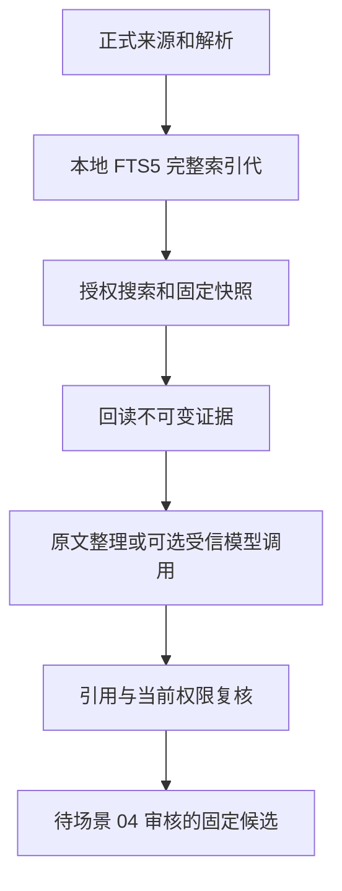

## 实现范围

为 Obsidian 建立本机知识服务：从独立试点接入、权限/预算/作业治理，到多来源收录、逐文件批准和固定证据检索。当前分支同时包含场景 01、02、开发者接手文档和场景 03 的本地能力。

场景 03 新增中文短词、可信别名和精确代码符号搜索，完整索引代原子切换，固定查询快照，来源家族与适用范围，以及原文回读、证据整理和待审核候选。来源被撤回或禁止本地 read 后，旧快照、证据 ID、缓存和保存入口都会拒绝继续使用。

模型调用接口复用已有用途授权与预算账本。真实提供方默认未安装；没有把确定性适配器测试或原文摘录称为真实生成质量验收。Wiki 更新、TaskNotes、通知、日历、OCR 与检索增强未启用。

## 数据与验证

schema 3 增加证据、来源关系、FTS5 索引代、快照、回答缓存与候选。已知 v2 升级前先生成私有数据库快照，未知结构只读；原件与业务账本不能作为索引缓存删除。

类型、lint、真实进程、权限与撤回、预算、迁移、真实网络语料和 OCI 检查结果见 `docs/implementation/evidence-search-validation.md`。真实 Obsidian 已验证收录、冲突保护、搜索、回读、原文整理和保存候选，页面错误为零。

万块性能与 20 题基线报告保留机器、字节数、分子分母和过度拒答。真实模型人工语义支持率及约 80 题/增强同题对照尚未完成，场景计划仍为 active。

截图：[搜索](https://github.com/liuxing95/repository/blob/codex%2Fmulti-source-ingestion/docs/implementation/evidence/obsidian-search.png)、[证据整理](https://github.com/liuxing95/repository/blob/codex%2Fmulti-source-ingestion/docs/implementation/evidence/obsidian-evidence-answer.png)。

## Post-Deploy Monitoring & Validation

负责人为试点主端操作者，窗口为升级后首批 10 次检索/原文整理及首次断连恢复。检查 schema=3、`PRAGMA integrity_check` 为 ok、活动索引代完整、无缺失 evidence；观察 `search.generation.published`、`source.index_requested`、`source.policy.changed` 事件。

健康信号：固定引用可回读，新来源可进入后续索引代；撤回后原件、引用、缓存和候选保存立即受限。关注 `HASH_MISMATCH`、`INDEX_FAILED`、`BASELINE`、`FORBIDDEN`、`UNKNOWN_COST`。出现未授权正文或损坏引用被认可时停止新操作与外发，保留 DB/WAL 和诊断；索引问题可重建，账本问题不可清库。旧程序不识别 schema 3，回退只在完整备份的独立副本中核对。

---

Generated with GPT-6 via [Codex](https://openai.com/codex/).
