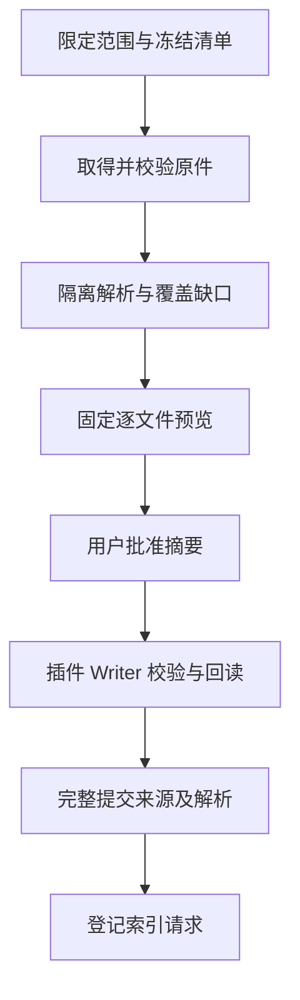

## Summary

让用户从文本、网页集合、固定代码快照和 PDF 取得可回读资料，并在逐文件批准后完成来源提交。获取、解析与正式提交独立记录：部分失败不会抹掉成功项，重复收录复用对象，重新解析保留旧引用。

此变更基于 `codex/workspace-runtime-governance`，增量审核基线为 `cdc4e73`。建议该分支作为本 PR 的初始 base；场景 01 合入主分支后再调整。

## 提交与边界

服务保存 schema 2 的原件、修订、解析、批准与回执，正式 Vault 仅由 Obsidian Bridge 写入。当前 Writer 只新建不可变来源投影；正文以代码围栏保存，原材料不成为可执行页面。编辑缓冲区、不同哈希、授权变化或失联都会暂停。实际搜索、Wiki 更新、OCR 和浏览器脚本不在此变更中。

macOS Seatbelt + Node 权限进程执行基础解析。网络仅由有界获取器经固定 IP 与跳转复核进行。GitHub 固定到实际 commit，本地脏目录保留字节快照；ZIP 不落盘解包、不执行安装或仓库脚本。schema 1 先创建 0600 快照再事务迁移，未知结构只读。

## Validation

- 类型检查、lint、构建通过。
- 全量 50 项测试通过，无跳过，包含实际 OCI、编译产物和真实 HTTPS GitHub 固定提交。
- 30 份真实资料跨四类输入；全部原件可回读，3,660 个文本块定位校验无错，每类都有明确的部分覆盖样本。
- Obsidian 1.13.7 实际操作预览、解析、编辑缓冲保护、批准恢复与来源回读；页面错误为零。
- PDF 表格结构和网页／PDF 字符损失未有人工逐字金标准，保持缺口／未知标记。

完整记录：`docs/implementation/multi-source-ingestion-validation.md`。截图：`docs/implementation/evidence/obsidian-ingestion.png`、`obsidian-ingestion-conflict.png`；修改前后治理截图也保留在该目录。

## Post-Deploy Monitoring & Validation

负责人为隔离试点的本地主端操作者；观察启动后首批 10 个作业及首次断连恢复。核对 jobs 中 ingestion 的 state/stage 和事件 `source.approved`、`source.committed`、`source.index_requested`、`changeset.committed`。正常情况只有全部回执完成后出现 committed 来源，原件可回读，`PRAGMA integrity_check` 返回 `ok`。

人工字节被覆盖、未批准来源可见、原件哈希损坏或解析器越界是停止门槛。停止收录并退出服务，保留 DB/WAL 和诊断。回退旧程序时从迁移前备份另建独立数据副本，不覆盖已经产生新来源的 schema 2。调试期间的旧隔离探针 UE 记录已在验收文档披露；最终解析配置正常退出。

---

Generated with GPT-6 via [Codex](https://openai.com/codex/).
