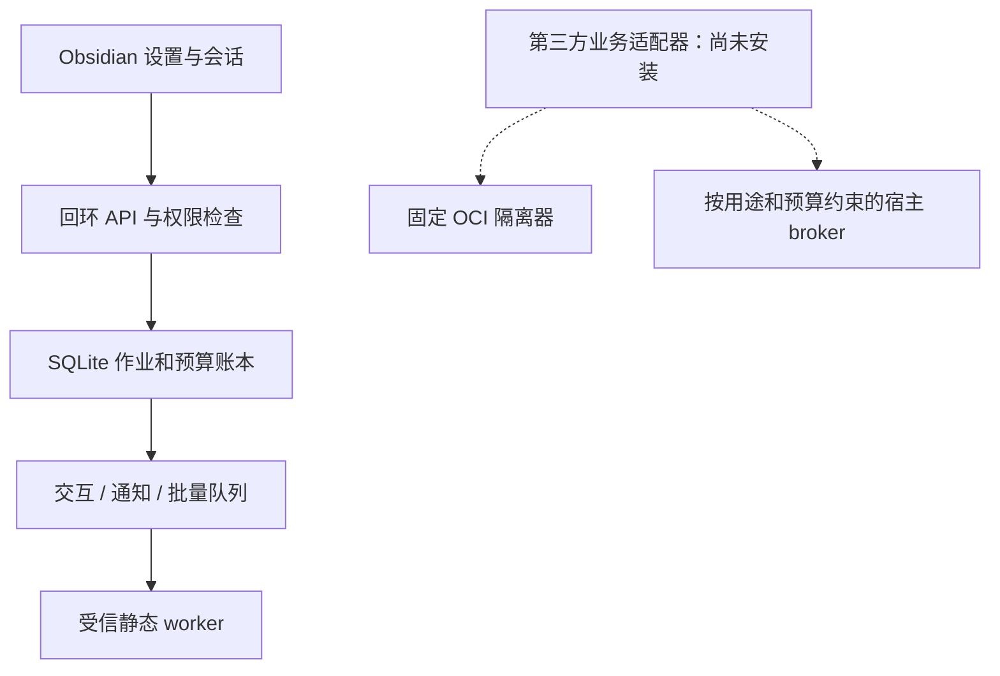

## Summary

为原有设计文档仓库建立可运行的 Obsidian 插件与本地服务，完成场景 01 的隔离试点、配对、主设备、权限、预算、作业、诊断与执行隔离。随分支保留此前整理的 PRD 和各场景技术方案；其余场景仍是设计文档，业务能力不自动启用。

## Implementation

采用单进程服务和本机 SQLite 账本，三个队列分别启动受信 worker；第三方执行使用固定 OCI 镜像，缺少受测环境时拒绝运行。插件会话只保存在内存，提供方密钥使用系统凭据库。所有变更带策略版本与幂等身份，费用在出站前预占，未知回执不释放预算。

首次接入通过本机 CLI 预览、确认摘要并生成试点与备份。没有真实模型、搜索、TaskNotes、Writer、日历或发布适配器，本轮唯一可运行的业务作业是本地自检。

## Validation

- 类型检查、lint 和构建通过。
- `KB_TEST_OCI=1 KB_TEST_BUILT=1 pnpm test`：29 个用例通过，无跳过；含双进程争抢预算、真实 OCI 负例、构建产物 worker、未知 schema、会话撤销和幂等重试。
- `pnpm test:desktop`：真实 Obsidian 1.13.7 完成配对、主端登记、配置保存、自检成功、诊断、释放和撤销流程。
- 实测 SQLite 3.53.4，macOS 系统凭据读写及删除通过。完整证据见 `docs/implementation/runtime-governance-validation.md`。

## Post-Deploy Monitoring & Validation

试点配置管理员在启动后观察 30 分钟，次日核对一次账本。检查 jobs 按 queue/state 的计数、calls 按 state 的 reserved/actual 汇总，以及事件 `job.finished`、`cost.reserved`、`cost.settled`。正常信号为自检完成、无滞留队列、未知费用没有被清零；当前未启用付费适配器，费用应为 0。

检索错误编号与 `AUTH`、`MASTER`、`SCHEMA`、`BUDGET`、`UNKNOWN_COST`、`WORKER_FAILED`、`SERVICE_LOCK`。若出现重复副作用、非预期出站、预占丢失或未知 schema 写入，立即停止服务并撤销会话，保留账本和备份。回滚代码或打开未修改的原 Vault，不删除账本来恢复额度。

---

Generated with GPT-6 via [Codex](https://openai.com/codex/).
