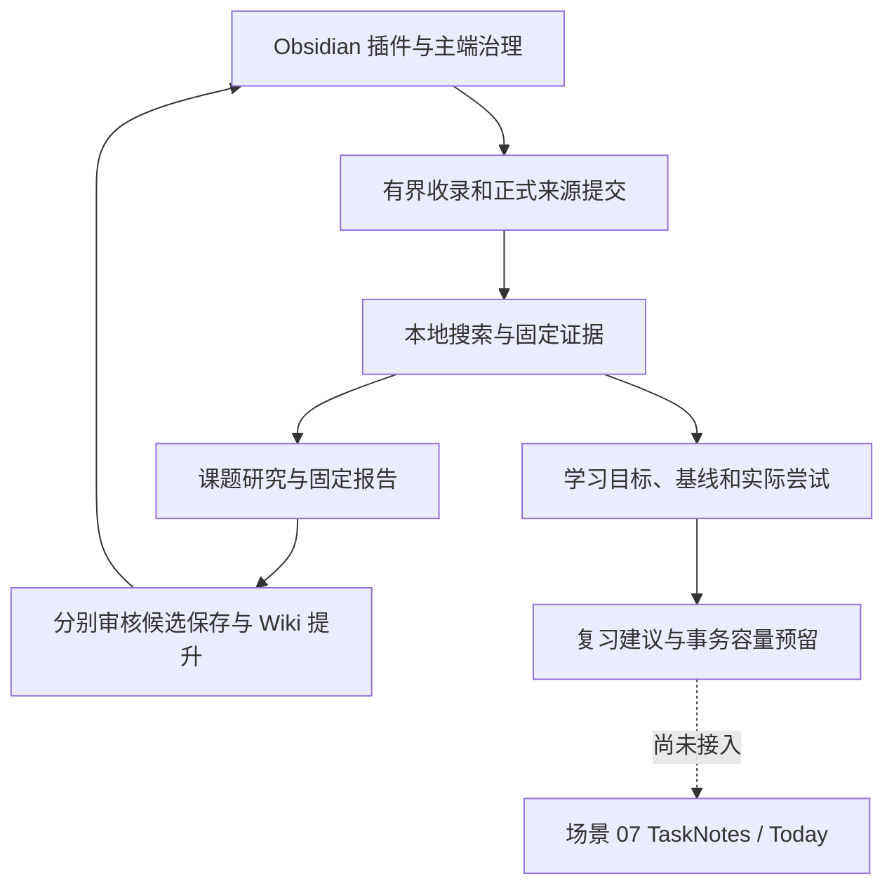

# feat: add governed knowledge, research and learning workflows

## 交付范围

本分支为 Obsidian 建立本地工作区治理、多来源收录、固定证据检索、Wiki 审核、课题研究和学习记录。服务维护身份、预算、权限及不可变记录，插件在用户批准后写 Vault。来源正式提交后才参与检索；候选保存和正式知识提升分别审核。

学习场景把参考资料与少量当前活动分开，保留人的原始表达、提示、产物、自报和遗留问题，重新打开单元可继续上次活动。学习能力按固定叶子验收项及评价来源展示；取消不删分母，新版本保留旧尝试。复习只产生少量明确建议，任务创建接口在 SQLite 事务中预留容量并持久化稳定身份，未知结果不重发。

当前不安装真实模型或 TaskNotes 适配器；研究采用完整原文整理，学习从设置页继续，复习保持建议。TaskNotes / Today 真实身份、最终未创建证明和跨应用并发仍需场景 07 验证，不以本地测试适配器代替上游验收。

## 数据与验证

已知旧数据库逐步升级到 schema 6，迁移前创建权限 0600 的私有备份。学习目标、基线、尝试、评价、建议和创建意图均在权威账本保存；服务与插件一起升级，旧服务不能写新库，不用迁移前副本覆盖后续来源、费用及学习记录。

最终类型、lint 通过，开启 OCI 和编译后真实进程的回归 121 项通过、2 项真实语料跳过。Obsidian 1.13.7 桌面 25 项通过，页面错误 0。原始语料及真实模型门槛保留既有记录。

[使用与接手](../../../../docs/implementation/learning-practice-review.md) · [详细验收](../../../../docs/implementation/learning-practice-validation.md) · [桌面截图](../../../../docs/implementation/evidence/learning-resume.png)。

## Post-Deploy Monitoring & Validation

隔离试点主端操作者核对首次目标、首次尝试、首次范围升级和前 10 项复习建议。检查 schema 6 / integrity_check、learning.attempt.recorded 与 learning.evaluation.recorded、建议状态及任务意图的日容量。没有任务适配器时意图表应为空；自报不增加通过权重，取消不减少分母，未知创建继续占预留，撤回后不读旧正文。

出现无尝试却增加通过、未选择创建任务、未知请求重发、时区重置额度或权限撤回仍可读时，暂停新写入和创建，保留 SQLite、Vault 及复现时间。不要删除意图、评价或基线恢复额度。只读 SQL 和恢复边界见验收记录。

---

Generated with GPT-6 via [Codex](https://openai.com/codex/).

本文件是本地 PR 草稿，GitHub CLI 尚未登录，未创建或更新 PR。
