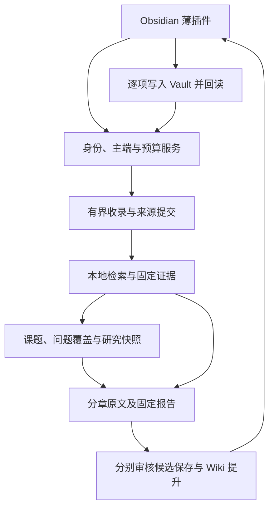

# feat: add governed knowledge ingestion, Wiki and research reports

## 交付范围

本分支为 Obsidian 建立可追溯的资料收录、证据检索、Wiki 审核和课题研究流程。服务保存身份、主端、预算、证据与版本账本，插件在用户批准后写入 Vault。资料从文本、静态网页、代码快照或 PDF 进入系统后，只有正式提交的来源才能参与检索和报告。

Wiki 候选保存与正式知识提升分别审核；更新核对编辑器和磁盘基线，逐项回读，完成事务后才进入正式检索。研究先确认问题、范围、时间意图和根预算，再固定证据快照、逐章整理原文、冻结带覆盖表和未解决项的完整报告。补采有明确入口和累计上限，新资料需正式提交并确认快照推进。取消保留既有章节与费用。

当前默认没有真实模型。受信模型接口、共享根预算和输出校验已实现，但章节仅接受完整原文主张，自由综合与人工语义门槛尚未验收。研究方案 RSH3 保持未完成；本分支用于有明确边界的本地试点。

## 数据与迁移

数据库逐步升级到 schema 5，已知旧版本迁移前创建权限为 0600 的私有备份。新增研究清单、快照、章节、尝试和不可变报告表；费用继续使用原根账本。服务与插件一起升级，旧服务不能写新 schema。回退前保留完整账本及 Vault，不用迁移前副本覆盖新增来源、费用和回执。

使用与恢复见[研究接手说明](../../../../docs/implementation/topic-research-report.md)，工程入口见[README](../../../../README.md)。

## Validation

最终类型检查、lint 通过；开启 OCI 和编译后真实进程的回归为 106 项通过、2 项真实语料测试跳过。真实 Obsidian 1.13.7 的 21 项桌面检查通过，页面错误 0，包含完整研究报告经 Writer 保存后的逐字比对。补采新增编排使用固定获取响应验证。真实模型、提供方实际费用及真实语料专项没有在本轮验收；历史语料失败记录保留。

[完整验收记录](../../../../docs/implementation/topic-research-validation.md) · [桌面截图](../../../../docs/implementation/evidence/research-report.png) · [桌面断言](../../../../docs/implementation/evidence/research-desktop-checks.json)。

## Post-Deploy Monitoring & Validation

隔离试点主端操作者观察首次研究、首次快照推进、首次候选保存和前 10 个章节尝试。核对 schema 5、SQLite integrity_check、报告最终快照与 calls 根费用；无模型研究不新增收费调用，取消后不新增章节，迟到真实费用仍可结算。research-budget 成功仅表示预算容器建立，不表示研究完成。

如出现越界补采、费用跨根、未确认推进、撤回正文仍可读或未经批准写文件，应停止新研究及写入，保留账本、Vault 和复现时间。不要删除调用、根预算或回执以恢复额度。具体只读 SQL 与恢复边界见验收记录。

---

Generated with GPT-6 via [Codex](https://openai.com/codex/).

本文件为本地 PR 草稿；GitHub CLI 尚未登录，未创建或更新 PR。
