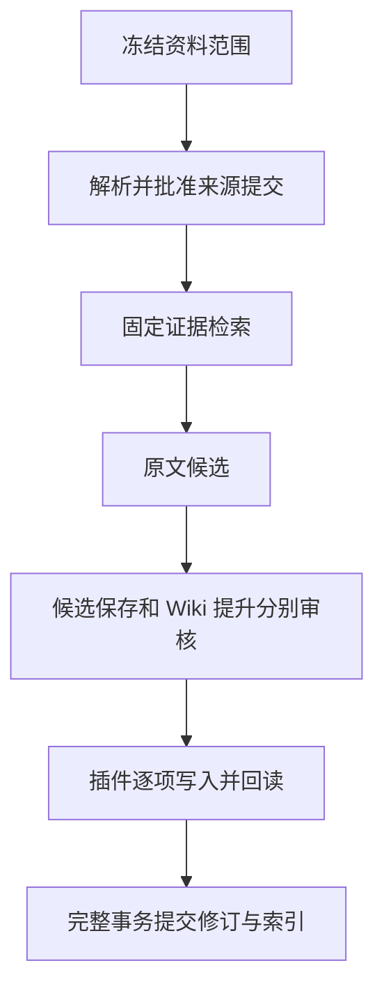

# feat: add governed ingestion, evidence search and reviewed Wiki writes

本分支从资料方案补齐本地服务与 Obsidian 薄插件：建立工作区与主端，冻结多来源收录范围，批准来源文件写入，按固定证据搜索，并将回答候选经两次审核保存为正式 Wiki。服务保存账本，插件负责 Vault 写入，避免模型或后台直接修改笔记。

场景 04 新增摘要绑定批准、15 秒逐项授权、同步 Vault.process 基线检查、回读回执、不可变页面修订与完整提交。部分落盘不会提前出现在正式检索；人工观察、来源权限与反向提案为更新提供可核对的恢复路径。真实模型编译尚未接入，本分支默认采用原文整理与编排。

数据库从已知旧版本逐步升级到 schema 4，升级前保存私有备份；旧服务不能写新库。回退前保留完整应用数据与 Vault，不用迁移前快照覆盖新增审计。

## Validation

类型与 lint 通过；最终代码的真实 Obsidian 桌面 17 项检查通过，无页面错误。全量可选专项首轮 90 通过、1 个真实语料失败；最终核心/OCI/真实进程回归 87 通过、3 失败、2 跳过。单独复测 OCI 通过，两个收录超时仍在；末次场景专项 17 通过、1 恢复超时，另有 UI worker 启动失败。系统负载显著升高，但失败原因尚未全部确认，不能合并视为全量通过。W4 模型与人工语义验收未完成，方案保持 active。

说明与详细验证：[Wiki 使用与维护](../../../../docs/implementation/wiki-review-commit.md)、[验收记录](../../../../docs/implementation/wiki-review-validation.md)。截图为 docs/implementation/evidence/wiki-review-entry.png；桌面断言为 wiki-desktop-checks.json。顺序 ce:review 的八项修复见同目录 review.md。

## Post-Deploy Monitoring & Validation

负责人为隔离试点主端操作者，观察首次候选保存、首次 Wiki 新建和更新、一次中断恢复以及前 10 次提交。查询 events 中 wiki.prepared/wiki.approved/wiki.file_applied/wiki.committed/wiki.observed，核对 wiki_receipts 与 wiki_changes 状态；PRAGMA integrity_check 应为 ok，wiki_pages 应无缺失当前修订。零模型模式不应新增费用，部分应用不应进入正式检索，撤回应立即阻断旧正文读取。

发现未批准写入、人工字节丢失、部分提交可见或撤回内容仍可读取，立即停止新写入并保留账本与 Vault。不要删回执或用旧备份覆盖当前数据库。未解决回归与模型门槛关闭前，不作为完整模型知识系统发布。

---

Generated with GPT-6 via [Codex](https://openai.com/codex/).

本文件是本地草稿，GitHub CLI 尚未登录，未创建 PR。
