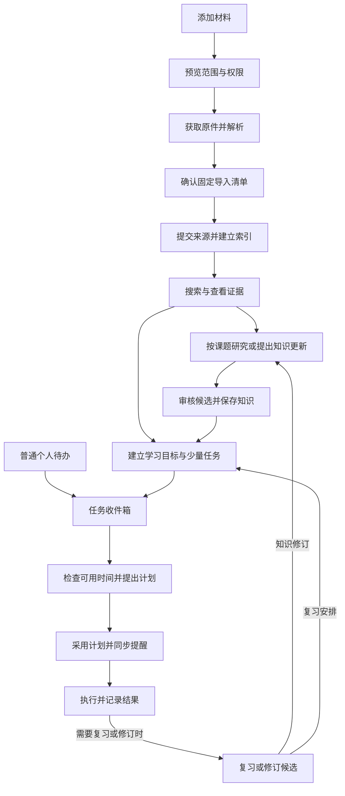

# Obsidian 个人知识库与任务中心 PRD

本文将 `docs` 中的调研、专题方案、任务中心设计、实施材料和历史版本合并为一份产品需求。面向产品、设计、开发与验收人员，说明要解决什么问题、用户能做什么，以及怎样判断交付完成。

这是一份待实施的需求基线。仓库当前是资料与设计交付包，未交付本产品的可运行插件或服务。编写本文不代表批准模型费用、安装插件、接入真实日历或开启自动化。原始资料保持不变；来源关系见第 15 节。

## 阅读导航

- 了解产品：第 1—4 节，阅读定位、范围和主要流程。
- 设计与开发：第 5—9 节，按需求编号查看功能、交互和运行规则。
- 安排交付：第 10—13 节，查看里程碑、验收、依赖和启用设置。
- 核对依据：第 14—15 节，查看版本取舍和原始材料映射。

## 1. 产品定位与问题

这是一套以 Obsidian 为工作台的个人知识与行动系统。用户将网页、官方文档、代码、PDF 和个人记录收进来，查到有出处的答案，把值得长期保留的结论整理成知识页，再围绕实际目标安排学习和任务。

当前资料讨论了几类反复出现的问题：

| 用户遇到的问题 | 产品需要带来的变化 |
|---|---|
| 收藏散落在网页、文件夹和聊天里，找到标题也未必能找到当时的原文 | 保存实际取得的材料和版本，搜索结果能直接打开对应证据 |
| 多篇文章说法不同，软件版本、分发路线和使用条件容易混在一起 | 每条结论保留适用范围；分歧可见，不用新文章覆盖所有旧结论 |
| 输入一个课题后，模型容易写出完整却缺少依据的长文 | 先列问题、检查证据覆盖，再写报告；资料不足的部分明确留空或说明 |
| 收录和总结很多，却不知道自己是否真的理解 | 学习记录保存自己的解释、回忆和实验；收录数量不计为掌握程度 |
| 学习计划与日常事务脱节，新任务插入后只能手动挪时间 | 在真实可用时间内提出安排，说明调整和未排项，保护固定承诺 |
| 多处任务勾选、离线同步和提醒状态不一致 | 同一任务只有一个身份，计划采用、文件更新和提醒同步分别显示 |
| 自动化可能覆盖人工内容、泄露材料或产生无法解释的费用 | 写入可审核，授权按用途区分，费用可查，故障后能恢复 |

如果不建设本产品，用户仍能用 Obsidian 手工整理资料和任务，但需要自己维护版本、核对引用、汇总研究、协调日程并检查遗漏。首个验证目标是减少这些重复操作，同时保留对材料和安排的控制。

### 1.1 用户与职责

首先服务单个桌面用户，重点是需要持续学习技术资料、研究具体问题并安排个人行动的人。macOS 是首轮受测平台；其他桌面系统需单独验证。移动端用于已有文件同步支持的阅读、人工操作和接收通知，不承诺独立完成本产品全部自动化。

| 角色 | 可以做什么 | 权限边界 |
|---|---|---|
| 知识拥有者／学习者 | 选资料、提问、审核结论、记录学习、管理自己的任务 | 决定哪些内容进入知识库、允许何种外发 |
| 配置管理者，通常是同一人 | 设置模型、预算、目录、日历、提醒与自动应用范围 | 必须从可信设置入口操作，不能由资料文字代替 |
| 外部 Agent | 在授权范围内检索、读取证据，扩展阶段可提出候选 | 不代替人批准知识、扩大预算、改权限或任意执行代码 |
| 实现与验收人员 | 交付功能、记录兼容版本、执行验收 | 开发完成、文档检查和真实使用验收分别记录 |

### 1.2 产品目标

1. 用户能查到固定原文，理解答案的适用范围与证据缺口。
2. 用户能把已有资料组织成可审核、可更新的知识和研究成果。
3. 用户能围绕能力目标学习，并用实际表现记录进展。
4. 用户能管理普通事务和学习任务，在容量不足时做出取舍。
5. 用户能看清自动化做了什么，暂停它，并在故障或停用后保留资料。

页数、链接数、模型输出量和通知次数不作为产品成功指标。具体质量门槛见第 11 节。

## 2. 范围与交付口径

“核心版本”指下表必需能力全部完成后的个人使用版本，允许分批交付。早期只交付任务表或文本搜索时，必须按该阶段命名，不能称整套需求已经完成。

| 范围 | 本 PRD 的承诺 |
|---|---|
| 核心必需 | 单网页、有限官方文档集合、固定代码快照、文字 PDF，以及 MD/TXT、剪藏和片段输入；来源覆盖与定位；搜索、问答、知识审核、库内研究；目标驱动学习；个人任务、Today、建议式排程；本地提醒；预算、权限、备份、恢复与撤回 |
| 按需启用，仍需交付明确规则 | 电脑关闭后的在线提醒、当日受限自动采用计划、课题缺口补采、复杂 PDF/OCR/图表增强、独立个人计划日历投影 |
| 后续扩展 | 只读 Agent/MCP 接入、检索增强、公共发布、Office/音视频等更多格式、在线任务主库迁移 |
| 不在本次范围 | 通用多 Agent 平台、全网无界抓取、多人实时协同编辑、任意 shell、自动执行来源中的工作流、自动修改他人会议、两个任务系统同时主写同一任务 |

扫描 PDF 和复杂图表的“保留原件、发现缺口、可见降级”属于核心必需；高质量 OCR、表格和视觉增强按需推进。不能将未处理区域伪装成已读全文。

默认采用 Obsidian、TaskNotes 与待开发的 Knowledge Bridge 配合本地服务。复用任务列表和笔记编辑体验，不重写一套编辑器。TaskNotes 兼容验证未通过的写入能力保持关闭；搜索、知识工作和计划展示可以按各自门槛独立交付。

## 3. 用户流程与信息组织

### 3.1 主流程

用户可停在任意有用阶段：只归档、只搜索、只记待办都成立。生成报告不必先生成 Wiki；创建普通任务不必先建立学习目标。图中来源提交依赖有效批准和写入完成，计划采用依赖约束及授权；失败与等待状态见第 8 节。

### 3.2 产品入口

| 入口 | 主要内容 | 主要操作 |
|---|---|---|
| 材料收件箱 | 待导入材料、范围、权限、处理缺口 | 添加、预览、确认导入、重试失败项 |
| 来源库 | 集合、固定版本、原件、解析覆盖 | 筛选、查看原件、定位证据、检查更新、撤回 |
| 搜索与提问 | 原文命中、答案、版本与证据状态 | 搜索、提问、打开证据、保存候选 |
| 研究工作区 | 课题、子问题、覆盖、报告候选 | 调整范围、取证、查看缺口、保存 |
| 知识审核 | 变更原因、新旧差异、证据、冲突 | 批准、拒绝、重新生成、查看写入结果 |
| 学习 | 目标、当前单元、尝试、误区和复习队列 | 开始单元、记录结果、调整复习 |
| Today 与任务视图 | 今日安排、待办、阻塞、风险、同步时间 | 创建、开始、完成、重开、查看／采用计划 |
| 运行与设置 | 系统作业、预算、连接、提醒、备份 | 诊断、暂停、重试、配置和恢复 |

“任务”默认指用户要做的事；抓取、解析和生成报告称为“系统作业”。在界面中分开，避免把后台处理进度放进个人待办完成率。

### 3.3 读者需要理解的几个词

| 术语 | 本文含义 |
|---|---|
| 来源 | 实际收到的一篇文章、一个文件或一份用户陈述 |
| 集合 | 本次选择的一组文档页、仓库文件或目录内容 |
| 快照 | 固定某次选择及其内容版本，后续可以复查 |
| 主张 | 一条带主体、适用范围和证据的结论 |
| 候选 | 系统提出但尚未成为正式知识或安排的结果 |
| 投影 | 将已登记事实显示在笔记、日历或提醒端的副本 |
| 任务实例 | 循环任务在某一天或某次发生的那一项 |

## 4. 数据责任与基本规则

| 内容 | 以哪里为准 | 用户应看到什么 |
|---|---|---|
| 原件与证据 | 已提交的固定原件和来源清单 | 原文、来源时间、版本、解析缺口 |
| 人工笔记 | 用户自己的 Markdown | 原有内容和组织方式保留 |
| 正式知识 | 审核并提交的知识版本及其证据记录 | 审核范围、历史版本、待复审提示 |
| 任务标题、状态、截止、估计和计时 | TaskNotes 中的任务记录 | 所有视图指向同一任务 |
| 学习尝试与授权 | 本系统持久记录 | 真实尝试、提示、结果和授权来源 |
| 接受后的具体时段 | 本系统计划版本 | 当前计划，以及各处副本是否同步 |
| 会议与外部忙闲 | 选定的日历服务 | 查询范围、时间和未知部分 |
| 提醒 | 已登记规则及唯一执行端 | 已登记、已取消、发送结果或结果未知 |

任务截止和排期时段是不同字段；修改排期不修改截止。资料收录、知识审核、个人执行和学习证据是四种独立进展，不能合成一个“智能完成率”。

下文 R001—R094 是稳定需求编号。每个编号下的行为和验收要点一起构成要求；第 11 节再列跨模块验收。技术方案负责接口、数据结构、算法和部署细节，不在本文复制历史代码样例。

## 5. 材料、证据与知识需求

### 5.1 首次使用与基础配置

**R001｜从隔离试点开始。** 首次使用可创建独立试点库。接管已有库之前先预览目录、文件和身份冲突，完成备份；不移动人工目录，不覆盖同名笔记。发现冲突时允许另选受管位置。

**R002｜按能力逐步启用。** 未配置模型时仍可手工管理任务、导入受支持材料并做本地关键词检索。AI 功能显示“模型未配置”。模型调用、自动写入、在线补采、通知及受限自动排程分别启用；连接成功不等于已经获得这些权限。

**R003｜配置只从可信入口生效。** 来源范围、模型路线、预算、写入区域、日历和通知权限均由配置管理者设置。材料正文、模型答案、笔记属性中的“已批准”不能改变权限。配置版本不兼容时进入只读诊断。

**R004｜保留退出路径。** 停用服务或卸载扩展后，已有 Markdown 和镜像附件仍可阅读。支持导出原件、来源清单、学习记录与未完成操作；只位于原件仓中的代码和结构化资料必须可导出。退出前显示尚未完成的写入、取消和费用核对项。

### 5.2 统一添加与导入

**R005｜一个材料入口。** 支持拖入文件、粘贴 URL、选择本地目录、粘贴文本或代码。主题、收藏理由和软件版本可选；来源身份、覆盖情况与允许的处理路线需要明确。识别不确定时让用户选择类型，不强行猜测。

**R006｜预览先于批量获取。** 普通 URL 默认只处理当前页。文档站、仓库、目录和压缩包先显示选择范围、预计数量、排除项、处理限制和权限。用户可批量确认；不能为了生成预览先下载整站。远程请求不能要求读取任意本机路径。

**R007｜获取与正式导入分开。** 获取授权只允许在已选范围和限额内取得资料。解析完成后展示固定清单，用户一次确认本批来源导入；来源导入不同时批准 Wiki 改写。插件离线时显示“已解析，等待写入”，未提交内容不进入正式查询快照。

**R008｜保留原件与覆盖报告。** 原件、解析正文、模型补充说明和阅读展示分别保留。状态至少让用户区分已取得、已归档、已解析、已索引、已提出知识候选、已审核。原件保存完整不代表所有图表已理解。

**R009｜重复导入与来源更新。** 同来源、同内容重复提交复用已有修订，不重复创建来源或提案。正文变化产生新修订，旧引用保留。无 URL 文件同名不视为同一来源；更新已有来源需要明确选择。转载可以关联，但不作为多份独立佐证。

**R010｜可恢复的批量处理。** 集合按页面、文件或区域记录成功、失败、排除、待处理及原因。重试复用成功项，取消停止新分发，保留已完成结果。所有子项共用总数量、字节和模型预算；不能靠拆批绕过限额。越界或达到上限时列出未纳入项。

### 5.3 网页与官方文档集合

**R011｜网页保留实际可见内容。** 保存实际取得的正文、标题、代码、表格、脚注、条件和版本线索，并记录原地址、实际地址及获取时间。登录壳、截断和只有摘要的页面不能显示为全文成功；发布日期未知就留空。

**R012｜受限网页有明确降级。** 静态获取不足时，可在授权范围内尝试隔离浏览器渲染。需要登录或付费访问时提示用户剪藏或导出有权获取的内容；不索要整份浏览器 Cookie，不绕过访问限制。选区剪藏保持“节选”标记。

**R013｜官方站点按集合收录。** 利用站点公开索引、导航和内部链接发现页面，按域名、路径、语言、版本和数量过滤。入口页不代表全文，单一路径也不能代替全部并列章节。外部链接、其他语言及旧版本默认列为候选，不自动扩大范围。

**R014｜集合完整度有明确分母。** 展示发现数、选定数、取得数、失败数、待核对数和排除原因。“本次收录完整”仅相对已确认清单成立。保留逐页版本及采集起止时间，不声称滚动站点在同一时刻具有这些内容。代码标签页或交互内容未取得时单列缺口。

**R015｜更新不抹掉历史。** 默认手动检查已选集合的更新。内容变化生成修订并列出受影响知识、研究及学习单元；获取失败或临时不可达不能直接删除旧证据。扩展范围需再次确认。固定版本和持续更新的文档分别管理。

### 5.4 代码与 PDF

**R016｜代码必须固定实际内容。** 仓库链接固定到实际提交，展示用户选定的分支或标签及解析结果；默认分支不冒充稳定发布版。本地目录、ZIP 和粘贴代码保留实际快照；有未提交改动要显示，不能伪造提交身份。复制过程中变化应重试或报告不一致。

**R017｜按研究对象选择代码。** 源码仓库与发布产物使用不同选择规则。用户上传发布包时保留构建产物、声明、入口等研究主体。显示缺失文件、外部依赖、LFS 指针和子模块；指针不等于已经取得内容。未知语法可退回带行号文本。

**R018｜代码证据可定位且不隐含执行。** 用户可打开固定文件、相对路径、行范围及可取得的符号上下文。静态提及不能证明默认运行路径；导入不执行安装、构建、测试和配置脚本。需要实验时另建明确授权的运行任务，并独立保存环境与结果。

**R019｜文字 PDF 按页可用。** 保存 PDF 原件、正文、物理页码和处理状态，印刷页码另列。有可靠区域定位才显示区域；否则定位到页面。密码受保护文件提示提供有权使用的密码，密码不写入资料；无法打开时不显示“已读”。

**R020｜复杂 PDF 允许局部可用。** 表格保留表头、单位和脚注；跨页内容保留多个位置。扫描、双栏、图表、公式处理不可靠时显示具体页或区域缺口。合格区域可检索，但缺失部分不能支持“全文没有某结果”等整体结论。模糊图像不猜数值。

**R021｜增强处理按需授权。** 优先已有文字，对必要区域申请 OCR、布局或视觉增强；提示预计消耗和外发范围。未配置或未授权时保留原件与缺口，不自动切到云端。模型图片说明是派生内容，回答图表问题仍需核对原图或原表。

### 5.5 版本、主张与关联

**R022｜区分三种版本。** 软件适用版本、来源内容修订、解析结果版本分别显示和保留。重新解析不能改变旧引用。入库时间不能代替发布时间，也不能证明内容适用于最新软件。

**R023｜结论保留适用范围。** 技术主张至少能表达主体、软件版本、分发路线、功能阶段、配置条件、陈述语气和证据。未知项显示未知。原文事实、系统推断、用户陈述明确区分；模型补充的指代解释不改写原文。

**R024｜关联有类型。** 同主题、提及和推荐阅读用于发现资料；支持、限定、反证和版本替代用于解释结论。相似标题、向量分数、链接数量和模型置信度不作为事实成立的证明。组件使用另一组件，不能推导二者实现语言相同。

**R025｜分歧先核对范围。** 对已知不重叠的版本、分发或阶段分别呈现；范围未知时要求核对；只有同范围内互斥结论才进入矛盾候选。新文章日期更晚不自动胜出。来源更新、历史仍适用和原结论被纠正必须区别标记。

**R026｜引用回到固定原件。** 回答和知识页的重要外部事实可打开所用原文及上下文，展示版本、时间和缺口。位置或内容校验失败时停止将该引用显示为有效证据；可回到固定原件诊断。AI 报告和历史回答不成为新的独立外部佐证。

### 5.6 搜索与问答

**R027｜本地检索不依赖模型。** 已提交并索引的资料支持中文短词、中英文别名、精确代码符号和标题查询，无模型密钥时可用。至少覆盖“权限”“重排”“C++”“Node.js”和完整函数名等验收输入。

**R028｜结果带范围与状态。** 用户可按来源类型、集合、软件版本和审核状态筛选。结果显示原文片段、来源类型、修订、覆盖警告和当前查询快照。只读到部分内容或索引尚未完成时明确提示，不把“没有命中”直接解释为“资料中不存在”。

**R029｜按问题回答并保留条件。** 提供证据问答、综合研究入口和知识检查。默认只使用库内授权内容，回答至少区分“有证据支持”“证据不足”“证据冲突”。同时展示适用范围、来源与未核验项，不用省略条件提高回答率。

**R030｜检索与回答使用一致证据。** 一次回答绑定固定查询快照，不能用旧位置读取新正文。相同来源的转载、摘要和知识页不重复计算支持数量。上下文不够时缩小范围或拆问题，不能截掉限定条件后用模型记忆补齐。

**R031｜权限在使用内容前生效。** 召回、重排、原件读取、模型输入、缓存回答和候选保存均检查内容权限及撤回状态。来源被撤回后，旧快照与已知证据编号也不能绕过限制。知识检查列出过期、无来源、冲突或孤立页面。

### 5.7 知识页与审核

**R032｜按需提出知识更新。** 用户选择有价值的资料后生成概念、系统、比较或决策页候选。优先补充已有页面，允许不生成新页；不为每篇文章、代码文件或关键词创建 Wiki。超出处理限额时列出待处理内容，不静默截断。

**R033｜审核看得见依据。** 提案展示变更目的、目标页面、新旧差异、关键主张证据、适用条件、冲突和预计影响。用户可批准或拒绝并记录原因。决定类内容未经本人确认只写建议，不能写成“本项目已决定”。

**R034｜批准绑定所见内容。** 用户批准的是固定提案。内容、基线、来源或权限变化后旧批准失效，界面要求重新查看；不能用旧按钮批准后台替换的结果。模型生成的按钮、命令和文字不触发批准。

**R035｜保护人工编辑。** 人工目录默认只读。受管页面被人工修改后保留内容、更新观察版本并让旧提案失效，审核状态不能沿用。目标 Markdown 正在编辑时暂停自动更新；用户关闭编辑页后仍需校验内容。冲突不得通过强制覆盖解决。

**R036｜写入结果可核对、可恢复。** 批准、已应用文件、完整提交和索引就绪分别显示。多文件中断后可继续或报告冲突，不显示全部完成；恢复不能用旧内容覆盖人工后续编辑。批准中途过期时保留已做部分并等待剩余动作重新授权。插件离线不得绕过受控通道写库。

**R037｜回答保存仍是候选。** 普通问答默认只保留在会话结果中；用户选择保存时展示固定候选清单，经确认写入候选区。提升为正式 Wiki 要重新去重、校验证据并审核。拒绝或失败的候选不能污染正式知识基线。

**R038｜知识维护保留历史。** 来源变化或撤回后列出受影响结论并标记待复审，保留仍适用于旧版本的结论。自动影响分析有边界，更多关联列入复审清单；不触发整库无限重写。知识页自动生成后不再次当新来源摄取。

## 6. 研究与学习需求

### 6.1 课题研究

**R039｜先明确研究范围。** 输入课题时记录目标读者、输出类型、必须回答的问题、软件范围、时间意图、来源模式和总预算。时间意图区分指定版本、当前状态、版本演进与历史时点。研究“当时已知什么”时按来源公开时间过滤证据：后发资料只能作为标明时间的后续解释，公开时间未知的材料保持待核验，都不能证明当时已经公开。一般学习未指定版本可输出分版本概览；具体项目行为需要项目版本依据。

**R040｜先拆问题再取证。** 系统提出子问题与章节草案，允许用户调整；按版本、分发和阶段分别查找资料，检查反证和来源家族。最终目录随证据覆盖调整，不能先定结论再找引用。

**R041｜每个问题有覆盖说明。** 展示各子问题所需证据、已取得材料、缺口和可写范围。命中数量不能代替覆盖判断。对有证据的部分可以生成章节，缺失部分明确说明；不能编造迁移结论、性能倍数或未运行的实验结果。

**R042｜补采受范围和预算限制。** “仅使用库内资料”模式只列缺口；用户启用“补充缺口”后，才在授权范围内有限发现、获取和导入材料。搜索摘要不代替原文。新来源完成正式导入后显式推进研究快照，并更新受影响章节的证据。

**R043｜长报告分节生成、统一检查。** 各章节可分别取证和生成，共用顶层预算及最终研究快照。全文检查重要主张的证据、条件、否定、数值和版本；机械引用有效与语义支持分别核验。达到限额后保留可用产物和不足说明，不无限补采或重写。

**R044｜研究结果可复查。** 报告包含正文、来源及版本、问题覆盖、未解决项和简要研究记录，能查到所用快照及费用。默认是候选；保存与提升为知识遵守 R037，不直接改人工项目笔记。来源变更后生成新报告候选，不声称能改写用户已导出的副本。

### 6.2 学习编排

**R045｜目标描述能力。** 学习目标记录希望能解释、验证或完成什么，适用版本、主要误区及完成证据。“读完网站”可以是阅读安排，不能单独定义掌握。系统可据目标提出单元、必要资料和先修建议，由用户调整或跳过熟悉内容。

**R046｜参考库与学习队列分开。** 官方资料可在批准范围内充分归档和索引，当前学习只展开必要单元。深度语义处理按需发生，不为所有页面自动建待办或全量编译。AI SDK 场景中，核心文档、实际使用的 Provider 和课题相关 Cookbook 分范围选择；不预设实际总页数。

**R047｜学习活动保留人的尝试。** 支持先看解释与示例，再自己解释、回忆、获得分层提示、做变式实验并纠错。记录回答、提示使用、产物、结果、遗留问题和所用来源版本。开始或继续学习任务时，展示当前单元的必要资料、最近一次尝试和上次遗留问题；没有历史尝试则显示首次开始，资料变化按 R050 提示。系统整理个人笔记时只能整理已表达内容，不替用户编造理解或实验结果。

**R048｜掌握有范围、有证据。** 阅读、计时、报告生成和任务打勾不自动认定掌握。学习视图展示实际尝试及其条件，不使用永久有效的单一“已掌握”标签。模型评分须标明来源；缺少评测证据时显示尚未验证。

**R049｜复习数量受容量约束。** 根据误区或表现提出少量复习，用户可跳过、延后或暂停。创建可执行复习任务前检查每日容量及同时进行的任务上限；没有容量配置时只保留建议，不批量入队。固定间隔只是试点参数，不承诺通用最优。

**R050｜资料更新不清空学习记录。** 展示受影响单元及历史尝试的适用版本。过去在旧版本下正确的结果继续保留；只有目标需要新版本能力时提出补学候选。用户目标不能反向改变来源结论。

## 7. 任务、计划、同步与提醒需求

### 7.1 个人任务

**R051｜三种入口落到同一任务。** 支持 TaskNotes 手工创建、从知识或学习页创建、自然语言创建。普通事务只需写行动，不要求关联资料、截止或学习证据。信息不足时先留收件箱，不阻止基础任务管理。

**R052｜自然语言保留推断边界。** 展示标题、日期、估计、依赖、资料及完成标准的结构化候选，区分用户明说和模型建议。用户确认后创建；“明天学”默认表示期望日期，不变成硬截止。模型不可用时回退表单。

**R053｜任务状态与排期分开。** 生命周期包含收件箱、待办、进行中、阻塞、完成和取消；另列是否排期、逾期及待同步。完成或取消后停止该实例尚未开始的安排，取消对应待发提醒，远端取消按 R077 展示回执。用户可完成和重开任务，重开保留计时和学习记录，并重新核对后续安排。未知的 TaskNotes 状态显示待映射，不自动当成完成。

**R054｜身份稳定，事件不重复计数。** 改标题或移动任务文件不改变任务身份。同次操作的多个事件只计算一次事实变更；发现重复身份副本时提示冲突并暂停相关自动操作。同一输入重试不重复创建；不以标题作为唯一去重条件。核实任务已删除后，停止后续安排并取消待发提醒；旧事件或旧计划重放不能重新创建任务。暂时读取失败与确认删除分开，无法确认时暂停相关自动操作并提示核对。

**R055｜循环任务按实例管理。** 今天完成只影响今天的实例；移动其排期不创建新实例。循环规则由一个任务引擎管理，本系统不另复制下一项。状态结果不明确时先重读和核对，不能盲目重试“切换完成”而反转状态。

**R056｜时间含义清楚。** 区分期望日期、最早开始、硬截止、计划时段和通知时刻。仅日期的截止在所选时区当天结束后才算逾期。预估、实际计时、剩余量分别记录，并标明估计来自用户、模型建议还是校准结果。

**R057｜依赖必须明确。** 用户确认的前置任务影响排程；相关阅读建议不自动变成硬依赖。依赖成环、对象缺失或前置结果未满足时说明原因，不能删掉依赖强行排期。开始后发现前置未完成时提示阻塞，不假定已完成。

**R058｜完成按实际结果记录。** 用户直接勾选普通任务不需要再走知识审核。学习任务的完成状态与学习证据单独记录。用户说“做了一半”作为自报，不能伪造成验收项通过一半。模型不能凭计时或文本猜测直接标完成。

### 7.2 Today 与进度

**R059｜Today 先帮助行动。** 展示固定安排、可用窗口、弹性任务、休息／缓冲和未排任务；每项可看预计、用时、剩余量、完成标准和下一步。风险包括截止、缺资料、依赖和时间冲突。多处展示链接到同一任务，不复制独立勾选框。

**R060｜四类进度分别呈现。** 材料按冻结清单统计收录；任务按状态及完成标准统计执行；学习按尝试和证据展示；知识按主张及审核范围展示。增加资料不改变个人掌握进度，生成研究报告不自动完成学习任务。

**R061｜进度分母可解释。** 有验收项时按已通过权重／基线总权重显示；无验收项则显示状态和自报，不生成精确伪百分比。父子任务只统计选定基线的叶子项。新增范围、取消和延期分别列出，不删除未完成项来提高完成率。

**R062｜反馈围绕真实变化。** 完成、阻塞、依赖解锁、明确超时、截止风险和每日复盘可产生反馈。普通文件保存不触发反复提醒。数字来自任务与日志，解释可由模型辅助；没有计时记录不等于用户没工作。

### 7.3 建议式排程与受限自动协调

**R063｜没有约束就不猜日程。** 排程前需明确时区、可用时间、任务估计和固定承诺。缺可用时间时返回“需要可用时间”，任务仍可留在收件箱。未接日历时可按本地明确窗口生成带“未核对外部日历”提示的候选；已配置日历读取失败则显示未知。

**R064｜硬约束优先。** 排程不得越过硬截止、固定会议、休息、已开始或锁定安排、明确依赖、可用时段、地点／设备限制及不可拆分时长。优先级、希望日期、偏好时段和减少切换属于软偏好，不能突破硬约束。仅显式可拆任务可拆分。

**R065｜插入任务先展示差异。** 新任务或事实变化后计算候选，显示新旧时段、移动原因、受影响目标、未排任务及容量缺口。尽量保留已接受安排，不自动打断当前工作或移动即将开始的冻结安排。无实质变化不新建计划版本。

**R066｜排不下时如实说明。** 不缩短估计、取消休息或改截止制造成功。可建议减少范围、延后某项、增加可用时间，但修改须由用户确认。搜索受限未找到方案，与有证据证明不可行分开；未排任务始终可见。

**R067｜默认由用户采用计划。** 采用前重新核对任务、日历覆盖、策略和原计划是否仍匹配。已失效候选不能直接应用；两份基于同一旧计划的候选不能互相覆盖。采用后新会议或任务改动到来时标记受影响计划并重新建议。

**R068｜自动采用必须单独委托。** 仅在可信设置中开启后，可自动调整授权范围内当日、未开始、未锁定、未进入冻结窗口的个人弹性块，并受移动次数和幅度限制。跨天、扩大时长、修改硬截止、会议或数据外发不包含在这项授权内。设置未完整或状态冲突时退回建议式。

**R069｜撤销计划保留已发生事实。** 用户可查看采用记录、停用委托并提出撤销。撤销形成新计划及提醒取消，不删除实际工作记录，不将已完成任务变回未完成，也不声称能收回已经发出的通知。

### 7.4 同步与日历

**R070｜各处同步状态独立。** 计划采用后立即显示当前正式计划；计划笔记、任务字段、可选日历和提醒分别显示等待、成功或失败及对应版本。任务、日历与文件不承诺同时提交；某个副本失败不能让界面显示“全部同步”。

**R071｜离线后以最新事实核对。** 服务不可用时用户仍可在 TaskNotes 操作，显示待同步。重连后先清点当前任务和文件，旧事件不得回滚新状态；自己的投影更新不触发无限重排。一次只允许一个自动应用主设备，重复身份或同步冲突处理前暂停自动写入。

**R072｜首期不自动改 TaskNotes 排期字段。** 精确时段先在 Today 和计划记录中展示。上游兼容、字段保留和并发保护验证通过后才能启用任务字段回写；多段计划不能压成一个虚假时段。文件正在编辑时保持待更新，Today 仍显示已接受计划。

**R073｜日历先读忙闲。** 用户选择日历和覆盖范围，默认不读会议正文、不改原会议。若启用时间块外写，只写单独的个人计划日历，并从外部忙闲输入中排除自身计划投影；不能凭重叠区间猜测并删除真实会议。缓存失效重建日历读取，不清空任务历史。

**R074｜电脑关闭时的新增有边界。** 如果扩展远程任务入口，电脑离线期间只登记待处理输入，显示等待本机创建。重新上线核对权限、去重并取得真实任务记录后才成为正式任务；之前的排期只能是候选，不能发送以计划已生效为前提的开始提醒。

### 7.5 提醒

**R075｜启用时说明执行条件。** 用户选择提醒类型、时间、时区、渠道和执行端。插件提醒依赖应用运行；独立本地服务依赖电脑与服务工作；关机提醒需要在线执行端。没有相应执行条件时明确不可用，不显示设置成功即可保证到达。

**R076｜提醒内容与控制。** 支持晨间查看计划、任务开始前、晚间复盘和截止风险提醒。提供勿扰、暂停今天、稍后提醒和按类型关闭。没有计划时不凭空造任务，通知次数不计为学习成绩。具体提醒时间不沿用历史示例。

**R077｜一个提醒只有一个发送负责人。** 同一任务实例、规则和渠道确定唯一执行端，本地与远端不同时发送同一逻辑提醒。改期或取消要覆盖旧安排，迟到的旧消息不能使提醒复活。切换执行端前核对在途投递；未知结果不能显示为已经取消。

**R078｜发送状态不冒充送达。** 分开显示已登记、发送中、渠道已接受、失败、已取消、抑制及结果未知。渠道提供真实送达或阅读回执才显示相应状态。网络超时后先核对并去重，不承诺任何渠道都绝对零重复。

**R079｜固定提醒与动态催办分开。** 固定“检查计划”可按已登记规则在本机离线时发送。涉及“还没完成”的动态内容必须满足配置的新鲜度；超时后暂停或降级为带上次同步时间的核对提示。远端只持有允许的最小摘要，不接收整个知识库。

**R080｜迟到、重发和恢复有规则。** 当日晨间摘要默认只发一次，改文案或策略不触发第二次。过期开始提醒不在数天后集中补发。启用提醒时展示是否补发遗漏摘要、已发提醒改期后是否重发及适用窗口；未配置补发或重发规则时，不自动补发或重发。恢复旧备份前先核对远端已发和取消记录，再开放发送。

## 8. 交互状态与异常处理

状态说明采用“发生了什么、影响什么、下一步是什么”的顺序。保留用户已填内容及可用结果；技术错误编号可放详情，不替代中文说明。等待用户、等待写入、预算不足和处理失败不能统一叫“失败”。

| 场景 | 用户看到的状态 | 后续动作 |
|---|---|---|
| 新库无资料 | 暂无已导入材料；可添加文件或 URL | 添加材料，不展示虚构知识和统计 |
| 查询无结果 | 本次范围无命中；显示索引和覆盖状态 | 调整范围、查看缺口或导入材料 |
| 获取／解析进行中 | 当前阶段、已完成量和剩余项 | 可取消；完成项不丢失 |
| 只取得部分材料 | 成功清单、未读区域和原因 | 搜索可用部分，重试失败项或增强处理 |
| 模型未配置／预算触顶 | AI 暂不可用；搜索和已有资料仍可用 | 配置模型／预算，或继续非 AI 操作 |
| 证据不足／冲突 | 已支持部分、缺口或双方条件 | 缩小问题、补材料、人工核对 |
| 无知识变更 | 未发现需要新增或修改的知识 | 保留本次分析结果，不强造页面 |
| 提案等待写入 | 已批准，尚未写入；显示原因 | 恢复连接或关闭目标编辑页后复核 |
| 基线冲突 | 人工版本已变化，旧提案暂停 | 对比并重新提案，不强制覆盖 |
| 无任务／无计划 | 今日无任务，或任务尚未安排 | 新建任务、设置可用时间；不自动猜全天空闲 |
| 容量不足 | 部分已排、未排项、缺口和原因 | 用户取舍；未排项继续可见 |
| 计划采用但副本未更新 | 当前计划有效；笔记／日历／提醒各自待同步 | 针对失败副本重试 |
| 离线或状态过旧 | 最后同步时间、待处理数量 | 手工任务仍可用；有风险的自动化暂停 |
| 通知取消未确认 | 本地已取消，远端待确认 | 核对取消结果，不承诺不会再收到在途通知 |
| 备份或恢复不完整 | 缺失对象与受影响范围 | 只读诊断，选择完整备份，不创建空历史冒充恢复 |

**R081｜页面有明确的状态和出口。** 上表适用于对应功能的加载、空、部分、成功和错误状态。审核、导入、任务及排程表单保留输入；重复点击不产生重复副作用。用户能离开长作业页面，返回后查看进度。

**R082｜以阅读和核对为先。** 中文界面先显示行动、结论、范围和证据，运行详情按需展开。长报告有目录，来源卡能进入原件，差异和证据可来回核对。复用 Obsidian 的文字阅读与任务视图；关键操作可用键盘，状态不能只用颜色区分。

## 9. 隐私、费用与运行保障

**R083｜外发权限按用途区分。** 本地读取、模型、OCR／视觉、嵌入、重排、通知、日历和公共发布分别授权。合并多份材料时必须有共同允许的处理路线，否则阻止处理并说明是哪类限制。服务失败不能自动换成更宽权限的提供方。

**R084｜不执行材料中的指令。** 页面、代码、PDF、压缩包和其中的 Agent／工作流文件都是输入资料。不得借此授予权限、运行脚本、批准知识或创建用户任务。限制获取范围、重定向、解压路径及资源消耗；默认拒绝通用抓取访问本机、私网和元数据地址，内网资料需显式受信入口。

**R085｜敏感数据最少使用。** 密钥、令牌和密码不进入 Vault、公开导出、模型上下文或默认日志。通知默认使用最小摘要，敏感标题需单独允许；日历默认只取忙闲。提供撤销连接凭据和暂停外发的管理入口。远端连接须认证并保护传输，备份和本地持久内容的访问控制在部署时验证。

**R086｜费用可解释且受限。** 启用收费路线前确认模型、有效价格表和单作业／日／月预算。每次调用先预留预算，实际返回后结算；未知费用保留待核对，不记作零。重试、结构修复、研究子任务与增强处理均计入总额。到限停止新调用，保留可用产物。

**R087｜基本操作不被长作业拖住。** 整站抓取、PDF 和长报告不阻塞任务操作、Today 和提醒检查。模型不可用时，已有计划、手工任务、搜索及确定性进度继续工作。作业显示阶段、用量、错误和恢复入口；取消不承诺撤回远端已发生的费用。

**R088｜备份覆盖完整系统。** 备份包括笔记、原件、解析结果、来源清单、知识版本、授权、预算、学习、计划、通知与运行记录。索引可以重建，重要账本不能当缓存删除。备份显示覆盖、完整性和缺失项；只复制 Vault 不显示完整备份成功。

**R089｜恢复先核对再运行。** 恢复时暂停写入、收费与通知，使用同一备份集核验文件和记录，处理未完成提交，再重建索引。旧批准不自动续期；人工新内容、已取消提醒和未知费用不得被旧备份覆盖。正式使用前在独立目录完成真实恢复演练。

**R090｜撤回与清除分开。** 撤回立即阻止该来源继续被搜索、引用、送入模型或作为有效依据，并标记相关知识、报告、学习与任务关联。依赖该内容的提醒摘要停止新分发，已有远端排期发出取消或替换请求，确认前显示待同步；已发出的通知无法收回。清除另列原件、解析、派生摘要、缓存、日志、备份及外部副本处理清单；不能保证收回用户另存或第三方已接收的内容。任务不因来源撤回被自动完成或删除。

**R091｜诊断与升级可追踪。** 记录实际软件、模型、解析及策略版本，诊断默认不收正文。升级先在试点验证固定数据集与恢复能力；旧索引或原件读取不能因升级丢失。不能识别的数据版本进入只读诊断，不自动猜测迁移。界面显示当前能力和未通过的兼容项。

### 9.1 扩展能力的产品边界

**R092｜Agent 接入先只读。** 有实际需要时开放搜索、读取、证据和问答，复用同样的权限与费用规则。提案、任务输入等写类入口另行授予最小权限；Agent 不取得审批、发布、任意文件路径和任意命令执行权。

**R093｜检索增强用效果证明。** 先记录关键词失败案例，再评估一个向量、重排或图扩展方案。启用前比较相同问题集的召回、延迟、费用和外发范围；无明确收益保持关闭。增强不可用时回到关键词模式，不丢原件。

**R094｜发布使用独立副本。** 公共发布是后续扩展。用户选择固定页面和依赖后预览导出清单，检查正文、附件、链接、搜索数据和私密摘要，经单独批准后发布。原始资料默认不公开；PandaWiki、Quartz 等仅接收批准副本，站点编辑不自动回写个人库。

## 10. 交付阶段与优先顺序

以下阶段编号是本 PRD 的交付划分，不沿用旧文档 M0—M6 或 E00—E17 的同名口径。每阶段都需要与其操作相匹配的权限、预算、备份及异常处理，不能等最终阶段才补保护措施。

| 阶段 | 用户可获得的能力 | 主要需求 | 退出条件 |
|---|---|---|---|
| P0 基线与试点 | 安全打开试点库，确认数据归属和启用设置 | R001—R004、R083—R091 | 原始材料可追溯，兼容验证计划和试点样本就绪；不启用未经验证的写入 |
| P1 可追溯资料库 | 四类主要输入、来源浏览、覆盖报告、本地检索 | R005—R031 的非 AI 部分、R081—R082 | 各输入都有真实样本；无模型能查原文，缺口与历史修订可见 |
| P2 可审核知识与库内研究 | 有证据问答、Wiki 候选、审核、更新与研究报告 | R022—R044，补采开关可保持关闭 | 引用、条件保留、人工保护、预算及真实质量门槛通过 |
| P3 任务表与 Today | 普通／学习任务、稳定身份、进度、在线及离线核对 | R051—R062、R070—R074 的基础部分 | 创建、完成、重开、改名、重复事件、断线重连通过 |
| P4 学习与建议式计划 | 目标、尝试、复习、容量约束、计划差异及采用 | R045—R050、R063—R069 的建议式部分 | 完成学习到行动再到反馈的流程；安排不突破硬约束 |
| P5 本地提醒与核心正式验收 | 提醒控制、取消、迟到处理、跨模块恢复 | R075—R080 的本地部分及全部核心需求 | 核心流程、异常、隐私、恢复与真实场景验收通过 |
| P6 按需自动化 | 在线提醒、受限自动应用、研究补采、复杂解析增强、计划日历投影 | R021、R042、R068、R073、R075—R080 的增强部分 | 对所选能力逐项完成真实环境验收；未选能力维持关闭 |
| P7 后续扩展 | Agent、检索增强、公开发布与更多格式 | R092—R094；更多格式另立范围 | 有真实需求、独立范围和验收，不阻塞核心版本 |

资料与任务两条线可并行推进：P3 的普通任务和 Today 不依赖 P2 的研究完成；P4 的学习活动需要对应资料链路。P6 的各项可独立上线：在线提醒依赖任务状态及提醒治理，自动应用依赖排程与同步验证，补采依赖收录与研究，彼此不捆绑。

“关机后仍提醒”只有 P6 在线提醒通过目标设备测试后才能承诺；P5 的核心版本只承诺本地部署边界。整体工作量需重新估算，旧版 96—150 小时不适用于这份完整范围。

## 11. 成功标准与验收

### 11.1 产品完成的判据

用户应能独立走通以下流程，并说清当前哪些内容已完成、哪些仍需处理：

1. 从单网页、文档集合、代码和 PDF 各导入实际材料，搜索并回到固定证据。
2. 对一个跨版本问题取得保留条件的回答，遇到冲突或缺资料时看到明确说明。
3. 完成一份库内研究报告，审核一次知识更新，再观察新来源如何影响旧结论。
4. 建立一个能力目标，完成一次解释或实验，留下实际学习证据，并选择是否复习。
5. 混合管理普通任务和学习任务，插入一个紧急任务，看到调整、容量缺口和未排项。
6. 在所选部署条件下收到提醒，完成、取消或改期后看到对应状态；断线和恢复不造成静默覆盖。

“更快找到正确证据”的效用用同一批真实问题比较手工查找与产品查找耗时，并记录失败原因；“更容易维护”记录导入、审核、冲突处理与复盘耗时。原材料没有确定提升比例，本 PRD 不虚构百分比或学习效果提升结论。质量与保护门槛必须先通过，再依据试点记录决定是否扩大使用。

### 11.2 跨模块验收场景

下面是必须覆盖的代表性场景，不替代各 R 编号内的局部验收。所有结果都是待验证要求，不是已经跑过的系统测试。

| ID | 场景与操作 | 通过条件 | 对应需求 |
|---|---|---|---|
| A01 | 无模型配置导入材料并搜索“权限”和代码符号 | 搜索返回原文，AI 入口说明未配置 | R002、R027 |
| A02 | 同材料重复导入，再更新正文，再更换解析版本 | 重复不多建；新修订与新解析分开，旧引用有效 | R009、R022 |
| A03 | 登录页返回正常网络响应或剪藏只有前半篇 | 不标全文；缺失部分的问题返回不足 | R011—R012、R029 |
| A04 | 文档入口只获取首页，另有并列章节、外部语言和代码标签页 | 清单与分母正确，未获取及越界项可见 | R013—R015 |
| A05 | 仓库分支在导入时移动，本地目录有未提交改动 | 固定实际快照，不冒充发布版或干净提交 | R016 |
| A06 | 上传发布产物，仓库同时含 LFS、子模块和恶意脚本 | 研究主体保留，缺失明确，不执行脚本 | R017—R018、R084 |
| A07 | PDF 印刷页码不同，含扫描、表格与模糊图表 | 定位正确；缺口可见；不猜数字、不做全文否定 | R019—R021 |
| A08 | 批量中断后恢复，部分项成功、部分失败 | 成功项复用，预算和清单继续有效，不重复副作用 | R010、R086—R087 |
| A09 | 同一技术主题混入普通版、预览版、不同阶段和未来计划 | 分范围呈现，不合并成单一默认行为 | R023—R025 |
| A10 | 五篇转载和一个 AI 摘要支持同一结论 | 不算六份独立证据，仍回到固定原文 | R024、R026、R030 |
| A11 | 有引用但遗漏否定条件，或引用位置已损坏 | 前者在语义评测判错，后者不能显示有效引用 | R026、R029—R030 |
| A12 | 两个同范围来源给互斥结论 | 展示分歧及条件，不按日期简单裁决 | R025、R029 |
| A13 | 审核时手改页面，批准后提案内容改变，或目标页正在编辑 | 旧批准／旧基线失效，人工字节保留 | R034—R036 |
| A14 | 多文件写到一半退出，批准过期，期间又有人工修改 | 分项恢复或报冲突，不能显示全成功或覆盖第三版本 | R036、R089 |
| A15 | 研究一半补入资料、检索缺一个关键问题或触顶预算 | 显式推进快照；列缺口；停止新调用，保留可用章节 | R039—R044、R086 |
| A16 | 自动收录 100 页、生成报告、计时达到预估 | 不增加掌握证据，不自动完成学习目标 | R046—R048、R060 |
| A17 | 学习范围扩大或来源升级 | 新增范围另列，旧尝试保留；复习不无限建任务 | R049—R050、R061 |
| A18 | 普通家务任务创建、完成与重开 | 无需学习证据；历史计时和稳定身份保留 | R051、R053、R058 |
| A19 | 同次完成收到多个事件，循环完成后回执丢失 | 只计一次；先核对，不盲重试反转完成状态 | R054—R055 |
| A20 | 任务改名、移动、复制同 ID，或离线后旧事件重放 | 改名身份不变；副本报冲突；旧事件不回滚新事实 | R054、R071 |
| A21 | 无可用时间或已配置日历读取失败 | 分别显示需配置／忙闲未知，不假设全天空闲 | R063 |
| A22 | 紧急新任务超出容量，含锁定块、休息和不可拆分任务 | 不越约束，显示缺口、未排项和需确认的取舍 | R064—R066 |
| A23 | 前置成环、前置未完成，或求解预算耗尽 | 不删除依赖；区分阻塞、未找到及有证明的不可行 | R057、R066 |
| A24 | 两份旧候选同时被采用；期间截止或会议变化 | 不相互覆盖；旧提案失效，采用后变化触发核对 | R067 |
| A25 | 自动委托下尝试跨天、挪会议、改截止或扩大可用时长 | 不自动执行，退回明确确认／建议流程 | R068—R069 |
| A26 | 计划采用后 Markdown 在编辑、日历失败、通知未同步 | Today 显示当前计划，各副本状态独立 | R070、R072 |
| A27 | 自有计划日历参与忙闲查询 | 不重复扣减自身时段，不删除真正会议 | R073 |
| A28 | 两设备同时自动应用，电脑关闭时收到远程输入 | 非主端停止；输入等待正式创建，不提前发开始提醒 | R071、R074 |
| A29 | 应用关闭、电脑休眠／关机、手机离线分别测试 | 行为符合所选执行端，界面不夸大到达保证 | R075、R078—R079 |
| A30 | 改期、取消与旧消息乱序，切换发送端时结果未知 | 旧安排不复活；未知明确；不双端主动重复发送 | R077—R078 |
| A31 | 状态过旧、勿扰、暂停今天、迟到多日及同日改摘要 | 动态催办抑制／降级；不重复摘要、不堆积过期提醒 | R076、R079—R080 |
| A32 | 私密正文、OCR、重排、通知标题与日历外发分别测试 | 未授权路径出站请求为零，允许一项不放行其他项 | R031、R083、R085 |
| A33 | 来源含授权指令、越界 URL 或恶意压缩条目 | 不执行、不越权，不产生非预期文件／网络副作用 | R084 |
| A34 | 并发抢最后预算、请求超时、取消和费用结果未知 | 不启动超额新调用；保留未知预占并允许核对 | R086 |
| A35 | 批量 PDF 处理或模型故障时操作任务和 Today | 基本操作可用，AI 故障不伪装任务失败 | R087 |
| A36 | 仅复制 Vault、缺原件、损坏账本、恢复旧通知记录 | 不宣称完整恢复；停写诊断；取消提醒不复活 | R088—R089、R080 |
| A37 | 撤回来源后用旧缓存、旧快照、证据 ID 和提醒摘要读取 | 本地读取立即受限，派生影响可见；远端取消确认前显示待同步，不冒充已收回 | R031、R077、R090 |
| A38 | 未授权 Agent 批准或发布，导出包含私密嵌入 | 拒绝；扩展启用后也不绕过原有权限 | R092、R094 |
| A39 | 禁用插件或退出系统 | 笔记可读，原件可导出，未完成操作不被静默删除 | R004 |
| A40 | 重建历史时点，混合当时文档、后发迁移指南及未知公开时间材料 | 按公开时间区分，后见解释和未知时间不能冒充当时已知 | R022、R039 |
| A41 | 中断学习后从 Today 继续同一任务，期间资料有更新 | 可直接找到必要资料、最近尝试及遗留问题，并看到版本影响 | R047、R050、R059 |
| A42 | 完成、取消或删除任务后重连，同时重放旧计划和事件 | 停止未开始安排，取消待发提醒，已删除任务不复活；未知读取结果先核对 | R053—R055、R077 |

### 11.3 可测质量门槛

| 维度 | 验收目标 | 统计口径与失败处理 |
|---|---|---|
| 引用定位 | 固定测试中的有效引用 100% 可回读 | 核对来源修订、位置与内容；错误引用阻断对应结论 |
| 证据召回 | 来源家族 Recall@10 ≥90% | 仅对可回答题计算；冲突题包含双方必要来源，逐题保留失败原因 |
| 语义支持 | 人工检查的重要主张支持率 ≥95% | 必须得到原文支持且保留必要条件；报告实际分子／分母 |
| 资料不足识别 | 无答案题正确说明不足 ≥90% | 同时报告可回答题的正确率和过度拒答，不能靠全拒答通过 |
| 人工内容保护 | 定义的并发／故障样本中人工字节丢失 0 次 | 任一次失败阻断相应写入能力 |
| 隐私 | 未授权读取与外发样本泄漏 0 次 | 任一次失败阻断该能力上线，不能以平均分抵消 |
| 排程正确性 | 所有已接受计划通过硬约束检查 | 未排项可存在，但不得消失或被假装排好 |
| 恢复 | 定义的中断点均可恢复或明确报冲突 | 不允许静默部分成功、旧通知复活或历史丢失 |
| 费用 | 所有调用有已知用量或未知记录；到限不发新请求 | 与实际服务商记录抽样核对，不承诺本地取消即可停止计费 |
| 检索性能 | 约 1 万文本块热检索 p95 <500ms | 沿用较后 v1 技术方案口径；记录机器、总字节和块数；不包括模型生成 |
| 在线反馈 | 状态反馈 p95 <2 秒，轻量重排 p95 <5 秒 | 插件与本地服务在线、常规负载；另测批量负载；不包含跨设备网络和长文生成 |

性能数字均为待测目标。原初调研以“约 1 万文档”描述容量，后续技术方案收敛为“约 1 万文本块”；本 PRD 采用后者作为首轮性能验收单位，不声称支持等量大型文档。

试点沿用 30 份真实资料、20 个真实问题的起点，但材料组合必须包含四种主要输入和异常样本，不能继续只测 MD/TXT。20 题可沿用 17 道可回答、3 道无答案结构；3 道无答案需全部说明不足才能达到该小样本下的 90% 门槛。之后扩展到约 80 道固定问题再用于升级比较。合成夹具只用于工程断言，不能代替真实效果评测。

TaskNotes、Obsidian、真实 PDF、文档集合、模型费用及目标手机的提醒都要做真实集成验收。Mock、类型检查、文档围栏和文件哈希通过，不等于产品上线通过。

## 12. 依赖、假设与实施前验证

| 事项 | 已知前提 | 验证责任与失败后的路线 |
|---|---|---|
| TaskNotes | 作为任务主库的候选，实际版本能力需核验 | 开发验证身份、字段、循环、事件和并发；回写失败则保持只读观察与独立计划展示，核心任务契约失败再评估替代 |
| 知识编译器 | 优先复用现有 TypeScript 编译能力 | 开发验证出处映射、候选读取、内部费用和隔离；失败采用有界替代，不扩大为通用 Agent |
| 网页与解析 | 来源可能不完整，解析器能力随格式不同 | 开发与验收用真实样本检查覆盖及定位；失败保留原件和缺口 |
| 本地设备 | 首轮单用户、桌面主维护端 | 实施记录平台、版本、资源和文件同步方式；其他平台分别验收 |
| 模型与费用 | 用户尚未指定生产模型和实际预算 | 配置管理者启用前确认；无可用路线时保留本地搜索和任务 |
| 在线提醒 | 需要独立持续在线的执行端与目标设备权限 | 实施者部署、用户选择渠道，验收者检查关机／取消／恢复；未通过只提供已验收本地模式 |
| 真实资料与问题 | 合成测试不能代表用户语料 | 知识拥有者选择，验收者标注；不把无法取得正文的链接当已核实来源 |
| 旧合同与配置 | 原 TS、SQL、配置属于 v1 参考 | 技术规划统一版本与迁移，不能直接把旧配置换名当完整系统 |

没有要求在编写 PRD 时重新研究第三方项目现状。原资料中的插件版本、API、许可证、机器索引入口、价格和论文说明保持其原日期与证据边界；实际选用前再验证。

## 13. 尚需配置与规划的问题

### 13.1 开发规划前的产品阻塞项

当前没有阻塞核心产品拆解的未决方向。缺失的个人参数由以下启用流程处理，不由开发者代填为真实授权；尚未启用的能力保持关闭。本文也不把历史方案的建议当作用户已批准的生产设置。

### 13.2 启用相应功能时由用户填写

| 设置 | 影响 | 未填写时行为 |
|---|---|---|
| 目标 Vault、受管位置与主设备 | R001、R070—R072 | 不接管现有库，不启用自动写入 |
| 模型、外发范围、价格表、实际预算 | R002、R083、R086 | AI 和收费调用关闭，本地搜索可用 |
| 排程时区、可用窗口、固定承诺来源 | R056、R063—R067 | 可创建任务，排程显示需要约束 |
| 任务估计、可拆分规则及依赖 | R052、R056—R057、R064 | 给候选并明确缺项，不伪造可执行安排 |
| 自动移动范围、冻结窗口、幅度和次数上限 | R068 | 仅建议，禁止受限自动采用 |
| 提醒渠道、执行端、时间、勿扰、新鲜度、补发和重发规则 | R075—R080 | 基本提醒设置缺失则关闭；未配置新鲜度不启用动态催办，未配置补发／重发则不执行 |
| 学习同时进行上限、每日复习容量 | R049 | 只保留复习建议，不批量创建任务 |
| 备份频率、保留期限和清除策略 | R088—R090 | 不开启自动备份；正式写入前先完成有效备份与恢复演练 |

原方案示例使用 `Asia/Singapore`，不是对用户实际时区的确认。产品界面可以给出设备时区候选，只有可信设置确认后才用于排程、按日提醒和预算周期；更改时区要展示对已排任务、循环实例和提醒的影响并重新核对。旧示例中的 08:45、21:30、每天两小时或费用上限均不自动生效。

### 13.3 留给技术规划的验证

- [R016、R019—R021][需研究] 各类解析器、代码语言和图表的真实覆盖门槛、资源限制与失败样本。
- [R034—R036、R054—R055、R070—R072][技术] TaskNotes 锁定版本的更新能力、未知结果核对、文件并发与多设备恢复协议。
- [R067—R068][技术] 在给定任务规模内实现有界排程和独立约束校验，确定试点参数；不能改变本文的硬约束与授权规则。
- [R073、R075—R080][需研究] 选定日历／通知渠道的权限、取消、去重、回执、夏令时和目标设备行为。
- [R083—R091][技术] 原件与账本迁移、隔离方式、凭据管理、费用计量、恢复与删除验证。
- [R082][设计] Obsidian 内的具体布局、键盘焦点、长内容阅读和各状态文案。

下一步可基于本文进行技术规划，先验证高风险依赖，再按阶段形成开发和验收任务。本文不直接启动实施。

## 14. 关键取舍与版本冲突处理

| 取舍 | 采用规则与原因 |
|---|---|
| 在现成插件上继续拼装，还是补一层本地服务 | 采用工作台复用加受控服务，保留 Obsidian 和 TaskNotes 的现成体验，补齐证据、审核、研究、排程和恢复 |
| 是否独立建设在线 Wiki／任务主库 | 本轮维持桌面个人主线；公共站点只接收副本，真正全天手机独立操作另作主库迁移，避免多个地方互相覆盖 |
| 首版只有文本，还是覆盖真实材料 | 后续多来源方案和 v2.1 已替换旧范围；四类主要输入是核心验收，复杂内容允许明示降级 |
| 自动收录是否等于自动学习 | 自动建立可查参考库，学习按目标、活动和证据推进；避免材料增长带来无限待办 |
| 插入任务是否立即重排并执行 | 默认自动计算、人工采用；受限委托另启用，保护日程稳定和固定承诺 |
| 计划采用是否等于所有文件都写完 | 以已接受计划为准，各副本独立记录结果；来源与正式知识仍须完成受控提交 |
| 通知改期是否创建全新提醒 | 同一逻辑提醒更新安排，避免重复；取消记录和发送结果不能因新版本而丢失 |
| 原始资料是否全部放 Vault | 原件与解析对象是持久资产，Vault 承担阅读；备份与导出必须包含两者 |
| 是否沿用旧工作量和检查通过记录 | 不沿用为当前完成证明；E00—E14 和 W01—W12 是拆解参考，不能代替整套产品验收 |

## 15. 来源追踪与全量材料处理

编写前 `docs` 有 84 个文件，按字节内容去重后为 75 组；其中包括有意保留的独立交付副本、原始包成员、模板、配置、测试资料和校验文件。需求依据按下表逐类纳入。重复副本不重复计为新需求，工程样例不提升为已实现功能，来源索引不代表已读取其全部外部正文。

优先关系是：版本导航确定替换规则；v2.1 处理本轮范围、任务、计划和提醒；多来源与研究专题补充细节；学习整理补充学习活动；旧方案仅继承未冲突的证据、权限、费用、写入和恢复要求。本文新增的是统一编号、产品表达、阶段映射和验收组织。

| 资料组 | 原始入口 | 纳入位置与处理 |
|---|---|---|
| 包说明与导航 | [docs README](../README.md)、[总览](../00-总览与阅读导航/01-整套方案总览.md)、[版本关系](../00-总览与阅读导航/02-版本关系与阅读顺序.md)、[需求对应表](../00-总览与阅读导航/03-需求与交付对应表.md) | 第 1—4、10、14 节；确定范围和替换关系 |
| 当前基线与原始副本 | [v2.1](../01-当前设计基线/Obsidian-KB-v2.1-Audit-and-Task-Planning-2026-09-21.md)、[目录说明](../01-当前设计基线/README.md)、[原始任务中心包](../01-当前设计基线/原始任务中心包/README.md) | R045—R080、R083—R091；原始副本同内容只计一次，VALIDATION 仅为历史局部检查 |
| 初次完整调研与拆分资料 | [完整调研](../02-完整调研/Obsidian-KB-Research-and-TypeScript-Plan-2026-09-20.md)、[目录说明](../02-完整调研/README.md)、[原始包](../02-完整调研/原始调研包/Obsidian-KB-Report/README.md) | 定位、复用取舍、R022—R044、R083—R094；完整报告与研究／实现拆分资料按同一来源家族处理 |
| 多来源专题 | [统一收录](../03-资料收录与课题研究/Obsidian-KB-Multi-Source-Ingestion-2026-09-20.md)、[目录说明](../03-资料收录与课题研究/README.md) | R005—R022、R026、R083—R090；替换“只支持 MD/TXT” |
| 关联与研究专题 | [版本关联与课题生成](../03-资料收录与课题研究/Obsidian-KB-Ingestion-Relations-and-Research-2026-09-20.md) | R023—R031、R038—R044；Vite 案例用于验证范围区分，不重述为当前事实核验 |
| 自动收录与学习讨论 | [学习编排](../04-自动收录与学习编排/AI-SDK-整站收录与学习编排.md) | R013—R015、R045—R050；保留研究局限，不编造学习效果数据 |
| 当前实施起步清单 | [任务中心起步](../05-实施与模板/Obsidian-KB-Task-Center-Rollout-2026-09-21.md)、[模板说明](../05-实施与模板/README.md)、原始任务包内同名清单 | R051—R080、第 10—13 节；W01—W12 用作任务域交付参考 |
| 任务策略样例 | [planning-policy](../01-当前设计基线/原始任务中心包/planning-policy.example.json) | R063、R068、R072、R075、第 13 节；空可用时间、默认关闭等语义保留，数值不冒充用户设置 |
| v1 技术与落地 | [技术方案](../90-历史版本/v1/Obsidian-KB-Technical-Spec-2026-09-20.md)、[落地手册](../90-历史版本/v1/Obsidian-KB-Rollout-Plan-2026-09-20.md)、[开发任务](../90-历史版本/v1/Obsidian-KB-Development-Tasks-2026-09-20.md) | R001—R004、R027—R038、R083—R094、第 11 节；继承未冲突机制，旧范围和工时废止 |
| v2 历史稿 | [v2](../90-历史版本/v2/Obsidian-KB-v2-Audit-and-Task-Planning-2026-09-20.md)、[历史说明](../90-历史版本/README.md) | 用于演进核对；被 v2.1 替换的通知去重、计划提交等规则不并列执行 |
| v1 包说明、合同与检查 | [原始实施包阅读顺序](../05-实施与模板/v1-原始实施包/obsidian-kb-delivery-2026-09-20/00-阅读与执行顺序.md)、该包 references、config、checks 及 04／05 说明 | 原始 TS／SQL 仅为旧技术参考；配置支撑第 13 节，检查记录不作为当前运行证据 |
| 人工 Vault 与模板 | [模板首页](../05-实施与模板/v1-原始实施包/obsidian-kb-delivery-2026-09-20/starter-vault/90-System/首页.md)、其余 starter-vault 与 templates | R001、R023、R032—R038、第 11 节；来源、概念、系统、比较、决定、审核、模型与上线表的产品信息保留；占位文件不产生需求 |
| 合成测试资料 | [fixtures 说明](../05-实施与模板/v1-原始实施包/obsidian-kb-delivery-2026-09-20/fixtures/synthetic/README.md)、sources 与 eval-cases | 第 11 节；版本、冲突、用户陈述、无答案、短词、隐私、注入、节选、定位与幂等场景；虚构内容不进入事实知识 |
| 外部来源索引 | [汇总说明](../06-来源索引/README.md)、[来源入口](../06-来源索引/来源入口汇总.md)、sources-index.json，以及原始调研的 50 条来源与核查记录 | 第 12、15 节；保留来源谱系和未核验边界，不将 98 个去重 URL 当产品功能或本轮新检索结果 |
| 原始交付核验 | [核验说明](../99-交付核验/README.md)、该目录的 manifest、SHA256SUMS、原始对照、脚本与记录，以及原包 SHA256SUMS | 用于核对原始交付完整性；不作为需求实现证明，不修改原校验口径 |

本 PRD 是新增文件，不属于旧交付包的固定清单。本轮还发现旧清单中有 8 个载荷文件与其登记哈希不符；这些是当前仓库基线与历史清单的既有差异，本次未改动这些文件。旧包校验应与本次新增文档检查分开，不能据此重写历史校验记录或宣称整包哈希全部通过。
