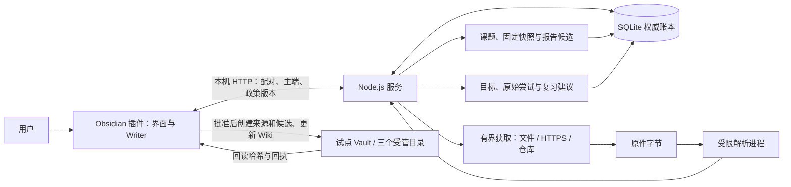
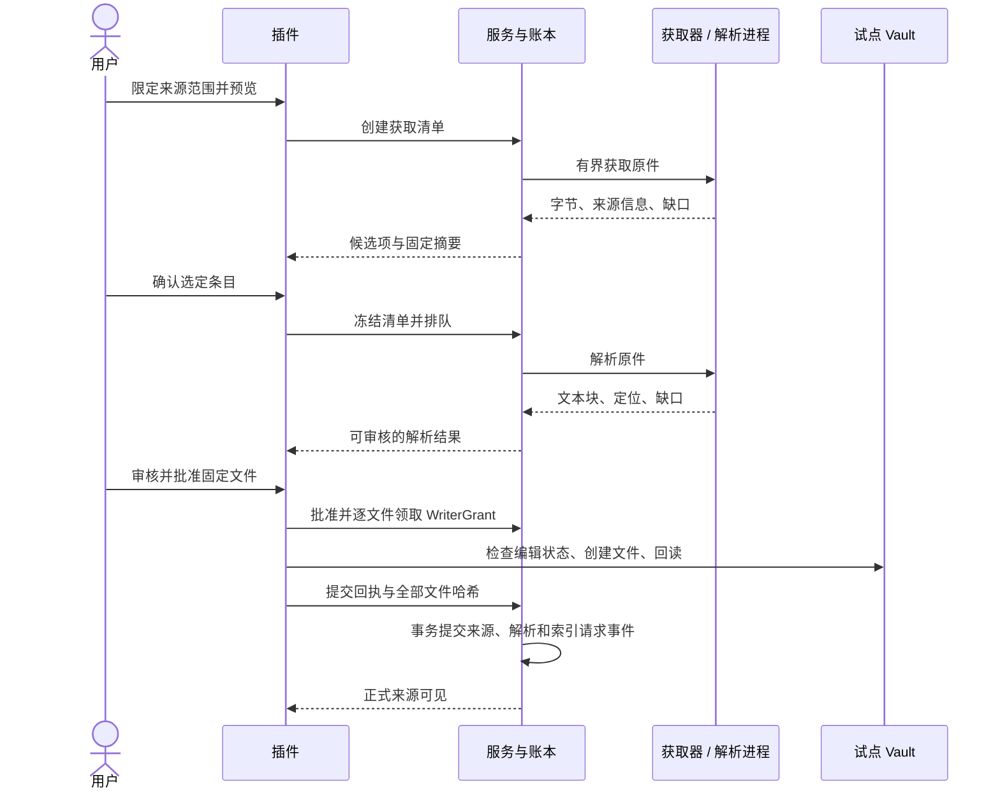

# 开发者接手指南

适合第一次接手这个仓库、需要运行和修改代码的开发者。最后核对：2026-09-22，已实现范围为场景 01、02、场景 03 的本地检索与问答工程接口，以及场景 04 的候选审核、Wiki 受控写入与恢复、场景 05 的库内研究和原文报告、场景 06 的学习目标、实际尝试与复习建议。真实模型与人工语义验收仍待完成。后续交付应同步更新本文，具体要求见 [贡献与交付约定](../../CONTRIBUTING.md)。

第一次接手，先读第 1—3 节，完成一份文本的收录。准备改代码时读第 4—7 节；遇到问题直接查第 8 节。不必先读完调研资料。

## 1. 这个项目现在能做什么

这是一个 Obsidian 桌面插件和本机 Node.js 服务组成的应用。插件负责操作界面、连接状态和经过批准的笔记写入；服务负责工作区、权限、作业、资料获取、解析和持久化。

目前可以把选定的资料库复制成独立试点，连接插件，收录文本、静态网页、文档集合、代码快照和 PDF。收录结果先供人检查，批准后才写入试点中的 `KB-Sources`。

| 范围 | 当前状态 | 接手时需要知道的限制 |
|---|---|---|
| 工作区接入、主端、会话、预算、作业治理 | 已实现 | 一份应用数据对应一个工作区；主端交接要显式完成 |
| 多来源获取、原件保存、解析与定位 | 已实现 | 基础解析目前仅在受测 macOS 环境开放；网页仅处理静态响应 |
| 来源文件审核与写入 | 已实现 | 仅新建不可变来源投影；不会自动覆盖人工修改 |
| 本地搜索、固定引用、原文整理与候选保存 | 已实现 | 首次查询或显式重建产生索引；原文摘录不等于已审核答案 |
| 候选区保存、Wiki 提升与更新、观察和影响清单 | 已实现本地流程 | 两次独立审核；打开编辑页会暂停写入；真实模型编译尚未开启 |
| 库内课题、历史资格、快照更新与研究报告 | 已实现原文流程 | [研究接手说明](../implementation/topic-research-report.md)；真实模型及语义验收未完成 |
| 学习目标、尝试、续学与复习建议 | 已实现本地流程 | [学习接手说明](../implementation/learning-practice-review.md)；TaskNotes / Today 仍待接入，当前不创建复习任务 |
| 模型回答、任务排程 | 部分接口及后续场景 | 模型适配器接口已实现，真实提供方与语义验收未完成；任务编排仍待实现 |
| OCR、模型、日历、通知和发布 | 尚未接入实际提供方 | 填写路线配置不会自动开通业务能力 |

首次收录后，可以直接进入 [检索与证据整理说明](../implementation/evidence-search-answer.md)，搜索中文短词或代码符号、回读引用，并了解模型能力当前的边界。

先保留默认配置 `{ "schemaVersion": 1, "budget": null, "routes": [] }`，即可跑通本地文本收录，不需要模型密钥。金额配置的单位是微美元，1 美元等于 1,000,000 微美元。

这里有两种不同的“预览”：CLI 的 `preview` 检查要接入的资料库；插件的“预览获取范围”会实际获取并暂存资料原件。两者都不会直接把新来源提交到正式来源列表。

## 2. 用一个独立样例跑起来

### 2.1 准备环境

本轮受测环境为 macOS 14.4 arm64、Node.js 24.14.1、pnpm 10.33.0、Obsidian 1.13.7。仓库要求 Node 24，精确依赖由 lockfile 固定。首次编译 `better-sqlite3` 等原生依赖可能需要 Xcode Command Line Tools。

以下命令在仓库根目录执行。Docker 只用于第三方执行隔离的专项测试，首次文本收录不需要 Docker。

```sh
node --version
pnpm --version
pnpm install --frozen-lockfile
pnpm build
```

构建成功后，应有 `apps/service/dist/main.js` 和 `apps/obsidian-plugin/dist/main.js`。当前没有热更新或自动复制插件的开发命令。

### 2.2 创建样例并预览接入

在同一个终端依次执行。临时目录只用于本次练习，系统可能清理它；正式使用请另选持久的本地目录。

```sh
KB_DEMO_ROOT=$(mktemp -d "${TMPDIR:-/tmp}/kb-onboarding.XXXXXX")
KB_DEMO_ROOT=$(cd "$KB_DEMO_ROOT" && pwd -P)
mkdir -p "$KB_DEMO_ROOT/source-vault" "$KB_DEMO_ROOT/materials"
printf '# 我的试点\n\n这是用于开发练习的资料库。\n' > "$KB_DEMO_ROOT/source-vault/首页.md"
printf '# 收录练习\n\n第一条：原件会保留。\n第二条：批准后才正式导入。\n' > "$KB_DEMO_ROOT/materials/hello.md"

node apps/service/dist/main.js preview \
  --source "$KB_DEMO_ROOT/source-vault" \
  --data "$KB_DEMO_ROOT/app-data" > "$KB_DEMO_ROOT/preview.json"
cat "$KB_DEMO_ROOT/preview.json"
```

预期 `fileCount` 为 1，`conflicts` 为空数组，并返回 `digest`。检查输出后，再执行下一步。`--data` 必须和来源目录分开，也不能位于来源目录的父目录；所有后续命令都要使用同一个 `--data`。

### 2.3 确认接入，找到试点

```sh
KB_DEMO_DIGEST=$(node -e 'console.log(JSON.parse(require("node:fs").readFileSync(process.argv[1], "utf8")).digest)' "$KB_DEMO_ROOT/preview.json")
node apps/service/dist/main.js adopt \
  --source "$KB_DEMO_ROOT/source-vault" \
  --confirm "$KB_DEMO_DIGEST" \
  --data "$KB_DEMO_ROOT/app-data" > "$KB_DEMO_ROOT/workspace.json"
cat "$KB_DEMO_ROOT/workspace.json"

KB_DEMO_VAULT=$(node -e 'console.log(JSON.parse(require("node:fs").readFileSync(process.argv[1], "utf8")).vaultPath)' "$KB_DEMO_ROOT/workspace.json")
printf '在 Obsidian 打开：%s\n待收录文件：%s\n' "$KB_DEMO_VAULT" "$KB_DEMO_ROOT/materials/hello.md"
```

输出中的 `vaultPath` 是应该在 Obsidian 打开的试点；`sourcePath` 是接入前的来源；`backupPath` 是接入时的备份。原资料库不会被移动。试点不复制原 `.obsidian` 和 `.git` 配置，以免自动运行原有插件。

如果两步之间修改了来源，摘要会失效，需要重新预览。已经接入的应用数据不能再次 `adopt`；第二次练习请从 2.2 节创建新目录。

### 2.4 安装插件，启动服务

```sh
mkdir -p "$KB_DEMO_VAULT/.obsidian/plugins/knowledge-task-center"
cp apps/obsidian-plugin/dist/main.js \
  apps/obsidian-plugin/dist/manifest.json \
  apps/obsidian-plugin/dist/styles.css \
  "$KB_DEMO_VAULT/.obsidian/plugins/knowledge-task-center/"

node apps/service/dist/main.js serve --data "$KB_DEMO_ROOT/app-data"
```

终端应显示服务地址 `http://127.0.0.1:27124` 和一次性配对码，保持这个终端运行。插件当前固定使用此端口，不能只修改服务端口来避开冲突。

在 Obsidian 中打开刚才的 `vaultPath`，允许第三方插件并启用“知识与任务中心”。进入该插件的设置页，输入配对码，点击“配对并检查”，然后点击“登记当前设备为主端”。“作业与诊断”中可以运行本地自检。

配对码 5 分钟内一次有效，会话最长 1 小时。插件重启后需要重新配对；要取得新码，先正常停止并重启服务。配对码和会话令牌不要放入笔记、截图或共享日志。

## 3. 完成第一次资料收录

在插件设置页的“05 / 资料收录”中操作：

1. 资料类型保留“文本 / Markdown / 剪藏”，入口填写刚才打印的 `materials/hello.md` 绝对路径。其他字段保留默认，本地文件不需要允许域名。
2. 点击“预览获取范围”。应出现 1 个候选，核对标题、范围和排除理由。
3. 点击“确认清单并解析”，随后刷新本批。查看解析正文和块定位，正文应包含样例中的两条说明。
4. 点击“审核正式导入文件”，展开将要生成的文件，检查内容后点击“批准以上文件并写入”。
5. 在试点的 `KB-Sources` 中找到新 Markdown 文件，并从插件的正式来源列表打开原文与定位。

验收这次练习时，分别检查“看到了解析结果”“试点中有来源文件”“正式来源列表中有记录”。作业显示完成，只说明获取与解析阶段结束；批准、写入和提交还有各自的状态。

练习结束后先让作业完成；如果要交接设备，在插件中释放主端。终端按 `Ctrl+C` 正常关闭服务。稍后继续时，使用原 `app-data` 启动服务即可，无需重新接入。换终端后 shell 变量不会保留，可从之前打印的路径恢复变量。

### 换成其他资料时填写什么

| 类型 | 入口与授权 | 结果需要检查什么 |
|---|---|---|
| 单页网页 | 完整 URL；显式允许域名和 URL 路径 | 重定向目标也需授权；登录墙、动态内容可能留下缺口 |
| 文档集合 | 文档入口或 `llms.txt`；限定域名、路径、页数和深度 | 发现清单只是本次范围；冻结后不会自动扩展 |
| 本地代码或 ZIP | 明确授权的路径；选择源码或发布产物 | 源码模式排除 `dist/build`；二进制、LFS 和子模块会标缺口 |
| GitHub 仓库 | `https://github.com/owner/repo`；允许 `api.github.com,raw.githubusercontent.com` | ref 会固定为实际 commit；不会执行仓库脚本或安装依赖 |
| PDF | 本地文件路径或已授权 HTTPS URL | 物理页和印刷标签不同；扫描页、表格、公式及列顺序要人工检查 |

编码选错时使用“重新解析原件”，保留原字节；需要读取上游新版本时使用“重新获取并生成新预览”。PDF 密码仅供本次解析使用，不持久保存。应用数据、试点 Vault 和生成目录不能反向收录。

## 4. 从界面到文件，代码如何协作



服务保存资料事实、证据、索引和提交记录，插件负责正式 Vault 写入。Wiki 的双重审核、同步更新和故障恢复见 [场景 04 说明](../implementation/wiki-review-commit.md)。检索与问答内部架构及流程见 [场景 03 图示](../implementation/evidence-search-answer.md#3-数据怎么流动)。解析器只接收原字节与必要配置，不能写 Vault、访问网络或启动子进程。当前 macOS 解析隔离与第三方程序的 OCI 隔离是两条不同路径。



批准绑定的是文件路径、内容、来源修订、解析、政策版本与主端代次。它不是“之后随时可写”的授权：批准有效期为 10 分钟，来源逐文件授权最多 60 秒；Wiki 和候选区最多 15 秒。中途断连可能留下部分已创建文件，但正式来源要等所有必要回执齐全才出现。

### 阅读代码的顺序

下表链接均指向实际源码；先沿一条业务链读完，再展开通用设施。

| 想理解或修改什么 | 首先阅读 | 继续追踪 |
|---|---|---|
| 命令启动、参数、锁和退出 | [service/main.ts](../../apps/service/src/main.ts) | [workspace/registry.ts](../../apps/service/src/workspace/registry.ts) |
| 插件注册、界面入口 | [plugin/main.ts](../../apps/obsidian-plugin/src/main.ts) | [views/settings.ts](../../apps/obsidian-plugin/src/views/settings.ts)、[views/ingestion.ts](../../apps/obsidian-plugin/src/views/ingestion.ts) |
| 客户端请求、刷新和幂等 | [connection.ts](../../apps/obsidian-plugin/src/connection.ts) | [http/server.ts](../../apps/service/src/http/server.ts)、[http/auth.ts](../../apps/service/src/http/auth.ts) |
| 收录字段和状态定义 | [contracts/ingestion.ts](../../packages/contracts/src/ingestion.ts) | [contracts/changeset.ts](../../packages/contracts/src/changeset.ts) |
| 获取、冻结、重试和解析调度 | [ingestion/routes.ts](../../apps/service/src/ingestion/routes.ts) | [manifest.ts](../../apps/service/src/ingestion/manifest.ts)、[fetcher.ts](../../apps/service/src/ingestion/fetcher.ts)、[repository.ts](../../apps/service/src/ingestion/repository.ts) |
| 原件、修订与解析保存 | [objects.ts](../../apps/service/src/ingestion/objects.ts) | [store.ts](../../apps/service/src/storage/store.ts)、[002-sources.ts](../../apps/service/src/storage/migrations/002-sources.ts) |
| 解析入口与格式处理 | [parser.ts](../../apps/service/src/ingestion/parser.ts) | [parser-entry.ts](../../apps/service/src/ingestion/parser-entry.ts)、[web-parser.ts](../../apps/service/src/ingestion/web-parser.ts)、[pdf-parser.ts](../../apps/service/src/ingestion/pdf-parser.ts) |
| 本地检索、索引代、证据和问答 | [search/search.ts](../../apps/service/src/search/search.ts)、[evidence/locator.ts](../../apps/service/src/evidence/locator.ts) | [answers/answer.ts](../../apps/service/src/answers/answer.ts)、[场景 03 说明](../implementation/evidence-search-answer.md) |
| 审批、落盘、冲突和恢复 | [commit.ts](../../apps/service/src/ingestion/commit.ts) | [writer/apply.ts](../../apps/obsidian-plugin/src/writer/apply.ts)、[writer/guard.ts](../../apps/obsidian-plugin/src/writer/guard.ts) |
| Wiki 提案、批准、版本提交与人工观察 | [review/routes.ts](../../apps/service/src/review/routes.ts)、[views/review.ts](../../apps/obsidian-plugin/src/views/review.ts) | [场景 04 使用与维护](../implementation/wiki-review-commit.md) |
| 课题、覆盖、快照与报告 | [research/routes.ts](../../apps/service/src/research/routes.ts)、[views/research.ts](../../apps/obsidian-plugin/src/views/research.ts) | [场景 05 使用与维护](../implementation/topic-research-report.md) |
| 学习目标、尝试、容量与版本影响 | [learning/routes.ts](../../apps/service/src/learning/routes.ts)、[views/learning.ts](../../apps/obsidian-plugin/src/views/learning.ts) | [场景 06 接手说明](../implementation/learning-practice-review.md) |
| 作业租约和费用 | [jobs.ts](../../apps/service/src/runtime/jobs.ts)、[budget.ts](../../apps/service/src/runtime/budget.ts) | [worker-pool.ts](../../apps/service/src/runtime/worker-pool.ts) |
| 出站与文件授权边界 | [security/egress.ts](../../apps/service/src/security/egress.ts)、[security/paths.ts](../../apps/service/src/security/paths.ts) | [file-reader.ts](../../apps/service/src/ingestion/file-reader.ts) |

## 5. 数据放在哪里，哪些可以重建

```text
app-data/
  state.db                         权威账本：原件、版本、作业、预算、批准、回执
  state.db-wal / state.db-shm       SQLite 运行时可能存在的伴随文件
  service.lock                     当前服务 PID
  state.db.before-v2-<id>           从 schema 1 升级时才生成的数据库快照
  state.db.before-v3-<id>           迁移到证据与检索 schema 3 前的数据库快照
  state.db.before-v4-<id>           迁移到 Wiki schema 4 前的数据库快照
  state.db.before-v5-<id>           迁移到研究 schema 5 前的数据库快照
  state.db.before-v6-<id>           迁移到学习 schema 6 前的数据库快照
  workspace-<id>/
    pilot/                         Obsidian 打开的试点
      .obsidian/plugins/knowledge-task-center/
      KB-Sources/                  批准后的不可变来源文件
      KB-Wiki/                     审核后的正式知识页面
      KB-Candidates/               单独审核保存的候选投影
      KB-Plans/                    预留目录
    backup/                        接入时的原资料库副本
    backup-manifest.json           接入时逐文件哈希与目录清单
```

`backup/` 只代表接入时刻，不会持续备份后来的收录。原件以 BLOB 存入 SQLite，不能仅靠 `KB-Sources` 文件恢复完整账本。可重建的是仓库中的 `dist/`、`node_modules/` 和测试输出；不要把 `state.db` 当作可删除的索引缓存。

常用术语及其对应关系：

| 名称 | 含义 |
|---|---|
| acquisition / ingestion / batch | 一次有明确范围的获取及处理清单；`ingestions` 表保存其状态 |
| source | 来源身份；同标题不等于同来源 |
| revision | 某来源取得的一版原字节；相同来源、相同字节复用修订 |
| parse artifact | 用指定解析器和配置得到的文本块与定位；重新解析保留旧产物 |
| ChangeSet | 待批准的固定文件变更集合 |
| WriterGrant / receipt | 逐文件短期授权 / 写入后回读哈希的回执 |
| epoch / policyVersion | 主端代次 / 政策版本，用于拒绝旧会话和过时操作 |

批次 `ready` 表示当前阶段处理结束，仍要看每条结果。条目的 `partial_parse` 表示有解析缺口；`pending_write` 仍待写入；`committed` 才是已正式提交。任务状态、批次状态和条目状态不能互相替代。

数据备份目前需要人工执行：先正常停止服务并关闭试点，复制完整应用数据目录到新的备份位置，记录代码版本与原路径。服务运行时单独复制 `state.db` 可能漏掉 WAL 数据。账本中存在工作区绝对路径，恢复到不同位置需要单独核对，当前没有一键搬迁命令。升级前快照用于核对或隔离恢复，不应直接覆盖已经产生新资料的数据库。

## 6. 修改代码后的日常流程

服务和插件都从构建产物运行。修改 `src` 后，执行 `pnpm build`；服务端变更需要停止并重新启动服务；插件端变更需要重新复制第 2.4 节的三个文件，在 Obsidian 中关闭再启用插件，并重新配对。共享 contracts 变更通常需要两端一起更新。

例如调整收录表单字段时，先检查 [字段 schema](../../packages/contracts/src/ingestion.ts) 的含义和上限，再修改表单和必要的服务校验。只改界面上限不会改变服务约束；修改解析行为时还要考虑解析指纹与旧引用是否继续有效。不要通过直接修改数据库状态来让界面显示“成功”。

按修改范围选验证：

| 命令 | 用途与前置条件 |
|---|---|
| `pnpm build` | 生成服务、worker、解析入口和插件产物 |
| `pnpm typecheck`、`pnpm lint` | 类型和静态检查 |
| `pnpm test` | 先构建，再运行常规测试；可选环境专项默认跳过 |
| `pnpm check` | 类型、lint、常规测试与编译后服务测试，代码交付的基本检查 |
| `pnpm test:corpus` | 重建并验证真实资料；需要外网，外部站点可能变化 |
| `pnpm test:desktop` | 重建并操作真实 Obsidian；需要 `/Applications/Obsidian.app`，27124 端口空闲 |
| `pnpm test:oci` | 真实容器限制；先构建，准备 Docker 与 README 指定镜像 |
| `KB_TEST_OCI=1 KB_TEST_BUILT=1 KB_TEST_CORPUS=1 pnpm test` | 开启全部服务专项；不包含桌面脚本，桌面仍单独运行 |

定向验证示例：

```sh
pnpm build
pnpm exec vitest run tests/integration/ingestion-manifest.test.ts tests/faults/ingestion-commit.test.ts
```

边界回归位于 `tests/security/`，流程测试位于 `tests/integration/`，故障恢复位于 `tests/faults/`。桌面脚本使用独立配置和测试 Vault，产物在 `.context/runtime-validation/`。测试数量属于某次验收记录，不能用历史数量代替本次运行结果。

## 7. 调接口与定位故障

先从 [Connection](../../apps/obsidian-plugin/src/connection.ts) 看现有调用方式，再看服务路由。接口只监听本机回环地址；直接在浏览器打开 URL 不会自动带上插件会话。

`POST /v1/pair` 使用一次性配对码、设备 ID 和试点绝对路径换取会话。后续请求带 Bearer；写入类操作还需当前政策版本 `x-policy-version` 和用于重试去重的 `x-operation-key`。配对、会话、预览和重解析等接口各有规则，应复用现有调用逻辑，避免把密码写入持久幂等记录。

完整接口表见 [治理验收记录](../implementation/runtime-governance-validation.md)和[收录验收记录](../implementation/multi-source-ingestion-validation.md)。返回错误包含 `code`、`message`、`impact`、`nextStep`、`retryable`、`detailId`。优先保存错误代码和复现步骤，不要为排错记录整份请求正文或配对凭据。`detailId` 是错误标识，当前没有按该 ID 自动检索日志的后台。

在另一个终端，用实际应用数据路径执行：

```sh
node apps/service/dist/main.js diagnose --data "/实际的/app-data"
```

这会输出脱敏版本、队列和费用汇总。如果需要进一步查表，先看验收记录中的只读 SQL；不要把修复手段写成修改 `committed`、删除作业或清空预算账本。

## 8. 常见问题怎么处理

| 现象 | 先检查 | 下一步 |
|---|---|---|
| 插件加载后仍是旧界面 | 是否只改了源码，或把文件复制到原 Vault | 重新构建，复制到 `vaultPath`，重载插件 |
| 原生依赖安装失败 | Node 是否为支持的 24 版本，编译工具是否可用 | 按 lockfile 重装依赖，保留具体安装错误；不要随意升级依赖规避 |
| 服务端口被占用 | 27124 是否已有服务或桌面测试 | 找到对应进程并正常停止，再启动当前工作区 |
| `SERVICE_LOCK` | `app-data/service.lock` 中的 PID 是否仍属于旧服务 | 用 `ps -p <PID> -o command=` 核对；仅确认服务已退出后删除残留锁 |
| 配对失败或 `AUTH` | 码是否过期、是否已经用过、打开的是不是试点 | 重启服务取得新码；核对 `vaultPath`，重新配对 |
| `MASTER` 或作业不执行 | 是否登记主端，插件是否持续在线 | 刷新连接；旧主端先完成作业和费用核对再释放，新端显式认领 |
| `BASELINE` | 文件、配置或政策是否发生变化 | 接入时重新预览；已连接时刷新状态，重新审核变化 |
| `FORBIDDEN` | 本地目录是否越界、网络域名和路径是否明确授权 | 修正具体范围；不要直接放开所有目录或域名 |
| 解析入口缺失 / `UNAVAILABLE` | 是否先构建，是否在受测 macOS 上运行 | 重新构建并检查环境；Linux/Windows 解析当前不可用 |
| `SNAPSHOT_CHANGED` | 本地文件是否在获取过程中发生变化 | 稳定文件后重新获取并生成新预览 |
| PDF 无文字或网页内容不全 | 扫描页、登录墙、动态页面及解析缺口 | 查看原件；必要时人工剪藏或重解析，不把部分覆盖标为完整 |
| 作业成功但没有正式来源 | 是否完成审核、批准和全部文件回执 | 回到本批导入审核，核对未完成文件 |
| Writer 提示文件正在编辑或内容冲突 | 目标是否在任一 Markdown 编辑页打开，是否已有不同内容 | 先保存并核对人工内容，关闭目标页后再审核；不要盲目删除冲突文件 |
| 已有文件但上次没有收到成功响应 | 文件是否仍与批准后的哈希一致 | 从原批次审核恢复；系统可识别已应用文件，不必另建批次重复写入 |
| `SCHEMA`、哈希损坏或出现未批准写入 | 数据版本、部署版本和最近操作 | 停止写入，保留完整数据与诊断；按验收记录核查，不清库重置 |

插件每 15 秒心跳，失联 45 秒后暂停后台执行。失联不会自动把主端交给其他设备。网络失败的条目可以按批次重试；已成功条目可复用。取消只阻止后续步骤，不会撤销已取得的原件、已写入文件或已经发生的远端费用。

## 9. 继续阅读和交接

理解产品范围，读 [PRD](../brainstorms/2026-09-21-obsidian-knowledge-and-task-center-requirements.md)；理解后续业务拆分，读 [总体技术方案](../plans/2026-09-21-001-feat-overall-knowledge-task-plan.md)。场景 01、02 的设计和验收入口已列在根 [README](../../README.md)。`docs/00` 等编号目录保留早期调研，里面的设计建议和示例不代表已经实现。

下一次交付需要把“如何使用、从哪里改、如何验证、失败后如何恢复”一起交接。文档位置和完成清单见 [CONTRIBUTING](../../CONTRIBUTING.md)，无需每次重新创建一篇重复的总指南。

本文的组织参考 [Diátaxis](https://diataxis.fr/) 对教程、操作指引、参考和解释的区分，以及 [Write the Docs 的入门文档指南](https://www.writethedocs.org/guide/writing/beginners-guide-to-docs/) 对读者、安装和小例子的建议；章节内容以本仓库实际实现为准。

### 本文核对记录

2026-09-21：逐段执行第 2.2—2.4 节的样例命令，确认预览得到 1 个文件且无冲突、接入后副本内容一致、三个插件文件复制到试点、服务在 27124 启动、诊断返回 JSON、正常退出后锁文件清理。测试用临时目录已清理。本次文档变更未重跑依赖安装、Obsidian 界面或整套业务测试；真实桌面收录结果见场景 02 的既有验收记录。文档本地链接和差异格式已检查。

2026-09-22：补充场景 04 的使用入口、Writer 更新与 schema 4 数据说明；本轮代码和真实桌面验证单独记录在 [Wiki 验收](../implementation/wiki-review-validation.md)，不替换上方 2026-09-21 的历史核对结果。

2026-09-22（场景 05）：补充课题研究、schema 5 和报告保存入口；本轮验证见[研究验收记录](../implementation/topic-research-validation.md)，不改写上方历史验收。

2026-09-22（场景 06）：增加学习目标、实际尝试与 schema 6 入口；TaskNotes / Today 明确保留集成门槛。本轮命令与桌面结果见[学习验收记录](../implementation/learning-practice-validation.md)，不替换历史验证。
