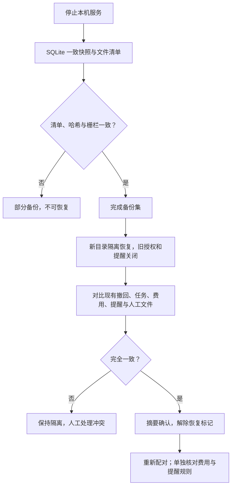

# 撤回、备份恢复与退出接手说明

本文面向刚接手项目的开发者。这里的“备份集”指本机应用数据目录、试点 Vault 和 SQLite 账本的一份可校验副本；“隔离恢复”指先恢复到新目录并保持服务能力关闭，绝不覆盖现有数据。设计目标见[场景 10 方案](../plans/2026-09-21-011-feat-backup-retraction-recovery-plan.md)，本页只描述当前代码已能做的事。

## 当前能完成什么

| 操作 | 已实现的结果 | 尚需人工处理 |
|---|---|---|
| 撤回正式来源 | 管理员在插件 **13 / 撤回与维护** 或本机 API 提交原因；政策版本前进，本机读取和外发入口按当前政策拒绝旧来源；不能用策略更新直接解除撤回 | 逐项检查已生成的 Wiki、报告、学习记录与外部副本；已经发出的内容无法收回 |
| 备份与验证 | 停止服务后，以 SQLite 一致快照、对象哈希和应用文件清单生成 `manifest.json` 与 `COMPLETE`；缺项或复制期间有变化只留下部分备份 | 选择受保护的本地目标和保留策略；系统凭据库的密钥不在包内 |
| 隔离恢复 | 校验完整备份后复制到新目录，建立恢复标记；旧会话和 Writer grant 作废，未完成作业取消，收费调用保留为未知，提醒规则关闭 | 对比现有账本与人工文件；较新事实冲突时不能自动继续 |
| 有条件继续 | 与原现场逐项核对相等后，用核对摘要解除恢复标记；新的配对才可写入；收费路线另需核对未知项后开放 | 恢复后的 Vault 要重新安装／配对插件；提醒规则需重新明确登记 |
| 退出与清除 | 导出可读 Vault、原件字节、来源／证据、学习／计划历史及待处理清单；可列来源相关对象和共享引用 | 清除目前仅有清单，**没有执行物理删除**；凭据撤销、外部内容和其他备份须分别处理 |

当前没有在线 relay，不能核对远端提醒或做关机后投递。恢复因此只支持现有本机账本仍可读取、且与备份中的关键事实完全一致的保守继续。现场丢失、发生过较新撤回／任务事实、人工编辑或提醒锚点冲突时，隔离目录继续保持关闭；不要为通过核对而删改新事实。

## 操作前确认

1. 在试点 Obsidian 中结束编辑，等待在途作业收敛；在服务终端按 `Ctrl+C` 停止。检查应用数据目录没有 `service.lock`。若有残留锁，按[接手指南](../development/onboarding.md)核对旧进程后再清理。
2. 准备与应用数据、试点 Vault 分离的新目录。备份集含私密正文和原件，未自行加密；使用受保护磁盘与受控账户。不要放进会自动运行插件的资料库，也不要把完整备份提交到 Git。
3. 下例的 `KB_DATA` 指已接入试点的应用数据绝对路径。默认值在 macOS 是 `~/Library/Application Support/KnowledgeTaskCenter`，这里只用独立路径示例，避免误操作真实资料。

```sh
KB_DATA="/绝对路径/应用数据"
KB_SET="/绝对路径/新备份集"
pnpm build
pnpm service backup --data "$KB_DATA" --output "$KB_SET"
pnpm service verify-backup --set "$KB_SET"
```

`backup` 返回 `complete: true` 才能作为恢复输入；`complete: false` 会列出 `errors`，目录没有 `COMPLETE`，不要自行补写。`verify-backup` 再次检查完成标记、全部文件哈希、数据库完整性／外键、对象原件、工作区身份、事件水位和提醒栅栏。单文件上限 100 MB，全部普通文件合计 2 GB、25,000 个；越界会留下部分备份。空目录本身不作为独立内容保存。

接入时生成的 `workspace-.../backup` 只是原始资料库副本，**不是**本命令生成的完整系统备份。备份集还包含应用数据下其他普通文件、账本和来源原件；SQLite 的活动 WAL 不靠直接复制。备份期间若 Obsidian 或其他程序修改 Vault／应用文件，前后清单不一致会拒绝标记完成。

## 撤回一份来源

先在正式来源列表核对来源 ID。插件 **13 / 撤回与维护** 输入 ID，点“查看影响”，填写原因、勾选确认后点“确认撤回来源”。管理员也可调用 `POST /v1/sources/:id/retract`，请求体为 `{ "reason": "..." }`，沿用本机 Bearer、政策版本和操作键。`GET /v1/sources/:id/retraction-impact` 只返回影响数量和边界说明。撤回记录存入 `kv` 的 `retraction:<id>`，原政策更新为所有路线拒绝，事件写入账本；重新写一份 `retracted:false` 的政策会被拒绝。

撤回不会删除个人任务或历史事实。影响数量是待复核线索，不代表所有派生正文已经自动擦除；如果 Wiki 页面混入多个来源，先停止旧页面的再分发，并人工核对、重新生成或修订。原件和证据读取、旧检索快照、答案缓存以及在途模型结果的当前政策复核沿用场景 03 的入口；[检索与证据说明](evidence-search-answer.md)列出这些路径。已送往模型提供方、系统通知或用户另存的内容无法召回。当前没有远端提醒取消适配器。

停止服务后可取来源清除清单：

```sh
pnpm service purge-inventory --data "$KB_DATA" --source-id "正式来源 UUID"
```

它会显示原件对象哈希、其他来源是否仍引用相同字节，以及 SQLite 页／WAL、迁移快照、备份和外部副本的处理范围。`status` 为 `inventory-only`，`physicalDeletionPerformed` 固定为 `false`。不能把它当成清除回执。

## 在独立目录演练恢复

```sh
KB_STAGE="/绝对路径/新的隔离恢复目录"
pnpm service restore-stage --set "$KB_SET" --output "$KB_STAGE"
pnpm service diagnose --data "$KB_STAGE"
pnpm service restore-audit --set "$KB_SET" --current-data "$KB_DATA"
```

隔离目录的 `state.db.restore-hold` 是禁止写入标记。即使误启动 `serve --data "$KB_STAGE"`，它也不会签发配对码、启动作业或发送提醒；用 `diagnose` 查看即可。`RESTORE-REPORT.json` 记录本次处置和隔离账本指纹；继续前会重新核对，隔离期间账本被改动就保持关闭。恢复会重定向试点 Vault／接入备份路径到隔离目录，撤销旧会话和 grant，停用提醒规则，并把发送中提醒与调用记为结果未知。不要复制旧会话令牌或旧插件配置来跳过重新配对。

`restore-audit` 返回 `conflicts`、`canResume` 和 `confirmDigest`。它比较来源、修订、批准、研究、学习、任务事实、计划、费用、提醒账本、政策与任务配置、事件水位、Vault 文件和提醒外部锚点。任何冲突都不输出继续摘要。尤其是较新的撤回、删除／完成任务或人工笔记修改，必须留在现有现场，不得用旧备份覆盖。如果现场不存在或外部提醒账本无法核对，当前版本没有自动合并路径。

仅在 `canResume: true` 且人工核对结果符合预期时，把当次返回的摘要传给继续命令：

```sh
pnpm service restore-resume \
  --data "$KB_STAGE" --set "$KB_SET" \
  --current-data "$KB_DATA" --confirm "restore-audit 返回的 confirmDigest"
```

继续命令会重新核对当前现场和隔离文件，完成后才解除恢复标记并在新目录建立提醒外部锚点。它**不替换**原 `KB_DATA`。要用恢复目录运行服务，须明确改用 `serve --data "$KB_STAGE"`，检查该试点 Vault 内的插件安装，重新配对并登记主端。旧提醒规则保持关闭；人工查看重复通知风险后再重新登记。收费调用也保持关闭：新管理员配对后，先读 `GET /v1/recovery/paid-gate`，核对 `unknownCalls`、实际提供方账单与预算，再用 `POST /v1/recovery/paid-gate/reopen` 提交 `{ "reviewedUnknownCalls": 数量, "confirm": true }`。条数变化会拒绝开放。此接口只证明人工确认了本机未结算项，不会替提供方自动结算，也不开放已撤回来源。

## 可读退出

停止服务后运行：

```sh
KB_EXIT="/绝对路径/新的退出目录"
pnpm service exit-export --data "$KB_DATA" --output "$KB_EXIT"
pnpm service verify-exit --set "$KB_EXIT"
```

输出包括 `Vault/` 原字节、`originals/` 按 SHA-256 命名的原件、`source-map.json`、`learning.json`、`plans.json`、`pending.json` 和包内 README。`verify-exit` 会核对完成标记、文件清单与内容哈希。仍可直接用文件管理器或 Markdown 编辑器阅读 Vault；JSON 用于保留来源映射和历史。导出不删除现有文件、不撤销系统凭据库密钥、不取消已经发出的通知或第三方副本。需要彻底退出时，先人工核对待处理清单，再分别关闭外部连接与凭据；目前没有一键清除。

## 代码入口与排障

维护命令位于 `apps/service/src/main.ts`；清单、数据库校验在 `lifecycle/backup.ts`，隔离复制在 `lifecycle/restore.ts`，当前事实核对与继续闸门在 `lifecycle/resume-gates.ts`。来源撤回在 `lifecycle/retraction.ts` 与 `security/policy.ts`；清除清单和退出分别在 `lifecycle/purge.ts`、`lifecycle/export.ts`。插件入口在 `apps/obsidian-plugin/src/views/maintenance.ts`。提醒外部锚点位于应用数据**父目录**，不能把它和旧数据库一起回滚。

`verify-backup` 报哈希或完成标记错误时，保持原现场并重新生成全新备份集；不要手改清单。`restore-audit` 有冲突时查看具体表名和 Vault 文件，保留隔离目录供人工比对；本版没有冲突自动合并。恢复目录无法配对时先用 `diagnose` 检查 `restoreHeld` 与 `reminderPaused`，不要直接删除 `state.db.restore-hold`。未知 schema 只能只读诊断，不能用较旧程序猜测迁移。执行验证范围和未完成项见[场景 10 验证记录](backup-retraction-recovery-validation.md)。


