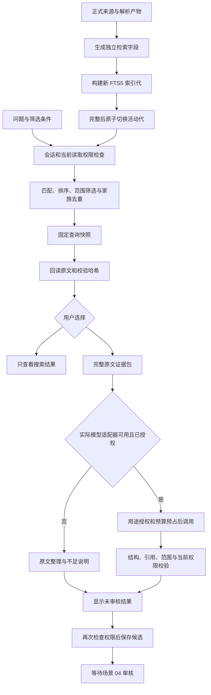
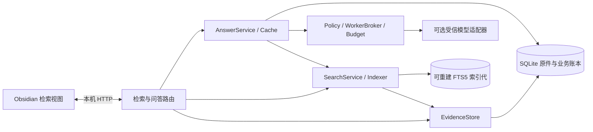

# 场景 03：证据检索、原文整理与问答接入

最后核对：2026-09-21。面向刚接手项目的开发者；首次安装先读 [开发者接手指南](../development/onboarding.md)，设计边界见 [场景 03 方案](../plans/2026-09-21-004-feat-evidence-search-answer-plan.md)。

## 1. 这次可以使用什么

正式提交的资料可以在本机按中文短词、英文别名、代码符号和标题检索。结果带固定原文、来源版本、解析版本、范围、覆盖缺口和查询快照。没有模型密钥也能完成搜索、回读、原文证据整理和候选保存。

模型回答的合同、预算调用路径、引用校验、缓存和撤回处理已实现。当前启动程序没有安装真实模型提供方，界面会显示“未配置模型”；受信适配器的工程测试不能代替真实模型效果验收。方案要求的重要主张人工支持率 ≥95% 尚未验收，因此场景方案仍保留 `active` 状态。

| 能力 | 当前行为 |
|---|---|
| 关键词搜索 | 中文单字和双字、固定别名、精确符号；无需外发 |
| 范围筛选 | API 支持主题、版本、渠道、阶段、配置、模态、来源类型；界面提供版本、来源类型、集合、审核状态和历史时点 |
| 固定原文回读 | 校验正文、范围、片段哈希和原件哈希引用；定位损坏时拒绝显示有效证据 |
| 原文整理 | 保留完整原文块，标示不足与缺口；不自动生成综合结论 |
| 模型回答 | 受信服务端适配器接口可用，默认没有实际提供方；不允许从笔记或请求体配置执行代码、URL |
| 候选保存 | 保存固定结果，等待场景 04 审核；不会创建或更新 Wiki |
| 知识检查 | 检查已登记来源与主张的无来源、失效定位、覆盖、分歧、孤立及显式替代关系 |
| 检索增强 | 记录对照门槛，向量、重排、图增强保持关闭，不发起外部请求 |

“有原文支持的证据”表示摘录能回到原文，不表示已经证明它回答了整个问题。界面会同时显示“语义尚未人工审核”。单靠引用格式合法无法证明语义正确。

## 2. 在插件中完成一次检索

### 准备资料

沿用场景 02：连接本机服务，登记主端，获取一份包含“权限不可默认开启”“Node.js”“C++”或实际函数名的资料。先核对解析结果，再批准文件写入。只有已正式提交的来源进入索引。

当前版本仍使用 `pnpm build` 构建，服务通过 `pnpm service serve --data "/实际应用数据目录"` 启动。升级插件时，将 `main.js`、`manifest.json`、`styles.css` 重新复制到试点插件目录，重载并重新配对。不要另建工作区来升级。

### 搜索和核对

1. 打开设置页的“06 / 证据检索与问答”。输入“权限”，点击“搜索原文”。
2. 结果显示本次实际问题、快照、索引状态和来源家族数量。展开条目，查看版本、来源类型、审核状态和覆盖警告。
3. 点击“回读固定原文”。核对来源修订、解析 ID、UTF-16 区间、页或行定位、相邻上下文，以及声明公开时间和已确认公开时间。
4. 用版本、集合、来源类型或审核状态缩小范围。未知范围仍可能出现在搜索结果中，但不能当作满足指定条件的事实依据。
5. 点击“整理本次原文证据”。系统保留完整块，不在块中间截掉否定、数值单位或条件；超限时提示缩小问题。
6. 需要交给后续审核时，点击“保存为待审核候选”。候选进入应用数据账本，等待场景 04 消费；目前没有 Wiki 审核页面。

“查看模型状态”展示已安装的受信路线；默认没有模型可选。仅在预算配置中添加路线不会自动安装模型适配器。

首次查询会构建本地索引。新增来源或修改范围后，后续查询检查索引代；也可点击“重建本地索引”。构建过程中已有读者使用旧的完整索引，并看到部分覆盖提示。没有命中时，应先核对筛选条件、索引完成度和原件覆盖。

## 3. 数据怎么流动





索引与业务表目前位于同一个 SQLite 文件，职责不同。允许重建索引不等于允许删除整个数据库。

## 4. 固定引用、范围和来源家族

每条证据固定 `parseId`、`revisionId`、`sourceId`、`blockId`、UTF-16 半开区间、片段哈希、规范化正文哈希、原件哈希和格式定位。索引中的 Unicode 规范化只影响检索字段；不会改写证据正文和偏移。

适用范围的空值表示未知。已知版本或渠道不同时返回不相交；比较完整范围时，只要还有未知项，就不能自动视为同范围冲突。`supports`、`contradicts`、`qualifies`、`supersedes`、`related-to` 分开登记；相似和相关不产生支持关系。主张以新 ID 表达修订，不能原地替换已有内容后沿用旧关系。

来源家族通过显式确认的父来源关联保存，不靠标题相同或向量相似自动合并。原文、镜像、转载和摘要可以登记关系，循环会被拒绝。搜索按家族去重；派生页只有能回读到当前快照中的原始证据，才进入事实证据包。尚未登记家族关系的转载仍可能分别出现，需要人工整理关系。

收录时继承的软件版本、集合和输入类型形成默认范围。更详细的范围、审核状态、来源家族和主张关系目前通过本地 API 维护，尚未提供完整的图形编辑器。确认公开时间必须附核对依据；页面声明时间、抓取时间不会自动变成已确认公开时间。

历史筛选仅使用已确认的公开时间。晚于目标日期的材料和公开时间未知的材料均排除，并显示提示。这是保守过滤，不会用当前材料假装还原当时全部知识。

## 5. 权限、快照和缓存

新收录的本地来源默认可供已配对且有读取角色的会话使用。若已为来源设置 `SourcePolicy`，则必须显式包含 `routes.read: ["local"]`；空数组禁止本地读取。外发模型另需 `routes.model` 中允许具体路线 ID。撤回优先于所有允许项。

升级前设置过自定义来源政策的工作区应检查 `read` 项。此版本不会自动扩大旧政策。搜索、原件、解析、已知证据 ID、旧快照、缓存和候选保存都会重新检查读取限制。

查询快照保留一小时，并绑定创建会话、索引代、实际命中的证据及范围摘要。它不会冻结永久权限。来源被撤回、范围或家族关系改变时，旧结果会被拒绝；重新配对产生的新会话不能凭旧 UUID 读取旧答案。

索引代完整后才发布。旧代在有效快照持有期间保留，后续查询或显式重建会清理过期快照及无读者的旧代。证据、修订和原件不会随索引代清理。保存候选保留完整材料供场景 04 后续处理；当前会话结果仍遵守快照有效期。

模型调用过程中周期检查权限和作业租约，失效时取消后续处理；费用回执不明确时保留预占。模型直接事实必须与完整引用块一致，改写只能标为推断，不能自行把结果标为已审核。缓存键包含问题、快照、政策版本、模型、路线和提示版本；命中后仍回读权限与证据。

服务端下一次访问会立即按新权限拒绝。插件对已显示的结果每 5 秒复核一次，失败后清除视图；已经被人读到或复制的内容无法远程收回。

## 6. 代码入口与接口

| 需要改什么 | 入口 |
|---|---|
| 证据、范围、快照、结构化回答合同 | [evidence.ts](../../packages/contracts/src/evidence.ts) |
| 定位校验、范围注记、家族和主张关系 | [locator.ts](../../apps/service/src/evidence/locator.ts)、[scope.ts](../../apps/service/src/evidence/scope.ts) |
| 分词、别名和精确符号 | [tokenizer.ts](../../apps/service/src/search/tokenizer.ts) |
| 索引代构建、切换和回收 | [indexer.ts](../../apps/service/src/search/indexer.ts) |
| 授权候选、筛选和固定快照 | [search.ts](../../apps/service/src/search/search.ts) |
| 证据包、调用、回答验证与缓存 | [answers/](../../apps/service/src/answers/) |
| HTTP 和插件操作 | [routes.ts](../../apps/service/src/search/routes.ts)、[views/search.ts](../../apps/obsidian-plugin/src/views/search.ts) |
| 知识检查与增强门槛 | [health.ts](../../apps/service/src/evidence/health.ts)、[enhancement.ts](../../apps/service/src/search/enhancement.ts) |
| schema 3 数据结构 | [003-evidence.ts](../../apps/service/src/storage/migrations/003-evidence.ts) |

接口继续使用配对 Bearer 和本机 Host/Origin 边界。读取允许 admin、user、reader；维护范围、重建、回答和保存候选需要 admin/user、当前主端与 `x-policy-version`。模型路线还受用途、会话心跳和预算限制。

| 接口 | 请求或结果 |
|---|---|
| `POST /v1/search` | `query` 必填；可选 `scope`、`collection`、`review`、`asOf`、`limit`；返回固定快照和结果 |
| `POST /v1/search/rebuild` | 重建索引，返回完整度、块数和分词指纹 |
| `GET /v1/evidence/:id` | 回读固定正文、上下文、范围、版本和定位 |
| `PUT /v1/evidence/profiles/:parseId` | 设置完整 Profile；空缺字段按合同默认值处理，修改前保留需要继续使用的字段 |
| `PUT /v1/evidence/family` | `{ "child": "来源 UUID", "parent": "原始来源 UUID" }`，显式关联且拒绝循环 |
| `PUT /v1/evidence/claims` | 创建固定主张；相同 ID 只接受内容一致的重放 |
| `PUT /v1/evidence/relations` | 登记关系；冲突候选必须具有已知重叠范围，互斥语义仍需人工确认 |
| `GET /v1/answers/options` | 实际已安装路线与模型状态 |
| `POST /v1/answers` | `snapshotId`、新操作 UUID `operationId`；可选已安装的 `routeId` |
| `GET /v1/answers/:id` | 重查授权后读取会话答案 |
| `POST /v1/answers/:id/candidate` | 重查授权后幂等保存固定候选，不写 Vault |
| `GET /v1/knowledge-health` | 问题类型、可读对象 ID 和说明；受限来源不返回正文 |
| `GET /v1/search/enhancement` | 当前关键词模式，增强关闭及原因 |

无模型查询示例，请通过现有 `Connection.request` 调用，避免在脚本日志中打印令牌：

```json
{
  "query": "Node.js 权限",
  "scope": { "version": "24", "sourceType": "text" },
  "collection": "开发",
  "review": "reviewed",
  "limit": 10
}
```

复用快照时，提交原始查询条件并增加 `snapshotId`，不能沿用旧快照 ID 换一个问题。模型请求超时或费用未知时，不自动生成新操作 ID 重发。

新增真实模型适配器的接入点是 `createServer` 的受信 `answerProviders` 参数及 `AnswerProvider.generate`。适配器必须自行落实提供方固定地址、系统凭据库、模型与提示、完整输入用量上界和真实费用回执；不能把测试中的固定费用照搬到真实调用。接入后还要完成真实输出、人工作用条件核对和过度拒答评估，再对外声明模型能力。当前 CLI 没有提供任意提供方配置文件加载入口。

## 7. 迁移、诊断与恢复

已知 schema 2 升级前创建权限为 0600 的 `state.db.before-v3-<id>`，再事务创建证据、索引、快照、缓存和候选表。schema 1 仍先沿原迁移到 schema 2，再迁移到 3；未知结构保持只读诊断。重启会验证已知结构，避免把半迁移数据库当成可用版本。

`evidence`、范围注记、来源家族、主张关系和候选属于需要保留的业务事实。`search_documents`、`search_fts` 和索引代是可重建数据。原件、来源修订和解析继续保存在原业务表。

| 问题 | 处理方式 |
|---|---|
| 已收录但搜不到 | 确认已经批准并正式提交，清除过严筛选，再重建索引 |
| 结果显示部分索引 | 等待当前构建结束后重新搜索；旧完整代仍可用 |
| `SNAPSHOT_EXPIRED` | 重新搜索，不把过期答案当作仍有效的快照 |
| `BASELINE` | 检查是否修改了范围、家族或政策，刷新连接并重新搜索 |
| `HASH_MISMATCH` | 保留原件和账本，核对解析；不要直接改引用偏移来让校验通过 |
| `FORBIDDEN` | 核对角色、主端及来源 `read`/`model` 路线，不清库绕过 |
| `UNSUPPORTED_CLAIM` / `SCOPE_MISMATCH` | 模型删改原文或伪造条件，结果未入缓存；检查适配器与结构化输出 |
| `UNKNOWN_COST` / `CALL_ALREADY_SENT` | 保留预占，核对提供方回执；不要用新键盲目重试 |
| `SCHEMA` | 停止写入，保留完整应用数据，使用匹配版本诊断 |

回退代码前先停止服务并备份完整应用数据。旧程序不识别 schema 3，不能直接用旧版本继续写当前数据库。迁移前快照只用于独立副本核对；已有新证据或候选时，不用旧快照覆盖当前库。

## 8. 验证与质量边界

本次验证命令与结果见 [验收记录](evidence-search-validation.md)。开发时可以先运行：

```sh
pnpm build
pnpm exec vitest run tests/unit/evidence-scope.test.ts tests/integration/evidence-readback.test.ts tests/integration/lexical-search.test.ts
pnpm exec vitest run tests/integration/grounded-answer.test.ts tests/security/revoked-evidence.test.ts
pnpm exec vitest run tests/performance/search-benchmark.test.ts tests/evaluation/retrieval-comparison.test.ts
pnpm check
pnpm test:desktop
```

固定问题集保存在 [tests/fixtures/search](../../tests/fixtures/search/README.md)，使用固定版本的真实项目文档与源码。它适合检查接手问题的基础召回，规模只有 7 个来源家族，不能据此推断大型知识库或开放领域问答质量。17 个可回答、3 个无答案题的实际分子分母、过度拒答和模型调用数均在报告中记录。

真实模型尚未接入，人工重要主张支持率尚未验收；后续约 80 题及 P7 的向量/重排/图对照也未执行。当前不把这些项目标成通过。

分词与 FTS 设计参考 [SQLite FTS5 官方文档](https://www.sqlite.org/fts5.html)。实际版本和行为以锁定依赖、源码与本仓库测试为准。
