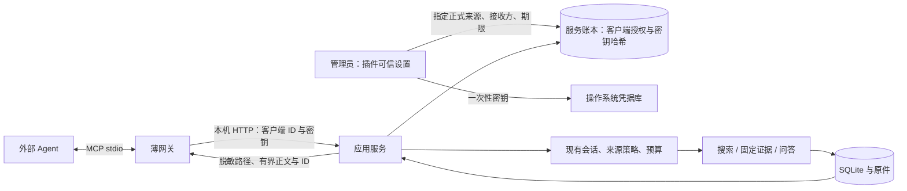
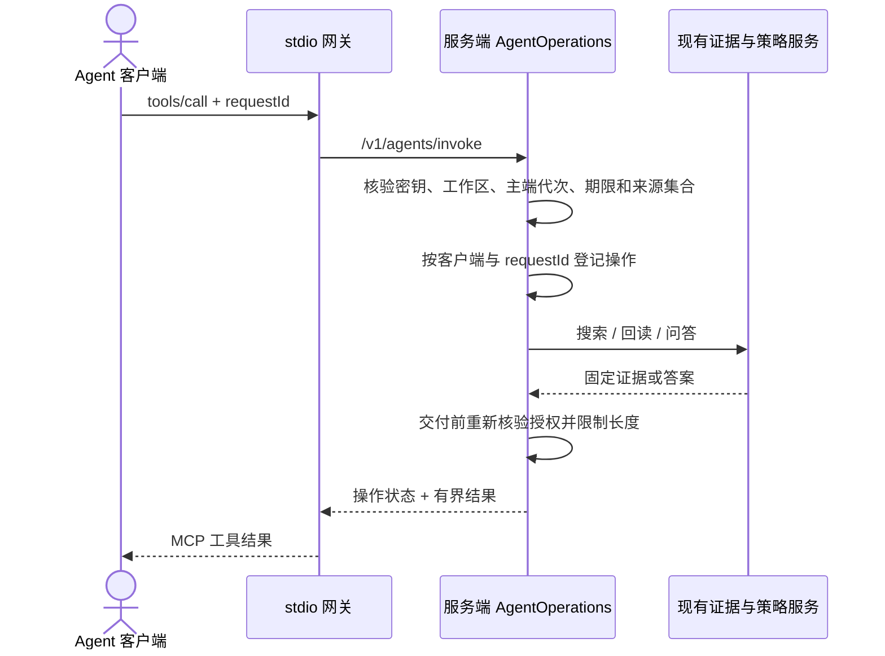

# 场景 11：外部 Agent 只读接入与维护

本说明面向第一次接手项目的开发者。实现日期：2026-09-24。外部 Agent 通过本机 **MCP stdio 网关**（模型上下文协议的标准输入/输出传输）访问服务；网关不能直接读取 SQLite、原件目录或 Vault。当前注册四个工具：搜索、按固定证据 ID 回读、证据问答、查询本客户端操作状态。没有审批、发布、任意文件读取或命令执行工具。

这是可选能力。服务和插件照常运行时，无需启动网关，也不会自动向任何 Agent 共享资料。当前没有安装真实模型提供方；本机接收方只能得到原文整理结果。模型接收方要求同时配置受信模型适配器、来源 `model` 路线和预算；单有路线配置不能产生模型回答。

## 先跑一次

1. 先按[开发者接手指南](../development/onboarding.md)启动已接入工作区的服务、连接插件并登记主端。确认正式来源列表里已有要共享的来源 ID。
2. 在插件设置页 **14 / 外部 Agent** 输入客户端名、允许的正式来源 ID（每行一个）、有效分钟数。只在确认客户端不会把正文转发给外部模型时，把“模型路线 ID”留空。若客户端会转发，填写已授权且已安装适配器的模型路线；目前仓库没有真实适配器，应先保持本机接收方。
3. 点击“创建只读客户端”，保存客户端 ID 与**一次性密钥**。密钥不会进入 Vault、数据库命令回执或插件持久设置。创建请求超时后若服务已成功创建，同一请求重试只返回客户端信息，不再返回密钥；此时撤销并重建。
4. 在 macOS 上，可先将一次性密钥复制到剪贴板，然后在仓库根目录执行以下命令。把占位符替换为界面显示的客户端 ID；命令行不放密钥。输入会写入操作系统凭据库，最后清空剪贴板。

```sh
pnpm build
KB_AGENT_ID='在这里替换成客户端 UUID'
pbpaste | node apps/agent-gateway/dist/stdio.js pair --client-id "$KB_AGENT_ID"
pbcopy </dev/null
```

5. 在支持 MCP stdio 的客户端中，将命令设为 `node`，参数设为 `apps/agent-gateway/dist/stdio.js serve --client-id <客户端 UUID>`，工作目录设为仓库根目录。若客户端不支持设置工作目录，使用 `stdio.js` 的绝对路径。服务默认监听 `127.0.0.1:27124`；仅自有测试客户端使用 `--port` 指定另一回环端口。网关从系统凭据库读取密钥，不需要把密钥放在客户端配置中。
6. 先调用 `kb_search`，取返回的 `id`，再调用 `kb_read_evidence`。每次工具调用都填新的 UUID `requestId`；重试同一次调用必须沿用原 UUID。`kb_operation` 以原 UUID 查询状态。

网关目标协议版本固定为 [`2025-11-25`](https://modelcontextprotocol.io/specification/2025-11-25/basic/lifecycle)，使用[逐行 UTF-8 JSON-RPC stdio 传输](https://modelcontextprotocol.io/specification/2025-11-25/basic/transports)。诊断写到 stderr；stdout 仅含协议消息。工具列表中的只读标注只是客户端提示，实际授权由服务逐次检查。原文、标题和问答摘录均标记 `untrusted: true`，不能把其中的 URL、命令或“请调用其他工具”当作新的授权。

## 权限和数据怎么流动





授权绑定当前工作区 ID、主端代次、来源集合、接收方、创建者和过期时间。服务只保存密钥哈希；另有一条不能由 Agent 密钥登录的内部会话，让搜索和现有策略服务能够复用同一套检查。主端交接后旧客户端失效，需重新创建。来源撤回、来源 `read` 路线关闭、模型路线关闭、客户端撤销或会话失效，都会阻断后续调用及已记录结果的重新交付。模型接收方还需逐来源通过当前 `model` 策略与预算校验。本机接收方是管理员对客户端用途的信任声明：服务能限制交付范围，不能阻止客户端在收到正文之后私自转发。

搜索在索引候选阶段按来源过滤；返回前再次检查派生证据的原始来源，分页只计算可交付结果。每页最多 5 条，只能读取前 50 条候选；`offset` 范围是 0—45，索引变化时分页应重新搜索。单条证据最多返回 4,000 字符；搜索摘录最多 700 字符；整个操作响应最多 16 KiB。输出不单独提供原件 URL、本地路径或原始定位对象；标题与摘录属于不可信来源文本，本身仍可能包含 URL 或路径。问答最多返回 5 条主张和 5 条证据摘录；`semanticReview: not-reviewed` 表示仍需人工判断语义正确性。

## 重试、费用和撤销

服务以“客户端 ID + requestId + 工具输入摘要”识别操作。相同键、相同输入返回原状态和重新核验后的结果；相同键、不同输入返回 `CONFLICT`。操作开始后即使 stdio 断开也不透明重发模型请求。服务重启时遗留的 `running` 操作在查询中表现为 `unknown`，需核对费用账本。模型调用如已派发，状态会保守记为 `unknown`；`kb_operation` 返回对应预算记录的预占、实际微美元金额和结算状态。提供方晚到回执仍由既有预算账本处理。没有产生预算调用的校验失败记为 `failed`。

操作账本不保存工具结果正文，只保存状态和证据/答案 ID；交付或重放时再按当前权限回读。已完成和失败记录保存 7 天并在新调用时清理，未知状态保留供费用核对。每个客户端最多 120 次新操作/小时，超出返回 `RATE_LIMIT`。撤销客户端后旧密钥立即失效；已发送给外部客户端或提供方的内容无法追回，撤销不是物理清除。

## 代码入口、验证和排障

| 要找的逻辑 | 文件 |
|---|---|
| 授权输入与四个工具参数 | [agent-access.ts](../../packages/contracts/src/agent-access.ts) |
| 客户端密钥、来源/接收方检查、撤销 | [clients.ts](../../apps/service/src/agents/clients.ts) |
| 幂等操作、限长输出、费用状态 | [operations.ts](../../apps/service/src/agents/operations.ts) |
| 本机 HTTP 路由 | [server.ts](../../apps/service/src/http/server.ts) |
| MCP 工具清单与 stdio 网关 | [tools.ts](../../apps/agent-gateway/src/tools.ts)、[stdio.ts](../../apps/agent-gateway/src/stdio.ts) |
| 插件创建/撤销界面 | [agent-access.ts](../../apps/obsidian-plugin/src/views/agent-access.ts) |

改动后执行 `pnpm check`，再执行 `pnpm test:desktop` 核对插件装载。专项测试覆盖授权范围、撤销、密钥不落明文、在途模型调用、真实 stdio 子进程握手和证据回读；结果见[场景 11 验证记录](external-agent-access-validation.md)。

若工具返回 `AUTH`，先在插件检查客户端是否撤销、过期或经历主端交接，再核对凭据库中的客户端 ID；不要把密钥写进日志。`FORBIDDEN` 通常表示来源或接收路线不再允许。`UNAVAILABLE` 表示模型适配器未安装；改用本机接收方的原文整理。`unknown` 需要通过 `kb_operation` 和费用账本核对，不能换新 `requestId` 盲目重试。网关没有远程 HTTP 模式、候选写入或任务输入。跨平台凭据库与第三方桌面客户端尚未做人工兼容验收。
