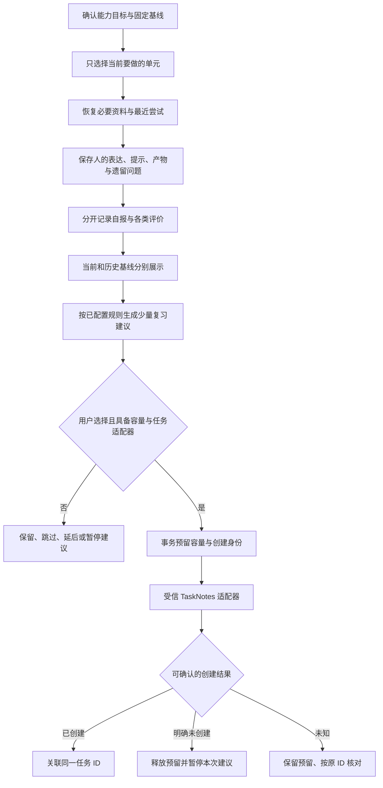
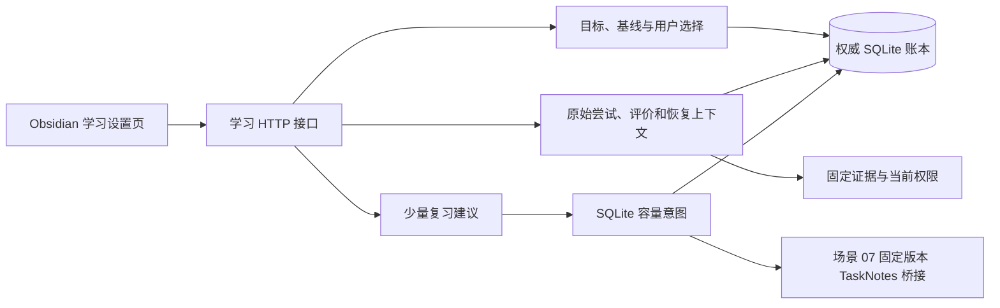

# 场景 06：学习、实际尝试与复习接手说明

最后核对：2026-09-22。首次启动见[开发者接手指南](../development/onboarding.md)，设计目标见[场景 06 方案](../plans/2026-09-21-007-feat-learning-practice-review-plan.md)，本次结果见[验收记录](learning-practice-validation.md)。

## 1. 当前交付到哪里

现在可以在“09 / 学习、尝试与复习”建立能力目标，选择少量当前单元，记录自己的解释、回忆、提示使用、产物和遗留问题。再次打开单元会显示必要资料、最近尝试及版本影响。来源撤回后保留记录身份，隐藏关联正文。

学习证据、用户自报、人工评价、程序检查和模型评分分开存储。任务打勾、阅读用时、资料数量、生成报告都不会增加证据通过权重。代码实验只保存产物引用和用户报告，不执行命令，不读取引用所指文件。

复习规则与容量默认都为空。用户配置规则后可生成少量建议，跳过、延后、暂停会保留。服务已实现任务创建的容量预留、固定身份及结果未知后的核对接口；**场景 07 已接入 TaskNotes 4.13.4 和 Today**。到期建议经完整清点、容量预留与明确确认后进入正式创建命令；未知结果保留原任务 ID。从 Today 继续同一个单元，详细门禁与本轮实际验收见[任务说明](task-today-reconciliation.md)。

没有调用真实模型。模型评分的受信登记接口已实现，当前页面只提供人的实际输入及人工评价。模型评分不计入通过权重，也不承诺学习效果或通用最优复习间隔。

## 2. 跑通一次学习与恢复

前置条件：服务和插件一起升级，重新配对并登记主端。需要引用材料时，先完成正式收录，在“06 / 证据检索与问答”取得固定 Evidence ID（原文编号）。资料不必先进入 Wiki。

1. 在 09 填写“希望能解释、验证或完成什么”、目标版本、适用条件和“可观察的完成证据”。例如目标是解释批准与写入的关系，完成证据是能够说明未批准和回执丢失时的行为。
2. 为每个必要单元填写标题、必要原文编号、可选参考及先修建议 ID。原文编号用逗号分隔。先修只是建议，不自动产生排程依赖。
3. 需要可量化验收时，在“叶子验收项”逐行填写 `说明未批准时不写入|1`；竖线后是正整数权重。只记录阅读或自报时可以留空，系统不会生成精确百分比。
4. 点击“预览学习目标与固定基线”，核对后勾选并“确认学习基线”。单元默认只进入参考库，不创建任务。一次最多 30 个单元，每单元最多 20 个叶子项。
5. 把一个单元改为“当前学习”，保存选择，再点“继续学习”。没有尝试时明确显示“首次开始”。单元顺序可调整，跳过熟悉内容、暂停和取消都保留选择。
6. 阅读必要资料，填写自己的实际表达，选择活动类型和已用提示层级。产物、用户报告和遗留问题分别填写，再点“保存我的实际尝试”。自己的代码由自己在合适环境运行，本功能不运行它。
7. 关闭页面后，“读取学习目标”并重新“继续学习”，可找回原始尝试、资料及遗留问题。最近最多展示 50 次尝试，完整记录仍在账本。
8. 有叶子项时，可对最近一次当前基线尝试做人工评价，填写结果、核对依据和规则版本。保存后重新打开目标可查看证据通过权重。界面会标明“人工评价”，不会伪装成程序检查。

提示层级只记录已经得到的帮助：0 为无提示，1 为方向提示，2 为关键步骤，3 为完整示例。当前不会自动生成解释、示例、提示或个人笔记；原始表达始终来自用户提交。

“当前学习”是用户选择的学习视图，不是已创建或已排程的任务。资料可以很多，目标只放要做的单元；系统不会按归档页数生成队列。真正创建复习任务时才检查任务容量。

## 3. 基线、版本与四种进度

基线是一份确认后固定的目标范围和叶子验收项。编辑目标时点击“编辑为新范围基线”，增加范围或调整目标版本，再预览确认；旧基线、旧尝试和旧评价保留。

- 新基线必须保留原有单元与原叶子项的身份、描述和权重。取消、延期或跳过只改变选择，不删掉分母。
- 当前和历史基线分别显示。新基线不自动继承旧基线的通过记录；旧版本的正确结果继续显示在历史基线中。新增加的叶子项单列数量。
- 每个叶子项以该基线最新登记的人工或程序评价为准，按数据库登记顺序处理同一时刻的更正。模型评分和自报不会成为通过记录。撤回来源关联的评价暂不参与可验证进度，原记录不删除。
- 没有叶子项时只显示状态、尝试和自报，不把“做了一半”转成 50%。

材料进度仍按收录清单核对，任务事实交给 TaskNotes，学习进度来自本场景，知识审核在 07。当前学习页说明这些口径，不复制 TaskNotes 的可写状态，也不以自己的记录代替全局 Today。

资料出现新修订时，继续学习会提示变化。旧尝试保存当时的来源修订和范围，不改成新版本。仅当目标明确要求新版本、最新已提交来源标注为该版本、且解析正文不同，才显示补学候选。正文不同只是待人工核对的信号；用户还需填写实质差异与补学理由。来源仅改日期、未匹配目标版本或无法读取，都不自动建补学任务。

图中 TaskNotes 在场景 06 首次交付时仅有测试适配器；场景 07 增加固定版本 Runtime 桥接，验证记录另行保存。

## 4. 复习规则和容量

展开“复习规则与容量”，先读取当前设置。复习规则需要明确间隔天数、建议窗口天数和每次预计分钟；容量需要同时进行任务上限、每日复习分钟上限和 IANA 时区，例如 `Asia/Shanghai`。这些是试点参数，由用户填写，不从历史计划猜测。

点击“生成少量复习建议”每次最多新增 3 项，只针对当前基线、当前选择且已有实际尝试的单元。有遗留问题时显示原因，没有遗留问题时标为按间隔重新回忆。间隔以尝试时间起算的经过天数计算，不承诺在用户当地固定钟点触发提醒。

同一尝试不会重复生成；同一单元当前基线已有未转成任务的建议时，也不继续堆叠。跳过或暂停后，新尝试不会绕开用户选择再次推送；需要用户“恢复建议”。延后需要带时区的未来时间。窗口结束后不自动删除，仍可由用户选择处理。

任务创建只针对已到建议时间的项目。没有容量或真实适配器时，返回说明且不产生预留。安装受信适配器后，服务要求完整、无重复任务 ID、最近 30 秒内的任务观察，再在 SQLite 同一事务内预留名额及分钟数。待创建、未知和未确认结束的任务也占同时进行上限；当日分钟额度按容量时区计算，跨日不释放未知任务的同时进行名额。

创建超时 8 秒后中止等待，记录为未知；不会因为用户重复点击而再次创建。对明确未创建的最终结果释放预留，暂停建议。本轮不提供同一失败意图的自动重发；未知结果只能按原任务 ID 与操作 ID 核对。已经存在容量记录后不允许改变时区，关闭再开启设置也不能绕过此限制。

当前只保证本服务发起的并发预留不会超发。TaskNotes 独立手改与服务预留不在同一原子事务；场景 07 接入后仍不宣称跨插件并发安全，未知与不完整清点会阻断进一步创建。

## 5. 代码、接口与数据

| 入口 | 负责什么 |
|---|---|
| [learning.ts](../../packages/contracts/src/learning.ts) | 目标、基线、尝试、评价、规则、建议和任务意图合同 |
| [goals.ts](../../apps/service/src/learning/goals.ts)、[units.ts](../../apps/service/src/learning/units.ts) | 确认摘要、持久幂等、固定叶子项及显式选择 |
| [attempts.ts](../../apps/service/src/learning/attempts.ts)、[resume.ts](../../apps/service/src/learning/resume.ts) | 保留原始表达、分开评价来源、受限内容隐藏与续学 |
| [review-suggestions.ts](../../apps/service/src/learning/review-suggestions.ts)、[capacity.ts](../../apps/service/src/learning/capacity.ts) | 复习去重、用户选择、原子预留、任务结果核对 |
| [impact.ts](../../apps/service/src/learning/impact.ts)、[evidence-view.ts](../../apps/service/src/learning/evidence-view.ts) | 来源变化、目标版本、当前及历史基线进度 |
| [routes.ts](../../apps/service/src/learning/routes.ts)、[插件视图](../../apps/obsidian-plugin/src/views/learning.ts) | 本机 HTTP、权限与操作界面 |

读取允许已配对的 admin/user/reader；修改需要 admin/user、当前主端、有效心跳和 `x-policy-version`。目标确认、尝试和人工评价另带稳定 `operationId`。不能从请求体或笔记安装任务脚本、检查器或模型适配器。

| 接口 | 用途 |
|---|---|
| `GET/POST /v1/learning/settings` | 读取／保存规则和容量；GET 包含任务适配器是否启用 |
| `POST /v1/learning/draft` | 校验完整或部分目标，返回待填项；成功时给出规范化 input 和 digest |
| `POST /v1/learning/goals` | 确认 `operationId/input/digest`；升级时另带 `goalId/previousId` |
| `GET /v1/learning/goals` | 最近 100 个目标 |
| `GET /v1/learning/goals/:id` | 当前基线、单元选择、历史进度、最近 100 个建议 |
| `POST /v1/learning/goals/:id/state` | 显式 `active` 或 `paused` |
| `POST /v1/learning/goals/:id/units/:unitId` | 保存 `state/rank/reason`，不创建任务 |
| `GET /v1/learning/goals/:id/units/:unitId/resume` | 必要资料、最近尝试、遗留问题、来源变化和任务关联 |
| `POST /v1/learning/goals/:id/attempts` | `operationId` 和 `attempt`；活动原始记录不可覆盖 |
| `POST /v1/learning/attempts/:id/evaluations` | `operationId` 和人工 `evaluation`；不接受伪造的 program/model 来源 |
| `POST /v1/learning/goals/:id/reviews` | 显式生成少量建议 |
| `POST /v1/learning/goals/:id/supplement` | `unitId/reason`，确认版本实质变化的补学建议 |
| `POST /v1/learning/reviews/:id/choice` | `state/reason`；延期另带毫秒 `dueAt` |
| `POST /v1/learning/reviews/:id/task` | 明确创建任务；当前 CLI 未启用 |
| `POST /v1/learning/task-intents/:id/reconcile` | 按固定身份查创建结果，不能当重试发送 |

`createServer` 第七个可选参数为受信 `LearningTaskAdapter`。它提供 `snapshot(timezone)`、`create(payload, signal)` 和 `lookup(taskId, operationId)`。创建必须在上游保留服务给定的稳定任务与操作身份；`not-created` 必须代表可证明、最终不会生效的结果，单次 404 或缓存缺失只能返回 `unknown`。本服务正在等待创建回执时不做会释放预留的核对。场景 07 默认安装该服务桥接；真实上游版本、字段保留和清点结果见独立验收记录，自动字段更新仍关闭。

`Attempts.recordEvaluation` 供受信检查器调用；模型评价必须带模型、提示版本、评分规则版本及评估者，程序评价需标注真实检查器。当前没有任何自动检查器或真实模型接入。HTTP 人工评价只允许提交叶子项、结果、依据与规则版本，来源由服务记录为 human。

schema 5 升到 6 前生成 `state.db.before-v6-<id>`，权限 0600，然后事务增加八张 `learning_*` 表。目标／基线、原始尝试／评价、建议／任务意图分别保存；规则保存在 `kv` 的 `learning:settings`。本场景不写 Vault 学习投影，不把 SQLite 当缓存。旧服务不能写 schema 6；迁移前备份不可覆盖后来产生的记录和费用。

## 6. 排障和恢复

| 现象 | 处理 |
|---|---|
| 草案不能确认 | 按待填项补能力、可观察证据、单元和权重；原文必须已正式提交且可读取 |
| `BASELINE` | 当前目标范围变化、删除旧叶子项、时区变更或任务快照不可靠；刷新后重新核对，不能强改摘要 |
| `PAUSED` | 目标暂停或单元未选择；显式恢复目标并保存“当前学习” |
| 保存尝试响应丢失 | 保持原操作编号重试；不要换新编号重复提交。内容变更应作为另一条新尝试 |
| 明明自报成功，权重仍为 0 | 自报与验收分开；需要有叶子项且有明确人工或程序评价 |
| 新基线显示尚未验证 | 旧结果仍在历史基线；新范围不自动继承旧版本通过记录 |
| `CAPACITY_UNCONFIGURED` / `TASK_ADAPTER_UNAVAILABLE` | 保留建议，先完成配置或场景 07 集成，不伪造已创建 |
| `CAPACITY` / `NOT_DUE` | 上限已满或尚未到建议时间；保留、延后或暂停建议 |
| 创建状态 `reserved` / `unknown` | 先按原 ID 核对；重启不释放预留，不删除意图来补额度 |
| 来源不可读 | 页面隐藏资料、尝试及关联评价正文，保留时间和身份。恢复来源权限后重新读取；不用旧缓存显示 |

页面每 5 秒核对当前活动的权限，撤回后清空显示的活动正文；服务每次读写也会重新检查。离开页面或重启插件后，已提交记录仍保留在同一应用数据目录。未提交的表单输入不持久化，离开前需保存。备份与迁移恢复按[接手指南](../development/onboarding.md#5-数据放在哪里哪些可以重建)执行。
