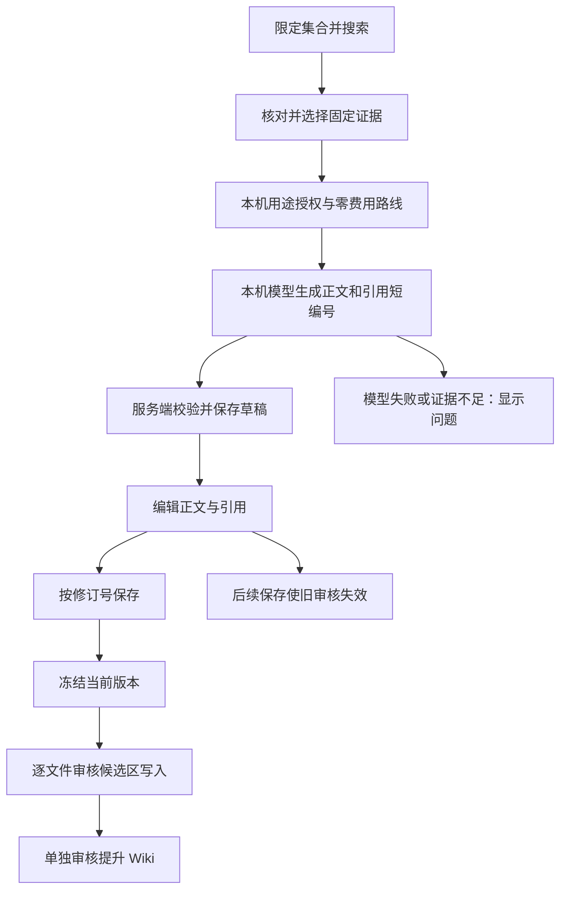

# 本机生成与草稿编辑

这条流程用于把已收录资料写成一篇简介或说明，再由人修改和审核。它补齐原需求 R029、R032—R037 中的写作入口，复用原有证据检索和 Wiki 写入流程。

本机模型负责综合正文；程序负责固定引用、保存草稿和版本校验。草稿可以继续编辑，候选区与正式 Wiki 的写入仍需分别批准。多章研究的自动语义检查、完整长文问题集不属于本次已完成范围，见[长文档验收记录](long-document-rag-validation.md)和[研究说明](topic-research-report.md)。

## 首次启用

在仓库根目录构建；安装新版插件时，把 `apps/obsidian-plugin/dist/` 下的 `main.js`、`manifest.json`、`styles.css` 复制到试点 Vault 的 `.obsidian/plugins/knowledge-task-center/`，重新启动插件。

先安装 Ollama 并下载要使用的模型。以下使用本轮受测的 `qwen2.5:3b`；小模型生成后仍需要人工检查。

```sh
ollama pull qwen2.5:3b
pnpm build
pnpm service serve --data "/绝对路径/原有应用数据" --ollama-model qwen2.5:3b
```

先正常停止使用同一数据目录的旧服务，再运行上面的启动命令。`--data` 必须继续使用原目录，否则看不到已收录来源。Ollama 不在 PATH 时，追加 `--ollama-bin "/绝对路径/ollama"`。macOS 应用内的命令通常位于 `/Applications/Ollama.app/Contents/Resources/ollama`，使用前核对本机文件。

服务启动一个独立 Ollama 回环进程，禁用云端模型，去除代理环境变量，固定已安装模型的摘要。服务不会下载模型，也不会转到远端提供方；模型下载由上面的显式命令完成，不涉及资料正文。随后重新配对插件并确认当前设备为主端。

## 用 XQuant 生成简介

前提是 `XQuant 入门书籍` 集合已经正式导入。这里使用所收录的固定版本，不会访问原文中提到的新书网站。

1. 在 **06 / 证据检索与问答** 把“集合（留空不限）”填为 `XQuant 入门书籍`，检索 `book/preface.md book/getting-started.md`。
2. 展开原文核对后，在结果中勾选“用于本机写作”。最多 8 条，默认勾选前 5 条；简介通常先选前言开头、学习地图和准备工作开头。搜索排名不等于完整覆盖全书，查看正文再决定。
3. 填写“生成草稿标题”，如 `XQuant 简介`。把“写作要求”写成具体目标，例如：

   > 根据选定资料，为刚接触 XQuant Beginner 的读者写约 500 字中文简介，介绍定位、适合读者、学习方法、主要内容和入门顺序。写成自然段；不要混淆入门书、open-xquant 工具与完整交易系统，没有依据的内容列为缺口。

4. 首次使用时，管理员点击 **授权选定资料用于本机模型**。它启用 `local-ollama` 零费用路线，只给选定证据所属来源添加模型用途授权。来源级授权意味着同一来源的其他片段以后也可用于该本机模型。既有预算、其他路线和其他用途授权保留；原预算为空时建立零额度预算。
5. 点击 **本机生成可编辑草稿**，等待结果。生成接口最多等待约 3 分钟；正常返回时已保存到应用数据库。关闭设置页不会取消服务端已发起的生成，稍后可以读取草稿。不要因为页面等待就连续重发。
6. 到 **07 / 正文草稿** 点击 **读取草稿**，打开相应标题。修改标题、逐段正文，展开“选择本段引用并核对原文”核对或调整引用；也可以添加、删除段落。
7. 点击 **保存草稿**。它保存到本机数据库，尚未写入 Vault。确认内容后点击 **提交当前草稿审核**。
8. 在 **07 / Wiki 候选与审核** 填写相应页面标题，点击 **读取待审核候选**，核对 **审核保存到候选区** 的完整文件与引用后批准。成功后再单独 **审核提升为 Wiki**。

现有原文答案或研究候选也能通过“创建编辑草稿”进入编辑器。段落超过 20 条时需要先拆分，不会静默截断报告。

## 编辑与引用的含义

编辑器处理普通正文，不执行 Markdown、HTML 或文中命令。保存到笔记时，程序转义正文中的 Markdown 控制字符，并生成脚注；每条脚注保留证据 ID 和来源修订，可在审核界面看到完整依据。

模型综合标为“推断、未审核”；改动后的段落记录为“用户陈述、未审核”。人工新增段落可以暂时不附引用，导出的正文会显示“本段未附来源，需人工核对”。改写不是原文事实，也不会因存在脚注而自动被判定正确。

每次保存带上预期修订号。两处同时编辑时，过期版本不能覆盖新版本。保存请求期间继续输入的文字会留在编辑器，并提示“之后的编辑仍未保存”。发生冲突，可用 **查看已保存版本（保留当前编辑）** 比较；复制需要保留的文字后，再选择 **载入已保存版本（放弃未保存修改）**。

提交审核会冻结当时版本；随后修改标题、正文或引用，旧候选提案、批准和 Writer 写入授权都会失效。已经正式提交的历史文件不会被倒改。重新生成是另一份结果，不覆盖人工草稿；相同固定证据和写作要求可能复用缓存，并返回之前的草稿。



## 代码、接口与数据

| 入口 | 职责 |
|---|---|
| `apps/obsidian-plugin/src/views/search.ts` | 资料集合、证据勾选、写作要求、本机生成与授权 |
| `apps/obsidian-plugin/src/views/drafts.ts` | 草稿列表、逐段编辑、引用选择、保存冲突、提交审核 |
| `apps/service/src/answers/local-model.ts` | 独立本机进程、模型身份检查、简化结构化输出、固定引用还原 |
| `apps/service/src/answers/answer.ts` | 快照校验、显式证据范围、生成缓存、预算 Broker |
| `apps/service/src/answers/local-setup.ts` | 管理员对选定来源的本机用途授权 |
| `apps/service/src/review/drafts.ts` | 草稿持久化、乐观并发、冻结候选 |
| `apps/service/src/review/candidates.ts`、`proposals.ts` | 草稿版本变化后的候选及旧授权失效 |
| `apps/service/src/wiki/bounded-compiler.ts` | 可读正文、转义、脚注与受控文件生成 |
| `packages/contracts/src/drafts.ts` | 标题、段落、引用和修订号契约 |

主要接口均需已配对会话；修改需当前策略版本及主端，配置授权另需管理员角色。

| 接口 | 输入与结果 |
|---|---|
| `GET /v1/answers/options` | 已安装提供方、是否仅本机，以及未启动时的说明 |
| `POST /v1/answers/local-setup` | `snapshotId`、`evidenceIds`；配置零费用路线并授权选定来源 |
| `POST /v1/writing` | `snapshotId`、`evidenceIds`、`operationId`、`routeId: local-ollama`、`title`、`writingInstruction`；生成并保存草稿 |
| `POST /v1/answers/:id/draft` | `title`；从服务端固定答案或候选创建编辑草稿 |
| `GET /v1/drafts`、`GET /v1/drafts/:id` | 最近 100 份可读草稿及单份正文 |
| `PUT /v1/drafts/:id` | `revision`、`title`、`paragraphs: [{text,evidenceIds}]`；冲突拒绝，同内容重试不增加修订 |
| `POST /v1/drafts/:id/candidate` | `revision`；幂等冻结当前版本到原候选流程 |

每份草稿最多 20 段，每段最多 4,000 字符，标题最多 120 字符；生成时最多选择 8 条完整证据，受 32,768 token 模型上下文和保守字节上界共同限制，超限拒绝，不静默截断。默认本机路线输出上限 2,048 token，价格配置一年有效；到期重新核对授权。来源撤回、读取权限变化、模型身份变化都会阻止继续使用相关正文。

草稿存于 `state.db` 的现有 KV 表，键为 `writing-draft:<id>`；来源答案与草稿映射使用 `writing-origin:`，冻结版本映射使用 `writing-frozen:`。冻结正文同时进入 `answer_candidates`。不新增数据库版本，现有完整备份会包含这些数据。草稿不是可丢弃索引。回退代码时先备份，不用旧数据库覆盖新草稿；旧程序没有草稿编辑界面，不能用它继续处理新草稿候选。

## 排障与验证

- **模型未启用**：检查启动命令是否有 `--ollama-model`，模型名称是否与已下载标签一致；在设置页“查看模型状态”核对。配置路线本身不会启动模型。
- **生成超时或连接中断**：先读取草稿，再看作业状态；本机调用也有零费用账本。未知结果不自动重发，不删除账本。确认已失败且无运行任务后才重新生成。
- **引用超限、上下文超限**：少选几段完整且相关的原文。不要通过删除否定词、条件或数字缩短证据。
- **快照过期**：重新搜索、勾选证据；已保存草稿不依赖搜索缓存期限，但仍核对来源状态。
- **保存冲突**：保留当前输入，比较服务端新版本，合并后重新提交。不要改数据库里的修订号。
- **批准后又编辑**：重新冻结、重新审核；旧按钮不能继续使用。

基础验证：`pnpm check`。定向验证：

```sh
pnpm exec vitest run tests/integration/writing-draft.test.ts \
  tests/integration/local-writing-setup.test.ts \
  tests/integration/local-model-adapter.test.ts \
  tests/integration/grounded-answer.test.ts tests/ui/drafts.test.ts
```

2026-09-28 的真实 XQuant 验证与完整检查结果见下方验收记录；旧长文指南的失败记录保留原日期，不用本次简介结果替代整体 RAG 质量结论。

## 本次验收记录

受测环境：macOS、Obsidian 1.13.7、Node.js 24.14.1、Ollama `qwen2.5:3b`，模型摘要前缀 `357c53fb659c`。使用已经收录的 XQuant 固定提交 `fc9a7c445d51ddbe76c7d59bec59f2eb89fe0ddc`，选取前言和准备工作的 3 条证据。

- 在真实设置页发起本机生成，约 27.4 秒返回并持久化草稿，正文未发送给远端模型。
- 模型生成 3 段可读文字；没有完全遵从 4 段要求，首段引用也不完整。核对后在编辑器调整引用、明确“评估归因”并补入门顺序。最终为 4 段、514 字。这次通过的是带人工审核的写作流程，不是无人审核的正确性保证。
- 用界面保存修订 2，再载入已保存版本，文字和引用均保留；分别审核候选区和 Wiki，两个文件均完整提交，文件 SHA-256 与批准内容一致。服务和 Obsidian 再次重启后，草稿修订 2、4 段正文及正式 Wiki 哈希仍可回读。
- `pnpm check`：类型检查、lint、212 项常规测试、2 项编译产物进程测试通过；9 项需特定环境的测试按开关跳过。本次没有重新运行 Docker 专项；实际桌面操作使用独立试点资料库。
- 新增回归覆盖 HTTP 生成与服务端保存、慢响应不断开、引用越界、零费用账本、来源级授权、过期编辑、批准后编辑失效、撤回清屏与保存期间继续输入。屏幕记录和完整样本只留在本机，不提交资料正文。

运行观察：新版本启用后的首轮生成，核对 `draft.created`、`draft.edited`、`draft.frozen` 和 `wiki.prepared` 事件，以及作业终态与调用账本；事件只记录 ID，不含正文。健康结果是生成后可读取草稿，保存修订递增且调用费用为零。若生成长期运行、未知调用增加或文件校验不一致，停止新的生成与批准，保留数据库，按上面的超时和恢复步骤核对。由试点维护者在首次使用与重启后各检查一次。
