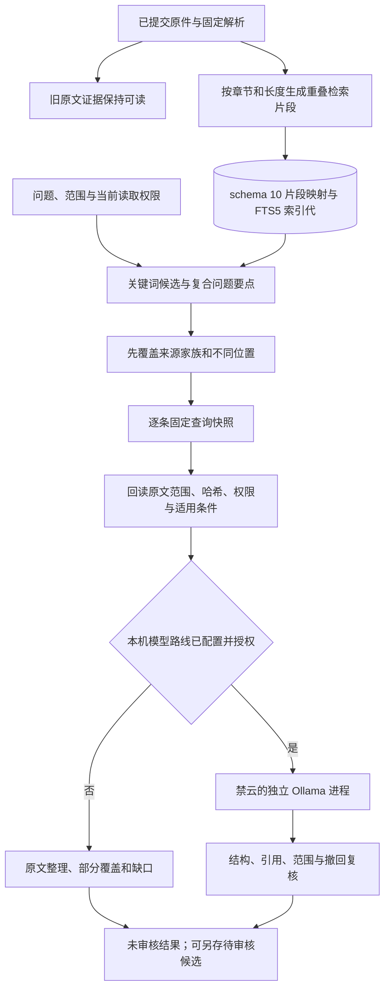

# 长文档检索与本机问答接手说明

本文面向第一次维护这条链路的开发者。设计取舍见[实施计划](../plans/2026-09-28-001-feat-long-document-rag-plan.md)，原有检索和权限合同见[场景 03 说明](evidence-search-answer.md)，本地 HTML 的收录步骤见[收录说明](local-html-ingestion.md)，实际表现见[本轮试点记录](long-document-rag-validation.md)。这里的 RAG 指“先找回可核对的原文，再用这些证据辅助回答”；检索命中和引用格式正确都不等于答案语义正确。

## 当前能做什么

正式提交的来源仍由原件、固定解析和原文证据负责。索引器会把解析文本派生为每段最多 2,400 个 UTF-16 字符、相邻段约 240 字符重叠的检索片段。片段有固定原文范围和哈希，回读时与解析文本和原始定位核对；旧证据 ID 不改写，也不因以后换分块算法而用新算法否定旧范围。一个来源家族可以在一次查询中贡献多处不重合的位置。复合问题先照顾不同要点，再用关键词排序填充结果，快照记录每条实际选中的证据。

无模型时，“整理本次原文证据”会回读这些位置，逐项列原文、范围和缺口，不写综合结论。可选的本机 Ollama 适配器只有在启动参数、已下载模型、预算路线与逐来源授权全部齐备时才进入模型调用。模型只接收优先覆盖问题要点的证据子集，原文整理仍可核对其余命中；模型使用 `E1` 之类的临时短编号，服务把它们映射回固定证据 ID，未知编号会拒绝。模型输出仍标记“语义尚未人工审核”；页面中的“已找到引用”只表示证据可回读，不证明模型的概括正确。问章节位置时，模型若没写出与所引证据一致的章节编号，结果会标成证据不足。首版本机路线只生成带引用的主张与缺口，关系数组固定为空，不自动判断证据冲突。本机向量索引代码可用于同题试验；这轮向量没有比关键词多找回标注章节，正式搜索入口仍以关键词为准，向量和重排没有自动启用。



## 如何运行

先按[开发者接手指南](../development/onboarding.md)构建并启动服务，正常完成一份来源的审核、批准和提交。升级到 schema 10 时会生成权限为 0600 的 `state.db.before-v10-<id>`，随后事务创建 `retrieval_chunks` 和 `retrieval_vectors`。首次搜索或“重建本地索引”会从固定解析重建片段；不要删除整个 `state.db` 来清索引。

默认启动命令仍为 `pnpm service serve --data "/实际应用数据目录"`，无需模型即可搜索。要试用本机模型，先从可信发行渠道安装 Ollama，并**明确下载**选定的本机模型；模型文件下载不包含用户资料。例如本轮试点选用 `qwen2.5:3b`。服务启动时指定已下载名称和本机可执行文件：

```sh
pnpm build
pnpm service serve --data "/实际应用数据目录" --ollama-model qwen2.5:3b --ollama-bin "/实际的/ollama/可执行文件"
```

服务会另起只绑定随机回环端口的 Ollama 子进程，设置 `OLLAMA_NO_CLOUD=1`，清除代理环境变量，在发送正文前和每次调用前检查本机模型名称与摘要。不接受请求里给出的 URL、云模型名称、自动拉取模型或 HTTP 重定向。子进程启动或模型身份检查失败时，带模型参数的服务启动失败；不带参数重新启动仍可搜索。已经运行的其他 Ollama 守护进程不是此路线的替代物。

“03 / 预算与路线”里的可信配置 JSON 还要有启用的 `model` 路线，ID 必须为 `local-ollama`，并有非空预算和未过期的零费用价格记录。以下只展示新增路线与预算的形状；保存时要合并工作区原有路线，不能整段覆盖其他用途配置：

```json
{
  "schemaVersion": 1,
  "budget": { "currency": "USD", "timezone": "Asia/Shanghai", "jobLimit": 10, "dayLimit": 0, "monthLimit": 0 },
  "routes": [{
    "id": "local-ollama", "purpose": "model", "enabled": true,
    "price": { "version": "local-zero-1", "expiresAt": 1800000000000,
      "inputPerMillion": 0, "outputPerMillion": 0, "fixedCost": 0,
      "maxInputTokens": 32768, "maxOutputTokens": 1024 }
  }]
}
```

`expiresAt` 是示例未来毫秒时间戳，使用时按实际日期设置。还须通过现有 `PUT /v1/source-policy` 为**每个要送入模型的来源**保留 `read: ["local"]` 并增加 `model: ["local-ollama"]`；其他用途字段按[来源政策合同](../../packages/contracts/src/policy.ts)完整提交，不能因增加模型路线而抹掉已有授权。重新配对或刷新会话后，在 **06 / 证据检索与问答** 搜索、回读、点击“查看模型状态”，再选择“使用 … 回答”。检索片段、证据包和候选不会自动写入 Wiki。

## 代码与数据从哪里改

| 关心的问题 | 入口 |
|---|---|
| 片段长度、重叠、章节边界 | [chunks.ts](../../apps/service/src/search/chunks.ts) |
| 新索引代、词法召回、要点选块 | [indexer.ts](../../apps/service/src/search/indexer.ts)、[search.ts](../../apps/service/src/search/search.ts)、[tokenizer.ts](../../apps/service/src/search/tokenizer.ts) |
| 固定范围与哈希回读 | [locator.ts](../../apps/service/src/evidence/locator.ts) |
| 证据包、拒答和结构化回答 | [evidence-pack.ts](../../apps/service/src/answers/evidence-pack.ts)、[answer.ts](../../apps/service/src/answers/answer.ts) |
| 禁云本机进程与模型身份 | [local-model.ts](../../apps/service/src/answers/local-model.ts)、[main.ts](../../apps/service/src/main.ts) |
| 可选向量试验与收益门槛 | [local-embeddings.ts](../../apps/service/src/search/local-embeddings.ts)、[enhancement.ts](../../apps/service/src/search/enhancement.ts) |
| schema 与恢复 | [010-rag.ts](../../apps/service/src/storage/migrations/010-rag.ts)、[backup.ts](../../apps/service/src/lifecycle/backup.ts)、[restore.ts](../../apps/service/src/lifecycle/restore.ts) |

`retrieval_chunks` 和 `retrieval_vectors` 是 SQLite 中可重建的派生索引，不是原件。`evidence` 仍保存旧块与新范围的固定身份；`query_snapshots` 在一小时有效期内绑定实际证据 ID。索引代重建失败保留旧完整代；撤回、范围变化、会话失效会使旧结果不能继续读。向量试验在写入和读取每个来源前分别检查 `embedding` 路线；它没有被并入默认 `/v1/search`，也不等于已通过收益门槛。

## 怎样验证与排障

先执行 `pnpm check`。定向检查可运行 `pnpm exec vitest run tests/unit/retrieval-chunks.test.ts tests/integration/long-document-retrieval.test.ts tests/integration/local-model-adapter.test.ts tests/integration/hybrid-retrieval.test.ts tests/faults/backup-restore.test.ts`。真实指南的原件与问题文件仅放在被忽略的 `.context/runtime-validation/long-document/`，设置 `KB_LONG_DOCUMENT_PATH` 后运行 `tests/evaluation/long-document-rag.test.ts`；评测文件记录必要原文在命中和证据包中的分子分母、无答案拒答及可选模型结果。未设置该变量时，该专项跳过，常规测试不依赖用户原文。

| 现象 | 核对与处理 |
|---|---|
| 搜不到新来源 | 先确认来源已正式提交、筛选条件及活动索引代；再点“重建本地索引” |
| 只有一个章节或答案不完整 | 查看快照中的不同位置、证据包缺口和问题要点；不要把一条摘录当完整回答 |
| `HASH_MISMATCH` | 保存原件和数据库，核对解析修订；不要改偏移或哈希来绕过校验 |
| `FORBIDDEN` | 核对当前会话、来源的 `read` 与具体 `model`／`embedding` 路线以及撤回状态 |
| `UNAVAILABLE` | 核对本机二进制、已下载模型名称、摘要和独立子进程；不切换到云端 |
| `BUDGET` | 检查零费用价格是否过期、输入上界与上下文窗口；缩小证据范围后重新搜索 |
| 模型输出无效 | 保留错误代码，重新核查原文；未通过结构和引用校验的结果不会作为有效答案缓存 |

回退到旧代码前先停服务并保存完整应用数据。旧程序不识别 schema 10，不能直接写升级后的数据库；`before-v10` 快照只能在隔离副本中核对，不能覆盖升级后新增的来源、答案或撤回记录。

## 能力边界

这轮[一份长文的 20 题试点](long-document-rag-validation.md)找齐了标注章节，但不能证明 PRD 所需的更大题集召回率或人工重要主张支持率。词面相近也可能漏证据，模型推断有引用仍可能错。向量或重排只有在固定同题集上同时改善召回、满足延迟和本机不外发要求后才可启用。旧的场景 03 验收日期和数值保留在[历史记录](evidence-search-validation.md)；本轮结果单独记录，不替换历史结论。
