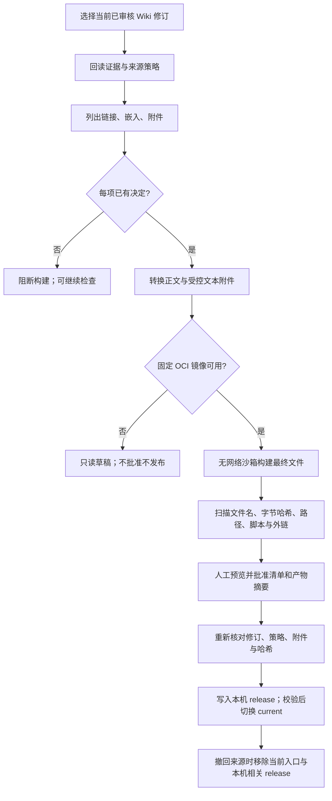

# 场景 12：公开副本导出与本机静态发布

本说明给第一次接手项目的开发者。当前实现日期：2026-09-24。**公开副本**是从已审核 Wiki 的固定修订生成的一组独立文件；它不连接整个 Vault。当前可在插件内检查依赖、阅读导出草稿、在隔离环境可用时构建并扫描最终文件、单独批准，再发布到本机应用数据目录。没有互联网发布适配器，也不会替用户上传到公网。

## 从界面走一次

1. 按[接手指南](../development/onboarding.md)启动服务、连接插件、登记主端。先在 **07 / Wiki 候选与审核** 完成候选保存和 Wiki 审核；人工改动尚未复审的页面不会出现在可发布列表。
2. 管理员在 **03 / 预算与路线** 的可信配置 JSON 中添加一条启用的 `publish` 路线。例如，在原有 `routes` 数组中追加 `{ "id": "local-site", "purpose": "publish", "enabled": true, "price": null }`，保留其他配置。保存后刷新连接。
3. 在 **15 / 公开副本** 输入同一个路线 ID，读取已审核 Wiki，勾选固定修订，点“检查直接依赖”。逐个核对所列正式来源。管理员可对每个来源单独点“允许此来源用于本机发布”；此操作保留该来源已有的其他用途策略，并使先前预览失效。
4. 对每条链接、嵌入和附件选择“移除”或“替换为公开 HTTPS 链接”；明确的 HTTPS 裸链接也可选择“保留”。只有 `KB-Wiki/PublicAssets` 目录直属、至多 100 KB 的 UTF-8 `.txt` 附件可选择“纳入受控文本附件”；其他附件必须移除或替换。每次最多 4 个文本附件。即使直接依赖列表为空，仍需人工阅读全文。
5. 没有 Docker 时可点“只读导出草稿”，查看转换后的正文与文本附件；它**不能批准或发布**。准备好 README 指定的固定 OCI 镜像并启动 Docker 后，点“隔离构建并预览最终文件”。页面、目录页、`search.json` 和附件的每个最终文件都在界面列出，附有哈希。人工检查标题、正文、附件、链接和搜索标题，再勾选确认并批准。当前主端的管理员或用户随后可点“发布到本机静态站点”。

本机输出位于应用数据目录 `public-site/releases/<releaseId>/`，`public-site/current` 是指向当前版本的符号链接。若要用自己的静态服务器试验，只向服务器开放 `current` 指向的内容；**不要把整个应用数据目录或 `releases` 目录作为站点根目录**。当前没有生产站点、认证方式或缓存策略配置，也没有远端上传按钮。

## 权限与构建边界

服务端只接收当前 `wiki_pages` 指向的正式修订，要求页面仍为 `reviewed`，并从其固定证据集合算出正式来源 ID。构建和发布均按 `publish` 路线逐来源核验；缺失来源策略默认**不允许发布**。设置或来源策略变化会使普通预览批准失效。来源撤回不可通过再改策略重新放行。

导出转换会去掉页面头部属性块和内部证据 ID，阻断未处理的 Markdown/Wiki 链接、嵌入、附件、本地路径与裸 URL。移除一个引用会移除其链接标题；替换使用明确给出的 HTTPS 地址，原样保留只适用于 HTTPS 裸链接。最终页面把正文作为已转义、保留换行的纯文本展示，公开 URL 以文本出现，不执行导入材料中的脚本。当前不支持图片、PDF 或任意 Vault 附件；文本附件只能来自受控目录，拒绝符号链接、硬链接和非 UTF-8 内容。上述规则是结构性防线，无法判断一段普通文字本身是否敏感；批准前仍要逐文件阅读。

构建适配器是仓库内固定的 `native-static-v1`，在既有 G5 Docker 沙箱内运行：固定镜像、只读输入、无网络、无 Vault 或对象库挂载。产物只允许选中的 `<pageId>.html`、`index.html`、`search.json` 和已列出的文本附件；不生成图谱、RSS 或正文搜索摘要。最终字节通过扫描后才形成摘要。原计划提到 Quartz；本轮未引入未锁定的 Quartz 源码与依赖，因而当前 HTML 是简单的纯文本页面。Quartz 和公网平台需要另行锁定版本、容器与发布目标后验收。

批准同时绑定 manifest 摘要、最终文件列表摘要、固定构建指纹、当前政策版本、主端代次与 `local-static-site` 目标。发布不会重新构建，而是写入预览时保存的**同一批字节**。写入每个文件后回读哈希；失败记录 `partial` 和未确认文件，同一操作 ID 重试只继续未确认项。文件全部核对、权限再次通过后，才原子替换本机 `current` 符号链接。这里的“原子”只针对本机入口切换，不代表外部 CDN 或服务器也原子更新。

来源撤回会阻止后续发布，移除受影响的本机 `current` 入口和相关 release 文件，并在影响清单中记录下架状态；若本机删除失败，状态为 `needs-takedown`。已经复制到外部站点、搜索引擎缓存或他人下载的内容无法由本机撤回。曾批准且发布过的旧预览可以再发布为回退版本，但会重新核对当前 `publish` 来源权限和证据；含撤回来源的版本不能复活。外部站点上的人工修改不会回写 Vault。

## 代码、数据和排障

| 要看什么 | 入口 |
|---|---|
| 输入合同、清单和状态 | [publication.ts](../../packages/contracts/src/publication.ts) |
| 页面修订、直接依赖、文本附件读取 | [manifest.ts](../../apps/service/src/publishing/manifest.ts)、[transform.ts](../../apps/service/src/publishing/transform.ts)、[attachments.ts](../../apps/service/src/publishing/attachments.ts) |
| 固定构建程序、最终文件扫描 | [build.ts](../../apps/service/src/publishing/build.ts)、[scan.ts](../../apps/service/src/publishing/scan.ts) |
| 批准、写入、重试、回退、撤回影响 | [release.ts](../../apps/service/src/publishing/release.ts)、[retraction.ts](../../apps/service/src/publishing/retraction.ts) |
| 本机 HTTP 与插件界面 | [routes.ts](../../apps/service/src/publishing/routes.ts)、[publication.ts](../../apps/obsidian-plugin/src/views/publication.ts) |

预览、批准和 release 记录以 `publication:*` 键存入 `state.db`；预览记录包含最终文件正文。`public-site/` 是可重建的本机站点投影，不在备份文件清单内，因为其中有 `current` 符号链接。备份仍保存 SQLite 内的批准字节和记录。隔离恢复后不能把历史 `published-local` 状态当成站点已恢复：先核对来源和恢复费用栅栏，再重新批准或按现行授权重新发布。应用数据应按私密数据管理，不要因为文件名叫“public”就开放数据库。

排障时先看 **15 / 公开副本** 的发布记录及“本机文件存在/缺失”：`partial` 表示一些文件没有确认；沿用同一操作 ID 重试，勿改输入盲目新建 release。恢复旧备份后历史记录可能仍写着 `published-local`，但本机文件会显示缺失。`BASELINE` 表示 Wiki、来源、附件、配置或主端状态变化，需重新预览和批准；`PUBLICATION_DEPENDENCY` 表示还有未处理引用；`PUBLICATION_OUTPUT` 表示最终文件未通过扫描；`UNAVAILABLE` 通常是固定 Docker 镜像或守护进程不可用，此时只使用只读草稿。`needs-takedown` 需要检查本机 `current` 和外部拷贝，不能报告为“已撤回所有副本”。

修改后运行 `pnpm check` 与 `pnpm test:desktop`。有 Docker 时再运行 `pnpm test:oci`，并人工走一次真实 OCI 构建、批准、本机发布与撤回。测试与环境结论单列在[本轮验证记录](public-copy-publishing-validation.md)；历史场景验收不能替代本轮检查。
