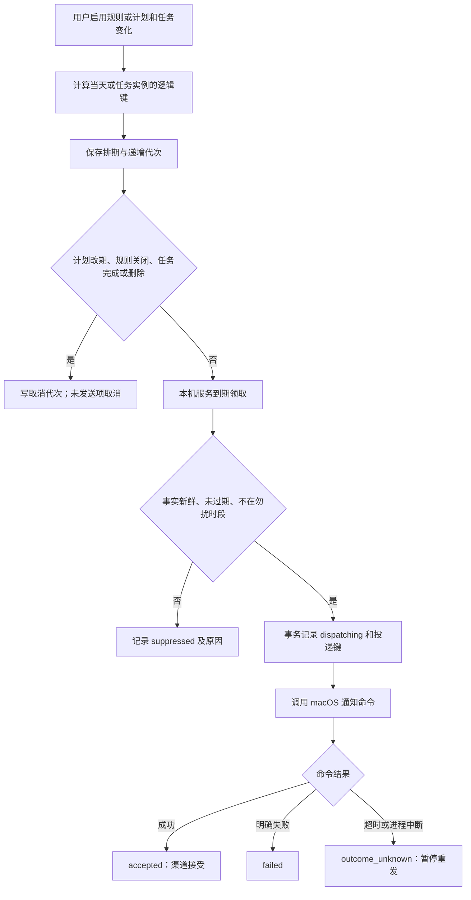
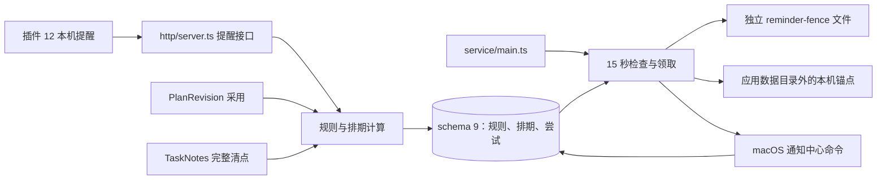

# 场景 09 接手说明：本机提醒、投递与取消

最后核对：2026-09-24。本文说明**当前代码**，设计目标见[场景 09 方案](../plans/2026-09-21-010-feat-reminder-delivery-control-plan.md)。先按[开发者接手指南](../development/onboarding.md)启动独立试点、服务和插件。本机提醒在 macOS 上执行；远端 relay、电脑关机后提醒和手机推送属于 P6，尚未交付。

## 用户如何启用

在插件设置页 **12 / 本机提醒** 点击“读取提醒”，确认页面显示本机服务执行条件。选择晨间查看计划、晚间复盘、任务开始或截止风险。前两类填写 `HH:mm` 和 IANA 时区，如 `Asia/Shanghai`；后两类填写提前分钟数及 TaskNotes 事实最多滞后的分钟数。每条规则都必须填写最多迟到分钟数、可选的勿扰开始与结束。两端勿扰时间要同时填写；跨午夜可用，例如 `22:00` 到 `07:00`。晨间／晚间**默认不补发**当天错过的提醒；常规轮询允许最多 30 秒的触发偏差，服务启动或规则建立晚于排期时不补发。显式勾选“补发当天遗漏”后仍受迟到窗口限制。任务改期后默认**不重发**，只有勾选“允许再次提醒”才取得新的投递资格。

启用前，人工检查 TaskNotes 是否已有同类提醒，勾选确认后登记。当前 TaskNotes Runtime API 未向本插件提供可可靠列出的提醒规则，界面不能自动找出重叠项；这一步由使用者核对。每台设备同一类规则只允许开启一条。关闭规则会取消尚未发送的排期。点击“暂停今天的提醒”会让当前设备当日后续提醒在领取时被抑制；已发通知无法撤回。对仍处于“已排期”的单次提醒，可在有效期内点“10 分钟后提醒”。晨间与晚间提醒在规则生效后计算今天和明天的本地时刻；夏令时不存在的当地时刻跳过，重复时刻采用第一次。每日提醒只发通用提示，不读取知识正文或任务标题。

任务开始提醒要求 TaskNotes 已被完整核对，且用户已采用包含该任务的正式时间计划；任务事实修订与计划采用时一致。截止风险提醒使用 TaskNotes 的 `due`：仅日期按任务时区的次日当地零点作为排他截止，带时区偏移的时间按具体时刻；不可靠的日期不排期。两类动态提醒在投递前复核任务还存在、状态未完成、修订仍匹配，且清点未超过规则的新鲜度。服务停止期间错过的开始提醒超过迟到窗口后抑制，不在开机时批量补发。

## 一条提醒怎么流转

`logicalKey` 由设备、规则、日期或任务实例以及桌面渠道形成；`generation` 是此键的单调排期代次。取消保存 `cancelGeneration`，旧代次不能取得发送权。`deliveryKey` 控制投递去重：晨间／晚间同日固定一次；任务开始和截止提醒已发后改期，只有规则显式允许重发才生成新键。一次 `dispatching` 写入与投递尝试同事务完成，外部通知在事务外执行。重启时仍在 `dispatching` 的尝试改为 `outcome_unknown`，不因没有回执就再次调用渠道。

| 状态 | 可相信的事实 |
|---|---|
| `scheduled` | 本机账本登记了未来发送资格 |
| `dispatching` | 已记录尝试，渠道调用可能正在进行 |
| `accepted` | `osascript` 命令成功返回，不证明系统展示、手机收到或已读 |
| `failed` | 已知本机渠道不可用；本版不自动重试 |
| `outcome_unknown` | 调用可能生效，未查明前不重发 |
| `cancelled` | 未发送的旧排期已取消；已发通知不能收回 |
| `suppressed` | 因迟到、勿扰或任务事实不可靠而未发送 |

已发后才发生任务取消时，排期仍保留接受结果，同时保存取消代次和“已发通知无法撤回”的原因。渠道没有可验证的送达或已读回执，因此界面不显示这两个状态。

## 代码、数据与接口

| 入口 | 职责 |
|---|---|
| [reminders.ts](../../packages/contracts/src/reminders.ts)、[identity.ts](../../apps/service/src/reminders/identity.ts) | 规则输入、状态、当地日期、夏令时与身份 |
| [rules.ts](../../apps/service/src/reminders/rules.ts) | 登记、关闭、稍后提醒、计划与任务变更后的排期／取消 |
| [dispatcher.ts](../../apps/service/src/reminders/dispatcher.ts)、[local.ts](../../apps/service/src/reminders/channels/local.ts) | 领取、勿扰／迟到／新鲜度复核、发送尝试与本机渠道结果 |
| [accept.ts](../../apps/service/src/planning/accept.ts)、[reconcile.ts](../../apps/service/src/tasks/reconcile.ts) | 计划采用和 TaskNotes 清点完成时同步提醒排期 |
| [009-reminders.ts](../../apps/service/src/storage/migrations/009-reminders.ts)、[store.ts](../../apps/service/src/storage/store.ts) | schema 9、升级快照、备份恢复栅栏 |
| [reminders.ts](../../apps/obsidian-plugin/src/views/reminders.ts) | 规则登记、关闭和最近排期结果 |

`GET /v1/reminders` 返回当前设备的规则、排期、人工核对标记、暂停状态和执行条件。`POST /v1/reminders/rules` 登记规则；`POST /v1/reminders/rules/:id/disable` 关闭；`POST /v1/reminders/:key/snooze` 传毫秒时间戳 `until`；`POST /v1/reminders/pause-today` 传当地日期和时区；`POST /v1/reminders/:key/review-unknown` 表示用户已核对并接受结果仍未知，**不会把它改写为成功，也不会自动重发**。写操作沿用 Bearer、主端、策略版本和 `x-operation-key` 幂等边界。设备 ID 来自插件稳定保存的数据；一次性配对后新会话 ID 不影响原规则。服务只监听本机回环地址。规则开启是显式行为，安装插件和采用计划本身不会自动开启任何提醒。释放主端前必须关闭本设备所有开启的提醒规则，并核对在途或结果未知的尝试；服务领取时也核对当前主端设备身份。

schema 8 升 9 前生成权限 `0600` 的 `state.db.before-v9-<id>`。应用数据目录中的 `state.db.reminder-fence` 和**应用数据目录的父目录**中的 `.kb-reminder-anchor-<路径哈希>` 分别保存同一个单调计数；后者不随单独的应用数据备份一起回滚。每次改变排期或写发送尝试先持久化这两个文件，再提交数据库。备份应用数据时保留数据库及同目录栅栏；恢复旧应用数据时**不要回滚父目录锚点**。任一计数不一致时服务暂停本机提醒，界面会显示暂停。先停服务，保留现场文件，核对最新数据库、同目录栅栏和父目录锚点，再恢复同一版本的数据并重启。当前没有自动合并旧备份的工具，不要删除栅栏、清空发送尝试或手动改计数来强行恢复，以免重新发送旧提醒。若整个主机连同父目录锚点一起恢复到旧时点，本机无法独立证明恢复后不会重复投递；须保持暂停并与外部渠道记录人工核对，P6 relay 的远端权威账本尚未实现。

## 验证与边界

在仓库根目录运行 `pnpm check`；针对身份、故障和恢复运行 `pnpm exec vitest run tests/unit/reminder-identity.test.ts tests/faults/reminder-dispatch.test.ts tests/faults/reminder-restore.test.ts`。桌面界面可用 `pnpm test:desktop` 的合成 Vault 检查，实际 macOS 通知权限仍应在目标机器上核对。本次检查结果见[场景 09 验证记录](reminder-delivery-control-validation.md)。如果一直显示 `scheduled`，先确认电脑未休眠、服务未停止、当地时间与时区正确；若显示 `suppressed`，查看原因并重新核对 TaskNotes 或调整规则；若是 `outcome_unknown`，不能通过重复登记同类规则强行补发，应人工检查系统通知记录。

旧计划的 `plan_outbox` 提醒投影仍为 `disabled`，Today 的该回执不是本机提醒发送结果；请以设置页独立账本为准。当前通知文案是固定的通用提示，没有使用资料来源，因此来源撤回不会留下需撤销的知识摘要。远程 relay、两端权威交接、手机离线／关机验收、真实送达回执尚未实现。ntfy 的[发布文档](https://docs.ntfy.sh/publish/)描述了 HTTP 发布与定时消息，[配置文档](https://docs.ntfy.sh/config/)描述服务访问配置；它们仅是后续渠道研究材料，当前代码没有连接 ntfy，不代表当前具备手机提醒能力。
