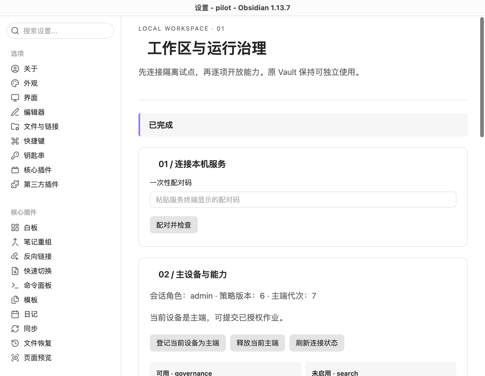
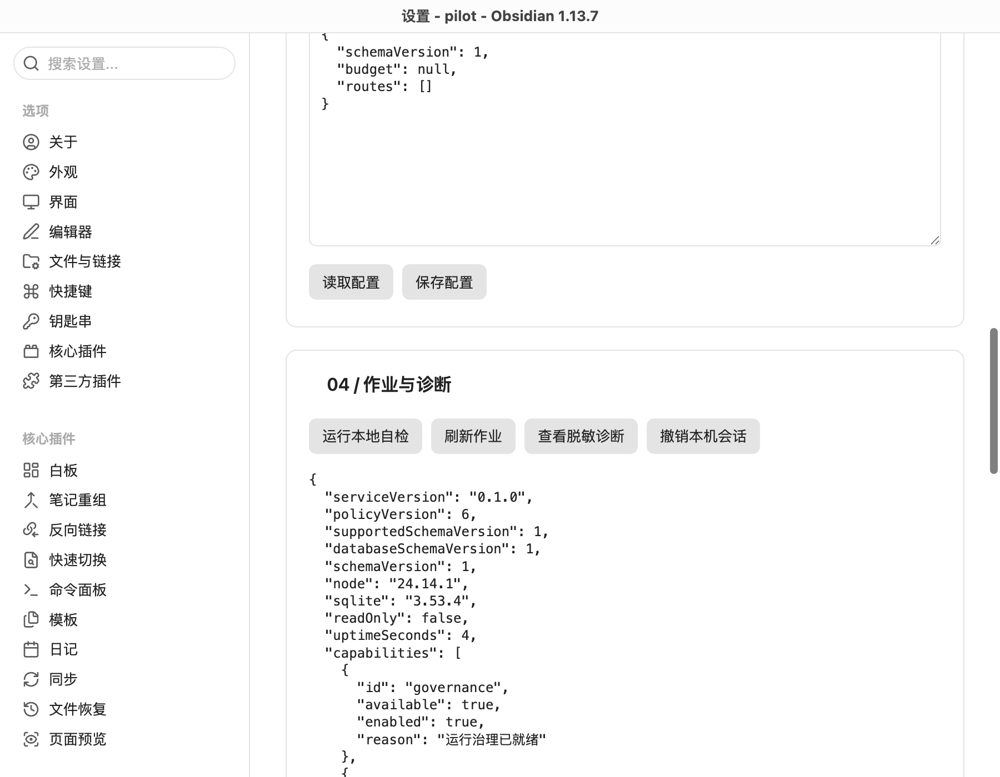

# 场景 01 实施验收

2026-09-21，完成[工作区接入与运行治理方案](../plans/2026-09-21-002-feat-workspace-runtime-governance-plan.md)的 G1—G5。入口为[根目录运行说明](../../README.md)。首次扫描与建库由本机 CLI 完成，插件负责配对和后续治理；本轮未制作通用 Vault 选择器。

## 已交付的边界

工程采用 pnpm workspace、TypeScript strict、Fastify、运行时 schema、真实 SQLite 与薄 Obsidian 插件。生产业务适配器默认空集合。权限、费用和隔离测试使用合成资料与合成提供方，不消耗真实模型额度。

| 单元 | 实现与验收证据                                                                                                                                                                                      |
| ---- | --------------------------------------------------------------------------------------------------------------------------------------------------------------------------------------------------- |
| G1   | 扫描文件／目录／插件版本、重复 taskId、符号链接与受管位置冲突；摘要确认后创建完整校验备份与隔离试点；错误 Vault、重复配对、凭据撤销、不可自动抢占主端和未知 schema 测试通过                         |
| G2   | 回环监听、Host／Origin／Bearer、四类角色、策略版本、来源路线交集及撤回；HTTPS 目标与全部 DNS 地址验证，连接固定已检查 IP，每次重定向重新验证；材料内容没有授权或执行入口                            |
| G3   | 根／子作业、阶段、租约、栅栏、取消、有限恢复；交互／通知／批量独立进程；三层预算事务、未知预占、跨午夜、唯一回执结算、超估计停止根作业；两独立进程争抢额度只允许一个成功                            |
| G4   | 真实 Obsidian 设置页；配对、主端交接、配置、作业刷新／取消／失败重试、诊断；失联保留草稿、重复点击合并、响应丢失幂等重试、迟到响应不覆盖新草稿、部分完成与键盘焦点测试通过                          |
| G5   | 固定摘要的 OCI 镜像、禁网、只读输入、专用输出、非 root、移除能力与资源限制；真实主目录／元数据／直连外网／进程数／超时／软链接输出负例通过；broker 不下发提供方密钥，校验会话撤销、心跳、策略与预算 |

单个用户可见流程已经在真实 Obsidian 运行：安装插件 → 配对 → 登记主端 → 读取／保存配置 → 创建自检 → 子进程完成 → 脱敏诊断 → 释放主端 → 撤销会话。渲染进程无未捕获异常。测试工作区和应用配置与用户资料隔离。

R002 的手工任务、导入和检索，R082 的长报告／证据阅读，以及 A01、A35 的完整业务联合验收需要对应后续场景；本轮只完成其治理基础，未声称这些业务已经可用。通用备份／回退／迁移仍归场景 10。

## 受测版本

| 项目                         | 实际值                                                                                        |
| ---------------------------- | --------------------------------------------------------------------------------------------- |
| OS                           | macOS 14.4（23E214），arm64                                                                   |
| Node.js / pnpm               | 24.14.1 / 10.33.0                                                                             |
| Obsidian                     | 1.13.7，桌面真实进程                                                                          |
| Fastify / Zod                | 5.12.4 / 4.6.5                                                                                |
| better-sqlite3 / 实际 SQLite | 13.0.3 / 3.53.4                                                                               |
| 系统凭据适配器               | @napi-rs/keyring 2.1.0；合成凭据创建、读取、删除通过                                          |
| Docker client / server       | 29.4.0 / 29.4.0                                                                               |
| OCI 镜像                     | `node:24.14.1-alpine@sha256:8510330d3eb72c804231a834b1a8ebb55cb3796c3e4431297a24d246b8add4d5` |

`pnpm licenses list --prod --json` 的生产依赖清单包含 MIT、BSD-3-Clause、ISC。精确安装树以 `pnpm-lock.yaml` 为准。未对其他操作系统作兼容承诺。

## 验证命令与结果

- `pnpm check`：类型检查、lint、26 个常规用例、构建、2 个编译产物测试通过。
- `pnpm test:oci`：4 个用例通过，其中 1 个是真实 OCI 负例组合，另外 3 个 broker 用例也在常规测试中运行。
- 三组测试合计覆盖 **29 个不同用例**。常规测试中显示跳过的 3 个环境测试，已分别在编译产物与 OCI 命令中执行，不是未验证项。
- `pnpm test:desktop`：上述真实 Obsidian 完整流程通过；截图如下。
- 凭据库测试使用随机测试账户及合成值，完成后已删除该凭据。

## 接口与权限

所有接口均在 `/v1` 下。除配对外，必须携带 `Authorization: Bearer <token>`。变更设置、主端、来源策略、作业和取消操作还必须携带 `x-policy-version` 与 UUID 格式的 `x-operation-key`。同一会话内，同键同载荷返回已保存结果，同键不同载荷返回冲突；幂等记录与本地变更在同一事务提交。

| 接口                                                                       | 允许角色／约束                                             |
| -------------------------------------------------------------------------- | ---------------------------------------------------------- |
| `POST /pair`                                                               | 本机一次性配对码；角色来自服务启动参数，不能由请求正文赋予 |
| `GET /workspace`、`GET /jobs`、`GET /diagnostics`                          | 有效会话；诊断不返回路径、正文或凭据                       |
| `POST /session/heartbeat`、`POST /session/refresh`、`POST /session/revoke` | 当前会话；心跳不自动接受新策略或新主端代次                 |
| `GET /settings`                                                            | admin / user / reader                                      |
| `PUT /settings`、`PUT /source-policy`                                      | admin；严格 schema、版本与幂等检查                         |
| `POST /master/claim`、`POST /master/release`                               | admin；明确 epoch；释放前无排队／运行作业或未结算费用      |
| `POST /jobs`、`POST /jobs/:id/cancel`                                      | admin / user，当前主设备、当前 epoch 和有效心跳            |

新建作业当前只接受 `diagnostic-check`。失败重试传入 `parentId`，费用继续归原根作业。首期没有接受任意命令、脚本路径、镜像、网络目标或插件代码的 HTTP 入口。

## 隔离与恢复的具体限制

OCI 运行上限为 1 CPU、128 MiB 内存、32 个进程、256 个文件描述符、最长 15 秒；单产物不超过 2 MB，最多 20 个普通文件、总输出不超过 4 MB。拒绝软链接、硬链接和特殊文件。输出总量是在执行结束后校验，不能把它当成宿主文件系统的硬配额；仅供已审查、输入有界的适配器接入，任意用户脚本仍不开放。

普通自检 worker 只承担故障与负载隔离。第三方路线目前没有业务适配器，即使 Docker 负例通过也不会自动开放。后续适配器应复用 Policy／Budget／WorkerBroker，并对自己的输入、网络目标、价格与产物单独验收。Docker 不可用时直接拒绝，不回退为普通子进程。

主端状态、会话哈希、设置、作业、事件、幂等结果与费用都在本机 `state.db`。没有全局分布式锁，也没有把两个独立数据库宣称为跨设备唯一性证明。每次重启将已派发而未结算调用改为未知状态，保留预占；未知 schema 不执行自动迁移。首次接入备份有逐文件哈希回读与文件同步，但不代替场景 10 的灾难恢复方案。

## Post-Deploy Monitoring & Validation

负责人为试点工作区的配置管理员。首次启用观察 30 分钟，次日再核对一次账本；这里只给出验证安排，不创建自动提醒。

- 正常信号：插件自检最终为“已完成”；队列恢复为空；schema 版本 1、`readOnly=false`；无真实提供方时费用汇总为 0。
- 查询 `SELECT queue,state,count(*) FROM jobs GROUP BY queue,state;` 核对滞留。查询 `SELECT state,count(*),sum(reserved),sum(actual) FROM calls GROUP BY state;` 核对未知费用。查询 `SELECT kind,count(*) FROM events GROUP BY kind;` 核对登记、作业及费用事件。
- 错误检索使用 `AUTH`、`MASTER`、`SCHEMA`、`BUDGET`、`UNKNOWN_COST`、`WORKER_FAILED`、`SERVICE_LOCK` 和返回的详情编号。默认 HTTP 请求日志关闭，错误响应只输出固定文案；配对码仅出现在本机启动终端。
- 若发现重复副作用、非预期出站、未知 schema 被写入或预占消失，停止服务并撤销会话。保留账本和初始备份，不通过清空数据库恢复运行。只回滚代码或重新打开未修改的原 Vault；已有账本不得交给不识别该版本的程序写入。

完整顺序审查记录位于 `.context/compound-engineering/ce-review/2026-09-21-runtime/`。审查按仓库指引在主线程执行，没有将其表述为独立子 agent 审查。
