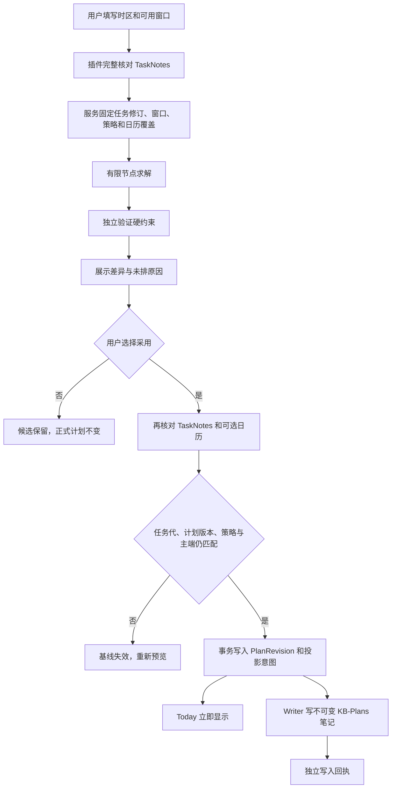
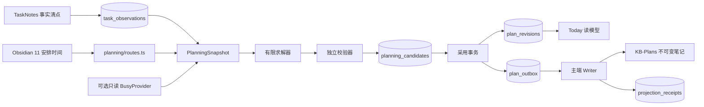

# 场景 08 接手说明：约束排程与计划采用

最后核对：2026-09-24。本文描述**当前代码**，设计目标见[场景方案](../plans/2026-09-21-009-feat-scheduling-calendar-sync-plan.md)。先读[开发者接手指南](../development/onboarding.md)了解独立试点、主端和 TaskNotes 的运行条件。

## 现在可以做什么

用户在插件设置页的 **11 / 安排时间** 填写计划时区、带偏移的可用时间，以及搜索节点、冻结分钟数和日历新鲜度。点击“核对任务并预览”，插件先通过 TaskNotes 4.13.4 完整清点，再请求本地服务生成候选。界面列出安排、保留／新增／移动／移除和未排原因；点击“核对后采用此计划”才写入正式计划。Today 随即读取新计划。撤销也是先预览一个基于现状的新候选，人工再次采用，不会回滚 TaskNotes 的真实任务或工作日志。

首期界面只填写**一个本地可用窗口和一个可选的不可用窗口**，也没有外部日历连接设置。服务合同支持多个可用／不可用窗口以及可注入的只读忙闲适配器，供后续集成和测试；当前正常启动的服务未注入 Google 提供方。因此 UI 会明确写“未核对外部日历”。如果 API 请求选择了日历而提供方不可用或任何一个日历返回错误，该范围标为“覆盖未知”，不能采用。没有分钟估计、正在计时、身份冲突、任务状态阻塞、无效截止和依赖问题会列为未排，不会假装已排。

自动委托和 Google 日历写入是总体方案中的 P6 单独启用项，当前**未开放**。计划采用会同时留下笔记、任务字段、日历、提醒四个投影意图；笔记由本机主端 Writer 写入，其余三类保持 `disabled`，不会发送外部请求。Today 分别显示“待同步”“已同步”或“未启用”。TaskNotes 的 `scheduled` 字段不会自动修改。

## 一次操作如何流转

时间块按毫秒时间点与半开区间 `[start,end)` 计算，相邻块不冲突。可用窗口必须有明确的 `Z` 或时区偏移；如果填写带偏移的本地时间，偏移必须与所选时区一致，避免夏令时缺失小时被静默纠正。TaskNotes 的仅日期截止按任务时区转换为**次日当地零点**，不会硬算 24 小时。任务预计时长减去已完成工作日志得到剩余分钟；重叠日志只扣一次，日志没有明确偏移或不能可靠解释时，剩余时长标为未知。

求解器优先按硬截止、用户优先级、期望日期与稳定任务 ID 排序，尝试保留原块，再在窗口内找连续空档。TaskNotes 文件可选填 `kbPlanPriority`（整数 0—5）、`kbPlanLocation`、`kbPlanDevice`；可用窗口可标地点与设备，指定的任务只会进入匹配窗口。字段未填时不推断资源或优先级。冻结范围内、已开始或显式锁定的旧块先占位；没有拆分授权，因此一个任务至多一个完整时间块。节点预算耗尽返回“未找到”；只有忽略可移动块后仍找不到足够连续空档时，才标记“硬条件证明当前时域不可行”。其余空间不足只说明未找到，不宣称数学上无解。最长求解时间可由用户填写，留空时受服务端 5000 毫秒安全上限限制。界面显示总容量下界缺口；受截止或碎片影响时即使下界为零，也可能有未排项。独立校验器再次检查时长、窗口、资源、不可用时间、重叠、截止、最早日期、依赖顺序、冻结块和重复任务。没有实质差异时返回 `no-op`，不会产生新 PlanRevision。

## 代码与账本

| 入口 | 用途 |
|---|---|
| [planning.ts](../../packages/contracts/src/planning.ts) | 明确时间、输入、候选与覆盖状态合同 |
| [snapshot.ts](../../apps/service/src/planning/snapshot.ts)、[freebusy.ts](../../apps/service/src/calendar/freebusy.ts) | 固定 TaskNotes 修订、时区、策略和日历覆盖；逐日历错误视为未知 |
| [solver.ts](../../apps/service/src/planning/solver.ts)、[validator.ts](../../apps/service/src/planning/validator.ts) | 排程与独立硬约束检查 |
| [accept.ts](../../apps/service/src/planning/accept.ts)、[undo.ts](../../apps/service/src/planning/undo.ts) | 版本比较、原子采用、基于现状撤销 |
| [notes.ts](../../apps/service/src/planning/notes.ts)、[plan-notes.ts](../../apps/obsidian-plugin/src/views/plan-notes.ts) | 受控笔记投影、丢回执后按哈希恢复 |
| [plan-review.ts](../../apps/obsidian-plugin/src/views/plan-review.ts) | 用户预览与采用入口 |
| [008-planning.ts](../../apps/service/src/storage/migrations/008-planning.ts) | schema 8：候选、正式版本、采用记录、投影意图与笔记授权 |

API 使用既有 Bearer 会话、策略版本和主端边界。`POST /v1/planning/candidates` 创建预览；`GET /v1/planning/candidates/:id` 回读；`POST /v1/planning/candidates/:id/accept` 采用；`POST /v1/planning/undo` 生成撤销候选；`GET /v1/planning/current` 查看当前正式版本。笔记投影通过 `/v1/planning/notes/pending`、`/:id/grant` 和 `/:id/receipt` 完成，仅主端可写。候选 ID 重试采用返回同一版本；另一个旧基线候选会失败。事务完成后恰好发生的外部变化仍可能使计划过时，因此 Today 根据任务失效记录隐藏受影响的未来块并提示重排。

schema 7 升 8 前，服务生成权限 `0600` 的 `state.db.before-v8-<id>` 快照，再执行迁移。`plan_revisions` 是正式计划权威；`task_plan_reads` 是 Today 读模型；`KB-Plans` 文件和日历都是投影，不能用删除数据库的方式“重建”正式计划。

## 验证、限制和恢复

在仓库根目录运行 `pnpm check`。针对本场景可运行 `pnpm exec vitest run tests/unit/planning-timezones.test.ts tests/unit/planning-constraints.test.ts tests/integration/planning-input.test.ts tests/faults/plan-acceptance.test.ts tests/contracts/calendar-provider.test.ts tests/performance/replanning.test.ts`。桌面端运行 `pnpm test:desktop`，并在合成 Vault 的插件设置页核对“11 / 安排时间”。本次执行结果与日期记录在[场景 08 验证记录](scheduling-calendar-sync-validation.md)。

候选提示“基线失效”时，在 Today 再核对 TaskNotes，重新预览；不要重复提交旧候选。笔记回执待写时，保持服务和主端插件运行，Writer 下一个周期重试；若笔记被人工编辑或打开编辑器，先保留人工内容并检查冲突，不强行覆盖。旧服务若显示只读，说明数据库已迁到 schema 8，应更新服务和插件构建；先保留 `before-v8` 快照。

需要接入真实 Google 日历时，先落实 OAuth 授权、明确要查的日历 ID 与专用 KB Plan 日历、独立凭据存储和真实测试日历。Google [FreeBusy 文档](https://developers.google.com/workspace/calendar/api/v3/reference/freebusy/query)明确响应可含逐日历错误，且忙闲区间结束端为排他边界；当前实现据此拒绝部分覆盖。现有 `BusyProvider` 只是受测接口，没有生产凭据、自动刷新和 Google 事件写入。不要把接口测试当作真实日历验收。
