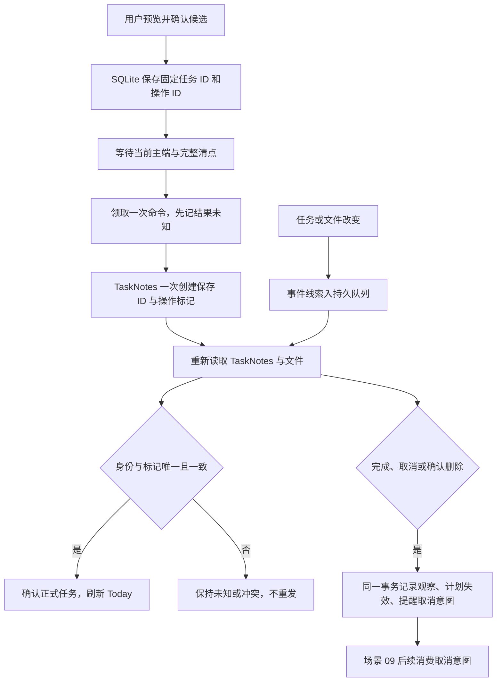
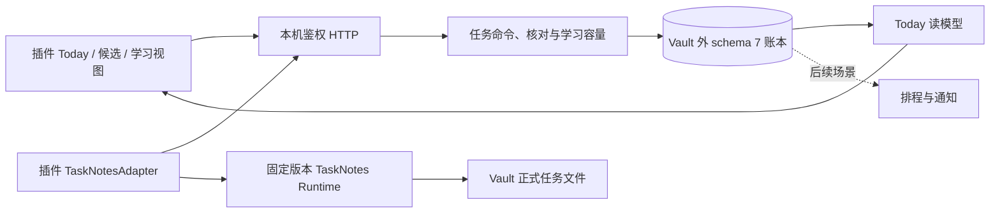

# TaskNotes、Today 与任务核对接手说明

本功能对应[场景 07 方案](../plans/2026-09-21-008-feat-task-today-reconciliation-plan.md)。首次运行先看[开发者接手指南](../development/onboarding.md)。验证结果单独放在[场景 07 验收记录](task-today-validation.md)。

## 先理解两份数据各管什么

TaskNotes 的 Markdown 文件保存正式任务，包括标题、状态、截止、循环和工作日志。本服务的 SQLite 保存稳定身份、最近观察、候选创建命令、学习关联和同步结果。Today 读取这些已确认事实，不提供另一组任务完成勾选。

本轮固定 TaskNotes **4.13.4**，Runtime API v1，release commit `153a107e5f1f215c24832d30d057f71b35365ae4`。只使用 Obsidian 内的 Runtime API，不需要打开 TaskNotes HTTP 服务。其他版本不会自动获得写权限；升级前要重跑契约测试。依据：[官方 Runtime API](https://tasknotes.dev/obsidian/javascript-api/)、[固定源码](https://github.com/callumalpass/tasknotes/tree/153a107e5f1f215c24832d30d057f71b35365ae4)。

能使用的部分：普通任务候选、明确选择旧任务接管、创建回执核对、改名与副本识别、任务状态观察、Today 未排项和学习续接。自动修改已有任务字段、循环 toggle 重试、精确排程、实际日历同步和通知发送没有开放。场景 08/09 接入前，计划与四类投影回执只有内部读模型接口及测试，不会凭空生成日程。

## 第一次使用

1. 按 README 创建独立试点，安装本仓库插件并连接本机服务，登记主端。
2. 在这个试点安装并启用 TaskNotes 4.13.4。试点接入不会自动加载原 Vault 的插件。保留 TaskNotes 自己的任务列表、看板、循环和计时入口。
3. 打开“知识与任务中心”设置的“10 / Today 与 TaskNotes”，点击“核对 TaskNotes 并刷新 Today”。确认最后核对时间。
4. 没有任务时，可直接填写“任务标题”“期望日期”“最早开始”“硬截止日期”“预估分钟”“任务时区”和说明。日期允许留空；例如“明天学”只是标题，不会暗中设成硬截止。
5. 点击“预览任务候选”，核对字段，勾选确认，再点击“确认登记任务”。先看到“等待本机创建”；随后插件创建，下一轮清点才显示“正式任务已确认”。
6. 在 Today 点击“打开 TaskNotes 任务”，通过原生入口完成、重开或计时。回到 Today 刷新即可看到最新事实。

普通任务不需要收录资料、学习目标、模型密钥或收费配置。初始状态要求 TaskNotes 配置中存在未完成的 `open` 状态；已有任务的完成状态按 TaskNotes 的 `isCompleted` 定义识别。其余非标准状态显示“待映射”，不会模糊匹配成完成。

“期望日期”是想在哪天做，“最早开始”是不可提前的日期，“硬截止”才是必须完成的期限。日期截止按所选时区的次日零点结束，夏令时日不固定加 24 小时。首期不写 TaskNotes `scheduled`。“一句话输入”提供有限的本地提取：识别今天、明天、后天和整数分钟数，显示原文依据；仍须检查表单并确认。不会从句子推断硬截止、复杂重复规则或精确时间，真实自然语言模型未接入。

### 接管已有任务

点击“预览已有任务接管”，勾选要接管的文件，再点“确认接管所选任务”。一次展示前 100 个未接管任务，可分批操作。插件在文件内容仍等于预览基线时，原子补一个随机 `taskId`；不重写正文和未知字段。预览后文件改过，就停止这次写入，重新预览。

复制任务文件可能复制 `taskId`。同 ID 指向两个文件时，两者进入身份冲突；请在 TaskNotes 中核对哪个是原任务。若副本确实代表新任务，人工移除副本的 `taskId`，再预览接管为新身份。不要直接修改服务数据库。

已确认删除的 ID 留作墓碑，旧文件重新出现也不会复活原任务。需要作为新任务恢复时，保留旧记录，把恢复文件按新的任务身份接管。

### 继续学习

场景 06 的目标、实际尝试和来源权限仍由学习模块管理。明确设置复习规则、同时进行上限和每日分钟上限，建议到期后才能确认创建。容量读取要求任务清点完整、新鲜，所有任务已有稳定身份，状态及预估可解释。未接管任务、未知状态、身份冲突、循环系列或不一致时区会阻断这条严格容量路线，普通手工创建仍可使用。

创建意图使用原有任务 ID，TaskNotes 创建标记得到确认后，学习页“核对任务创建结果”可以收取回执。Today 的“继续这项学习”回到同一个目标与单元，恢复原尝试和固定引用。TaskNotes 中勾选完成不会替用户生成一次学习尝试。

容量预留只保证本服务发起的并发请求不重复占用或超发；TaskNotes 原生界面仍可独立修改，两个应用之间没有原子容量事务。不要把本轮接口验收当作跨插件 CAS 保证。

## 一次创建和一次核对怎么走



事件只是“需要再读”的线索，不直接携带要覆盖的状态。插件先等 TaskNotes 就绪，完整读取任务，再核对缓存、文件内容和文件列表是否变化；变化时下一轮重新读。服务拒绝过期清点覆盖较新的清点。断网期间的内存线索可能丢失，重连全量清点负责恢复事实。

普通文件正文保存不会产生第二次完成事件。重开不会抹掉先前的计划失效记录。未开始的旧安排从执行读模型中移除；已开始的工作、旧计划内容与工作日志保留。提醒取消 outbox 是可靠待办账本，目前没有通知发送器，因此 `pending` 不表示外部提醒已经取消。

## 代码和数据从哪里看



| 入口 | 维护时关注什么 |
|---|---|
| [contracts/tasks.ts](../../packages/contracts/src/tasks.ts) | 字段上限、事实、日期、命令和 Today 的共享契约 |
| [tasknotes/adapter.ts](../../apps/obsidian-plugin/src/tasknotes/adapter.ts) | 版本门禁、两轮核对、身份写入和唯一一次创建 |
| [tasks/routes.ts](../../apps/service/src/tasks/routes.ts) | 鉴权、主端及政策版本检查 |
| [tasks/commands.ts](../../apps/service/src/tasks/commands.ts) | 固定载荷摘要、待创建、未知与正式回执 |
| [tasks/reconcile.ts](../../apps/service/src/tasks/reconcile.ts) | 观察事务、墓碑、循环映射、失效与取消 outbox |
| [tasks/learning-adapter.ts](../../apps/service/src/tasks/learning-adapter.ts) | 学习容量事实和创建队列之间的桥接 |
| [tasks/today.ts](../../apps/service/src/tasks/today.ts) | 当前事实、未来安排过滤和学习续接身份 |
| [tasks/progress.ts](../../apps/service/src/tasks/progress.ts) | 冻结叶子权重，取消和新增范围不删旧分母 |
| [007-tasks.ts](../../apps/service/src/storage/migrations/007-tasks.ts) | schema 7 新增表 |

任务文件自定义字段：`taskId`、`kbOperationId`、`kbDesiredDay`、`kbEarliestDay`、`kbTimezone`。只有候选创建和明确接管会写入它们。`timeEntries` 只读观察，不复制一份可编辑日志。

schema 6 升至 7 前，服务生成权限 0600 的 `state.db.before-v7-<id>` 快照，再事务迁移。旧学习尝试、研究记录和费用不变。新表包括观察、分批清点、事件队列、循环实例映射、命令、失效记录、取消 outbox、进度基线、计划读模型和投影回执。没有这些账本不能靠重新扫描 Vault 完全恢复，所以不能把数据库当缓存删除。

循环由 TaskNotes 展开；本系统不运行另一套 RRULE 引擎。实体实例用系列稳定 ID、原始发生日期及系列时区形成映射，移动期望日期不会换身份；规则调整仍保留旧映射。无法找到受管系列或同一实例映射多个任务时暂停可靠同步。

## API 与开发检查

所有接口使用本机会话；写操作还要当前主端与 `x-policy-version`。下面只是路由说明，不包含真实凭据。

| 路由 | 用途 |
|---|---|
| `GET /v1/tasks/today` | 最新观察、待创建、风险、学习关联与独立投影回执 |
| `POST /v1/tasks/text-draft` | 有限本地短句候选，保留原文与字段依据 |
| `POST /v1/tasks/draft` | 验证表单和日期语义，返回字段依据 |
| `POST /v1/tasks/commands` | `operationId + input` 登记幂等创建 |
| `POST /v1/tasks/commands/claim` | 主端只领取一次，返回前已置未知 |
| `POST /v1/tasks/commands/:id/confirm` | 对仍未领取的候选按摘要重新授权 |
| `POST /v1/tasks/commands/:id/cancel` | 取消还没领取的候选；未知结果不能按未创建释放 |
| `POST /v1/tasks/inventories` | 开始清点，固定当前观察代次 |
| `POST /v1/tasks/inventories/:id/items` | 分批传事实，每批最多 20 个 |
| `POST /v1/tasks/inventories/:id/finish` | 核对数量、清点边界与存在文件后提交 |
| `POST /v1/tasks/events` | 保存事件线索，不覆盖任务事实 |
| `POST /v1/tasks/baselines` | 冻结叶子权重基线；暂未提供图形编辑器 |

插件每 1.5 秒尝试核对，运行中的核对不重入。单轮最多 10,000 个任务、20,000 个可见 Markdown 路径；服务清点有效期 60 秒，创建所依赖的观察最多 30 秒。超限或读取失败时保留最后确认结果，暂停自动创建。常规 API 请求体 32 KB，内容特别大的日志或目录应先缩小试点。

```sh
pnpm check
node scripts/fetch-tasknotes.mjs
node scripts/tasknotes-contract.mjs
KB_TEST_TASKNOTES=1 pnpm test:desktop
```

下载脚本固定版本并检查 `main.js` SHA-256，只保存到忽略提交的测试目录；桌面测试加载到 `.context/runtime-validation/tasknotes-v7/` 的合成 Vault，契约测试另建独立 Vault。没有安装应用或下载资产时，桌面测试不能运行，不等于服务单元测试失败。

## 遇到问题先看这里

| 现象 | 含义与处理 |
|---|---|
| 等待本机创建 | 尚未领取。检查插件版本、缓存、主端和连接；换会话后核对候选字段再“重新确认待创建” |
| 结果未知 | 命令可能已执行；刷新完整清点寻找固定标记。不要再点一遍创建同一事情，也不要删账本来解除容量 |
| 正式任务没出现，但没有错误 | 创建结果可能缺少标记，或 TaskNotes `open` 状态不可用；先去原生任务列表核对。系统不以暂时找不到文件作为未创建证明 |
| 缓存尚未反映文件内容 | 任务正在写入或索引；等待后再核对，期间保留旧事实 |
| 重复身份／循环实例冲突 | 先分辨副本与真实任务，再接管新身份；不要让同一 ID 代表两个文件 |
| 来源撤回后学习无法继续 | 学习模块重新检查固定引用权限；TaskNotes 状态不能绕开来源撤回 |
| 没有精确进度 | 尚未冻结叶子验收权重基线；只显示任务事实，避免制造百分比 |
| outbox 一直 pending | 场景 09 尚无外部发送器；只完成本地取消意图登记 |
| 旧服务显示只读 | 新数据库已是 schema 7；服务与插件需一起更新构建，不能覆盖回旧快照 |

上线后重点看未知命令、身份冲突、最近完整清点时间和取消 outbox。自动字段更新继续关闭；升级 TaskNotes、开放自动循环状态或部署外部提醒前，需要各自独立验收。
