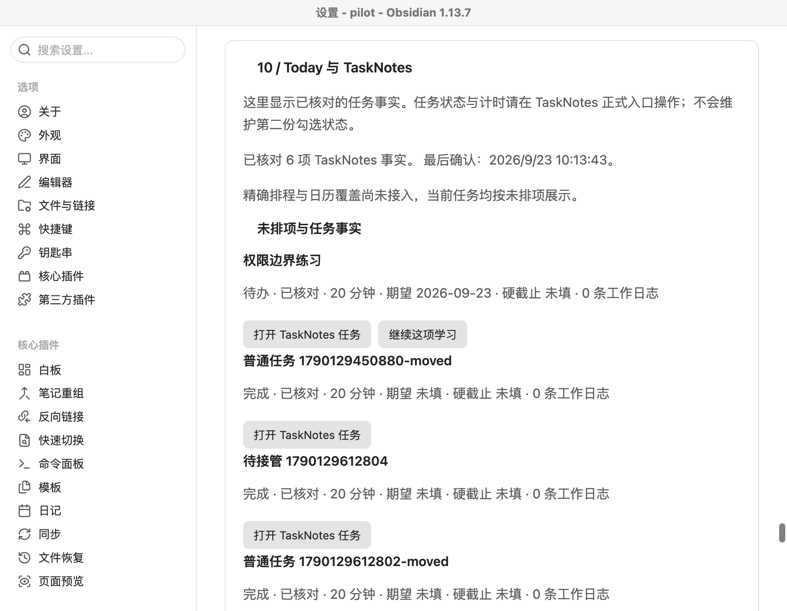

# 场景 07 实施与验收记录

日期：2026-09-23。对应[方案](../plans/2026-09-21-008-feat-task-today-reconciliation-plan.md)与[使用、代码及恢复说明](task-today-reconciliation.md)。本页只记录本轮实测，不替换场景 01—06 的历史结果。

## 验证环境与真实契约

macOS，Node 24.14.1、pnpm 10.33.0、Obsidian 1.13.7、SQLite 3.53.4。TaskNotes 固定 **4.13.4**，release commit `153a107e5f1f215c24832d30d057f71b35365ae4`，Runtime API v1。下载发布资产的 `main.js` SHA-256：

```text
ae394af31dbad2566bc4a1635c354f669f23fc820e22e4eaf2f6239dfa89f4ca
```

先检查官方固定源码，再在独立合成 Vault 加载实际发布资产。`scripts/tasknotes-contract.mjs` 真实执行创建、状态更新、改名、复制、循环 toggle 和实例实体化。结果显示：

- 一次创建文件可同时带 `taskId` 和 `kbOperationId`。
- 状态更新保留未知嵌套字段及正文；改名保留稳定 ID，副本会复制 ID。
- 对同日循环实例连续 toggle 两次，完成列表从包含该日变回空。没有把 toggle 当幂等 set-state。
- 实体实例提供 `recurrence_parent` 和 `occurrence_date`；服务按系列稳定身份、原始日期和时区映射，不自己展开循环。

这些测试不证明 TaskNotes 提供跨插件 CAS。首期自动字段更新关闭，正式状态修改仍使用 TaskNotes 原生入口。上游 HTTP 服务未启用。

## 自动化回归

`KB_TEST_OCI=1 KB_TEST_BUILT=1 pnpm test`：**139 项通过、2 项真实语料跳过**，52 个文件通过、1 个文件跳过。最终 `pnpm check` 也通过：常规 136 项通过、5 项按环境跳过，另执行 2 项编译产物进程检查；其中 OCI 与进程路线的完整统计采用上面的 139 项结果。类型与 lint 通过。跳过的是原有真实语料路线，本轮没有重跑网络语料，也没有关闭历史真实模型与语义验收门槛。

新增测试覆盖：

| 验收问题 | 验证方式 |
|---|---|
| 标题和路径变化是否换身份，副本是否冲突 | 身份集成测试；真实桌面改名 |
| 不完整清点、缓存遗漏是否误删 | incomplete/旧代次/仍存在文件测试；真实文件配合缓存故障注入 |
| 同一完成产生多次事件，重开再完成 | 事件线索去重、业务修订、取消 outbox 测试 |
| 回执丢失后是否重发、单纯达到状态是否可归因 | 命令故障测试：未知保持、双标记、冲突不认领 |
| “明天”是否偷填硬截止、夏令时是否错一天 | 有限短句候选和纽约春秋切换测试 |
| 取消或新范围是否删除进度分母 | 固定基线及叶子权重测试 |
| 学习候选等待期间暂停目标 | 真正服务账本、建议、容量、命令、观察和 Resume 集成测试 |
| 笔记待投影时是否仍可见已接受计划 | 内部只读计划夹具；note pending 与 calendar failed 独立 |
| 升级是否丢旧记录 | schema 1—6 到 7、0600 快照、学习数据保留及新库重开 |

服务端性能样本为 **1,000 个任务、25 次完整核对事务加 HTTP Today 读取**，p95 约 **363 ms**。低于本轮 2 秒目标；测量包含观察账本写入，不包含 Obsidian 扫描磁盘和真实排程求解。不能把它表述为 10,000 个任务下的完整桌面性能保证。

## 真实桌面

```sh
node scripts/fetch-tasknotes.mjs
node scripts/tasknotes-contract.mjs
KB_TEST_TASKNOTES=1 pnpm test:desktop
```

本轮使用 `.context/runtime-validation/tasknotes-v7/` 下的合成数据，保留原场景的 25 项检查，并新增 TaskNotes 与 Today 检查。复习场景只把本次合成尝试的时间设为两天前，以便在一次测试中验证到期；正文、身份、API 和真实 TaskNotes 创建都沿正式链路运行，没有改主机时间或用户资料。

桌面操作验证：明确选择旧任务接管且字节保留；表单候选创建真实任务；原生完成同步；改名保留身份；实际文件仍在而缓存暂时漏项时不删除；复习建议创建正式任务并从 Today 恢复原尝试。合计 **31 项桌面检查通过，页面错误为 0**。原始摘要见[桌面记录](evidence/task-today-desktop-checks.json)、[契约记录](evidence/tasknotes-contract.json)和[性能记录](evidence/task-today-performance.json)。



初次运行暴露的测试问题也已处理：新候选预览增加了第二个 `pre`，原诊断选择器需要限定内容；TaskNotes 的侧栏不是 Markdown 编辑器，检查缓冲时需要识别 editor；TaskNotes 默认标题随文件名变化，改名测试应核对稳定 ID，不应要求旧标题不变。全回归另发现循环冲突处理依赖顺序，已修复并补回归。

## 完成范围与后续依赖

T1—T3 已实现并验证。T4 的 Today 任务事实、学习续接、接受计划读模型与独立回执边界已实现；**真实计划生产者、固定安排／空闲窗口和日历覆盖仍依赖场景 08，实际提醒取消依赖场景 09**。这部分没有用内部夹具冒充提供方验收，场景 07 方案保留 active，T4 不完整勾选。

取消 outbox 当前保存本地意图，外部 `pending` 不表示已经取消成功。可选 P6 远程输入未接入。任务文件自动更新与循环自动状态命令继续关闭；升级 TaskNotes 必须重新跑契约。

部署后检查最近完整清点时间、unknown/conflict 命令数量和取消 outbox；来源撤回、目标暂停或主端变化后先核对，不清账本、不盲重发。出现未知新数据库版本时只读诊断，服务与插件一起更新；迁移前快照不能覆盖新任务或新费用。
