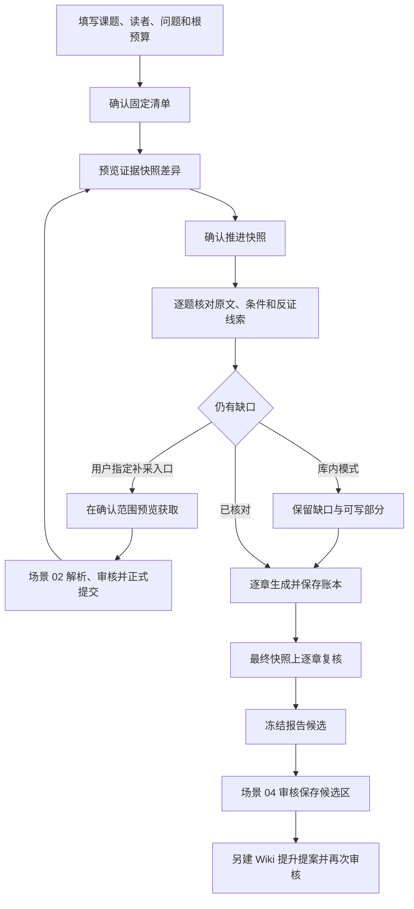
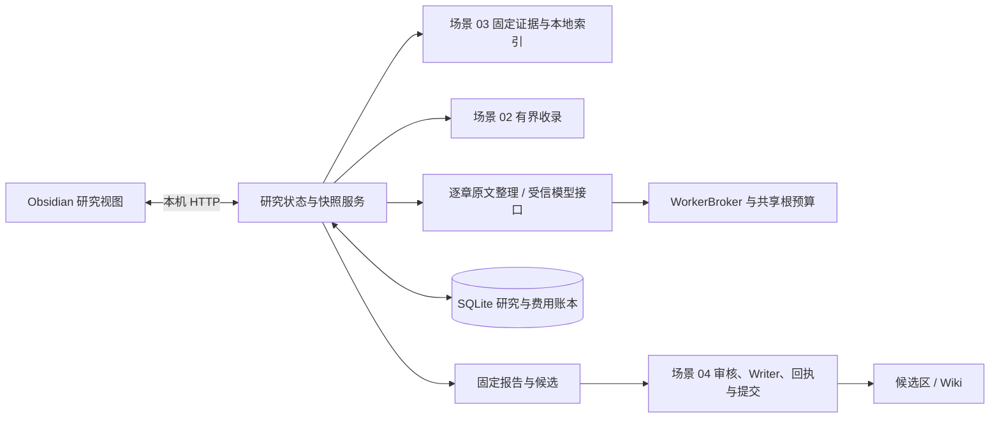

# 场景 05：课题研究与报告接手说明

最后核对：2026-09-22。设计见[场景 05 方案](../plans/2026-09-21-006-feat-topic-research-report-plan.md)，实际测试见[验收记录](topic-research-validation.md)。第一次运行工程，先读[开发者接手指南](../development/onboarding.md)。

## 1. 当前能完成什么

将一个课题拆成明确的问题，固定一份已正式收录的证据快照，逐章整理原文，输出带来源、版本、覆盖表、未解决项和费用摘要的报告候选。报告保存复用场景 04：先在账本登记候选，再由用户审核写入 `KB-Candidates`；提升到 `KB-Wiki` 需要新的提案和批准。

默认没有真实模型提供方。当前章节保留完整原文，不生成自由改写的综合论述；来源中的否定、数值、单位与适用条件不会因写作而被删掉。受信模型接口可以选择和组织原文，但目前同样只接受完整引用的主张。机械校验通过不等于问题已经获得充分回答；真实模型效果、跨章节语义审阅和人工质量门槛尚未验收，RSH3 保持未完成。

补采当前是用户为具体缺口指定入口，复用现有收录器在确认域名、路径、页数内发现和获取。没有自动搜索引擎或无限循环研究 Agent。只使用库内资料时，研究模块不发网络请求。

## 2. 跑通第一份报告

前置条件：更新服务和插件，重新配对并登记主端；至少有一份正式收录的资料。以下操作在设置页“08 / 课题研究与报告”完成。

1. 填写“研究课题”“目标读者”，选择报告类型和时间意图。“建议问题草案”给出可编辑的问题，每行一个；实际问题越具体，检索范围越容易核对。
2. 填写版本、分发和运行阶段。一般概览可以留空版本；具体项目需要版本及已收录的锁文件或配置 Evidence ID（固定原文编号）。来源范围需要先确认 `sourceType` 为 `lockfile` 或 `configuration`，且版本匹配，不能仅凭课题中的一句版本说明通过。
3. 填写必要证据类型。例如普通文本默认是 `text`，网页是 `web`；如使用 `documentation`，需先在来源范围中作出该标注。未找到要求类型时保留缺口。界面将同一组要求用于每题；不同问题需要不同检索词、条件和类型时，可通过接口提交完整问题清单。
4. 选择“仅使用库内资料”。无模型时费用和调用上限都填 0，材料上限默认 10。点击“预览课题清单”，补齐待填项，核对问题和根预算后勾选确认。修改表单会使原确认控件失效。
5. 点击“准备研究快照差异”，检查新增、移除的证据编号、原文和受影响问题，再勾选“确认推进研究快照”。只预览不会切换当前快照。
6. 每题会显示原文、适用条件、历史资格和缺口。点击“生成本章候选”，结果只保存在应用账本。可以先生成一部分，未完成的问题会在报告中列出。
7. 人工核对后可保存覆盖判断。标为“足够支持”必须提供支持证据、核对反证、满足必要证据类型及课题和问题范围。默认不会根据命中数量自动给出这个状态。
8. 点击“冻结报告候选”，核对正文与全文检查结果；点击“送入待审核候选”。到“07 / Wiki 候选与审核”读取候选、审核保存。保存的是完整报告，不会被压成单页 Wiki 模板。

报告默认是可核对的资料整理稿。不要把“未完成章节”“待核验条件”删掉后当作已验证结论。取消后可重新读取既有研究、章节、费用和报告，也可以冻结部分报告；取消的根研究不再执行新章节或补采。需要改写范围或扩大额度时重新确认一份研究清单，旧记录保留。

## 3. 历史时点怎样判断

历史研究必须填带时区的截止时间，例如 `2025-01-01T00:00:00Z`。公开时间取已确认的来源公开日期及其核对依据，不使用抓取时间、页面中的随意日期或软件版本号代替。

| 显示资格 | 含义 | 能否进入“当时已知”的章节主张 |
|---|---|---|
| `eligible` | 截止时已经公开，且保存了公开时间核对依据 | 可以作为待核对原文 |
| `later-explanation` | 截止之后公开的解释或指南 | 不可以；只列入资料及资格清单 |
| `publication-unknown` | 公开日期或核对依据缺失 | 不可以；保留待核验 |

非历史模式的 `eligible` 仅表示不受历史日期排除，仍需核对版本、分发、阶段与问题相关性。查询分发范围为普通包时，不会纳入明确标为预览包的原文；条件未知的资料可以作为线索，但不能据此确认充分覆盖。

## 4. 快照、补采与更新

“补充缺口”模式需要在最初课题清单中明确允许域名和路径。进入具体问题后填写入口 URL，点击“预览单页补采范围”。当前界面每次一页；接口可发起最多十页的有界集合预览。到“05 / 资料收录”点击“查看历史批次”，选择该入口，继续解析和正式导入。取得 HTML、搜索摘要或解析完成都不表示研究证据已增加。

只有来源和解析都正式提交后，它们才可能出现在新快照里。新快照要再次确认；旧章节及旧报告不会修改。受影响章节需要重新生成或保留为未完成；未受影响的上一快照章节可在最终快照上重新检查后复用，不再次调用模型。复用保留原章节身份，并在报告中标出最终检查快照。

材料按来源身份计数，库内证据和补采名额使用同一研究上限。准备快照时就计入新来源的名额，确认推进只决定哪份快照成为当前版本；放弃草案不会退还名额。补采前按申请页数预留；正式提交的补采来源被研究接纳时，预留转为已用名额。失败、未完成或没用到的预留不会自动返还。重复同一操作编号不再次预留或抓取；未知结果需先核对历史批次，不能靠反复点击绕过上限。

目前一次研究最多 10 题／10 章、30 个来源身份、3 次补采发现和 30 次模型尝试。每题最多 8 条完整原文，每块最多 4000 字符；最多扫描 3000 个检索候选，达到限制会显示缺口。快照最多 1 MB，报告最多 128 KB，超限拒绝而不是截断正文。同一来源家族的相同文本及条件去重；同一家族的不同原文块仍能保留，但不会冒充多个独立来源。

## 5. 代码与数据怎样协作

| 文件入口 | 负责什么 |
|---|---|
| [research.ts](../../packages/contracts/src/research.ts) | 课题、问题、快照、章节和报告合同 |
| [brief.ts](../../apps/service/src/research/brief.ts) | 草案缺项、固定清单、根作业、材料限额与取消 |
| [coverage.ts](../../apps/service/src/research/coverage.ts) | 历史资格、覆盖表与人工判断校验 |
| [snapshots.ts](../../apps/service/src/research/snapshots.ts) | 同一索引代取证、固定完整原文、差异和明确推进 |
| [acquisition.ts](../../apps/service/src/research/acquisition.ts) | 缺口、域名／路径检查、累计预留及收录预览 |
| [chapters.ts](../../apps/service/src/research/chapters.ts) | 章节证据包、受信提供方、同根预算与取消 |
| [report-check.ts](../../apps/service/src/research/report-check.ts) | 最终引用复核、旧章复用、跨章待核验项 |
| [artifacts.ts](../../apps/service/src/research/artifacts.ts) | 不可变报告版本、幂等冻结与候选登记 |
| [routes.ts](../../apps/service/src/research/routes.ts) | HTTP 接口与主端权限 |
| [research.ts](../../apps/obsidian-plugin/src/views/research.ts) | 研究表单、明确确认、覆盖判断与报告预览 |

新表为 `research_jobs`、`research_snapshots`、`research_assessments`、`research_chapters`、`research_attempts`、`research_reports`。根预算和实际费用继续保存在 `roots`、`jobs`、`calls`；补采预留身份保存到 `kv`。`research-budget` 作业完成代表预算容器已经建立，不代表整篇研究结束；研究状态和章节应从研究接口读取。

schema 4 升到 5 前生成权限为 0600 的 `state.db.before-v5-<id>`，然后事务建表。已知更早版本顺序升级；未知结构保持只读。旧服务不能写 schema 5。备份恢复仍按[接手指南](../development/onboarding.md#5-数据放在哪里哪些可以重建)处理，不用升级前备份覆盖升级后产生的研究、来源和费用。

## 6. 接口与模型接入

读取允许已配对的 admin/user/reader。修改操作需要 admin/user、当前主端、有效心跳和 `x-policy-version`。所有正文读取都核对当前来源权限和原文；撤回后不能用已知报告、候选或研究 ID 绕过门禁。界面每 5 秒复核正在显示的研究与报告，变化后清空正文；已导出的笔记无法远程收回。

| 接口 | 输入或结果 |
|---|---|
| `GET /v1/research/options` | 实际安装的模型路线与当前边界 |
| `POST /v1/research/draft` | 部分课题字段，返回待填项；完整时返回固定摘要 |
| `POST /v1/research` | `operationId`、完整 `brief`、草案 `digest` |
| `GET /v1/research` | 最近可读取的 100 项研究 |
| `GET /v1/research/:id` | 当前快照、覆盖、章节、费用及最近 50 份报告 |
| `POST /v1/research/:id/snapshots` | 准备差异，暂不切换 |
| `POST /v1/research/:id/advance` | `snapshotId`、所见 `digest` |
| `POST /v1/research/:id/coverage/:questionId` | 当前 `snapshotId` 与 `assessment` |
| `POST /v1/research/:id/chapters/:questionId` | `operationId`、当前 `snapshotId`、可选受信 `routeId` |
| `POST /v1/research/:id/acquisition` | `operationId`、`questionId`、`entry`、`maxPages` |
| `POST /v1/research/:id/cancel` | 停止后续步骤，保留章节与费用 |
| `POST /v1/research/:id/reports` | 冻结当前可用章节及缺口；同内容同费用复用同一版本 |
| `GET /v1/research-reports/:id` | 固定报告版本，重新核对权限 |
| `POST /v1/research-reports/:id/candidate` | 登记待审核候选，不写文件 |

`assessment` 包含 `state`、`supportingIds`、`opposingIds`、`counterChecked` 与 `note`。状态为 `partial`、`supported`、`conflict`、`unanswerable`；未检索时另显示 `unsearched`。冲突必须指明双方证据；人工判断只针对当前快照，不自动沿用到新快照。

模型入口是 `createServer` 第六个参数 `researchProviders`，类型为 `ReadonlyMap<string, ResearchProvider>`。提供方由受信服务代码安装，不能通过笔记、请求体或路由配置加载任意脚本或 URL。当前 CLI 不安装真实提供方；仅填写价格配置不会启用模型。

每章模型调用通过 `WorkerBroker` 预占根、日、月额度，再取得真实费用回执。根调用次数计尝试次数，授权或预算拒绝的尝试也可能占用该上限；费用以 `calls` 的实际结算及未结预占为准。取消会中止后续处理，迟到的真实费用仍结算，取消后的输出不写章节。重启保留根预算；相同操作不会透明重发未知费用的请求。默认不自动结构修复或递归改写。

## 7. 常见问题与恢复

| 现象 | 检查与处理 |
|---|---|
| 草案不能确认 | 按待填项补读者、问题、范围、时间与限额；历史模式填 cutoff，项目模式核对版本依据 |
| 命中了材料，仍显示部分覆盖 | 检查必要证据类型、未知条件、来源家族与反证；只有人工明确判断后才可能显示足够支持 |
| 新资料未出现在报告 | 核对来源已正式提交，准备新快照并确认推进，再生成受影响章节 |
| `BASELINE` | 原文范围、权限或当前快照变化；重新取证和审核，不把旧批准强行复用 |
| `BUDGET` / `LIMIT` | 根费用、调用、材料、章节或正文达到上限；保留部分报告，不自动创建新根绕开限制 |
| `CALL_ALREADY_SENT` / `UNKNOWN_COST` | 检查调用账本与提供方回执或已有收录批次；不自动换操作编号重发 |
| `UNSUPPORTED_CLAIM` | 提供方删改了完整原文或条件；该章未保存。核对适配器输出，必要时使用原文整理 |
| 取消、关闭插件或进程退出 | 重新配对后“读取研究记录”；已提交的章节与费用仍在。未知调用需先核对；取消的研究可读及冻结部分报告 |
| 报告送入候选后没看到文件 | 还需到 07 审核并批准；登记候选不是 Writer 提交 |

库内检索采用词法匹配，反证查询结果只是线索，不能自动认定“没有反证”。跨章节逻辑、数值因果和未运行实验的识别仍需人工阅读；正文明确区分来源陈述与本系统实际执行。完整语义验收、自动搜索发现和提供方真实费用验收是后续门槛。
