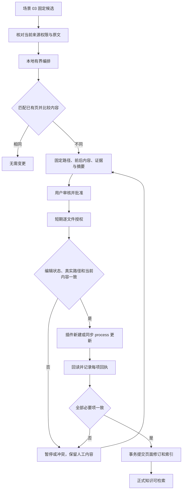
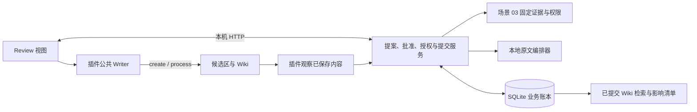

# 场景 04：候选审核、Wiki 写入与恢复

最后核对：2026-09-22。首次接手先读[开发者接手指南](../development/onboarding.md)，本场景设计见[场景 04 方案](../plans/2026-09-21-005-feat-wiki-review-commit-plan.md)。

## 1. 当前可以做什么

将场景 03 保存的固定回答候选，经过两次独立审核，先写入 `KB-Candidates`，再提升到 `KB-Wiki`。第二次审核生成新的提案；第一次批准不能直接拿来写正式知识。更新 Wiki 前展示完整的修改前后内容、路径、哈希、主张、条件、缺口和原文证据。

本轮采用本地原文编排：将已有主张和引用组织成页面，不调用模型，也不执行资料中的指令。真实模型提取、生成与费用验收尚未开启。支持概念、系统、比较和决定四种页型；决定页必须填写用户本人确认的决定，模型建议不能自行成为用户决定。

同类型、规范化后同标题的 Wiki 优先更新原页；不是语义自动合并。相同内容返回“无需变更”。每个提案最多生成一页、20 条主张、128 KB 正文，超出的主张列入待处理，不截断单条原文。候选区文件为不可变投影，不自动覆盖后来的人工作业。

## 2. 完成一次保存与提升

前置条件：已按 README 构建并更新服务与插件；使用独立试点 Vault；已配对、登记当前主端，至少有一份已正式收录资料。

1. 在“06 / 证据检索与问答”搜索，整理本次原文证据，再点击“保存为待审核候选”。此时只在应用账本保存固定对象，尚未写笔记。
2. 进入“07 / Wiki 候选与审核”，填写“Wiki 页面标题”和页型，点击“读取待审核候选”。
3. 对选定记录点击“审核保存到候选区”。核对完整内容与引用，勾选“确认本次固定变更”，点击“批准并应用本次变更”。成功时显示“候选区提交完成”。
4. 对同一个候选点击“审核提升为 Wiki”。再次核对这份新提案并批准。成功时显示“业务提交完成，正式 Wiki 索引就绪”。
5. 在“搜索正式 Wiki”填写词语，点击“检索已提交 Wiki”。只返回业务已提交的不可变版本；候选和部分写入的文件不参与检索。

标题用于匹配页面，文件名使用稳定 ID；不要直接改受管文件路径来表示重命名。更新已有页面时会先扫描人工修改，以实际观察内容作为审核基线。若页面正在编辑，先保存、核对并关闭编辑页；Writer 不会代替你处理未保存输入。

已提交的页面更新可点击“生成反向提案（重新审核）”，将当前内容与原更新前的完整字节重新展示。批准前不执行恢复，不删除旧审计；首次新建没有自动删除动作。

拒绝提案时填写原因，再点击“拒绝本次提案”。拒绝保留审计记录，已应用的部分文件也不会被静默删掉。需要继续时创建新提案，重新核对当前内容。

## 3. 从候选到正式知识

服务不直接写正式 Vault。所有内容先固定在账本，再由已配对的主端插件落盘。SQLite 事务负责业务提交，不把跨文件写入伪装成文件系统事务。

## 4. 批准与故障恢复

提案摘要包含路径、前后哈希与完整内容、页面和来源修订、证据、候选对象哈希、政策版本及主端代次。批准绑定会话、摘要和 10 分钟有效期。逐文件授权最多 15 秒，另受会话和批准有效期限制；重新批准会生成新批准编号，旧授权失效。

Writer 只接受 `KB-Sources`、`KB-Candidates`、`KB-Wiki` 下的固定 ID 文件。人工目录、任务目录、嵌套路径、符号链接及硬链接均不能借此写入。来源文件仍只能新建。Wiki 更新使用 `Vault.process`，在同步回调内重查编辑状态、路径、授权期限和当前文本哈希。

| 现象 | 当前行为 | 恢复方式 |
|---|---|---|
| 文件正在任一编辑叶打开 | 暂停，不改编辑缓冲 | 保存并关闭，再生成或读取审核记录 |
| 已写文件但回执丢失 | 若当前内容等于 afterHash，识别为已应用，不再修改 | 读取提案与恢复记录，核对后重新批准 |
| 内容等于原 beforeHash | 有效授权下可重试该项 | 使用当前会话重新领取授权 |
| 出现第三个哈希或同名新建冲突 | 保留人工内容，拒绝写入 | 扫描人工修改，核对新提案；不自动覆盖或删除 |
| 批准过期或会话更换 | 保留已应用文件与回执 | 在新会话中重新审核批准 |
| 政策、主端或来源依据变化 | 原提案不能继续写入 | 刷新连接并创建新提案；来源被撤回时先处理来源权限 |
| 所有文件落盘但最后响应丢失 | 正式提交幂等，保留同一操作身份 | 重新读取原提案确认 committed |

“提交未完成”可能意味着磁盘上已有部分文件。正式检索仍读取最后完整提交的页面修订。最终检查后，其他程序仍可能修改文件；后续观察记录这种变化，不承诺永久锁住文件。

## 5. 人工修改、撤回与影响

插件每 15 秒扫描已登记页面，也可点击“扫描人工修改与影响”。打开的编辑页暂不作为稳定观察；关闭后记录完整已保存内容及新观察 ID，不覆盖旧页面修订。提交新修订后，上一修订的观察保留为历史，不继续充当当前基线。观察内容尚未验证；重新生成提案会展示它与候选的差异。

影响报告按每批最多 100 页返回，`nextOffset` 表示下一批。报告记录人工修改、无来源、来源不可读，以及同一来源出现新修订的提醒。新版出现只要求检查范围，不自动替代旧结论；更远关系由人工复审，不递归重写整个库。

候选、提案、已知页面修订 ID 和正式检索均重新检查来源权限；撤回不依赖影响扫描完成。界面已显示的提案及 Wiki 检索结果每 5 秒复核，失效后清空。已经写入 Vault 或被复制的内容无法靠服务端权限远程收回；受管文件也不能再作为来源反向摄取。

## 6. 代码与接口

| 入口 | 负责什么 |
|---|---|
| [wiki.ts](../../packages/contracts/src/wiki.ts) | 页面、提案与输入合同 |
| [proposals.ts](../../apps/service/src/review/proposals.ts) | 固定摘要、匹配已有页、基线与重试 |
| [approval.ts](../../apps/service/src/review/approval.ts) | 批准、拒绝、有效期与审计 |
| [writer-session.ts](../../apps/service/src/review/writer-session.ts) | 逐文件短期授权、授权复核、回执 |
| [commit.ts](../../apps/service/src/review/commit.ts) | 全部回读后发布不可变版本与索引 |
| [apply.ts](../../apps/obsidian-plugin/src/writer/apply.ts)、[guard.ts](../../apps/obsidian-plugin/src/writer/guard.ts) | 三个受管目录的公共 Writer、同步内容保护 |
| [bounded-compiler.ts](../../apps/service/src/wiki/bounded-compiler.ts) | 有界原文页面编排，资料始终作为文本 |
| [observations.ts](../../apps/service/src/wiki/observations.ts)、[impact.ts](../../apps/service/src/wiki/impact.ts) | 人工观察、读取门禁、正式检索及影响清单 |
| [review.ts](../../apps/obsidian-plugin/src/views/review.ts) | 审核界面与人工观察客户端 |
| [004-changesets.ts](../../apps/service/src/storage/migrations/004-changesets.ts) | schema 4 新表 |

接口延续配对 Bearer、本机 Host/Origin 检查。读取允许 admin/user/reader；提案、批准、写入及观察需 admin/user、当前主端、有效心跳和 `x-policy-version`。不向模型或外部 Agent 分发插件会话令牌，资料文字没有批准入口。

| 接口 | 用途 |
|---|---|
| `GET /v1/wiki/compiler` | 当前编排路线、上限和 SDK 禁用原因 |
| `GET /v1/wiki/candidates` | 最近可读取的固定候选 |
| `POST /v1/wiki/changes` | `operationId`、`candidateId`、`destination`、`title`、`kind`；决定页另需 `confirmedDecision` |
| `GET /v1/wiki/changes`、`GET /v1/wiki/changes/:id` | 提案列表、完整差异和恢复状态 |
| `POST /v1/wiki/changes/:id/approve` | 绑定所见 `digest` 批准 |
| `POST /v1/wiki/changes/:id/reject` | `digest` 与拒绝 `reason` |
| `POST /v1/wiki/changes/:id/grant` | 领取指定 `sequence` 的短期授权 |
| `POST /v1/wiki/changes/:id/validate` | 写前复核授权 `token` |
| `POST /v1/wiki/changes/:id/receipt` | 回读后的 `token` 与 `afterHash` |
| `POST /v1/wiki/changes/:id/finish` | 所有逐项回读的 `hashes`，完整后业务提交 |
| `POST /v1/wiki/changes/:id/reverse` | `operationId`；为已完成更新生成新的反向提案 |
| `GET /v1/wiki/pages`、`GET /v1/wiki/pages/:id` | 当前页面或固定页面修订；后一个 ID 是修订 ID |
| `POST /v1/wiki/search` | `query`；仅检索已提交页 |
| `POST /v1/wiki/observations` | `pageId` 与完整已保存 `content`；删除时为 null |
| `GET /v1/wiki/impact?offset=0` | 分批影响报告 |

列表当前最多 100 个候选或提案、1000 个正式页；观察正文最多 128,000 个字符。超过试点规模需先扩展分页和观察能力，不能把“没有扫描到”当作没有变化。

## 7. 数据升级与恢复

schema 3 升级前生成 `state.db.before-v4-<id>`，权限为 0600，再事务创建 Wiki 表。已知 schema 1/2 按既有迁移顺序升级；未知结构只读。新建应用数据直接初始化到 4。

`wiki_changes`、`wiki_approvals`、`wiki_grants`、`wiki_receipts`、`wiki_pages`、`wiki_revisions`、`wiki_edges`、`wiki_observations` 与 `wiki_impacts` 保存业务事实。`wiki_fts` 是与正式版本同时更新的查询索引。不要通过清库、删回执或修改状态字段修复冲突。

回退前停止服务与试点，保留完整应用数据和当前 Vault。旧程序不识别 schema 4；迁移前快照只能在独立副本中核对，不覆盖迁移后产生的新页面与审计。具体检查与本次真实验证见[验收记录](wiki-review-validation.md)。

## 8. 编译器选择与未完成门槛

2026-09-22 核对上游提交 `946451a3995e4a384a010acdbc5da3226c1df328` 的 [SDK 入口](https://github.com/atomicstrata/llm-wiki-compiler/blob/946451a3995e4a384a010acdbc5da3226c1df328/src/sdk/core.ts)和[类型合同](https://github.com/atomicstrata/llm-wiki-compiler/blob/946451a3995e4a384a010acdbc5da3226c1df328/src/sdk/core-types.ts)。普通 `compile` 经提供方检查后直接进入内部编译；实验性 preparation 的 providerInvocation 不是本仓库预算网关的现成适配。

因此本轮没有安装或运行第三方 SDK，没有给它真实密钥，也不声称已经完成其隔离验收。原生路线只编排场景 03 的固定主张；真实模型“一次提取、一次生成、最多一次结构修复”的路线仍待接入和真实费用核对。W4 的完整模型验收未完成，计划保持 active。当前可交付的是本地候选审核、受控写入与恢复链路。
