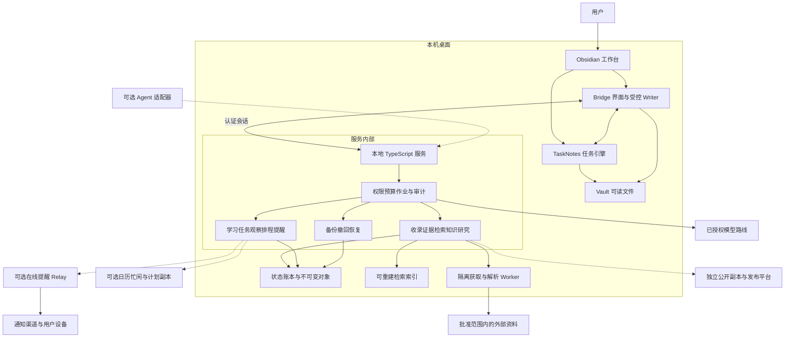
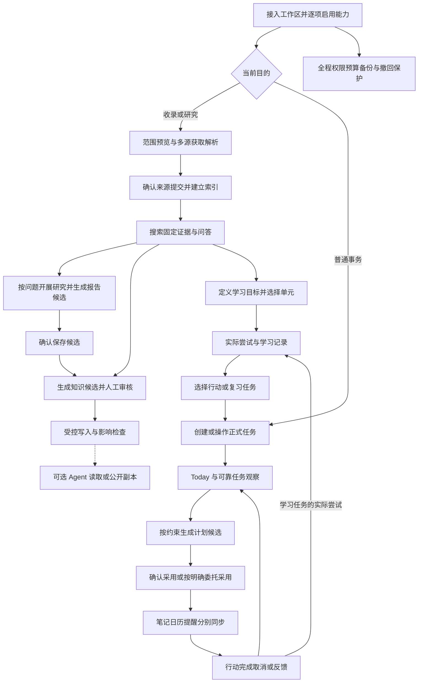
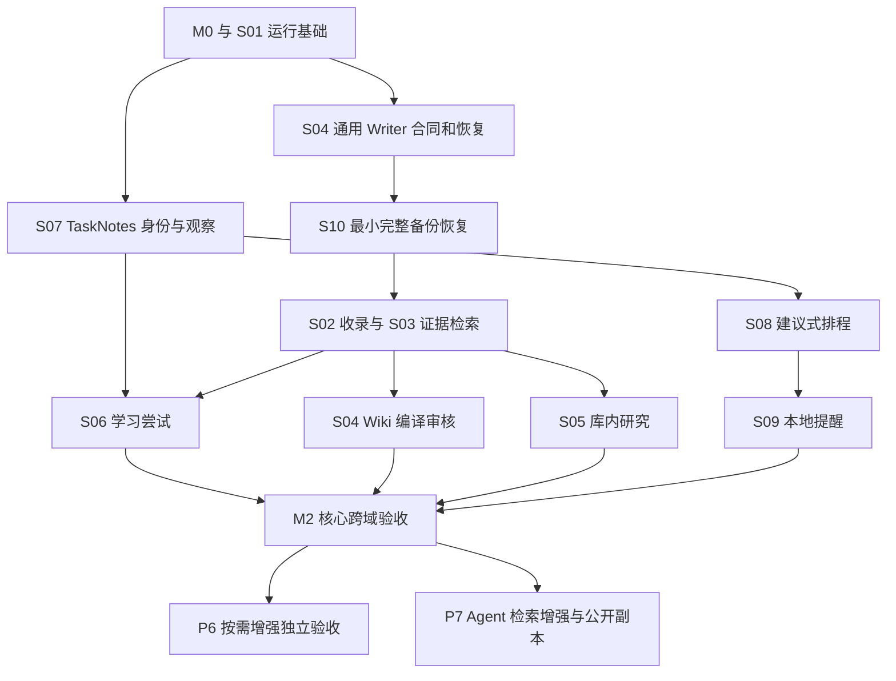

# Obsidian 知识与任务中心总体技术方案

本方案以 [完整 PRD](../brainstorms/2026-09-21-obsidian-knowledge-and-task-center-requirements.md) 为需求基线，将 94 项需求拆为 12 个业务场景。每个子方案分别记录调研、选择、数据与流程、异常恢复、实施文件和验收；本文负责串起架构、跨场景合同和交付顺序。

主线是 **Obsidian ＋ TaskNotes ＋ 薄 Bridge 插件 ＋ 一个本地 TypeScript 服务**。资料可追溯，知识变更先审核，任务事实来自 TaskNotes，精确计划由本地账本管理，提醒有明确执行端。12 份子方案是业务分工，不代表 12 个微服务。

当前仓库只有资料与设计参考，没有已运行的插件或服务。本文是可实施的技术设计，所有性能、兼容、恢复和手机通知结果仍待实施验证。下文文件路径为拟新增的工程落点；本次不修改原始资料、不编写应用代码。

## 1. 阅读导航与场景划分

先读本页第 2—5 节理解总体边界，再按工作场景进入子方案。开发排序见第 7 节，逐条需求映射见附录。

| 场景 | 子方案 | 独立交付的结果 | 主责需求 |
|---|---|---|---|
| S01 | [工作区接入与运行治理](2026-09-21-002-feat-workspace-runtime-governance-plan.md) | 可信设置、权限、预算、作业和运行状态 | R001—R003、R081—R087、R091 |
| S02 | [多来源资料收录](2026-09-21-003-feat-multi-source-ingestion-plan.md) | 固定原件、来源修订、覆盖与提交清单 | R005—R021 |
| S03 | [证据、检索与问答](2026-09-21-004-feat-evidence-search-answer-plan.md) | 无模型检索、固定证据、保留条件的回答 | R022—R031、R093 |
| S04 | [知识提案、审核与受控写入](2026-09-21-005-feat-wiki-review-commit-plan.md) | 有依据的 diff、固定批准和可恢复提交 | R032—R038 |
| S05 | [课题研究与报告生成](2026-09-21-006-feat-topic-research-report-plan.md) | 问题覆盖、分节报告、来源与费用记录 | R039—R044 |
| S06 | [学习目标、实际尝试与复习](2026-09-21-007-feat-learning-practice-review-plan.md) | 可继续的学习活动和容量受控的复习建议 | R045—R050 |
| S07 | [任务生命周期、Today 与离线核对](2026-09-21-008-feat-task-today-reconciliation-plan.md) | 同一任务事实、稳定身份、行动视图和进度 | R051—R062、R070—R072、R074 |
| S08 | [约束排程、计划采用与日历投影](2026-09-21-009-feat-scheduling-calendar-sync-plan.md) | 可解释的候选、正式计划与独立投影 | R063—R069、R073 |
| S09 | [提醒登记、投递与取消](2026-09-21-010-feat-reminder-delivery-control-plan.md) | 本地提醒与可选在线提醒的完整账本 | R075—R080 |
| S10 | [撤回、备份恢复与退出](2026-09-21-011-feat-backup-retraction-recovery-plan.md) | 停止使用、完整备份、恢复与可读导出 | R004、R088—R090 |
| S11 | [外部 Agent 受限接入](2026-09-21-012-feat-external-agent-access-plan.md) | 最小权限的搜索、证据和问答工具 | R092 |
| S12 | [公开副本导出与发布](2026-09-21-013-feat-public-copy-publishing-plan.md) | 经单独批准的独立公开副本 | R094 |

S01 和 S10 是所有业务的运行基础。S11、S12 以及 S03 的检索增强属于 P7 可选能力；S09 的在线 relay、S08 的自动委托等按 P6 分别启用，不捆绑上线。

## 2. 设计依据与已经做出的取舍

### 2.1 资料优先级

需求与成功标准以本次 PRD 为准；实现细节沿用不冲突的 [v2.1 基线](../01-当前设计基线/Obsidian-KB-v2.1-Audit-and-Task-Planning-2026-09-21.md)、[v1 技术方案](../90-历史版本/v1/Obsidian-KB-Technical-Spec-2026-09-20.md)、[多源收录专题](../03-资料收录与课题研究/Obsidian-KB-Multi-Source-Ingestion-2026-09-20.md)、[研究专题](../03-资料收录与课题研究/Obsidian-KB-Ingestion-Relations-and-Research-2026-09-20.md) 和 [学习专题](../04-自动收录与学习编排/AI-SDK-整站收录与学习编排.md)。旧 TS／SQL 是设计样例，旧工时和“只做 MD/TXT”的范围不再适用。

仓库没有业务实现和 `docs/solutions/`，没有真实运行经验可以冒充已验证模式。各子方案的官方调研均注明 2026-09-21 核查与未取得正文的情况；公开文档说明能力方向，目标安装版本仍需契约测试。历史交付清单不包含本套新增文档，本轮不重写原清单及其既有哈希差异。

### 2.2 关键决定

| 决定 | 原因 | 暂不采用的路线 |
|---|---|---|
| 一个本地模块化服务，重解析用隔离 worker | 单用户规模，便于统一权限、费用与恢复 | 每业务一个服务、分布式消息平台 |
| 复用 Obsidian 编辑与 TaskNotes 任务能力 | 已有工作台与任务视图，减少重复建设 | 自建完整笔记编辑器、同时启用多个循环引擎 |
| 状态账本、不可变对象、可重建索引分离 | 笔记可读、证据固定、索引故障可恢复 | 只备份 Vault、把全部账本当缓存 |
| 关键词和精确符号检索先行 | 无密钥可用；先积累真实失败题 | 首期同时部署向量、重排和图数据库 |
| 模型输出均是待校验的建议或候选 | 条件、出处、费用和批准必须可检查 | 通用自主 Agent 直接改库、改任务或执行脚本 |
| PlanRevision 是已接受排期的事实 | 避免将多段排期塞入单个任务字段 | 任务／文件／日历三方无条件双向同步 |
| 提醒只有一个发送负责人 | 改期、取消、迟到与重试需要统一账本 | 本地和远端同时发送，依赖手机自行去重 |
| 先做试点与兼容验证，自动化默认关闭 | PRD 未给生产参数，接口存在待验证点 | 沿用历史示例值直接替用户启用 |

首轮 macOS 桌面单用户、单自动主端；其他平台逐项验收。Node.js 24 LTS 为服务候选线，TypeScript strict、pnpm workspace、Fastify、运行时 schema 与 better-sqlite3 沿用旧设计。精确补丁、依赖、许可证和原生构建在 M0 固定。实际 SQLite 必须包含官方 WAL-reset 修复，依据见 S01；不以 npm 驱动包版本代替内核核验。

## 3. 总体架构图

> 图示用于评审组件关系和信任边界，属于设计方向，不是可复制的实现规范。业务模块共用服务进程；虚线是单独启用的扩展。

图中的“服务写 Vault”只通过 Bridge 发起受控操作。TaskNotes 文件由其 adapter／用户操作管理，知识来源和计划投影由 Bridge Writer 管理。模型、解析 worker、外部 Agent 和 relay 均不获得 Vault 写权限。

### 数据责任表

| 数据 | 事实源 | 可写责任与副本 |
|---|---|---|
| 人工笔记 | Vault 当前人工内容 | 用户编辑；自动流程默认只读 |
| 来源和解析 | state.db 中已提交修订＋哈希对象 | 收录服务登记；Vault 来源页是受控展示与入口 |
| 正式知识 | 已提交页面修订、主张证据与 Vault 受管页面 | Bridge 应用已批准变更；人工变化保留并新增观察修订 |
| 任务和计时 | TaskNotes 记录及其服务行为 | TaskNotes 写；本系统只存观察修订与关联，不建第二个任意可写主库 |
| 学习尝试 | state.db 的版本化活动记录 | 学习服务保存人的输入；Vault 可读视图用于导出 |
| 已接受计划 | state.db 的 PlanRevision | 采用事务写；Today 读取；Markdown／日历是可延迟副本 |
| 提醒 | 每个逻辑键唯一执行端的持久账本 | 本地服务或 relay；服务保留期望状态和远端回执 |
| 索引 | index.db | 由提交事件重建，不持有唯一业务事实 |
| 密钥 | 操作系统凭据存储／远端受保护凭据存储 | 可信设置写入；Vault、模型和默认日志不保存 |

服务应用数据目录与 Vault 分开；活动 SQLite 不进入 Obsidian Sync、网盘同步或网络共享盘。不可变对象在物理删除前检查引用；所有可读导出都能追溯到固定对象清单。

## 4. 整体业务流程图

> 下图展示完整业务路径与独立入口，属于方向性设计。普通事务可直接进入任务链，不要求经过研究或学习。

模型不可用时，收录基础解析、搜索、手工任务、Today、已接受计划和确定性进度继续工作。某份来源只解析部分也可以检索，但回答须带覆盖限制。计划排不下时保留未排项；提醒取消未确认时显示待同步。

## 5. 跨场景合同与一致性

### 5.1 必须稳定的身份

内部 ID 用不含用户正文的随机身份。来源、来源修订、解析、证据、主张、页面修订、任务、循环实例、学习尝试、计划和提醒各有独立身份，不用标题或当前路径统一代替。

`operationKey` 表示同一次用户／系统操作；`payloadDigest` 防止同键改载荷；`revision` 表示事实变化；`generation` 表示同一提醒的配置变化；`deliveryKey` 表示一次发送资格。它们解决的问题不同，不能合成一个时间戳字段。

### 5.2 跨模块事件

状态变更与 outbox 在同一业务事务中提交，消费者按事件 ID 和业务修订去重。事件只传必要 ID、版本、原因和相关 ID，不搬运正文。外部副作用结果另记回执，不跨 SQLite、文件和第三方 API 宣称分布式事务。

| 事实或事件 | 产生方 | 消费者与失效动作 |
|---|---|---|
| SourceCommitted／SourceUpdated | S02 | S03 建索引；S04 标记直接知识影响；S05／S06 标记需核对 |
| SourceRetracted | S10 | 所有读取即时门禁；S04—S06 影响清单；S09 取消摘要；S12 下架清单 |
| ChangeSetCommitted | S04 | S03 发布新索引代；UI 分别展示提交与索引状态 |
| TaskObserved／TaskDeleted | S07 | S08 使候选失效；完成／取消／删除使未开始块停止并产生 S09 取消意图 |
| LearningAttemptRecorded | S06 | 刷新能力证据；只建议复习，不直接完成任务或认定掌握 |
| PlanAccepted | S08 | S07 Today 立即读取；文件、日历、提醒分别推进至目标版本 |
| ReminderReceipt | S09 | 更新发送／取消状态；不倒推任务已经完成或用户已阅读 |
| PolicyChanged／RestoreStarted | S01／S10 | 旧授权复核；暂停相关 Writer、收费和发送，保留未完成记录 |

### 5.3 三种提交，不共享一个“成功”

| 提交类型 | 本地生效条件 | 尚未完成的事情 |
|---|---|---|
| 来源／Wiki 文件提交 | 所有必要文件回读符合批准清单，状态账本推进快照 | 索引可能尚未就绪；人工后续修改需重新观察 |
| 计划采用 | 当前基线比较通过，PlanRevision 与投影意图一次事务写入 | 文件、日历、提醒可能各自待同步 |
| 提醒投递 | 执行端登记与渠道回执分别记录 | 渠道接受不等于设备送达，取消不等于收回已发内容 |

外部状态会在检查后变化，因此采用前读最新事实、采用后持续核对。对于未知任务结果、重复身份、在途发送或失联旧主端，暂停相关自动化，不用自动重试掩盖不确定性。

任务完成、取消或删除不会改写历史 PlanRevision。S07 在同一观察事务中写入块的失效记录与取消意图，Today 和提醒执行器立即排除这些尚未开始的失效块；后续重排生成新的计划版本。这样即使排程 worker 暂停，旧未来安排也不会继续作为可执行计划发送提醒。重开任务不删除旧失效记录，必须重新核对并生成新的安排。

### 5.4 UI 与错误合同

Bridge 主入口按行动组织：Today、资料与搜索、研究、学习、审核、运行与维护。长作业页可退出再进入；每个入口复用 S01 的加载、空、部分、成功、错误和待处理状态。优先展示“发生什么、影响什么、下一步”，内部字段放详情。

窄侧栏按单列呈现，复杂 diff／时间线可打开独立宽视图；键盘可进入主要动作，焦点可恢复，图表旁保留文字状态。失去连接不清空表单，重复操作沿用幂等身份。普通完成操作保持直接，不增加 Wiki 审批。

错误至少区分：输入缺失、权限拒绝、预算不足、等待 Writer、结果未知、基线冲突、资料覆盖不足、外部不可用和版本不支持。取消、重试、重新核对与重新批准各有适用状态；前端不得把 retryable 标志等同于可以再次执行非幂等动作。

## 6. 拟建工程边界

所有路径相对仓库根目录，子方案给出文件级落点。领域模块先留在服务内，出现真实独立发布需求再拆包。

| 目录 | 责任 |
|---|---|
| `apps/service/src/` | workspace、security、runtime、storage、ingestion、evidence、search、answers、wiki、review、research、learning、tasks、planning、calendar、reminders、lifecycle、publishing |
| `apps/obsidian-plugin/src/` | 认证连接、TaskNotes adapter、Bridge Writer、Today／Review 等界面 |
| `apps/cli/src/` | 受认证的诊断与维护入口，不绕开权限和 Writer |
| `packages/contracts/src/` | 版本化边界对象、运行时 schema、错误与事件合同 |
| `apps/reminder-relay/src/` | P6 可选在线提醒账本与发送进程 |
| `apps/agent-gateway/src/` | P7 可选 stdio 协议适配 |
| `tests/` | 单元、真实 SQLite、Obsidian 契约、故障、安全、性能与真实语料评测 |

### 总体实施单元

子方案单元是业务开发清单，下列单元只负责工程与跨域整合，不重复实现业务逻辑。

- [ ] **M0：建立工程和兼容基线。** 覆盖 R001、R091；无前置。新增 `package.json`、`pnpm-workspace.yaml`、`tsconfig.base.json`、`apps/service/package.json`、`apps/obsidian-plugin/package.json`、`packages/contracts/package.json`、`docs/engineering/compatibility-matrix.md`。沿用旧方案工作区边界，固定实际依赖及构建目标；纯脚手架不另写镜像式单测。验证：各包边界明确，插件不打包服务端原生数据库，实际版本清单可追溯。TaskNotes／Writer 等行为验证在对应业务单元完成。

- [ ] **M1：共享事件与合同版本。** 覆盖 R070、R083、R086—R091；依赖 G1—G3。新增 `packages/contracts/src/events.ts`、`packages/contracts/src/errors.ts`、`apps/service/src/runtime/outbox.ts`；测试 `tests/integration/outbox-versioning.test.ts`。沿用短事务＋业务幂等模式，测试事件写后崩溃、重复消费、同键异载荷、旧协议和未知 schema；预期不丢意图、不重复事实、不宽松解析未知版本。验证：各场景只使用一套事件和错误语义。

- [ ] **M2：贯通关键业务验收。** 覆盖 PRD A01—A42；依赖所验阶段的子单元。新增 `tests/e2e/knowledge-to-action.test.ts`、`tests/e2e/recovery-and-cancellation.test.ts`、`tests/evaluation/real-corpus-manifest.json`、`docs/engineering/acceptance-record.md`。按 PRD 六条用户流程组织，重点测试知识审核中人工编辑、研究推进快照、学习续接、紧急任务插入、完成后远端取消、旧备份恢复。验证：逐项记录通过／失败／未启用，不用合成夹具冒充真实体验。

- [ ] **M3：运行与发布说明。** 覆盖 R004、R075、R088—R091；依赖各阶段门槛。新增 `docs/engineering/operator-guide.md`、`docs/engineering/backup-restore-runbook.md`、`docs/engineering/upgrade-guide.md`；测试 `tests/integration/upgrade-compatibility.test.ts`。测试旧数据副本迁移、未知新 schema、迁移中断与回退读取；预期只在完整备份上升级，旧应用不能写新 schema。验证：用户可接入、暂停、诊断、恢复与退出，所选提醒部署条件写明。

工程新增时每个功能单元以契约与故障样本先行，尤其 TaskNotes、Writer、预算和提醒。本文不提供实现代码或逐条执行命令，具体方法名与 SQL 由实施阶段在合同内确定。

## 7. 交付顺序与依赖

需求阶段沿用 PRD 的 P0—P7。资料线和任务线可以独立推进，S 编号是阅读顺序，不是开发顺序。

> 下图只表示主要前置关系，属于方向性设计；表格和子方案说明细化了同一场景内可以提前完成的单元。

| 阶段 | 本次实施范围 | 退出门槛 |
|---|---|---|
| P0 | M0、G1—G3、W1—W3 的基础协议、O2 的最小备份恢复；T1 与编译器适配做契约验证 | 试点库与真实样本就绪，权限和原件归属明确，未知能力关闭 |
| P1 | I1—I4、E1—E2、公共 UI；O1 基础撤回门禁从权限层开始接入 | 四种主要输入可追溯，无模型可搜，覆盖不足可见，恢复通过 |
| P2 | W4—W5、E3、知识检查、RSH1／3／4；O1 补全派生影响 | 引用和语义质量、人工保护、候选保存与预算通过；补采可关 |
| P3 | T1—T4 普通任务、Today、离线核对；不自动回写 scheduled | 完成、重开、改名、重复事件与删除核对通过；不依赖 P2 全部完成 |
| P4 | L1—L4、P1—P3 | 实际学习证据可继续；计划硬约束全部通过，未排任务明确 |
| P5 | N1—N2、N4 本地部分、O3 本地核对、M2—M3 | 核心场景、隐私、备份恢复和本地提醒通过 |
| P6 | 按选项实施复杂解析、RSH2 补采、P4 委托、P5 日历、N3 relay、远程 TaskCapture | 每项单独验证，不因另一项通过自动开放 |
| P7 | A1—A3、E4 增强部分、PUB1—PUB3 | 有实际需要且完成独立权限／效果／发布验收 |

S10 的完整清单随新账本持续扩展，不是 P5 才第一次备份。原文中一个单元跨基础与增强时，先交付默认关闭的合同和基础路径，再开放增强。迁移文件名的编号为当前规划序列；实施在实际提交时统一登记依赖并分配顺序，不把各子方案独立开发时的文件顺序当成可直接执行的迁移脚本。

第一次接入真实资料前，必须已能备份并恢复当前已有的全部账本。S04 的 W1—W3 只依赖基础治理，先完成 Writer 协议；S03 的 E1 先定义证据合同，E2 再依赖正式收录。S06 先完成目标与尝试，复习任务创建才依赖任务命令和容量。按这些子单元顺序落地，避免把整份子方案互相视为前置而形成循环。

不沿用旧版 96—150 小时估计。先完成 TaskNotes、Writer、四类解析、编译器预算和手机提醒这些兼容验证，再按通过结果估算对应单元；不用未经验证的总日期替代交付门槛。

## 8. 系统级验收

| 维度 | 目标与口径 | 负责场景 |
|---|---|---|
| 固定引用 | 固定样本 100% 可回读；原件／解析／位置与片段哈希一致 | S02—S03 |
| 召回 | 可回答题来源家族 Recall@10 ≥90%，冲突题含双方必要来源 | S03 |
| 语义支持 | 人工检查重要主张支持率 ≥95%，条件与否定不能漏 | S03—S05 |
| 不足识别 | 无答案题正确说明不足 ≥90%，同时报告可回答题正确率与过度拒答 | S03—S05 |
| 人工保护 | 定义并发和故障样本人工字节丢失 0 次 | S04、S07、S10 |
| 隐私 | 未授权读取与外发 0 次；所有入口含缓存和旧快照 | S01、S03、S10—S12 |
| 排程 | 所有已接受计划过独立硬约束验证；未排项不消失 | S08 |
| 恢复 | 所有定义中断点可恢复或明确冲突；旧提醒不复活 | S04、S09—S10 |
| 费用 | 每次收费调用有已知或未知用量；到限不发新调用 | S01、所有模型使用方 |
| 搜索性能 | 约 1 万文本块，热检索 p95 <500ms，记录硬件／字节／块数 | S03 |
| 在线交互 | 状态反馈 p95 <2 秒，轻量重排 p95 <5 秒；另测批处理负载 | S01、S07—S08 |

从 30 份真实资料和 20 个真实问题开始，包含网页、文档集合、代码、PDF 及异常样本。若采用 17 道可回答＋3 道无答案结构，3 道无答案必须全部正确说明不足才达到目标；之后扩为约 80 题用于升级比较。旧合成夹具可复用工程断言，不能替代真实效果评测。

产品效用另记录同题手工查找与产品查找耗时、导入／审核／冲突处理耗时，不虚构提升比例。真实 Obsidian、TaskNotes、SQLite、日历、模型账单和所选手机渠道都需验证。性能目标不包含长文模型生成或跨设备网络延迟。

## 9. 风险、处理与实施时验证

| 风险／未决项 | 本轮已确定的处理 | 实施负责人和失败路线 |
|---|---|---|
| TaskNotes 状态、ID、循环、事件与并发 | Runtime adapter 隔离；先观察，scheduled 自动回写关闭 | S07：锁版测契约；核心不满足先停对应能力，再评估替代，不双主写 |
| Obsidian 编辑缓冲与外部同步竞争 | 打开目标暂停，逐项哈希和回执，真实编辑验证 | S04：任何人工损失阻断写入；只读入口可保留 |
| 编译器隐藏调用与沙盒行为 | 所有调用必须进预算和出站网关；正式 Vault 不可达 | S04：不满足换有界原生适配器，不靠提示词补安全 |
| PDF／集合覆盖不足 | 明确缺口与位置，增强另授权 | S02：不支持区域保持部分，不猜内容 |
| 本地账本无法锁住外部事实 | 采用前刷新，采用后核对，未知停止自动化 | S07—S08：真实竞态验收；计划不声称全球事务 |
| 提醒超时、取消与发送并发 | 唯一负责人、代次、独立投递键、unknown 状态 | S09：不支持可靠回执就展示限制，未验收不承诺关机提醒 |
| 备份恢复到较旧事实 | 独立目录、保留现场，核对当前撤回、删除、授权、远端水位和未知费用 | S10：不能核对则部分能力保持暂停 |
| 模型和生产预算未指定 | 本地基本功能可用；收费路线默认关闭 | 用户启用时填写，S01 校验；不代填历史示例 |
| 额外扩展拖延核心版本 | P6／P7 按需逐项开启 | 总体集成负责人按阶段验收，不让可选组件成为核心依赖 |

本轮没有需要用户决定才能继续编写方案的产品阻塞项。目标 Vault、模型路线、价格与额度、日历集合、可用窗口、提醒时区／渠道、在线服务器及公开站点属于启用设置。缺项的行为已写明；它们没有被假定为现有授权。

## 10. 运行与维护交接

每次交付记录实际依赖与策略指纹、已验收能力、失败样本、备份／恢复结果及待启用项。数据库迁移先在备份副本执行，未知 schema 只读；旧索引指纹变化时重建，旧来源与证据仍可回读。

运行看板至少展示交互延迟、队列年龄、等待 Writer 数、索引覆盖、预算已用／预占／未知、任务核对时间、失效计划数、提醒 unknown／cancel_pending 和最近完整备份。指标只从账本算，不读取正文做诊断。

业务故障按责任恢复：单项解析重试、失效提案重新审核、计划重新建议、投影独立重试、未知发送先核对。不能用“重建数据库”作为通用修复按钮。退出和公开发布使用两个不同出口，个人完整导出不意味着允许公开。

## 附录：逐条需求主责映射

下面给每个 R 编号一个主责场景；跨域协作见第 5 节和对应子方案。实施时保留原编号，避免拆分后失去验收来源。

| 需求 | 内容 | 主责场景 | 实施单元 |
|---|---|---|---|
| R001 | 从隔离试点开始 | [S01](2026-09-21-002-feat-workspace-runtime-governance-plan.md) | G1 |
| R002 | 按能力逐步启用 | [S01](2026-09-21-002-feat-workspace-runtime-governance-plan.md) | G1 |
| R003 | 配置只从可信入口生效 | [S01](2026-09-21-002-feat-workspace-runtime-governance-plan.md) | G1 |
| R004 | 保留退出路径 | [S10](2026-09-21-011-feat-backup-retraction-recovery-plan.md) | O4 |
| R005 | 一个材料入口 | [S02](2026-09-21-003-feat-multi-source-ingestion-plan.md) | I1、I4 |
| R006 | 预览先于批量获取 | [S02](2026-09-21-003-feat-multi-source-ingestion-plan.md) | I1、I4 |
| R007 | 获取与正式导入分开 | [S02](2026-09-21-003-feat-multi-source-ingestion-plan.md) | I1、I4 |
| R008 | 保留原件与覆盖报告 | [S02](2026-09-21-003-feat-multi-source-ingestion-plan.md) | I1、I4 |
| R009 | 重复导入与来源更新 | [S02](2026-09-21-003-feat-multi-source-ingestion-plan.md) | I1、I4 |
| R010 | 可恢复的批量处理 | [S02](2026-09-21-003-feat-multi-source-ingestion-plan.md) | I1、I4 |
| R011 | 网页保留实际可见内容 | [S02](2026-09-21-003-feat-multi-source-ingestion-plan.md) | I2 |
| R012 | 受限网页有明确降级 | [S02](2026-09-21-003-feat-multi-source-ingestion-plan.md) | I2 |
| R013 | 官方站点按集合收录 | [S02](2026-09-21-003-feat-multi-source-ingestion-plan.md) | I1、I2 |
| R014 | 集合完整度有明确分母 | [S02](2026-09-21-003-feat-multi-source-ingestion-plan.md) | I1、I2 |
| R015 | 更新不抹掉历史 | [S02](2026-09-21-003-feat-multi-source-ingestion-plan.md) | I1、I2 |
| R016 | 代码必须固定实际内容 | [S02](2026-09-21-003-feat-multi-source-ingestion-plan.md) | I3 |
| R017 | 按研究对象选择代码 | [S02](2026-09-21-003-feat-multi-source-ingestion-plan.md) | I3 |
| R018 | 代码证据可定位且不隐含执行 | [S02](2026-09-21-003-feat-multi-source-ingestion-plan.md) | I3 |
| R019 | 文字 PDF 按页可用 | [S02](2026-09-21-003-feat-multi-source-ingestion-plan.md) | I3 |
| R020 | 复杂 PDF 允许局部可用 | [S02](2026-09-21-003-feat-multi-source-ingestion-plan.md) | I3 |
| R021 | 增强处理按需授权 | [S02](2026-09-21-003-feat-multi-source-ingestion-plan.md) | I3 |
| R022 | 区分三种版本 | [S03](2026-09-21-004-feat-evidence-search-answer-plan.md) | E1 |
| R023 | 结论保留适用范围 | [S03](2026-09-21-004-feat-evidence-search-answer-plan.md) | E1 |
| R024 | 关联有类型 | [S03](2026-09-21-004-feat-evidence-search-answer-plan.md) | E1 |
| R025 | 分歧先核对范围 | [S03](2026-09-21-004-feat-evidence-search-answer-plan.md) | E1 |
| R026 | 引用回到固定原件 | [S03](2026-09-21-004-feat-evidence-search-answer-plan.md) | E1 |
| R027 | 本地检索不依赖模型 | [S03](2026-09-21-004-feat-evidence-search-answer-plan.md) | E2 |
| R028 | 结果带范围与状态 | [S03](2026-09-21-004-feat-evidence-search-answer-plan.md) | E2 |
| R029 | 按问题回答并保留条件 | [S03](2026-09-21-004-feat-evidence-search-answer-plan.md) | E3 |
| R030 | 检索与回答使用一致证据 | [S03](2026-09-21-004-feat-evidence-search-answer-plan.md) | E3 |
| R031 | 权限在使用内容前生效 | [S03](2026-09-21-004-feat-evidence-search-answer-plan.md) | E3、E4 |
| R032 | 按需提出知识更新 | [S04](2026-09-21-005-feat-wiki-review-commit-plan.md) | W4 |
| R033 | 审核看得见依据 | [S04](2026-09-21-005-feat-wiki-review-commit-plan.md) | W4 |
| R034 | 批准绑定所见内容 | [S04](2026-09-21-005-feat-wiki-review-commit-plan.md) | W1、W4 |
| R035 | 保护人工编辑 | [S04](2026-09-21-005-feat-wiki-review-commit-plan.md) | W2、W5 |
| R036 | 写入结果可核对、可恢复 | [S04](2026-09-21-005-feat-wiki-review-commit-plan.md) | W1—W3 |
| R037 | 回答保存仍是候选 | [S04](2026-09-21-005-feat-wiki-review-commit-plan.md) | W4 |
| R038 | 知识维护保留历史 | [S04](2026-09-21-005-feat-wiki-review-commit-plan.md) | W5 |
| R039 | 先明确研究范围 | [S05](2026-09-21-006-feat-topic-research-report-plan.md) | RSH1、RSH3 |
| R040 | 先拆问题再取证 | [S05](2026-09-21-006-feat-topic-research-report-plan.md) | RSH1、RSH3 |
| R041 | 每个问题有覆盖说明 | [S05](2026-09-21-006-feat-topic-research-report-plan.md) | RSH1、RSH3 |
| R042 | 补采受范围和预算限制 | [S05](2026-09-21-006-feat-topic-research-report-plan.md) | RSH2 |
| R043 | 长报告分节生成、统一检查 | [S05](2026-09-21-006-feat-topic-research-report-plan.md) | RSH3 |
| R044 | 研究结果可复查 | [S05](2026-09-21-006-feat-topic-research-report-plan.md) | RSH4 |
| R045 | 目标描述能力 | [S06](2026-09-21-007-feat-learning-practice-review-plan.md) | L1 |
| R046 | 参考库与学习队列分开 | [S06](2026-09-21-007-feat-learning-practice-review-plan.md) | L1 |
| R047 | 学习活动保留人的尝试 | [S06](2026-09-21-007-feat-learning-practice-review-plan.md) | L2 |
| R048 | 掌握有范围、有证据 | [S06](2026-09-21-007-feat-learning-practice-review-plan.md) | L2 |
| R049 | 复习数量受容量约束 | [S06](2026-09-21-007-feat-learning-practice-review-plan.md) | L3 |
| R050 | 资料更新不清空学习记录 | [S06](2026-09-21-007-feat-learning-practice-review-plan.md) | L4 |
| R051 | 三种入口落到同一任务 | [S07](2026-09-21-008-feat-task-today-reconciliation-plan.md) | T1、T2 |
| R052 | 自然语言保留推断边界 | [S07](2026-09-21-008-feat-task-today-reconciliation-plan.md) | T1、T2 |
| R053 | 任务状态与排期分开 | [S07](2026-09-21-008-feat-task-today-reconciliation-plan.md) | T1—T3 |
| R054 | 身份稳定，事件不重复计数 | [S07](2026-09-21-008-feat-task-today-reconciliation-plan.md) | T1—T3 |
| R055 | 循环任务按实例管理 | [S07](2026-09-21-008-feat-task-today-reconciliation-plan.md) | T1、T2 |
| R056 | 时间含义清楚 | [S07](2026-09-21-008-feat-task-today-reconciliation-plan.md) | T1 |
| R057 | 依赖必须明确 | [S07](2026-09-21-008-feat-task-today-reconciliation-plan.md) | T2、T3 |
| R058 | 完成按实际结果记录 | [S07](2026-09-21-008-feat-task-today-reconciliation-plan.md) | T2、T3 |
| R059 | Today 先帮助行动 | [S07](2026-09-21-008-feat-task-today-reconciliation-plan.md) | T4 |
| R060 | 四类进度分别呈现 | [S07](2026-09-21-008-feat-task-today-reconciliation-plan.md) | T3、T4 |
| R061 | 进度分母可解释 | [S07](2026-09-21-008-feat-task-today-reconciliation-plan.md) | T3、T4 |
| R062 | 反馈围绕真实变化 | [S07](2026-09-21-008-feat-task-today-reconciliation-plan.md) | T3、T4 |
| R063 | 没有约束就不猜日程 | [S08](2026-09-21-009-feat-scheduling-calendar-sync-plan.md) | P1 |
| R064 | 硬约束优先 | [S08](2026-09-21-009-feat-scheduling-calendar-sync-plan.md) | P2 |
| R065 | 插入任务先展示差异 | [S08](2026-09-21-009-feat-scheduling-calendar-sync-plan.md) | P2 |
| R066 | 排不下时如实说明 | [S08](2026-09-21-009-feat-scheduling-calendar-sync-plan.md) | P2 |
| R067 | 默认由用户采用计划 | [S08](2026-09-21-009-feat-scheduling-calendar-sync-plan.md) | P3 |
| R068 | 自动采用必须单独委托 | [S08](2026-09-21-009-feat-scheduling-calendar-sync-plan.md) | P4 |
| R069 | 撤销计划保留已发生事实 | [S08](2026-09-21-009-feat-scheduling-calendar-sync-plan.md) | P3 |
| R070 | 各处同步状态独立 | [S07](2026-09-21-008-feat-task-today-reconciliation-plan.md) | T3、T4 |
| R071 | 离线后以最新事实核对 | [S07](2026-09-21-008-feat-task-today-reconciliation-plan.md) | T3、T4 |
| R072 | 首期不自动改 TaskNotes 排期字段 | [S07](2026-09-21-008-feat-task-today-reconciliation-plan.md) | T3、T4 |
| R073 | 日历先读忙闲 | [S08](2026-09-21-009-feat-scheduling-calendar-sync-plan.md) | P1、P5 |
| R074 | 电脑关闭时的新增有边界 | [S07](2026-09-21-008-feat-task-today-reconciliation-plan.md) | T2 |
| R075 | 启用时说明执行条件 | [S09](2026-09-21-010-feat-reminder-delivery-control-plan.md) | N1—N3 |
| R076 | 提醒内容与控制 | [S09](2026-09-21-010-feat-reminder-delivery-control-plan.md) | N1、N2 |
| R077 | 一个提醒只有一个发送负责人 | [S09](2026-09-21-010-feat-reminder-delivery-control-plan.md) | N1、N3、N4 |
| R078 | 发送状态不冒充送达 | [S09](2026-09-21-010-feat-reminder-delivery-control-plan.md) | N2、N3 |
| R079 | 固定提醒与动态催办分开 | [S09](2026-09-21-010-feat-reminder-delivery-control-plan.md) | N2、N3 |
| R080 | 迟到、重发和恢复有规则 | [S09](2026-09-21-010-feat-reminder-delivery-control-plan.md) | N1、N2、N4 |
| R081 | 页面有明确的状态和出口 | [S01](2026-09-21-002-feat-workspace-runtime-governance-plan.md) | G4 |
| R082 | 以阅读和核对为先 | [S01](2026-09-21-002-feat-workspace-runtime-governance-plan.md) | G4 |
| R083 | 外发权限按用途区分 | [S01](2026-09-21-002-feat-workspace-runtime-governance-plan.md) | G2 |
| R084 | 不执行材料中的指令 | [S01](2026-09-21-002-feat-workspace-runtime-governance-plan.md) | G2、G5 |
| R085 | 敏感数据最少使用 | [S01](2026-09-21-002-feat-workspace-runtime-governance-plan.md) | G2、G4 |
| R086 | 费用可解释且受限 | [S01](2026-09-21-002-feat-workspace-runtime-governance-plan.md) | G3 |
| R087 | 基本操作不被长作业拖住 | [S01](2026-09-21-002-feat-workspace-runtime-governance-plan.md) | G3、G5 |
| R088 | 备份覆盖完整系统 | [S10](2026-09-21-011-feat-backup-retraction-recovery-plan.md) | O2 |
| R089 | 恢复先核对再运行 | [S10](2026-09-21-011-feat-backup-retraction-recovery-plan.md) | O2、O3 |
| R090 | 撤回与清除分开 | [S10](2026-09-21-011-feat-backup-retraction-recovery-plan.md) | O1、O4 |
| R091 | 诊断与升级可追踪 | [S01](2026-09-21-002-feat-workspace-runtime-governance-plan.md) | G1、G4 |
| R092 | Agent 接入先只读 | [S11](2026-09-21-012-feat-external-agent-access-plan.md) | A1—A3 |
| R093 | 检索增强用效果证明 | [S03](2026-09-21-004-feat-evidence-search-answer-plan.md) | E4 |
| R094 | 发布使用独立副本 | [S12](2026-09-21-013-feat-public-copy-publishing-plan.md) | PUB1—PUB3 |
