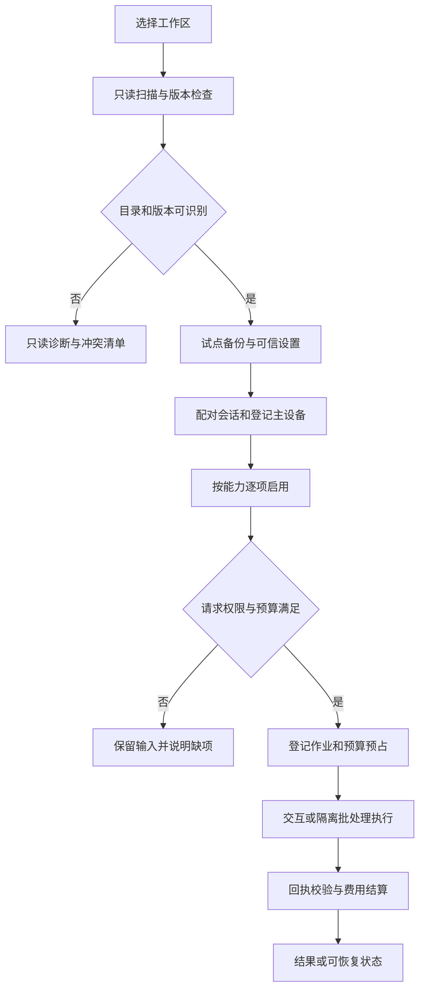

# 场景 01：工作区接入与运行治理

[返回总体方案](2026-09-21-001-feat-overall-knowledge-task-plan.md) · [需求原文](../brainstorms/2026-09-21-obsidian-knowledge-and-task-center-requirements.md)

## 1. 要解决的问题

用户第一次连接已有 Vault 时，系统必须先识别目录、插件、数据版本和授权，再开放能力。没有模型或服务暂时故障时，手工任务和本地资料仍可用。后台处理不能拖住 Today，也不能从资料里的文字取得执行权限。

本场景主责 R001—R003、R081—R087、R091；验收关联 A01、A08、A32—A35。备份与退出由场景 10 实现。当前仓库只有设计文档，下面的工程文件均为拟新增，不能把旧合同当成已实现服务。

## 2. 独立调研与选型

核查日期：2026-09-21。原有依据是 [v1 技术方案](../90-历史版本/v1/Obsidian-KB-Technical-Spec-2026-09-20.md) 的薄插件、本地服务和预算预占，以及 [v2.1](../01-当前设计基线/Obsidian-KB-v2.1-Audit-and-Task-Planning-2026-09-21.md) 的交互／批处理隔离。仓库没有 `docs/solutions/`，没有可照搬的运行经验。

| 调研问题 | 官方依据与事实 | 本方案决定 |
|---|---|---|
| 服务运行时怎么选 | [Node.js 发布表](https://nodejs.org/en/about/previous-releases) 将 24 列为 LTS | 沿用 Node.js 24 的受测补丁版；实施时记录精确版本，不锁网页展示的“最新” |
| SQLite 能否承担本地账本 | [SQLite WAL](https://www.sqlite.org/wal.html) 说明同机共享内存限制及 WAL-reset 修复 | 数据库留在本机应用数据目录；实际 SQLite 必须包含该修复，采用 3.51.3 或更高受测版本，或官方明确回补版本 |
| 本地接口是否可以免认证 | [MCP 传输安全说明](https://modelcontextprotocol.io/specification/2025-11-25/basic/transports) 指出本地 HTTP 的 Origin 与 DNS rebinding 风险 | 自有 Bridge 接口同样做认证、Host／Origin 校验；回环地址不等于可信调用者 |
| 抓取器如何约束目标 | [OWASP SSRF 指南](https://cheatsheetseries.owasp.org/cheatsheets/Server_Side_Request_Forgery_Prevention_Cheat_Sheet.html) 讨论地址验证、重定向与 DNS 风险 | 每次连接和重定向都检查解析后的地址；网络策略由服务执行，模型没有通用 fetch 权限 |

采用 TypeScript strict、pnpm workspace、Fastify、运行时 schema、better-sqlite3。它们沿用旧设计方向，精确版本、许可证和原生构建结果在实施时固定。首期只建一个本地服务，不引入 Redis、消息集群或通用工作流平台。

## 3. 技术设计

### 接入、身份与能力开关

首次接入由 Bridge 选择 Vault，生成内部 `vaultId` 并登记受管目录、任务目录和主设备。先扫描重名、重复身份、符号链接和既有配置，再创建隔离试点与备份。尚未完成接管时只显示预览。

可信设置存于服务应用数据目录；Vault 中的模板、网页和模型结果都不能修改设置。角色至少区分配置管理、用户操作、受控 Writer、只读客户端。插件握手绑定 Vault、会话与设备，服务签发短期能力；密钥由操作系统凭据存储保管，账本只存引用。首次配对经本机 UI 展示并确认，不能由待导入内容发起。

每个请求携带操作身份、作用域、策略版本和幂等键；同键不同载荷报冲突。费用、网络、模型、OCR、嵌入、重排、提醒、日历和发布是独立权限。多个来源的允许路线取交集；交集为空即说明阻断原因，不自动换提供商。

主设备先采用显式登记，不做多设备自动抢占。跨设备切换需要旧端停止、未完成操作核对和新 epoch；旧端离线无法确认时，新端仅只读。不能仅靠两个各自独立的 SQLite 锁证明全局唯一。自动写入会话失联或过期就暂停；更细的文件授权见场景 04。

### 账本与后台作业

`state.db` 保存权威业务账本；`index.db` 保存可重建索引；原件与解析对象按内容哈希放在对象目录。两库不跨库提交业务事务。一个服务控制状态写入，短事务提交；网络请求、模型调用、PDF 解析都不占用数据库事务。

作业表保存根作业、父子关系、输入摘要、阶段、重试次数、租约、栅栏序号和取消请求。过期 worker 的结果必须带旧栅栏号并被拒绝。事件先持久记录，再由消费者按业务键去重；不把“至少处理一次”写成“外部副作用恰好一次”。

交互请求、提醒检查、批量作业分队列。初期批量并发为保守的可配置小值，重 CPU 解析放独立进程，数据库仍由服务写。Worker 接口只提供本次输入和输出，不传 Vault 路径与密钥，不继承全部环境变量。取消阻止后续步骤；远端调用已开始则保留费用待核对。

普通子进程只隔离故障和负载，不能当成操作系统权限沙箱。首期自有静态解析器按受信代码审计，不运行输入脚本；第三方编译器、动态浏览器、复杂解析和发布构建如需强隔离，使用固定镜像的 OCI 作业环境，仅挂载本次只读输入与专用输出，不挂载 Vault、用户主目录或容器控制 socket；关闭非必要能力并限制 CPU、内存、进程数和总时长。模型或获取请求由受认证的宿主代理按作业权限执行，worker 不持有提供方密钥，也不能直连任意外网。这个选择依据 [Docker 安全模型](https://docs.docker.com/engine/security/) 与 [运行约束](https://docs.docker.com/engine/containers/run/)（2026-09-21 核查）；容器默认配置不等于满足上述边界。

缺少已验证隔离环境时，关闭这些第三方路线；Wiki 改用受信的有界原生适配器，网页保留静态解析／人工剪藏，复杂区域保留缺口。基础任务、搜索和自有基础解析不因此依赖容器。启用第三方路线前做越界文件与出站负例测试，不能把换一个临时目录当成完成隔离。

### 费用约束

启用收费路线前要求有效价格表、输出上限、单作业／日／月额度和币种。金额用最小计费单位的整数，跨币种未配置换算时不合并成虚假的总额。日／月归属按已配置的预算时区，调用记录固定归属窗口。

每次调用在同一短事务内检查三层余额并预占，预估须覆盖输入、输出上限及适用附加费。不能确定安全上界的路线先关闭。子章节、结构修复、重试和 OCR 都继承根作业预算。明确未发出的失败可释放；请求已发出但回执不明则保留未知预占，不能通过重启、跨日或重试清零。收到用量后按唯一 provider 请求号结算，超出估计时记录真实费用并阻止后续调用，不篡改账单。

### 用户可见状态

统一返回“状态、中文原因、影响范围、下一步、可重试性、详情编号”。加载、空、部分完成、等待授权、等待 Writer、预算不足、冲突与失败分开。表单草稿保留，长作业可离开再进入。键盘可操作，状态不只依赖颜色；重试按钮沿用同一操作身份。诊断默认只含版本、时长、计数和错误编号。

## 4. 场景流程图

> 下图用于评审处理顺序与边界，属于设计方向，不是可直接复制的实现规范。

## 5. 实施单元

以下路径相对仓库根目录；全部为新增建议。沿用旧合同中的身份、作业、用量概念，重新定义版本化运行时校验，不原样复制 v1 类型。

- [x] **G1：工作区与能力协商。** 需求 R001—R003、R091；无前置。文件：`packages/contracts/src/workspace.ts`、`apps/service/src/workspace/registry.ts`、`apps/obsidian-plugin/src/connection.ts`；测试：`tests/integration/workspace-onboarding.test.ts`。实现扫描、配对、主端登记与能力清单。测试已有目录冲突、错误 Vault、未知 schema、凭据撤销、双设备离线切换，预期不接管、不越权。完成依据：试点可接入，未通过的能力清楚保持关闭。

- [x] **G2：策略与本地 API 边界。** 需求 R083—R085；依赖 G1。文件：`packages/contracts/src/policy.ts`、`apps/service/src/security/policy.ts`、`apps/service/src/http/auth.ts`、`apps/service/src/security/egress.ts`；测试：`tests/security/policy-boundaries.test.ts`。模式遵循 PRD 用途授权与 OWASP 网络验证。测试多来源路线无交集、恶意 Origin、重定向到私网、路径穿越、资料伪造审批、泄漏到日志；预期请求被拒且无出站／越界文件。完成依据：A32、A33 的允许和拒绝矩阵都有记录。

- [x] **G3：作业与预算账本。** 需求 R086—R087；依赖 G2。文件：`apps/service/src/runtime/jobs.ts`、`apps/service/src/runtime/budget.ts`、`apps/service/src/runtime/worker-pool.ts`、`apps/service/src/storage/migrations/001-foundation.ts`；测试：`tests/integration/job-budget.test.ts`、`tests/faults/worker-recovery.test.ts`。先以真实 SQLite 验证事务与崩溃边界。测试并发抢最后额度、未知费用、重复结算、午夜跨窗、取消在途请求、过期 worker 回传；预期账本不漏、不凭空释放。完成依据：所有调用能追溯根预算，基本请求不被批处理阻塞。

- [x] **G5：第三方作业隔离。** 需求 R084、R087；依赖 G2、G3，启用第三方 worker 前完成。文件：`apps/service/src/runtime/sandbox.ts`、`apps/service/src/runtime/worker-broker.ts`；测试：`tests/security/worker-confinement.test.ts`。将上述挂载、资源和网络策略做成受信固定配置，不接受资料指定镜像或启动参数。测试 worker 读取主目录、访问元数据、绕过模型预算、进程耗尽和输出软链接；预期系统层阻断且宿主仅接收通过校验的产物。完成依据：受测隔离环境有版本与负例记录；不通过保持路线关闭。

- [x] **G4：公共交互状态与诊断。** 需求 R081—R082、R085、R091；依赖 G1、G3。文件：`apps/obsidian-plugin/src/ui/operation-state.ts`、`apps/obsidian-plugin/src/views/settings.ts`、`apps/service/src/runtime/diagnostics.ts`；测试：`tests/ui/operation-state.test.ts`、`tests/integration/diagnostics-redaction.test.ts`。测试断线保留表单、重复点击、键盘焦点、局部成功、诊断隐私。完成依据：用户从失败状态能找到可行下一步，诊断不含正文和密钥。

## 6. 风险、验证与启用

服务开发先落 G1—G3，其余场景复用，不各自建权限或预算系统。macOS 为首个验收平台；其他系统逐项验证路径、凭据存储、原生数据库和通知。升级前冻结实际依赖清单与测试集，未知迁移停在只读模式。

尚需实施验证：Obsidian 桌面运行环境、SQLite 驱动实际内核版本、进程资源限制、配对交互和队列负载。未通过时关闭相应写入／解析路线，不能用文档已写完替代能力可用。

## 7. 实施结果（2026-09-21）

工程骨架及 G1—G5 已实现。运行入口见[根目录 README](../../README.md)，逐项证据、实际版本、接口权限、截图和未启用范围见[实施验收](../implementation/runtime-governance-validation.md)。首次建库采用本机 CLI 的扫描／摘要确认流程，之后在真实 Obsidian 插件中配对和管理；会话令牌仅保留内存，提供方密钥使用操作系统凭据库。

29 个不同用例已覆盖常规、编译产物与真实 OCI 验证；真实 Obsidian 的完整治理流程已通过。后续导入、检索、任务、Writer、模型、提醒、日历、发布仍按总体方案分别实施，不随本场景完成而自动启用。
