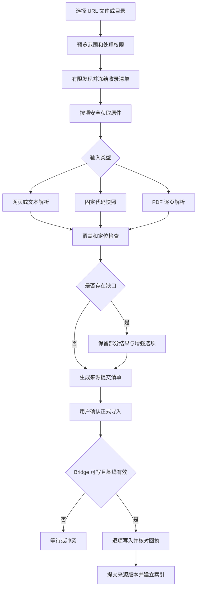

# 场景 02：多来源资料收录

[返回总体方案](2026-09-21-001-feat-overall-knowledge-task-plan.md) · [需求原文](../brainstorms/2026-09-21-obsidian-knowledge-and-task-center-requirements.md)

## 1. 范围与交付结果

统一接收 Markdown／文本、网页、文档集合、代码快照和 PDF，保留取得的原件、结构化解析、覆盖说明和可回读位置。导入成功意味着批准的来源版本完成提交；不意味着全文读懂、知识已审核或学习任务完成。

主责 R005—R021；关联 R022、R026、R083—R087；验收 A02—A08、A33。依赖场景 01 的权限与作业、场景 04 的受控文件提交、场景 03 的证据与索引合同。为避免交付循环，先实现场景 04 的通用 Writer，再做本场景；Wiki 编译本身不在这条前置链上。

## 2. 独立调研

本地依据：[统一收录专题](../03-资料收录与课题研究/Obsidian-KB-Multi-Source-Ingestion-2026-09-20.md)。以下官方材料于 2026-09-21 核查。

| 输入 | 核查结论 | 实现选择及边界 |
|---|---|---|
| 网页 | [Readability](https://github.com/mozilla/readability) 提取正文，但不负责净化不可信 HTML | 本地静态提取，DOM 脚本与外部资源关闭，显示前净化；抽取器成功不等于全文完整 |
| 文档网站 | [AI SDK 的 llms.txt](https://ai-sdk.dev/llms.txt) 目前包含导航、搜索入口和站点索引链接 | 把机器入口当发现线索，和目录导航交叉核对；不能假设 llms.txt 必然直接列全站每页 |
| 代码 | [GitHub 固定文件链接](https://docs.github.com/en/repositories/working-with-files/using-files/getting-permanent-links-to-files) 区分分支与特定提交 | 导入时解析并固定实际 commit；本地脏目录另生成文件清单和内容哈希 |
| PDF | [PDF.js API](https://mozilla.github.io/pdf.js/api/draft/api.js.html) 提供页读取与文本提取接口 | 首期逐页文本与定位；格式复杂时给部分覆盖，不把纯文本顺序当原版式 |
| 增强解析 | [DoclingDocument](https://docling-project.github.io/docling/concepts/docling_document/) 可表达表格、图像、布局与出处 | 作为可选隔离 worker；是否准确保留表格单位、跨页结构仍用真实样本验收 |

不建设无限爬虫。初期使用有界 HTTP 获取、静态解析和人工剪藏；只有真实页面必须执行脚本时，才单独启用隔离浏览器路线。默认不接入任意浏览器登录态。

## 3. 数据与流程设计

### 3.1 收录清单和授权边界

先创建 `AcquisitionPlan`：来源类型、入口、允许域名／路径、语言和版本、最大页数／字节／深度／耗时、外发路线、目标集合和抓取策略。发现也消耗范围与资源；扩范围要生成新预览。收录批准与 Wiki 批准是不同操作。

网页规范化保留影响内容的查询参数，不一律删查询串。记录原 URL、最终 URL、canonical 声明和实际字节哈希；canonical 只是来源关系线索，不能让网页声明合并不相关源。单项重复判断基于来源身份与字节，不按标题去重。

集合发现完成后冻结 `CollectionManifest`，每项有发现来源和状态：排除、待获取、取得、部分解析、失败、待写入、已提交。分母是这份批准清单，不是“已抓到几页”。收录时间跨度也要记录：网页集合一般不是上游同一瞬间的原子快照。新发现页面只能进入下一版清单。

### 3.2 四类适配路线

| 路线 | 必须保留 | 失败与降级 |
|---|---|---|
| Markdown／文本与剪藏 | 原字节、编码、原链接、标题、人工确认的节选状态 | 非法编码不静默替换；剪藏缺正文仍可保存节选 |
| 单页／集合 | HTML 原件、正文块、标题层级、代码标签页、抓取时间、公开时间的证据 | 登录墙、脚本壳、截断响应识别为不足；获取成功不记为全文 |
| 代码／发布产物 | resolved ref、commit、路径、行范围、文件哈希、来源类型；脏目录额外保留清单 | source 与 dist 使用不同筛选规则；LFS 指针和未取子模块列缺失，不自动执行安装、构建、钩子或仓库脚本 |
| PDF | 原文件、物理页码、印刷页码标签、文本／表格块和坐标、解析器指纹 | 加密文件等待临时密码；扫描页或模糊图保留缺口；不从缺失页面推出全文否定 |

代码先用路径和行号定位，语法树符号识别是可替换的增强。排除规则对目标资料生效：研究发布产物时不能按通用规则把整个 dist 删掉。本地读取必须由文件选择或明确目录授权提供，拒绝越界符号链接；压缩包限制展开总量、条目数量和路径，不接受软链接逃逸。

PDF 基础解析不附带远端 OCR 权限。需要增强时先展示页／区域、目的、提供方及费用，由用户选择授权范围。增强结果形成新的解析产物，不覆盖旧引用。PDF 密码只在本次处理内使用，默认不落盘。

### 3.3 原件、解析和提交

一条来源有多个不可变 `SourceRevision`；同一修订可有多个 `ParseArtifact`。后者记录解析器、配置、编码及块定位版本。派生摘要只作导航，不能替代原文证据。被确认的公开时间、声明的发布日期、抓取时间分字段保存，未知则为空。

Worker 先把对象写入暂存区并校验哈希，服务登记清单和候选来源投影。用户批准正式导入后，经 Bridge 写入受管来源 Markdown；所有必要文件回执完整后，服务才推进来源提交点并发出索引事件。插件离线停在“资料已取得，等待写入”，未提交内容不进入正式搜索。

“重新解析”和“重新获取”是两个操作。重新解析只新增 ParseArtifact；获取到新正文才新增来源修订。对同一已完成步骤重试复用对象与回执。单页失败不使整批回滚；整个批次可取消，成功项保留，未开始项停止。

更新获取失败、页面暂时消失或认证失效，只更新本次获取状态，不删除上一已提交修订，也不自动撤回旧证据。集合新版清单中未发现旧页面时记录“本轮未发现”，由用户核对是移址、权限变化还是确实下线。

## 4. 场景流程图

> 下图用于讨论处理边界，属于方向性设计，不是实现代码。

## 5. 实施单元

- [ ] **I1：统一输入与清单。** 需求 R005—R010、R013—R015；依赖 G1—G3。文件：`packages/contracts/src/ingestion.ts`、`apps/service/src/ingestion/manifest.ts`、`apps/obsidian-plugin/src/views/ingestion.ts`；测试：`tests/integration/ingestion-manifest.test.ts`。沿用专题中的 acquisition／commit 分离。测试同 URL 同字节、同标题异源、并列目录漏页、集合中断恢复与新增页；预期去重正确、分母不漂移。完成依据：A02、A04、A08 能逐项解释。

- [ ] **I2：网页与文件安全获取。** 需求 R011—R012、R084；依赖 I1、G2。文件：`apps/service/src/ingestion/fetcher.ts`、`apps/service/src/ingestion/web-parser.ts`、`apps/service/src/ingestion/file-reader.ts`；测试：`tests/security/acquisition-boundaries.test.ts`、`tests/integration/web-capture.test.ts`。测试正常正文、200 登录页、节选、压缩炸弹、重定向／DNS 地址变化、恶意 HTML；预期缺口明确且无脚本或越界网络执行。完成依据：真实网页回读与安全负例均通过。

- [ ] **I3：代码与 PDF 解析。** 需求 R016—R021；依赖 I1、G3。文件：`apps/service/src/ingestion/repository.ts`、`apps/service/src/ingestion/pdf-parser.ts`、`apps/service/src/ingestion/enhancement.ts`；测试：`tests/integration/repository-snapshot.test.ts`、`tests/integration/pdf-locators.test.ts`。测试移动分支、脏目录、dist、LFS、物理／印刷页错位、密码、扫描和表格；预期版本与缺失不混淆，未授权 OCR 请求为零。完成依据：A05—A07 有真实样本记录。

- [ ] **I4：来源提交和批次恢复。** 需求 R007—R010；依赖 I2、I3、W1—W3（场景 04）。文件：`apps/service/src/ingestion/commit.ts`、`apps/service/src/storage/migrations/002-sources.ts`；测试：`tests/faults/ingestion-commit.test.ts`。测试批准后断连、写一半、哈希不符、取消后迟到 worker、新解析复用原件；预期仅完整提交的版本对搜索可见。完成依据：收录 UI、来源账本、文件回执与索引状态一致。

## 6. 上线门槛与待验证项

先用 30 份真实资料覆盖四种主要输入，不能只用 UTF-8 文本替代 PDF 和代码验收。每种输入至少包含一个部分失败样本。记录原件可用性、块定位、字符损失、表格遗漏、峰值内存和总耗时。

复杂 OCR、浏览器脚本执行、自动更新订阅均不是基础导入的隐含动作。其效果、资源开销和权限验证未通过时，只保留明确的人工重试入口。执行材料中的实验需要另一个由用户授权的工作流程，本场景不执行。
