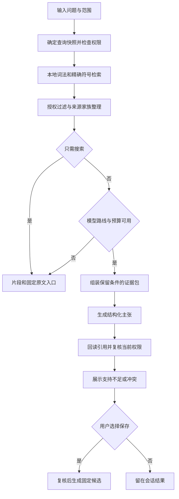

# 场景 03：证据、检索与问答

[返回总体方案](2026-09-21-001-feat-overall-knowledge-task-plan.md) · [需求原文](../brainstorms/2026-09-21-obsidian-knowledge-and-task-center-requirements.md)

## 1. 范围

把“搜到相似文字”变成“找到适用范围明确、能返回原文的依据”。无模型时也能检索；有模型时只基于授权快照回答，并明确不足和冲突。

主责 R022—R031、R093；关联 R038、R090；验收 A01、A09—A12、A32、A37、A40。场景 02 提供来源，场景 04 接收保存候选，场景 05 复用证据包。向量或图增强属于 P7，不是关键词搜索前置。

## 2. 独立调研

本地参考 [版本关联与课题研究](../03-资料收录与课题研究/Obsidian-KB-Ingestion-Relations-and-Research-2026-09-20.md) 及 v1 包的 [设计合同](../05-实施与模板/v1-原始实施包/obsidian-kb-delivery-2026-09-20/references/contracts.ts)。旧合同已有 SourceRevision、ParseArtifact、Evidence、Claim，必须扩展适用范围和撤回门禁。

2026-09-21 核查 [SQLite FTS5](https://www.sqlite.org/fts5.html)：内置 tokenizer 不直接解决全部中文检索；trigram 的全文查询不能匹配少于三个 Unicode 字符。因而选“应用侧规范化分词＋FTS5＋精确符号表”，不能把开启 FTS5 当成中文验收通过。

同日核查 [llmwiki SDK](https://raw.githubusercontent.com/atomicstrata/llm-wiki-compiler/main/docs/guides/sdk.mdx)：其 search 依赖模型能力，query 的 save 会写入并参与后续查询。故本场景自建本地 SearchService 和 AnswerService，编译 SDK 只在场景 04 沙盒内复用。是否引用有效由本系统判断。

## 3. 证据合同

| 对象 | 身份与关键字段 | 不允许的替代关系 |
|---|---|---|
| 来源修订 | sourceId、revisionId、原件哈希、公开／抓取时间 | 软件版本不等于文档修订 |
| 解析产物 | parseId、revisionId、解析器指纹、规范化字节哈希 | 重解析不覆盖旧产物 |
| 证据 | evidenceId、parseId、blockId、范围、引用片段哈希、原件位置 | 标题或可变 URL 不能代替固定位置 |
| 主张 | 内容、sourced／inferred／user-stated、审阅状态、适用条件 | 模型推断和用户目标不能冒充来源事实 |
| 关系 | supports、contradicts、qualifies、supersedes、related-to | related-to 不表示支持；图连通不表示逻辑蕴含 |
| 查询快照 | 来源／解析／页面修订清单、索引代号、创建时间 | 快照不能冻结永久读取权限 |

文本沿用 UTF-16 半开区间定位，同时固定规范化字符串及其哈希；表格／PDF 保留页、区域和单元格位置；代码保留固定路径和行范围。任何再分词、Unicode 归一化或换行调整只作用于检索字段，不能改变证据正文偏移。回读时验证范围和片段哈希，不匹配则显示定位失效并阻断对应结论。

适用范围至少包含主题、软件版本、分发渠道、运行阶段、配置、模态和证据来源类型。比较范围时返回重叠、不相交或未知；只有范围重叠且结论互斥才建立冲突候选。较新资料可能只是另一个版本，不能按时间自动覆盖旧结论。

来源家族把原文、镜像、转载与派生摘要关联起来。回答可展示多个入口，但证据数量和召回指标按家族去重。Wiki 只有向下追溯到原始证据才可支持事实，不能以生成页再次支持自身。

## 4. 检索与回答设计

### 本地检索

中文按固定版本策略生成单字与相邻双字 token，英文按词与别名检索；另建精确符号字段保留 `C++`、`Node.js`、完整函数名与路径。中文单字是补充召回，排序优先双字、标题和精确符号。别名由受信词表或经确认的映射提供，不让模型临时改索引语义。

查询先校验范围与读取权限，读取匹配该快照的索引代，再按当前撤回状态过滤。候选排序在授权集合内进行，避免先截取全库前十再过滤导致漏召回。返回固定原文片段、来源类型、版本、覆盖和索引完成度。索引代构建完成后原子切换活动指针；旧代保留到读者释放，索引可重建，业务账本不可丢。

### 有证据回答

AnswerService 组装证据包：问题、适用范围、不可变原文、来源家族、覆盖和冲突。上下文装不下时缩小问题或分段处理，保留否定、数值单位和前置条件；不靠摘要填补没取到的原文。

模型只返回受校验的主张、引用编号、条件与不足说明。服务执行引用存在性、范围、权限和回读检查；语义支持仍需固定评测和人工抽检，机械合法不等于语义正确。回答结果可以部分支持且同时列出缺口；总体状态为有支持、证据不足或证据冲突。

回答缓存键包含问题、快照、策略、模型与提示版本；每次命中还要重新检查当前授权和撤回。生成过程中发生撤回时，停止后续读取和调用，并阻止旧答案作为有效结果显示或保存。保存前再次校验，然后交给场景 04 的候选确认流程。

### 检索增强的启用条件

先积累关键词失败题，选择一种增强做同题对照，比较来源家族 Recall@10、延迟、成本和外发。向量索引指纹含模型、维度、分块与规范化版本；变化后新建代，不能混用旧向量。增强异常退回关键词。未证明收益保持关闭，不同时引入向量库、重排器和图数据库。

## 5. 场景流程图

> 下图展示拟议的控制顺序，供评审使用，不是实现规范。

## 6. 实施单元

- [ ] **E1：固定证据与范围关系。** 需求 R022—R026；依赖 G1—G3，输入合同与 I1 协同。文件：`packages/contracts/src/evidence.ts`、`apps/service/src/evidence/locator.ts`、`apps/service/src/evidence/scope.ts`、`apps/service/src/storage/migrations/003-evidence.ts`；测试：`tests/unit/evidence-scope.test.ts`、`tests/integration/evidence-readback.test.ts`。测试 emoji 偏移、换行、重解析、损坏引用、版本不相交与未知范围、来源循环；预期位置可回读且不产生伪支持。完成依据：A09—A12 的固定证据断言通过。

- [ ] **E2：无模型索引与搜索。** 需求 R027—R028；依赖 E1、I4。文件：`apps/service/src/search/tokenizer.ts`、`apps/service/src/search/indexer.ts`、`apps/service/src/search/search.ts`、`apps/obsidian-plugin/src/views/search.ts`；测试：`tests/integration/lexical-search.test.ts`、`tests/performance/search-benchmark.test.ts`。测试两字词、别名、符号、授权后排名、半完成索引及索引代切换。完成依据：无密钥完成 A01，约一万文本块热检索 p95 <500ms，记录机器和总字节。

- [ ] **E3：证据问答与缓存。** 需求 R029—R031；依赖 E2、G3。文件：`apps/service/src/answers/evidence-pack.ts`、`apps/service/src/answers/answer.ts`、`apps/service/src/answers/cache.ts`；测试：`tests/integration/grounded-answer.test.ts`、`tests/security/revoked-evidence.test.ts`。测试有答案、无答案、同范围冲突、五转载、遗漏否定、模型结构错误、生成中撤回、缓存越权。完成依据：机械引用 100% 可回读，语义评测达到 PRD 门槛，权限失败不返回正文。

- [ ] **E4：增强对照与知识检查。** 需求 R031、R093；依赖 E2—E3；增强部分 P7。文件：`apps/service/src/search/enhancement.ts`、`apps/service/src/evidence/health.ts`；测试：`tests/evaluation/retrieval-comparison.test.ts`、`tests/integration/knowledge-health.test.ts`。测试无来源页、冲突页、指纹变化、增强停机及拒绝外发。完成依据：检查报告列出问题与定位；增强有同题收益报告才允许开启。

## 7. 验证与限制

先标注 20 个真实问题，再扩为约 80 题；17 道可回答题用于召回，3 道无答案题须全部说明不足。重要主张支持率目标 ≥95%，来源家族 Recall@10 ≥90%，同时报告过度拒答。不能把模型自评分作为最终验收。

本方案不承诺所有语言的最优分词，也不在规划阶段证明性能。实施中若词法未达标，先分析失败题和查询计划，再决定是否替换分词；不以提前增加多个检索组件掩盖问题。
