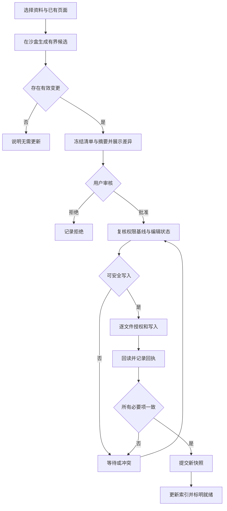

# 场景 04：知识提案、审核与受控写入

[返回总体方案](2026-09-21-001-feat-overall-knowledge-task-plan.md) · [需求原文](../brainstorms/2026-09-21-obsidian-knowledge-and-task-center-requirements.md)

## 1. 要解决的问题

用户审核的是一份看得见的变更，而不是给模型一张长期写入通行证。批准后也可能因为文件在编辑、基线变化或插件退出而尚未落盘。本场景把这些状态分开，并提供逐文件可恢复的提交过程。

主责 R032—R038；为 R007、R036 提供公共 Writer；验收 A13—A14。依赖场景 01 的身份、策略与作业，编译部分再依赖场景 03 的证据。人工目录默认只读，任务文件由 TaskNotes 管理，不走本场景的 Wiki 写入器。

## 2. 独立调研与取舍

参考 [v1 技术方案](../90-历史版本/v1/Obsidian-KB-Technical-Spec-2026-09-20.md) 与 [旧设计合同](../05-实施与模板/v1-原始实施包/obsidian-kb-delivery-2026-09-20/references/contracts.ts)，继承固定提案摘要、逐项授权和回执。2026-09-21 核查：

| 问题 | 官方事实 | 设计决定 |
|---|---|---|
| 如何避免读旧内容再写入 | [Obsidian Vault 文档](https://docs.obsidian.md/Plugins/Vault) 推荐 `process`，其修改回调是同步的 | 异步生成在写前完成；回调内检查当前字节哈希，只对匹配基线做同步修改 |
| 能否把多文件当事务 | [Obsidian API 声明](https://raw.githubusercontent.com/obsidianmd/obsidian-api/master/obsidian.d.ts) 提供文件操作；未给本方案跨文件提交协议 | 本系统记录变更清单、逐项回执与最终提交点，不承诺文件系统瞬间全改 |
| 编译器能否直接接管 Vault | [llmwiki SDK](https://raw.githubusercontent.com/atomicstrata/llm-wiki-compiler/main/docs/guides/sdk.mdx) 提供 review 候选，但提示词政策本身不可强制执行 | SDK 仅在作业沙盒生成候选；获取、授权、预算和正式写入由本系统控制 |

优先验证 llmwiki 适配器。必须能取得固定候选、恢复来源定位、约束所有内部模型调用并阻止沙盒外写入；任一项不通过，改用有界原生流程：一次提取主张、一次生成页面，最多一次受预算约束的结构修复。两条路线择一上线，不长期并存两套知识事实。

第三方适配器须通过 S01 的 G5 隔离与调用代理，不能仅在临时目录运行就视为受限。若 SDK 无法经代理逐次预占费用，直接判该适配路径不满足采用条件；不让它携带真实密钥绕开网关。原生回退路径只调用本系统网关，模型输出不执行。

## 3. 提案与批准合同

`ChangeSet` 保存基线快照、目标页面、源修订、权限版本、每个文件的操作、beforeHash／afterHash、候选对象哈希及摘要。摘要覆盖所有会影响用户所见结果的字段，不能只对正文做哈希而漏掉路径或来源。

提案首先匹配已有概念／系统／比较／决定页，允许零变更。页数与主张数设显式作业上限，超出部分列为待处理。用户决定只有明确用户确认才能进入决定页，模型建议保持“建议”来源。

Review 视图显示目的、逐文件 diff、主张与证据、条件、冲突及影响。批准由受信 UI 的用户动作生成，绑定提案摘要、身份、策略与有效期；拒绝保存原因。模型文本、网页按钮、外部 Agent 不得进入批准入口。

普通问答和研究报告的保存也先冻结候选清单，由用户确认写入候选区；提升为 Wiki 再生成新的 ChangeSet 并审核。候选区不进入正式知识基线，不能调用上游 query-save 绕开该流程。

## 4. 逐文件提交与崩溃恢复

### 4.1 写入协议

服务登记 prepared 清单后，按文件签发短期 `WriterGrant`，绑定会话、主设备 epoch、变更摘要、路径、patch 序号和 afterHash。Bridge 检查受管根目录与真实路径，拒绝路径穿越和符号链接逃逸；服务进程不能趁插件离线用裸文件系统写正式 Vault。

更新已有 Markdown 时，先确认目标不在任何打开的编辑叶中，再在同步处理回调内校验字节哈希。新文件创建前要求目标不存在；名称碰撞报冲突，不默认覆盖。目标在写入过程中被打开、插件上下文失效或能力无法证明时暂停。真实 Obsidian 验证应覆盖编辑缓冲区；仅磁盘哈希相等不足以证明用户没有未保存输入。

每项完成后 Bridge 回读并登记回执。回执丢失时按以下规则恢复：

| 观察结果 | 恢复动作 |
|---|---|
| 当前哈希等于 afterHash | 记录已应用，禁止再改一次；保留原操作身份 |
| 等于 beforeHash，批准和 grant 仍有效 | 可以申请当前会话的新 grant 后执行该项 |
| 等于第三个哈希，或新建路径出现不同内容 | 标记冲突，保留人工内容 |
| 剩余项的批准过期／政策变化 | 保留已应用项，重新展示剩余清单等待授权 |
| 目标正在编辑／插件离线 | 等待 Writer，不推进完整提交 |

只有所有必要项回读一致，服务才在一次状态事务中标记 committed 并推进知识／来源快照，再发送索引事件。文件应用、业务提交、索引就绪分别显示。提交检查与外部人工写入没有全局事务；后续文件变化由观察器生成新观察版本并标记待复审，不能宣称永久锁住文件。

部分应用期间，Obsidian 文件系统可能已经看到部分内容，Bridge 须显示“提交未完成”；正式检索只读取最后完整提交的不可变页面修订。修复不能自动用备份覆盖第三版本。需要撤销时创建反向候选并重新核对当前内容，不删除已经发生的审计记录。

### 4.2 人工修改与影响传播

页面人工改动后，保留完整字节，新增观察版本，原批准不沿用；人工添加的主张标记未验证。以证据边找直接受影响主张和页面，有限批次标记过期、冲突或失去来源；更远关系只进入待复审清单，不递归整库重写。自动生成目录不进入来源摄取器，防止自循环。

来源撤回的访问阻断由场景 10 即时执行，影响分析可异步；不能等到所有页面标记完才停止旧内容读取。

## 5. 场景流程图

> 下图是审核与提交的方向性设计，用于核对状态和中断点，不是实现代码。

## 6. 实施单元

- [ ] **W1：提案、摘要与授权合同。** 需求 R033—R034、R036；依赖 G1—G3。文件：`packages/contracts/src/changeset.ts`、`apps/service/src/review/proposals.ts`、`apps/service/src/review/approval.ts`、`apps/service/src/storage/migrations/004-changesets.ts`；测试：`tests/security/approval-binding.test.ts`。沿用 v1 合同概念并补全路径和政策摘要。测试批准后改路径、正文、证据、权限或基线；预期旧批准全部失效。完成依据：审核所见与实际授权逐字节可比对。

- [ ] **W2：Bridge Writer。** 需求 R035—R036；依赖 W1。文件：`apps/obsidian-plugin/src/writer/guard.ts`、`apps/obsidian-plugin/src/writer/apply.ts`、`apps/service/src/review/writer-session.ts`；测试：`tests/obsidian/writer-contract.test.ts`、`tests/security/writer-paths.test.ts`。先做真实插件契约验证。测试未保存编辑缓冲、第三哈希、同名新建、目录逃逸、会话过期、迟到 grant；预期不丢人工字节。完成依据：A13 通过，失败则相应写能力关闭。

- [ ] **W3：提交回执与恢复。** 需求 R036；依赖 W2。文件：`apps/service/src/review/commit.ts`、`apps/service/src/review/recovery.ts`；测试：`tests/faults/changeset-recovery.test.ts`。测试每项写前／写后／回执前／最终提交前退出、批准中途过期、人工新编辑；预期已应用可识别、剩余可暂停、正式快照不部分推进。完成依据：A14 每个中断点有确定结果或显式冲突。此单元完成即可支持来源提交，不必等 Wiki 编译。

- [ ] **W4：编译适配与 Review。** 需求 R032—R034、R037；依赖 W1—W3、E1、G3。文件：`apps/service/src/wiki/compiler-adapter.ts`、`apps/service/src/wiki/bounded-compiler.ts`、`apps/obsidian-plugin/src/views/review.ts`、`apps/service/src/review/candidates.ts`；测试：`tests/contracts/compiler-adapter.test.ts`、`tests/integration/wiki-review.test.ts`。两个适配路径仅择一启用。测试零新页、优先改旧页、候选截断、隐藏内部收费、恶意资料政策、保存后再提升；预期所有正式写入都经自有审核。完成依据：固定样本引用可回读、费用完整、沙盒外写入为零。

- [ ] **W5：人工观察与影响清单。** 需求 R035、R038；依赖 W3、E1。文件：`apps/service/src/wiki/observations.ts`、`apps/service/src/wiki/impact.ts`；测试：`tests/integration/wiki-impact.test.ts`。测试人工修改、旧版本仍适用、来源撤回、大图截断及生成页再摄取；预期历史保留、待复审范围明确、无无限循环。完成依据：每个影响项可回到具体证据或变更。

## 7. 启用门槛

上游 SDK 版本、内部费用钩子和候选接口需实际验证；文档里出现方法不等于它满足本系统契约。人工内容保护是硬门槛，任一次丢失阻断相应写入能力。正式文件写入与 Obsidian 同步插件可能竞争，首轮只在隔离试点单主端验收；不能以 SQLite 事务替代跨应用并发保护。
