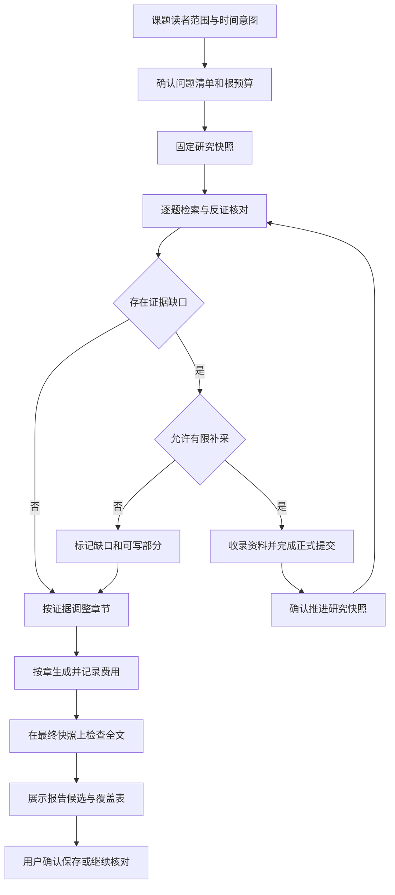

# 场景 05：课题研究与报告生成

[返回总体方案](2026-09-21-001-feat-overall-knowledge-task-plan.md) · [需求原文](../brainstorms/2026-09-21-obsidian-knowledge-and-task-center-requirements.md)

## 1. 范围

用户输入课题后，先明确要回答的问题与证据范围，再生成能核查的分节报告。研究允许有未解决项；补采、生成报告和提升 Wiki 分别受控。

主责 R039—R044；验收 A15、A40。依赖场景 03 的证据检索、场景 01 的统一预算；补采复用场景 02，保存复用场景 04。P2 先交付库内研究，P6 单独开放补充缺口。

## 2. 独立调研

本地依据是 [版本关联与课题研究专题](../03-资料收录与课题研究/Obsidian-KB-Ingestion-Relations-and-Research-2026-09-20.md)，其核心问题是跨版本、跨条件综合时容易漏掉限定词，不能用命中数替代问题覆盖。

2026-09-21 复核 [llmwiki SDK](https://raw.githubusercontent.com/atomicstrata/llm-wiki-compiler/main/docs/guides/sdk.mdx) 的 query/save 边界；它不能直接承担本 PRD 的冻结研究清单与候选保存。选服务内显式研究状态机，复用模型网关，不引入自主无限循环 Agent。

同日复核 [AI SDK 机器导航](https://ai-sdk.dev/llms.txt)。入口给出的索引和搜索只是寻找材料的线索，研究仍要取得原文并经收录提交。本轮尝试读取该站具体结构化输出页面未成功，因此不据此选择某个 SDK API 或声称已验证结构化输出兼容性；模型适配器的运行时 schema 是本系统责任。

对于历史时点研究，技术决策来自 R039：证据可用性按来源公开时间判断，不用抓取时间或软件版本号代替。外部文档没有替本系统解决该业务口径。

## 3. 研究对象与执行设计

### 输入与问题覆盖

`ResearchBrief` 包含课题、读者、输出类型、必答问题、软件范围、时间意图、库内／补采模式和根预算。缺少这些字段时先显示草案与待填项；一般学习可分版本概览，具体项目行为必须有项目版本依据。

将课题拆成 `ResearchQuestion`，每题记录必要证据类型、所需版本与条件、正反观点、找到的证据和缺口。章节是问题的组织方式，随证据调整。状态区分未检索、部分覆盖、足够支持、存在冲突和不可回答；覆盖由内容与条件判断，检索条数只作辅助。

历史时点模式额外记录 cutoff 与证据角色：当时已公开、后续解释、公开时间待核验。只有第一类可证明“当时已知”；后两类可以单列说明，但不能混入当时结论。公开时间证据不足时保留未知，不让模型猜日期。

### 有界补采与快照推进

库内模式只检索当前研究快照并列缺口。补采模式为具体缺口产生有限 AcquisitionPlan，由现有范围授权约束；扩域或扩大预算重新确认。搜索摘要不能直接入证据包。

新增材料经来源正式提交后，生成研究快照候选。用户可看到新增／替换版本与受影响问题；确认推进后，把相关章节标记为需要重新核验。保留旧章节及其旧快照，不能把半篇旧证据、半篇新证据包装成单一最新研究。

冻结最终报告时，所有章节必须在最终快照中重新验证其引用和适用范围。未使用新材料且证据仍一致的章节可复用，不必再次收费生成；无法重新确认的章节改为不足或保留在未完成区。

### 分节生成与检查

每章单独组装证据包，输出主张、引用、条件、正文和未解决项。根作业统一限制发现次数、材料数、章节数、模型调用数和总费用。重试不能创建新的根预算，取消保留已生成章节与费用记录。

全文检查包括：必答题覆盖、固定引用可回读、反证是否遗漏、数值与单位、否定条件、版本边界、重复来源家族、章节相互矛盾和未经运行的实验声明。机械检查和语义审阅各有结果；模型复核只能提供辅助意见。

报告产物包括正文、来源清单、问题覆盖表、未解决项、最终快照、版本与成本摘要。默认停在可预览候选；用户确认保存后写入候选区，提升知识再次审核。报告更新产生新版本候选，不静默改用户导出的文件。

## 4. 场景流程图

> 下图用于核对研究中的证据和预算边界，属于方向性设计。

## 5. 实施单元

- [ ] **RSH1：课题与覆盖表。** 需求 R039—R041；依赖 E1—E3。文件：`packages/contracts/src/research.ts`、`apps/service/src/research/brief.ts`、`apps/service/src/research/coverage.ts`、`apps/obsidian-plugin/src/views/research.ts`；测试：`tests/integration/research-coverage.test.ts`。沿用专题的问题先行和 PRD 时间意图。测试一般概览、项目版本缺失、多个分发范围、后发指南和未知公开时间；预期条件明确且历史口径不混淆。完成依据：A40 的三类资料有不同证据资格。

- [ ] **RSH2：补采与快照变更。** 需求 R042；依赖 RSH1、I4。文件：`apps/service/src/research/acquisition.ts`、`apps/service/src/research/snapshots.ts`；测试：`tests/integration/research-snapshot.test.ts`。测试库内模式不发网络请求、范围越界、仅取得搜索摘要、收录待写入、研究中更新来源；预期补采有上界且正式提交前不推进研究快照。完成依据：用户能核对快照差异及受影响章节。

- [ ] **RSH3：章节生成与全文检查。** 需求 R040—R043；依赖 RSH1、G3，补采可不启用。文件：`apps/service/src/research/chapters.ts`、`apps/service/src/research/report-check.ts`；测试：`tests/evaluation/research-report.test.ts`、`tests/faults/research-budget.test.ts`。测试缺关键题、矛盾章节、去掉否定、虚构性能倍数、并发章耗尽同一预算；预期不足可见、错误结论被阻断、预算到限不再调用。完成依据：A15 和报告语义门槛通过。

- [ ] **RSH4：报告候选与恢复。** 需求 R044；依赖 RSH3、W3—W4。文件：`apps/service/src/research/artifacts.ts`、`apps/service/src/storage/migrations/005-research.ts`；测试：`tests/integration/research-save.test.ts`。测试取消后返回、重复保存、来源撤回、报告升级；预期章节与费用不丢、保存不直接进入正式 Wiki。完成依据：报告每条重要结论可追溯最终快照和原文。

## 6. 风险与实施验证

最容易低估的是跨章节条件保持和来源公开时间不足。试点选跨版本技术主题，人工标注必答问题、反证与历史时间角色。不要以报告长度或引用数量评定成功。

具体模型、上下文容量和单章上限实施时根据已授权路线配置；上限影响批次，不改变证据标准。模型失效时仍可输出已确认的来源清单、覆盖表和缺口，不虚构完整报告。
