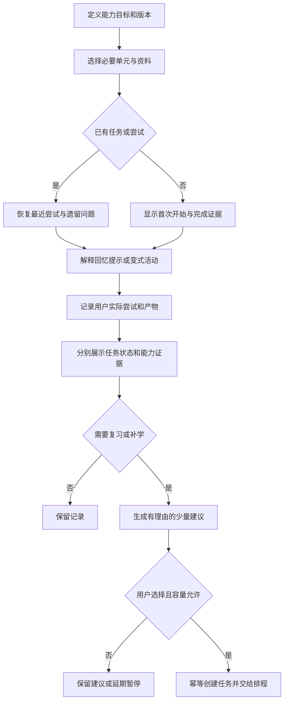

# 场景 06：学习目标、实际尝试与复习

[返回总体方案](2026-09-21-001-feat-overall-knowledge-task-plan.md) · [需求原文](../brainstorms/2026-09-21-obsidian-knowledge-and-task-center-requirements.md)

## 1. 范围

把资料转为少量可以解释、验证或完成的学习活动，记录人的实际尝试，并能在中断后接着做。资料收藏量、阅读用时和任务完成都不自动成为掌握证据。

主责 R045—R050；关联 R058—R062；验收 A16—A17、A41。依赖场景 03 的固定证据和场景 07 的任务能力；排程与提醒分别调用场景 08、09。学习链路不要求所有资料先编成 Wiki。

## 2. 独立调研与选择

本地主要依据：[AI SDK 整站收录与学习编排](../04-自动收录与学习编排/AI-SDK-整站收录与学习编排.md)。需要保留的设计是“参考库可大，当前行动队列要小”。

2026-09-21 核查 [AI SDK 导航入口](https://ai-sdk.dev/llms.txt)，入口按 Core、UI、Providers 等组织；这支持按目标范围选资料，不能据入口数量推断学习单元数量或站点总页数。本系统把核心、实际 Provider 和相关 Cookbook 分开筛选，不默认全站生成任务。

另检索确认 [Roediger 与 Karpicke 2006 年原始研究条目](https://pubmed.ncbi.nlm.nih.gov/16507066/)，其研究关注检索练习与保持；本轮未取得该页面完整正文，不据此给出效果百分比、通用最优间隔或适用于所有技能的保证。产品取“让用户实际作答并保留记录”这一已明确需求，不新增复杂记忆预测模型。

不接入 FSRS 或第二套任务循环引擎。首期复习用显式可配置规则生成建议；只有容量允许且用户选择时才转为任务。以后是否采用自适应算法，应基于个人真实记录另行对照。

## 3. 数据与交互设计

### 目标和单元

`LearningGoal` 记录能力描述、目标版本、可观察的完成证据、常见误区和范围基线。`LearningUnit` 链接必要来源、可选参考、先修建议与验收标准；建议不自动变成排程硬依赖。用户可调整顺序、跳过熟悉内容或暂停。

大量归档资料只进入参考库。只有当前选中的单元进入行动队列；先检查 WIP 与每日容量，不按文档页数一对一生成待办。目标和单元以稳定 ID 关联任务，多个视图共享同一任务记录。

### 尝试和继续学习

一次 `LearningAttempt` 保存用户原始表达、引用的解释／例子、提示层级、实际产物引用、用户报告的结果、可验证的检查结果、遗留问题和来源修订。自报、程序验证、人工评价和模型评分分字段记录；模型评分必须带模型、提示、评分规则版本，不能冒充客观通过。

从 Today 打开学习任务时，ResumeContext 返回目标、当前单元、必要资料、最近尝试、遗留问题与来源更新提醒。没有记录明确写“首次开始”。资料已撤回则显示不可读及影响，不从旧缓存展示正文；仍保留尝试的时间、类型和受限关联。

活动可包括解释、示例、回忆、提示、变式验证和纠错。整理个人笔记只重排用户已经表达的内容；新增解释需标记系统补充。代码实验在本场景只记录用户提交的产物和结果；不自动执行资料里的命令。

### 完成、范围变化和复习

任务是否完成由任务事实决定；能力证据视图展示在哪个版本、哪些条件下做过什么，不给永久单一“已掌握”。计时达到预估不触发任务完成，模型生成答案不算用户作答。

有明确验收项的目标按固定叶子项与权重显示证据通过情况；新增范围形成新基线并单列变化。仅自报的活动显示状态与说明，不生成精确百分比。知识审核进度仍由场景 04 管理。

复习建议记录触发原因、建议窗口、所需时长、关联误区和来源版本。生成可执行任务时，在状态账本中原子预留容量，建立幂等的创建意图，再调用 TaskNotes；待创建项也占容量，防止并发超发。创建失败释放可确认未生效的预留，结果未知保持待核对。缺容量配置只展示建议。

来源更新后，通过证据关联找出受影响单元；旧尝试继续属于旧版本。只有目标要求新版本且存在实质差异时，才提出补学候选。跳过、延后、暂停都记录用户选择，不以反复生成同一任务施压。

## 4. 场景流程图

> 下图用于评审学习到行动的连接方式，属于方向性设计。

## 5. 实施单元

- [ ] **L1：目标、单元与范围基线。** 需求 R045—R046；依赖 E1、T1（场景 07）。文件：`packages/contracts/src/learning.ts`、`apps/service/src/learning/goals.ts`、`apps/service/src/learning/units.ts`、`apps/service/src/storage/migrations/006-learning.ts`；测试：`tests/integration/learning-scope.test.ts`。参考学习专题的参考库／队列分离。测试归档 100 页只选两单元、跳过已熟悉部分、修改版本范围；预期不批量建任务、不改变既有通过记录。完成依据：A16 的材料增加不改变掌握证据。

- [ ] **L2：尝试记录与恢复上下文。** 需求 R047—R048；依赖 L1、E1。文件：`apps/service/src/learning/attempts.ts`、`apps/service/src/learning/resume.ts`、`apps/obsidian-plugin/src/views/learning.ts`；测试：`tests/integration/learning-resume.test.ts`。测试首次开始、中断续学、提示使用、来源更新／撤回、模型评分与用户自报混合；预期原始尝试保留，必要资料和遗留问题可见，不自动认定掌握。完成依据：A41 从 Today 能接回实际活动。

- [ ] **L3：复习建议与容量预约。** 需求 R049；依赖 L2、T2、G3。文件：`apps/service/src/learning/review-suggestions.ts`、`apps/service/src/learning/capacity.ts`；测试：`tests/integration/review-capacity.test.ts`。测试无容量设置、WIP 已满、同时确认多个建议、任务创建超时、跳过后再次生成；预期不超发、不重复创建，未知保留待核对。完成依据：建议数量、预留和正式任务可对账。

- [ ] **L4：版本影响与四类进度连接。** 需求 R050，协同 R060—R061；依赖 L2、W5、T3。文件：`apps/service/src/learning/impact.ts`、`apps/service/src/learning/evidence-view.ts`；测试：`tests/integration/learning-version-impact.test.ts`。测试旧版本正确结果、目标升级、取消单元与基线扩大；预期历史不清零、补学由用户选、分母变化单列。完成依据：A17 不出现“删掉未完成项就提高进度”。

## 6. 验证与待定参数

每日容量、WIP、复习间隔、目标版本与评分规则都在启用时配置，历史示例不等于用户授权。没有参数仍能记录学习与查看证据。验证以“能继续上次活动”“用户尝试未被生成内容替代”“版本变化可解释”为主，不以学习效果提升比例作为未经实测的承诺。
