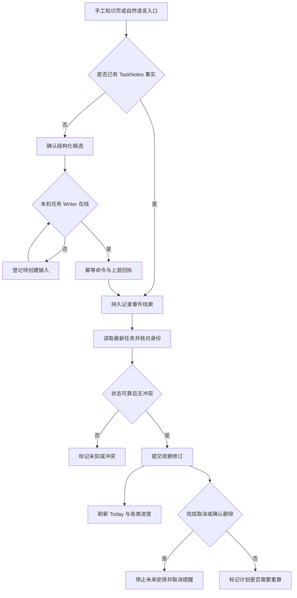

# 场景 07：任务生命周期、Today 与离线核对

[返回总体方案](2026-09-21-001-feat-overall-knowledge-task-plan.md) · [需求原文](../brainstorms/2026-09-21-obsidian-knowledge-and-task-center-requirements.md)

## 1. 范围与事实归属

普通事务、学习任务和自然语言输入都进入同一任务系统。TaskNotes 管任务标题、状态、截止、循环和计时；本地服务保存稳定身份、观察修订、关联和操作账本。Today 汇总行动和风险，不另造一份可独立勾选的任务。

主责 R051—R062、R070—R072、R074；验收 A18—A20、A26、A28、A35、A41—A42。精确排期由场景 08 保存，提醒由场景 09 执行。普通任务不依赖资料收录、模型或学习目标。

## 2. 独立调研与集成边界

本地依据：[v2.1 的任务命令与事件核对](../01-当前设计基线/Obsidian-KB-v2.1-Audit-and-Task-Planning-2026-09-21.md)。2026-09-21 复核 [TaskNotes Runtime API](https://tasknotes.dev/obsidian/javascript-api/)：任务事件可能同次发出多种通知，循环接口存在 toggle，外部手改不一定带 correlation。官方 [HTTP API](https://tasknotes.dev/HTTP_API/) 以路径寻址，且同页对回环监听和 CORS 的描述存在冲突。

因此主选 Obsidian 内 Runtime adapter，不依赖额外 HTTP／MCP 入口，也不把文档所示版本号当成已安装版本。实施时固定 release／commit 并记录实际能力。未找到足以证明跨插件原子 CAS 的官方保证，不能把写前重读一次称为并发安全更新。

保留 TaskNotes 的列表、看板、任务菜单和循环能力。自建部分限于 Today、关联资料、候选创建、观察账本和同步状态；不同时接入另一个自动生成循环任务的引擎。

## 3. 身份、状态与时间

### 稳定身份

采用受管自定义字段保存随机稳定 `taskId`，服务维护它与当前 TaskNotes 路径的映射。路径只是定位符，标题只是展示。首次接入旧任务时先验证自定义字段保存能力，再由用户确认接管范围；写入必须保留未知字段和正文。若该契约未通过，先只读观察，不用路径哈希假装稳定身份。

同 ID 出现两个不同文件时标为身份冲突，暂停该任务自动排程、提醒和写入，交给用户区分副本。文件移动只更新映射。确认删除需完成一次可靠清点并排除改名、移动、缓存未就绪与读取失败；单次 404 或文件暂不可读只表示未知。已确认删除写入 tombstone，旧事件和旧计划不得创建回同一任务。

循环实例由系列 taskId、原始发生日期／时间和时区形成 `occurrenceKey`，并映射上游虚拟实例或实体实例。移动排期不改原发生身份；循环规则调整需保留旧实例映射并核对未来实例，不能把新旧规则下同一天随意合并。循环展开由 TaskNotes 承担。

### 正交状态

| 维度 | 表达 |
|---|---|
| 生命周期 | inbox、todo、in-progress、blocked、done、cancelled，映射实际 TaskNotes 配置 |
| 排程 | 未排、已排、部分排、需重新核对 |
| 同步 | 当前已观察修订、最后核对时间、待处理／冲突 |
| 估计与工作 | 预估、实际日志、剩余量和来源分别保存；实际超估不自动完成 |
| 学习 | 独立的尝试及证据，通过场景 06 读取 |

未知状态保持待映射，不按字符串近似推断完成。用户直接完成普通任务不走 Wiki 审核；重开保留工作日志和尝试。完成、取消或确认删除时，在服务一次状态事务内登记新观察事实、停止未开始计划块的意图和提醒取消 outbox；外部回执仍异步。已开始／已发生的工作保留，取消失败显示待同步。

停止安排以独立失效记录作用于执行视图，保留原 PlanRevision 的历史内容；Today 与提醒发送前都检查该记录，不能等下一轮求解才停止旧未来块。重开任务仍需重新核对安排，不能清除失效记录直接复活旧提醒。

期望日期、最早开始、硬截止、计划时段和提醒时刻独立。仅日期截止以所选时区次日零点为排他上界，不用 UTC 零点或固定加 24 小时代替自然日。自然语言“明天学”默认形成期望日期候选，只有用户明确含义才填硬截止。

## 4. 命令、事件和重连

### 创建与状态命令

自然语言输出结构化草案，并为每个字段标注原文依据或系统建议；用户确认后登记 `TaskCommand`，包含 operationKey、载荷摘要、目标状态、目标实例及当前观察版本。表单可在无模型时完成相同操作。

创建前把操作标记与稳定 ID 纳入一次上游可验证写入；回执丢失后按标记清点，找到则关联，没法确认就停在结果未知。若上游不能原子保留创建标记，不对失败创建盲目重试，应由用户核对后重试。任务不存在与“请求尚未回执”不能混为一谈。

状态操作优先使用设定目标状态接口。循环实例仅能 toggle 时，adapter 串行核对当前状态后最多调用一次；超时转未知，重新读事实，不直接重发。用户期间又修改时，不能因当前碰巧等于目标就声称本次命令成功；区分“目标状态已满足”和“操作归因已确认”。

### 事件只触发核对

链路为“事件入持久 inbox → 合并待核对任务 → 重读最新事实 → 生成观察修订 → 更新进度并使相关计划失效”。事实修订按稳定身份、规范化业务字段与可用的上游版本构造；普通文件保存不重复产生完成事实。body-only 变化可刷新资料关联，但不反复触发排程和提醒。

Bridge 重连先等 TaskNotes 缓存 ready，完成全量清点，再处理离线事件线索。分页清点期间发生变更的任务进入第二轮核对；未达到一致观察边界时保持待同步，不执行高风险自动应用。source/correlation 用于抑制自己的投影回环，但不是唯一幂等依据。

本系统不复制可写的 TaskNotes timeEntries；只观察规范化日志并保留来源。未知同步期间显示最后确认时间；不能把没有计时当成没有工作。

## 5. Today 与进度

Today 从当前已接受计划、最新已确认任务、日历覆盖和风险读模型合成。显示固定安排、可用窗口、弹性块、休息缓冲及未排项；资料和学习任务提供“继续”入口。任务状态操作返回 TaskNotes 正式入口或已验证 adapter，不在多个 Markdown 表格里维护独立 checkbox。

计划已经采用时，Today 立即展示 PlanRevision；笔记、任务字段、日历与提醒分别显示其回执版本。首期不写 TaskNotes scheduled；打开的计划笔记可以继续待投影，不影响 Today 读取正式计划。

进度保持四套口径：材料按冻结收录清单、任务按状态／验收项、学习按尝试证据、知识按主张审核。任务精确百分比只在有叶子验收基线和权重时计算；父项不再重复计分。取消、延期和范围新增单列，不能删分母制造完成率。

远程输入是 P6 可选 `TaskCapture`，离线时只登记“等待本机创建”。正式任务回执、去重和权限核对完成前，不创建生效开始提醒。远端不直接写 Vault。

## 6. 场景流程图

> 下图供评审入口到任务事实的处理顺序，属于方向性设计。

## 7. 实施单元

- [x] **T1：TaskNotes 契约与身份。** 需求 R051、R054—R056、R071；依赖 G1。文件：`apps/obsidian-plugin/src/tasknotes/adapter.ts`、`packages/contracts/src/tasks.ts`、`apps/service/src/tasks/identity.ts`；测试：`tests/obsidian/tasknotes-contract.test.ts`、`tests/integration/task-identity.test.ts`。先在真实插件验证 ID、未知字段、正文、改名、移动、重复副本与循环实例。完成依据：A18—A20 的身份稳定；失败保留只读并记录阻断，不伪造 TaskNotes 已兼容。

- [x] **T2：候选与命令账本。** 需求 R051—R055、R058、R074；依赖 T1、G3。文件：`apps/service/src/tasks/commands.ts`、`apps/service/src/tasks/capture.ts`、`apps/obsidian-plugin/src/views/task-capture.ts`；测试：`tests/faults/task-command-retry.test.ts`。测试双击创建、回执丢失、toggle 超时后用户反向修改、自然语言日期误推断、离线远程输入；预期不重复、不盲重试、不提前宣称正式任务。完成依据：每个命令有明确完成、未知或冲突状态。

- [x] **T3：最新事实核对与进度。** 需求 R053—R054、R057—R058、R060—R062、R071；依赖 T1、T2。文件：`apps/service/src/tasks/reconcile.ts`、`apps/service/src/tasks/progress.ts`、`apps/service/src/storage/migrations/007-tasks.ts`；测试：`tests/integration/task-reconciliation.test.ts`、`tests/integration/progress-baseline.test.ts`。测试三种完成事件、离线旧事件、全量清点中改名、未知读取、确认删除、依赖环、基线增减；预期事实只计一次、分母可解释、删除不复活。完成依据：A19、A20、A42 的取消意图可追到 outbox。

- [ ] **T4：Today 与投影回执。** 需求 R059、R070—R072；依赖 T3，排程后接 P3（场景 08）。文件：`apps/service/src/tasks/today.ts`、`apps/obsidian-plugin/src/views/today.ts`、`apps/service/src/projections/receipts.ts`；测试：`tests/integration/today-state.test.ts`、`tests/obsidian/plan-projection.test.ts`。测试空任务、未排项、学习续接、计划采用但文件在编辑、日历失败、批处理高负载；预期当前计划可见且各副本状态独立。完成依据：A26、A35、A41 及在线反馈 p95 <2 秒目标通过。

## 8. 风险与上线条件

自动任务字段回写保持关闭，除非锁定上游版本通过真实并发与字段保留测试；仅靠 UI 的一次成功不能开放后台自动化。基础任务契约失败时先记录差异和替代成本，再调整 TaskNotes 路线，不偷偷建立另一个任务主库。

## 9. 2026-09-23 实施与依赖状态

使用、代码入口、架构与恢复见[TaskNotes / Today 接手说明](../implementation/task-today-reconciliation.md)，本轮命令、真实契约、桌面与性能见[验收记录](../implementation/task-today-validation.md)。

- T1：固定 TaskNotes 4.13.4 / Runtime API v1，已在真实 Obsidian 验证创建标记、未知字段与正文、改名、副本及循环操作。自定义 ID 通过明确接管写入；现有任务字段自动更新仍关闭。
- T2：普通表单与有限本地短句候选已实现。短句仅建议相对日期和分钟数，硬截止须人工填写；固定操作 ID、摘要、一次领取和结果未知核对落地。状态操作返回 TaskNotes 原生入口，因此不发出需要重试的循环 toggle。P6 远程入口为可选，未启用。
- T3：schema 7、历史观察、分批一致清点、循环实例映射、旧线索核对、墓碑、独立失效与取消 outbox、冻结叶子权重已实现。真实文件仍在而缓存漏项会阻断删除，完整清点才能形成确认删除。
- T4：Today 可读任务事实、待创建回执、风险和学习续接；已接受计划与四类回执有内部只读集成边界。A41 的 TaskNotes 正式任务到原尝试链路通过真实桌面测试。真实 PlanRevision 生产者、固定安排／空闲窗口／日历覆盖依赖场景 08，提醒提供方依赖场景 09；未用测试夹具替代实际提供方验收，T4 保持未勾选。

本轮包括 OCI 和编译后进程的 139 项回归通过，2 项真实语料跳过；类型和 lint 通过。服务端 1,000 任务、25 样本的完整核对加 Today HTTP 读取 p95 约 363 ms，不包括桌面全量磁盘扫描。上线仅开放已验证的本地任务试点，方案继续 active 等待 T4 外部依赖；跨插件 CAS、自动字段更新、真实模型和既有语料门槛没有宣称完成。
