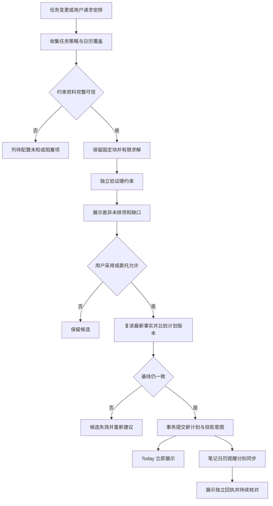

# 场景 08：约束排程、计划采用与日历投影

[返回总体方案](2026-09-21-001-feat-overall-knowledge-task-plan.md) · [需求原文](../brainstorms/2026-09-21-obsidian-knowledge-and-task-center-requirements.md)

## 1. 范围

在真实可用时间里安排行动，插入新任务时说明哪些安排会移动、哪些排不下。模型可解释意图，时间安排由确定性约束检查决定；默认先建议、后采用。

主责 R063—R069、R073；协同 R056—R057、R070—R072；验收 A21—A28。依赖场景 07 的可靠任务观察，采用后向 Today、文件投影、可选日历和提醒分别发意图。

## 2. 独立调研与选择

本地依据是 [v2.1 的排程、提交与日历章节](../01-当前设计基线/Obsidian-KB-v2.1-Audit-and-Task-Planning-2026-09-21.md)，策略参考 [planning-policy 样例](../01-当前设计基线/原始任务中心包/planning-policy.example.json)，其中数值不是生产授权。

2026-09-21 核查官方接口：

| 问题 | 已确认依据 | 本方案选择 |
|---|---|---|
| 只读忙闲是否可行 | [Google FreeBusy](https://developers.google.com/workspace/calendar/api/v3/reference/freebusy/query) 返回选定窗口的 busy 与逐日历错误 | 首个外部适配器用最小忙闲权限；成功响应中某日历报错仍是覆盖不足 |
| 增量缓存失效如何处理 | [Google 同步指南](https://developers.google.com/workspace/calendar/api/guides/sync) 的 410 要求重新全量同步 | 只重建该适配器缓存；基础 FreeBusy 本身按窗口重读，不套用 events syncToken |
| 自有时间块如何写 | [创建事件指南](https://developers.google.com/workspace/calendar/api/guides/create-events) 提供事件创建与自定义 ID 约束 | 后续只向独立 KB Plan 日历投影，用确定性合法事件 ID 和回执去重 |
| 时间和循环的标准依据 | [RFC 5545](https://datatracker.ietf.org/doc/html/rfc5545) 区分日期、日期时间、时区和循环表达 | 存时区及原始本地时间语义；不把自然日当固定 24 小时 |

首期不引入通用优化求解器。选择有限时域的确定性启发式＋独立硬约束验证器，得到可解释结果；确实需要更强求解时再比较同一问题集。未找到全排方案不等于数学上已证明无解。

## 3. 输入快照与日历覆盖

`PlanningSnapshot` 固定当前 planRevision、任务观察修订、依赖图、剩余时长与来源、可用窗口、日历覆盖哈希、策略版本、时区、评估时刻。任务未估计时进入需补充清单，不自行变成零时长。没有可用窗口返回“需要可用时间”。

未连接外部日历时可基于明确本地窗口给建议，标注“未核对外部日历”；已连接但读取失败时保留未知，不把旧缓存当空闲。缓存记录成功覆盖的日历集合、起止范围和读取时间，采用前须在配置的新鲜度内复读。任一必需日历失败，禁止自动采用相关范围。

所有时间块在计算时使用明确的时间点和半开区间。仅日期截止转换为当地次日零点；跨夏令时用时区规则生成端点。用户输入处于跳时缺失或重复时刻时，要求明确实际时刻或选定偏移，不静默采用服务器时区。循环实例展开仍来自 TaskNotes。

## 4. 求解、校验与差异

先冻结固定会议、已开始／锁定块、即将开始的冻结窗口、休息与不可用区间。检查依赖环、缺失前置和不满足的硬条件。显式前置必须已完成，或在候选计划中先完成；无法保证结果的前置以阻塞说明呈现，不能消掉依赖。

在剩余窗口内按硬截止紧迫度、用户优先级、希望日期和稳定任务 ID 排序；保留原已接受块的偏好高于无理由移动。先尝试不移动，再在配置的节点数／耗时预算内做有限调整。不可拆任务只能完整放置；可拆任务遵守明确的最小块和最大拆分数。没有拆分设置就不猜。

候选输出包括已排块、未排任务、容量缺口、移动原因、保留项和搜索停止原因。可以返回完整、部分或未找到；仅在明确约束冲突或容量下界等可证明条件下使用“不可行”。不缩短估计、挪休息或改截止制造成功。

独立验证器再次核验每个候选块的时长、窗口、冲突、截止、依赖、地点／设备、锁定和拆分限制。即便求解器输出看似合理，验证失败也不能采用。无实质差异返回 no-op，不新建计划版本。

## 5. 计划采用与受限委托

用户看到新旧差异后采用。服务先重新获取任务和日历的可用最新观察，再在一个 `state.db` 短事务里比较当前 PlanRevision、任务观察代和策略版本，插入新 PlanRevision、采用记录及各投影 outbox。并发旧候选只能有一个成功，其余显示基线失效。

这个事务不锁住外部 TaskNotes 和日历。检查后恰有新会议或人工改动，观察器会标记受影响计划并重新建议；不能宣称永远无冲突。存在未知任务命令、身份冲突或主端问题时暂停自动采用。

P6 的自动委托绑定可信策略摘要和有效范围。仅当日、未开始、未锁定、冻结窗口外的个人弹性块可调整，并受累计移动次数、幅度和时长边界限制。跨天、扩大任务时长、改截止、改会议、扩大可用时间或外发不属于此授权。缺任何必要参数退回建议。

撤销生成一份基于当前事实的新候选与新计划版本。原来时段已被占用或任务已完成时不能直接恢复旧版；保留真实工作记录，并为旧未来提醒生成取消意图。

## 6. 日历与 Markdown 是独立投影

正式计划先在本地账本生效，Today 直接读取。计划笔记走 Bridge Writer；任务 scheduled 首期不自动改。日历投影属于单独选择的 P6 能力，只写指定 KB Plan 日历，不改原会议。

忙闲查询按日历 ID 排除 KB Plan 日历，不从重叠时间段猜自有事件。投影键绑定 planBlock 身份，更新后保存 provider eventId、版本／ETag、目标计划版本和结果。创建超时先查确定性事件身份；条件更新冲突时不强覆用户改动，转成计划约束候选。每次投影前确认仍是当前意图版本，旧 outbox 不得覆盖新计划。

某副本失败独立重试，不回滚已接受计划。原会议读取、计划投影和提醒各自的授权与回执必须在界面可辨认。

## 7. 场景流程图

> 下图用于评审求解和计划生效边界，属于方向性设计。

## 8. 实施单元

- [ ] **P1：规划快照与忙闲适配。** 需求 R063、R073，协同 R056—R057；依赖 T1、T3、G2。文件：`packages/contracts/src/planning.ts`、`apps/service/src/planning/snapshot.ts`、`apps/service/src/calendar/freebusy.ts`、`apps/service/src/planning/time.ts`；测试：`tests/integration/planning-input.test.ts`、`tests/unit/planning-timezones.test.ts`。测试空可用时间、配置日历单项报错、未接日历、仅日期截止、夏令时缺失／重复小时；预期不把未知当空闲，时间含义一致。完成依据：A21、A27 有明确覆盖状态。

- [ ] **P2：有限求解与独立验证。** 需求 R064—R066；依赖 P1。文件：`apps/service/src/planning/solver.ts`、`apps/service/src/planning/validator.ts`、`apps/service/src/planning/diff.ts`；测试：`tests/unit/planning-constraints.test.ts`、`tests/performance/replanning.test.ts`。测试紧急插入、容量不足、不可拆、锁定、依赖环、地点冲突、搜索预算耗尽与无变化；预期所有已排块过硬约束，未排项不消失。完成依据：A22—A23 通过，轻量重排目标 p95 <5 秒。

- [ ] **P3：采用事务与撤销。** 需求 R067、R069—R070；依赖 P2、T3、G3。文件：`apps/service/src/planning/accept.ts`、`apps/service/src/planning/undo.ts`、`apps/service/src/storage/migrations/008-planning.ts`、`apps/obsidian-plugin/src/views/plan-review.ts`；测试：`tests/faults/plan-acceptance.test.ts`。测试两个旧候选、采用前后任务改动、新会议、进程退出、撤销遇到已完成任务；预期计划不互相覆盖、事实不回滚、outbox 不丢。完成依据：A24、A26 的账本和 UI 一致。

- [ ] **P4：受限自动采用。** 需求 R068；依赖 P3、G1 主端协议；P6 启用。文件：`apps/service/src/planning/delegation.ts`；测试：`tests/security/planning-delegation.test.ts`。测试跨天、冻结、超移动额度、策略撤销、未知任务命令和双主端；预期全部退回建议而不是扩大授权。完成依据：A25、A28 通过才开放开关。

- [ ] **P5：计划日历投影。** 需求 R073，协同 R070；依赖 P3、G2；P6 启用。文件：`apps/service/src/calendar/projection.ts`、`apps/service/src/calendar/reconcile.ts`；测试：`tests/contracts/calendar-provider.test.ts`、`tests/faults/calendar-projection.test.ts`。测试自身 busy 排除、创建超时、迟到旧意图、用户修改事件、410 重建缓存；预期不误删会议、不重复块、不清任务历史。完成依据：真实测试日历验证 A27，投影故障不改变正式 PlanRevision。

## 9. 实施待验证项

求解时域、搜索预算、冻结窗口、拆分参数和移动上限是配置，不沿用历史示例当用户意愿。其他日历提供商不是首个适配器的免费兼容范围，后续用相同合同另测。排程正确性要求所有已接受计划通过独立硬约束检查；可以不完美优化，但不能靠遗漏未排项达标。
