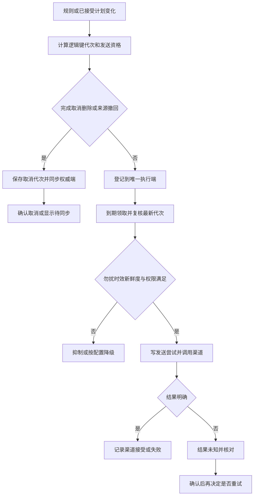

# 场景 09：提醒登记、投递与取消

[返回总体方案](2026-09-21-001-feat-overall-knowledge-task-plan.md) · [需求原文](../brainstorms/2026-09-21-obsidian-knowledge-and-task-center-requirements.md)

## 1. 范围

为晨间查看计划、任务开始、晚间复盘和截止风险建立可核对的提醒。提醒有明确的发送负责人、有效期和状态，任务改期／结束后能取消旧安排。插件在线、本地服务运行与电脑关机是不同部署条件。

主责 R075—R080；关联 R053—R054、R070、R090；验收 A29—A31、A37、A42。P5 交付本地模式；关机提醒是 P6 的独立在线 relay，需要额外部署和目标设备验收。

## 2. 独立调研与决定

参考 [v2.1 提醒身份与离线事实设计](../01-当前设计基线/Obsidian-KB-v2.1-Audit-and-Task-Planning-2026-09-21.md)。2026-09-21 核查 [ntfy 投递文档](https://docs.ntfy.sh/publish/)：当前文档包含 sequence ID、定时更新和取消；[服务配置文档](https://docs.ntfy.sh/config/) 描述访问控制及私有实例配置。

这些能力可作为渠道适配候选，但不证明所部署版本、手机推送链路或在途取消满足本产品要求。采用自有提醒账本，ntfy 仅负责渠道交付。P6 首个 relay 自己保管排期，到期才向渠道发送，避免把业务调度分散到本地、relay 和渠道三处。渠道定时可另行验证，默认不启用。

同一任务的同一提醒类型不同时开启 TaskNotes 自带提醒与 Bridge／relay 规则。已有用户提醒在启用时展示重叠清单，由用户决定交接；不擅自删除原规则。

## 3. 身份、代次与状态

`ReminderRule` 记录类型、时间与时区、渠道、执行端、勿扰、迟到窗口、动态新鲜度、补发和重发设置。缺参数不开启该规则。普通“检查计划”可不带任务；任务开始提醒必须关联已创建任务实例和已接受计划。

逻辑键由用户、任务实例或日期范围、规则身份和渠道组成。`generation` 表示排期配置变化，单调递增；取消保存同键的取消代次，即 tombstone。接收方只接受较新代次，旧 upsert 不能复活取消。

投递去重另有 `deliveryKey`。同日晨间摘要按用户、当地日期、规则、渠道固定一次，改文案不生成新发送资格。开始提醒已发后再改期，只有显式允许重发且满足窗口才新建 deliveryKey；未配置默认不重发。勿扰／暂停、snooze 与过期抑制均记录结果和原因。

| 状态 | 可向用户说明什么 |
|---|---|
| scheduled | 执行端已登记，尚未发送 |
| dispatching | 开始投递，可能已产生外部副作用 |
| accepted | 渠道确认接收，不等于手机已到达 |
| failed | 已知失败，可按规则重试 |
| outcome_unknown | 请求可能生效，需要核对 |
| cancelled | 当前发送权威确认取消未来发送 |
| suppressed | 因过期、勿扰、新鲜度等规则未发送 |

送达／已读只在渠道提供真实回执时显示。取消意图本地已登记但远端未确认时，在同步维度显示 cancel_pending；不能提前写成已取消。已发通知不可收回。

## 4. 发送与权威切换

本地服务或 relay 以短租约领取到期项，核对当前代次、取消代次、发送责任、规则和状态新鲜度，再登记发送尝试。检查与领取在各自权威账本事务内完成；网络调用在事务外。超时后按 provider request／sequence 信息核对，渠道不支持可靠核对时保留 unknown，不盲目重发。

本地与 relay 不共用热 SQLite，也不依赖网络共享文件锁。relay 保存自己的最小提醒账本，收到带单调序号的同步消息后返回确认。执行端切换先暂停新发送，核对旧端在途记录并取得停发确认，再提高 authority epoch、登记新端。旧端不可联系时不自动迁移发送权；宁可显示等待核对，也不能两端各自判断应补发。

固定查看提醒只依赖已登记规则。动态“尚未完成”提醒必须满足任务快照新鲜度；超时后抑制，或按用户配置降级为“上次同步于某时，请检查计划”。远端只接收明确允许的最小摘要、任务引用和有效期，默认不带知识正文、敏感标题或模型生成长总结。

任务完成／取消／删除、计划改期、来源撤回都产生更新或取消意图。来源依赖记录到摘要来源 ID，撤回能阻止新摘要外发；已登记远端的旧摘要发取消／替换请求，确认前显示待同步。取消与实际发送并发时，回执如实记录先后结果，不承诺原子撤回外部推送。

## 5. 迟到、恢复和设备条件

插件模式需要 Obsidian 运行；独立本地服务需要电脑运行且进程可执行；在线 relay 需要远端持续运行，目标手机还受系统权限、网络和推送通道影响。界面按实际模式显示条件，不能把“定时器已设”当成“关机也能到”。

重启先清点已发、取消、unknown 和过期项。过期开始提醒默认抑制，不成批补发；晨间摘要默认每天一次。补发遗漏摘要或已发后改期重发只有用户配置后才启用，并预览适用窗口。

恢复旧备份由场景 10 暂停所有发送，先和 relay／渠道的可核对记录合并已发与取消状态；若远端不可确认，相关键保持暂停。不能通过恢复旧 generation 重新获得发送资格。

## 6. 场景流程图

> 下图用于评审登记、执行和取消的关系，属于方向性设计。

## 7. 实施单元

- [ ] **N1：规则与身份账本。** 需求 R075—R077、R080；依赖 G3、T3、P3。文件：`packages/contracts/src/reminders.ts`、`apps/service/src/reminders/rules.ts`、`apps/service/src/reminders/identity.ts`、`apps/service/src/storage/migrations/009-reminders.ts`；测试：`tests/unit/reminder-identity.test.ts`。测试同日改摘要、已发后改期、夏令时、snooze、未配置重发、TaskNotes 重叠规则；预期 generation 与投递资格分离。完成依据：每条提醒可说明何时由谁发、是否会重发。

- [ ] **N2：本地执行与结果核对。** 需求 R076、R078—R080；依赖 N1。文件：`apps/service/src/reminders/dispatcher.ts`、`apps/service/src/reminders/reconcile.ts`、`apps/service/src/reminders/channels/local.ts`；测试：`tests/faults/reminder-dispatch.test.ts`。测试发送前／后崩溃、渠道超时、勿扰、睡眠后迟到、任务状态过旧；预期 unknown 不记成功，过期不堆积发送。完成依据：A29、A31 在实际本机模式验证。

- [ ] **N3：远端 relay 与权威交接。** 需求 R075、R077—R079；依赖 N2、G2；P6 单独实施。文件：`apps/reminder-relay/src/server.ts`、`apps/reminder-relay/src/ledger.ts`、`apps/reminder-relay/src/dispatcher.ts`、`apps/service/src/reminders/relay-sync.ts`、`apps/reminder-relay/src/channels/ntfy.ts`；测试：`tests/integration/reminder-authority.test.ts`、`tests/devices/mobile-reminder.test.ts`。测试电脑关闭、旧 upsert 晚于取消、两端切换时在途、匿名读取、手机离线；预期唯一负责人、最小摘要、真实回执。完成依据：A29—A30 通过才承诺相应部署条件。

- [ ] **N4：跨域取消与恢复。** 需求 R077、R080，协同 R053—R054、R090；依赖 N2，远端可选 N3。文件：`apps/service/src/reminders/invalidation.ts`、`apps/obsidian-plugin/src/views/reminders.ts`；测试：`tests/integration/task-reminder-cancellation.test.ts`、`tests/faults/reminder-restore.test.ts`。测试来源撤回、任务确认删除、旧计划重放、旧备份、取消与发送并发；预期旧提醒不主动复活、在途结果诚实可见。完成依据：A37、A42 的本地与远端取消状态可追溯。

## 8. 风险与启用设置

渠道的认证、私有 topic、TLS、保留策略和目标设备权限均需实测；随机 topic 名不是授权控制。ntfy 的当前文档能力与具体部署版本分别登记。没有可靠去重／核对能力的渠道须展示限制，不把账本内幂等推导为外部绝对零重复。
