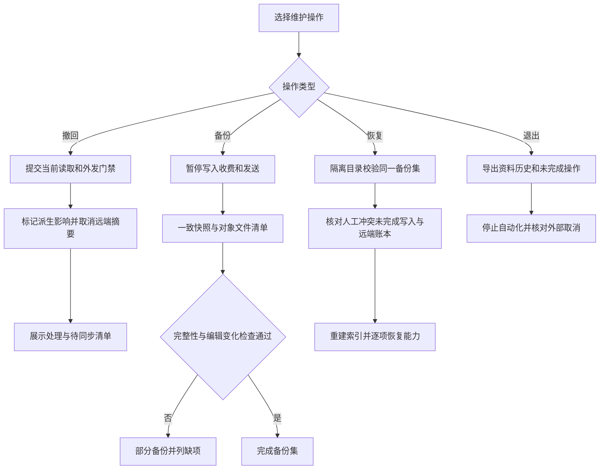

# 场景 10：撤回、备份恢复与退出

[返回总体方案](2026-09-21-001-feat-overall-knowledge-task-plan.md) · [需求原文](../brainstorms/2026-09-21-obsidian-knowledge-and-task-center-requirements.md)

## 1. 范围

本场景保证用户能停止使用某份来源、恢复完整系统或退出产品，同时不丢人工内容、不重新发送旧提醒。撤回先限制使用，清除再按明确清单处理存储；两者不能合成一个“删除成功”。

主责 R004、R088—R090；协同 R031、R036、R080、R091；验收 A14、A36—A39。备份属于各阶段上线基础，不等到系统全部完成再补。

## 2. 独立调研

本地依据：[v1 技术方案](../90-历史版本/v1/Obsidian-KB-Technical-Spec-2026-09-20.md) 的恢复协议及 PRD 的完整系统备份要求。2026-09-21 核查 [SQLite Backup API](https://www.sqlite.org/backup.html)，可生成数据库一致副本；但它不同时冻结 Vault、对象目录和外部提醒账本。因此需要本系统的备份集清单与暂停／核对过程。

另核查 [SQLite WAL](https://www.sqlite.org/wal.html)，活动数据库还涉及 WAL 状态，不能把任意时刻复制一个 db 文件当成完整数据库备份；也不把活动 SQLite 放进通用文件同步目录。选择官方一致快照能力配合对象哈希清单，不建设持续多主数据库同步。

这些数据库机制不保证安全擦除备份或第三方副本。清除的交付物必须是处理范围、结果与例外，不能用本地删除记录声称外部内容已收回。

## 3. 立即撤回与派生影响

`Retraction` 保存来源身份、当前撤回状态、原因、操作者、时间和单调策略代号。确认撤回后先在权威状态库提交拒绝继续使用的门禁，再异步做索引、候选、报告、学习关联和摘要影响扫描。

所有读取边界实时检查当前撤回：搜索命中、原件读取、证据编号、重排输入、模型调用、缓存答案、候选保存、Agent 输出和发布。旧快照不能越过当前策略。多来源派生结果只要混入已撤回内容，默认阻断旧正文的继续分发，直到重新生成或人工确认删去受限部分；不能只移掉脚注却保留正文。

在途作业请求取消，下一步处理与最终结果交付再次检查。已经发给提供方的内容不能收回，记录已发生外发；不再启动新调用。知识页标记影响与待复审，个人任务保留状态和历史，只提示其资料不可用，不自动完成或删除。

提醒摘要带来源依赖，停止新分发并发送远端取消／替换意图。回执未确认显示待同步；已发出的内容列为不可收回，不能误报取消完成。

## 4. 备份集

每次备份生成 `BackupSet`，包含 schema／软件版本、Vault 身份、账本截止点、对象清单、文件哈希、授权和预算记录、未完成操作、远端对账水位及完成状态。

| 内容 | 处理 |
|---|---|
| Vault | 包括人工笔记、任务文件、受管来源与 Wiki、候选和计划投影；保留路径与原字节 |
| state.db | 完整业务账本、预算未知项、审批、学习、计划、通知、撤回和 outbox |
| 原件与解析对象 | 按账本引用封闭收集，核对哈希；缺任何必要对象即不完整 |
| index.db | 可省略并重建；备份记录其指纹和覆盖情况 |
| 可信配置 | 配置版本、权限与主设备信息；密钥另走操作系统受保护备份或重新认证 |
| 在线 relay | 保存可恢复的账本备份或可核对水位；恢复时必须读现端最新记录 |

备份期间暂停服务写入、收费启动和提醒发送，等待已知在途工作收敛，未知项原样记入清单。插件请求维护窗口，用户仍能有意编辑文件；系统对复制前后清单及文件内容做一致性核对，检测到变化便重试相关步骤或标记不完整，不能声称已锁住所有外部编辑器。

数据库通过一致快照接口导出，对象只复制不可变且被清单引用的版本。最后核对 Vault 清单、数据库对象引用与备份期间的观察变化，生成完成标记。没有完成标记或缺少文件时只称部分备份。

## 5. 恢复、升级和退出

### 恢复

先进入维护状态，停用 Writer、模型和通知；保留当前现场快照。在独立目录恢复同一 BackupSet，验证清单、哈希、schema、外键／业务引用和对象可读性。未知版本进入只读诊断，不猜测迁移。

备份中的人工文件与当前现场不同，先列冲突，用户选择后才切换；不直接覆盖较新的笔记。未完成 ChangeSet 按场景 04 的 before／after／第三哈希规则恢复。旧批准保留历史但不自动续期，待继续部分重新审核。

恢复前保存的较新撤回记录、任务删除标记、完成／取消事实和凭据撤销记录，必须先与旧备份对账。读取／外发使用当前更严格的授权和撤回状态，不能直接载入旧配置重新放行。较新的任务事实、工作日志与恢复文件不一致时列冲突并暂停相关执行，不能为了恢复通过而静默选旧版本。若最新现场已经丢失且无可靠对账来源，受影响自动化继续关闭，直到用户核实任务与权限。

预算未知预占继续保留，并尽可能与提供方对账。提醒先与当前 relay／渠道记录核对；保留已发、取消及较新代次，不让旧备份降低水位。不能确认的键暂停发送。单主端身份重新登记，旧 Writer 会话和 grant 全部失效。

索引从已验证账本与对象重建，先通过只读核对，再分能力开放写入、收费和提醒。恢复演练必须在独立目录完成，记录恢复耗时、缺失项和已恢复能力；本轮不虚构 RTO／RPO 数字。

### 清除与退出

清除计划按来源列原件、解析、派生正文、缓存、索引、日志、备份和外部副本。对共享对象先检查其他合法引用，不能删除别的来源仍需使用的对象；若同字节本身需要全面禁用，另作明确范围授权。日志按内容最小化设计，但清除仍检查历史载荷。

SQLite 页、WAL、索引以及备份可能保留旧字节，不能只删业务行就宣称物理清除。根据部署存储与备份能力执行重建／轮换／到期处理，记录哪些副本已清除、待到期或无法控制。第三方已接收内容和用户另存副本列明边界。

退出时导出可读 Markdown、原件、来源与证据映射、学习和计划历史、待处理操作清单。先停用自动作业与外部排期，核对取消结果，再撤销凭据与卸载连接。用户可只禁用插件而保留资料，不强制删除文件。

## 6. 场景流程图

> 下图供评审维护操作的分支和恢复门槛，属于方向性设计。

## 7. 实施单元

- [ ] **O1：撤回门禁与影响任务。** 需求 R090、协同 R031；依赖 G2、E1、W5。文件：`apps/service/src/lifecycle/retraction.ts`、`apps/service/src/lifecycle/impact-jobs.ts`；测试：`tests/security/retraction-boundaries.test.ts`。测试旧快照、证据 ID、缓存答案、混合派生摘要、在途模型和任务资料关联；预期本地新读取／外发立即拒绝，任务事实保留。完成依据：A37 全入口覆盖，远端取消未确认不冒充成功。

- [ ] **O2：完整备份与隔离恢复。** 需求 R088—R089；依赖 G3、W3，后续各域持续接入清单。文件：`apps/service/src/lifecycle/backup.ts`、`apps/service/src/lifecycle/restore.ts`、`apps/cli/src/maintenance.ts`；测试：`tests/faults/backup-restore.test.ts`。测试仅 Vault、副本缺原件、损坏账本、复制中人工编辑、未知 schema、第三哈希、旧批准和未知费用；预期不完整就停写诊断，不覆盖新事实。完成依据：A14、A36 在独立目录真实演练。

- [ ] **O3：账本核对与恢复后的能力开放。** 需求 R089，协同 R080、R091；依赖 O2，提醒部分再依赖 N4。文件：`apps/service/src/lifecycle/resume-gates.ts`、`apps/service/src/lifecycle/remote-ledger.ts`；测试：`tests/integration/restore-external-state.test.ts`。测试旧备份含已撤回来源、已删除任务、已撤销权限和已取消提醒，另测 relay 不可达、旧主设备上线和预算窗口变化；预期不复活资料／任务／提醒、不续旧 grant、不清零费用。完成依据：每项能力有独立开放回执。

- [ ] **O4：清除和可读退出。** 需求 R004、R090；依赖 O1—O2。文件：`apps/service/src/lifecycle/purge.ts`、`apps/service/src/lifecycle/export.ts`、`apps/obsidian-plugin/src/views/maintenance.ts`；测试：`tests/integration/exit-export.test.ts`、`tests/integration/purge-inventory.test.ts`。测试共享对象、历史备份、外部副本、未完成操作和禁用插件；预期不误删、例外明确、脱离插件仍可阅读。完成依据：A39 通过且用户能理解剩余操作。

## 8. 运行要求

备份存储位置、加密与访问权限、保留周期和外部副本策略启用时由用户配置。先做最小完整备份／恢复再接入真实资料；每新增一类权威账本，同时补入备份清单。升级迁移先在备份副本验证，回退应用不能直接读取更高版本可写 schema。
