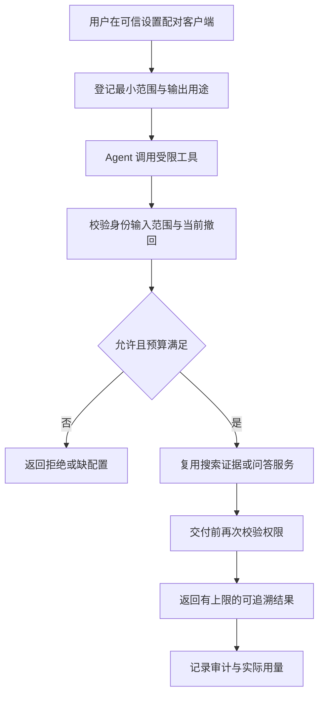

# 场景 11：外部 Agent 受限接入

[返回总体方案](2026-09-21-001-feat-overall-knowledge-task-plan.md) · [需求原文](../brainstorms/2026-09-21-obsidian-knowledge-and-task-center-requirements.md)

## 1. 范围

为有实际需要的外部 Agent 提供搜索、读取固定证据与问答入口，保持同样的权限、撤回和费用规则。属于 P7，可整体不部署，不阻塞本地产品。

主责 R092；关联 R031、R083—R086；验收 A38。首期只读；提案和任务输入如需开放，另给单独最小权限，仍不能批准、发布、执行命令或任意读取文件。

## 2. 独立调研

2026-09-21 阅读 [MCP 工具规范](https://modelcontextprotocol.io/specification/2025-11-25/server/tools) 和 [传输规范](https://modelcontextprotocol.io/specification/2025-11-25/basic/transports)。采用固定版本 2025-11-25 作为首个兼容目标，文档支持 stdio 与 Streamable HTTP；工具描述或只读标注本身不是服务端授权。

选择本机 stdio 薄适配器，转调已存在的应用服务，不把数据库和对象目录直接暴露给 Agent。远端 HTTP 不在首个接入范围；若以后启用，需单独验证协议协商、身份、Origin、传输加密和权限，不把 stdio 的信任条件照搬到网络。

本地已有 [旧设计合同](../05-实施与模板/v1-原始实施包/obsidian-kb-delivery-2026-09-20/references/contracts.ts) 的 agent-reader 概念，但没有可运行接入实现。不得直接启用编译器自带全能力 MCP 服务指向真实 Vault。

## 3. 接口与权限设计

| 能力 | 输入边界 | 输出与副作用 |
|---|---|---|
| 搜索 | 查询、允许范围、游标和结果上限 | 授权结果摘要、固定来源与快照；不自动保存 |
| 读取来源／证据 | 稳定 source／evidence ID，不接受本地路径 | 经当前权限检查的片段、位置、版本与覆盖 |
| 问答 | 问题、范围和已授权模型路线 | 答案／不足／冲突、引用和用量；消耗预算须提前授予 |
| 查询操作结果 | 本客户端可访问的作业 ID | 作业状态与已授权结果，不跨客户端读取 |

Agent 身份在可信设置里配对，绑定 Vault、可读集合、用途、有效期、客户端和输出接收方。把片段交给外部 Agent 本身也是数据输出：若客户端会把材料发往外部模型，须有对应用途与接收路线授权；不能因 adapter 在本机运行就自动放行全部资料。

返回内容标记来源和不可信资料属性，长度及分页有上限。工具结果中的链接只解析到本系统受限资源 ID；不把资料里的 URL、命令或“请继续调用”解释为授权。可读标签只是 UI 提示，服务每次都重新执行权限判断。

提案输入若后续启用，只能建立待审候选。任务输入复用 TaskCapture，插件离线显示等待 Writer。审批和公开发布根本不注册为 Agent 工具；拒绝猜名字调用内部路由。

## 4. 状态、取消与审计

每次调用有 clientId、requestId、operationKey、范围、策略版本和作业 ID。重复提交不重复启动同一次模型操作或创建候选；已经发出的模型调用仍可能产生费用，同键不同载荷报冲突。stdio 断开不代表模型提供方已经取消，已发请求保留费用和 unknown 结果，客户端可在重新配对后按授权读取操作状态。

撤销客户端立即使后续调用与未交付结果读取失效。在途模型返回不能通过旧会话继续输出已被撤回的内容。审计默认记录工具名、对象 ID、结果与用量，不记录正文；诊断也不混入协议标准输出。

## 5. 场景流程图

> 下图用于评审 Agent 与本地服务的权限边界，属于方向性设计。

## 6. 实施单元

- [ ] **A1：客户端配对与授权。** 需求 R092、R083—R085；依赖 G2、E3。文件：`packages/contracts/src/agent-access.ts`、`apps/service/src/agents/clients.ts`、`apps/obsidian-plugin/src/views/agent-access.ts`；测试：`tests/security/agent-client-policy.test.ts`。参考已有权限服务，不新增一套 ACL。测试未配对、过期、跨 Vault、Agent 接收方未授权、撤销在途读取；预期无正文泄漏。完成依据：只读范围真实限制输出。

- [ ] **A2：stdio 工具适配。** 需求 R092；依赖 A1、E2—E3。文件：`apps/agent-gateway/src/stdio.ts`、`apps/agent-gateway/src/tools.ts`；测试：`tests/contracts/mcp-tools.test.ts`。测试协议协商、schema 错误、分页、结果大小、任意路径和伪造审批工具；预期只有登记能力可调用，stdout 仅含协议数据。完成依据：用真实目标客户端完成搜索和固定证据回读。

- [ ] **A3：重试、费用与可选候选入口。** 需求 R092、R086；依赖 A2；候选写入另需 W4／T2。文件：`apps/service/src/agents/operations.ts`；测试：`tests/faults/agent-operation-retry.test.ts`。测试重试、断连、相同 key 不同正文、未知模型费用、离线任务输入；预期副作用不重复、结果状态准确，未授写权限时无候选产生。完成依据：A38 拒绝审批／发布且问答仍受根预算约束。

## 7. 开放条件

实际客户端、协议 SDK 与运行时版本在 P7 实施时固定并验收，不承诺所有 Agent 自动兼容。远端访问、共享知识库、多用户权限体系均不属于这份本机单用户接入方案。
