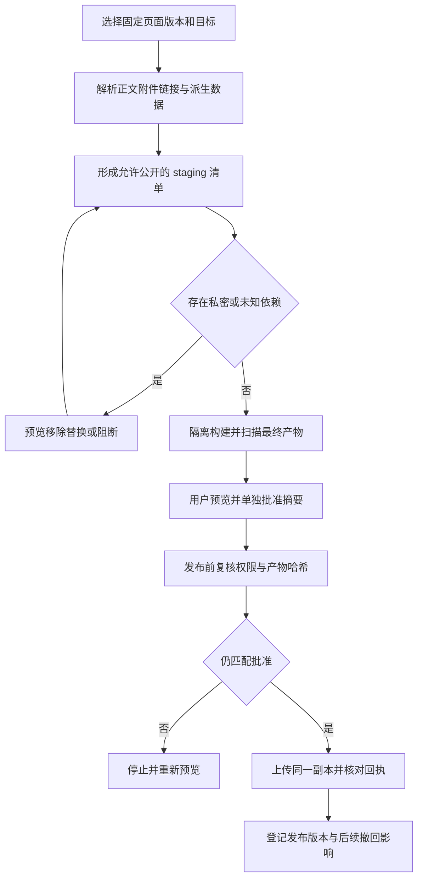

# 场景 12：公开副本导出与发布

[返回总体方案](2026-09-21-001-feat-overall-knowledge-task-plan.md) · [需求原文](../brainstorms/2026-09-21-obsidian-knowledge-and-task-center-requirements.md)

## 1. 范围

用户选定固定版本的知识页，查看正文、附件、链接和搜索数据的实际公开副本，单独批准后发布。发布平台只接收这份副本，不连接整个 Vault，也不把站点编辑自动写回个人库。

主责 R094；关联 R034、R083—R085、R090；验收 A38。属于 P7，核心系统无需安装发布平台。先支持本地公开副本与一个静态站点适配器；PandaWiki 等其他平台保留同一出口合同，后续单独实现。

## 2. 独立调研

2026-09-21 尝试读取 Quartz 的 ExplicitPublish／Assets 文档页面，正文未返回；随后核查维护者源码：[ExplicitPublish 过滤器](https://raw.githubusercontent.com/jackyzha0/quartz/v4/quartz/plugins/filters/explicit.ts) 根据 publish 字段决定 Markdown 是否发布，[Assets 发射器](https://raw.githubusercontent.com/jackyzha0/quartz/v4/quartz/plugins/emitters/assets.ts) 单独枚举并复制非 Markdown 资源。

因此，给页面加 publish 标记不能作为整个 Vault 的隐私边界。选独立 staging 目录，只放已批准候选中的页面与附件，再交给 Quartz 构建。实施时固定源码 commit、依赖和构建配置；本轮读的是 v4 分支，不能把可变分支当长期锁定版本。

旧资料把 Quartz／PandaWiki 列为展示层；本方案继承“批准副本单向发布”，不因平台支持页面导入就默认支持安全发布。

## 3. 导出清单与批准对象

`PublicationManifest` 包含页面 ID／修订、转换后的正文哈希、附件哈希、外链、嵌入展开结果、公开元数据、构建配置指纹和构建产物清单。来源原件默认不进入清单；选中 Wiki 也不自动公开它引用的私密原文。

先遍历所选页面的直接依赖，给出保留、替换为公开链接、移除或阻断的预览。未授权嵌入不能静默展开。私密页面标题、文件路径、来源摘要、属性、图谱节点、搜索索引和 RSS 都属于检查范围；删除正文链接而保留搜索摘要仍算泄漏。

构建在隔离临时目录完成，构建进程只读受控 staging，不得读取真实 Vault 或对象目录。首次安装依赖和插件仅来自受信工程配置，导入材料里的脚本不能变为构建步骤。构建期间默认不抓外部资源；所需资源先进入明确清单。

构建隔离复用 S01 的 G5，不把临时目录本身当权限边界；未通过隔离门槛时仅提供可读导出预览，站点构建与发布保持关闭。

先生成最终网站文件并扫描，再让用户预览。用户批准的是 manifest 摘要、实际构建产物摘要和目标站点，发布时上传同一批字节；不能批准后重新构建一份可能不同的网站。任何内容、依赖、配置、权限或目标变化都使批准失效。

## 4. 发布、撤回与故障

发布记录保存目标、批准身份、manifest digest、文件摘要、外部 release ID、当前／上一版本与结果。上传失败只重试未确认项；平台支持整版切换时，在所有文件校验后切换版本。平台不支持时必须展示可能的部分更新，不能说已原子发布。

发布前再次检查来源撤回和权限；发布后收到撤回时，阻止新发布，并产生受影响公开内容的下架／替换清单。平台缓存、搜索引擎与他人下载不可保证收回，用户可查看已执行与未确认项。

回退使用曾批准且当前仍允许公开的构建产物。旧版本已含撤回来源时不能直接回滚复活。站点上的人工修改不自动合并回 Vault，若要保留，作为新的外部输入重新收录与审核。

## 5. 场景流程图

> 下图用于评审公开范围与批准对象，属于方向性设计。

## 6. 实施单元

- [x] **PUB1：依赖清单与公开转换。** 需求 R094、R083；依赖 E1、W3、O1。文件：`packages/contracts/src/publication.ts`、`apps/service/src/publishing/manifest.ts`、`apps/service/src/publishing/transform.ts`；测试：`tests/security/publication-dependencies.test.ts`。测试私密嵌入、未授权原件、附件间接引用、链接泄漏标题、来源撤回；预期清单封闭且阻断未授权内容。完成依据：用户能看到每个公开文件及其依据。

- [x] **PUB2：隔离构建、扫描与预览。** 需求 R094、R084—R085；依赖 PUB1。文件：`apps/service/src/publishing/build.ts`、`apps/service/src/publishing/scan.ts`、`apps/obsidian-plugin/src/views/publication.ts`；测试：`tests/integration/publication-build.test.ts`。测试 staging 外读取、脚本注入、搜索索引／图谱／RSS 泄漏、附件复制及构建后内容变化；预期最终字节可审核，未通过不得申请发布。完成依据：A38 覆盖实际构建输出而非只检查 Markdown。

- [x] **PUB3：批准副本发布与下架。** 需求 R094，协同 R034、R090；依赖 PUB2、G2。文件：`apps/service/src/publishing/release.ts`、`apps/service/src/publishing/retraction.ts`；测试：`tests/faults/publication-release.test.ts`。测试批准后重新构建、目标改变、上传超时、部分发布、回滚含撤回源、站点编辑；预期旧批准失效、回执准确、不回写个人库。完成依据：真实测试站点能核对 release 与批准字节，下架例外明确。

## 7. 上线条件

生产站点、认证方式、公开范围和缓存处理在启用时选择。没有公开授权只能本地预览，不能替用户发布。本方案不把平台产品选型扩大成公共知识社区、多人协作或双向同步项目。

## 8. 2026-09-24 实施边界

本轮交付了固定 Wiki 修订的依赖检查、受控 UTF-8 文本附件、只读草稿、OCI 内的最终文件构建与扫描、摘要批准、本机静态站点 release、同操作重试、来源撤回下架和历史批准版本的受权回退。真实 OCI 到本机站点的链路已跑通；操作与验证见[场景 12 接手说明](../implementation/public-copy-publishing.md)和[本轮验证](../implementation/public-copy-publishing-validation.md)。

实施时将原拟 Quartz 构建器收敛为仓库内固定的 `native-static-v1`：当前没有经过锁定和验收的 Quartz 源码、依赖及容器镜像，而本轮只需输出选定页面的纯文本静态站点。此适配器不安装第三方插件，仍使用 G5 的固定无网络 OCI 沙箱；它不会把 Vault 挂入构建器。当前目标是本机 `local-static-site`，不是公网平台。Quartz、PandaWiki、远端站点认证、缓存清理和公网发布均未实现，启用前需另立目标、锁定版本并做独立验收。PUB1—PUB3 的勾选仅针对本轮本机目标与受控文本附件，不表示任意附件或公网平台已经安全可用。
