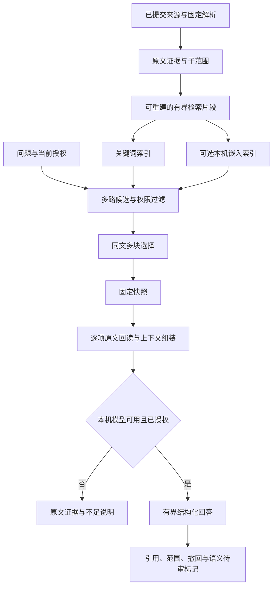

# 长文档多证据检索与本机问答

[返回场景 03 方案](2026-09-21-004-feat-evidence-search-answer-plan.md) · [产品需求](../brainstorms/2026-09-21-obsidian-knowledge-and-task-center-requirements.md) · [现状说明](../implementation/local-html-ingestion.md)

## 问题与交付范围

现有本地 HTML 能保存原件、解析为定位块，并以 SQLite FTS5 检索；一次搜索却只保留每个来源家族的最高分块。无模型的“整理原文”只复述该块。对一份 26 万余字符的指南，这只能证明单词命中，不能回答跨章节问题，也不能衡量证据是否找全。

本计划在现有场景 03 上增加可重建的长文检索片段、同一来源的多块召回、固定证据组装、受控的本机模型问答，以及真实长文评测。用户已选择本机模型，正文不发往远端。来源原件、解析产物、人工审核和现有无模型检索保持权威；模型不可用时仍可搜索和回读。向量与重排按 R093 做同题对照，不以安装新组件代替效果证明。

### 需求追踪和成功条件

| 编号 | 来源与目标 | 可观察结果 |
|---|---|---|
| L1 | R026—R028：固定原文、无模型检索 | 新片段能精确回到来源修订、原文范围与哈希；旧证据 ID 可回读，中文短词和代码符号不回退 |
| L2 | R029—R030：跨段证据问答 | 同一长文中相隔章节的必要证据可共同进入一次快照和证据包；可部分支持并列出缺口，关键证据不足时不输出无据结论 |
| L3 | R031、R083—R086：权限、撤回、私密本机处理 | 召回、片段扩展、模型输入、缓存和候选保存遵守当前权限；只使用经确认的本机模型，不自动外发或下载 |
| L4 | R093：增强按收益开启 | 本地向量和可选重排与关键词基线用同题集比较召回、延迟、资源；无可复现收益则保持关闭 |
| L5 | PRD 第 11 节及本轮真实指南试点 | 固定真实问题覆盖单章节、跨章节、无答案、冲突、版本条件；报告分子分母与失败题，不把测试替身当模型质量验收 |

## 关键决定

1. **原文证据与检索片段分离。** 原件、ParseArtifact 和现有 Evidence 不重写。新片段是带分块器指纹、解析 ID、原文 UTF-16 范围和映射证据 ID 的可重建索引产物。过长原文块需要可校验的子范围证据；不能为了适配模型改写原件或旧引用。
2. **先修复多块关键词召回，再加语义增强。** FTS5 和既有中文词法／精确符号检索作为基线；一个来源可贡献多个不同位置，家族去重只用于独立来源统计和转载抑制。排序与上下文组装必须在权限过滤之后。[SQLite FTS5 文档](https://www.sqlite.org/fts5.html)说明 BM25 排序能力，不能把其分数当作事实可信度。
3. **有界上下文与逐项引用。** 按章节边界与候选长度切片、保留受限重叠；表格、代码与否定条件不被无提示截断。检索片段初版以可复现的保守字节上界约束，选择本机模型后再核对其 tokenizer 与上下文窗口；实现阶段用固定题比较候选长度、重叠与每来源片段上限，不能把字符数谎称为精确 token 数。证据包先固定快照、回读、去重，再按模型实际计数或保守上界打包；JSON 字节数另作传输指标，不代替计费／上下文 token。模型的综合表述标为推断并绑定原始证据；`sourced` 仍保留完整原文，不让引用格式通过代替语义核对。长上下文模型也可能漏掉中间证据，不能用“整篇塞入提示词”规避召回设计。[长上下文位置实验](https://arxiv.org/abs/2307.03172)
4. **本机模型是受信执行路线。** 优先由应用启动专用的 Ollama 本地进程并设置禁云，只绑定固定回环地址；若改接已运行的守护进程，必须能在每次请求前确认禁云与已下载模型身份，否则失败关闭，不发送正文。聊天和嵌入共用该门禁，禁止任意 URL、代理、重定向、云模型标签与自动下载；服务重启或配置漂移后重新验证。模型名和下载在本机试点确定，出站观察是实际验收条件。Ollama 的[本地接口](https://docs.ollama.com/api/introduction)、[结构化聊天](https://docs.ollama.com/api/chat)及[关闭云功能方法](https://docs.ollama.com/faq)是适配依据。材料正文始终作为不可信数据，不能提升成系统指令。[OWASP 提示注入说明](https://genai.owasp.org/llmrisk/llm01-prompt-injection/)
5. **增强可选且可回退。** 本机嵌入和重排分别受每个来源的 `embedding`、`rerank` 路线授权；只在明确选择、模型可用且同题评测证明收益后启用，撤回或授权变更立即停止在途处理。索引指纹包含分块器、嵌入模型摘要、维度和归一化版本。候选不达标、模型失联或重排超时时回到关键词路径，不影响原文。优先用本机可复现的精确向量比较验证小规模语料；是否需要额外向量扩展由规模测试决定。

## 总体流程

> 下图是供评审的方向性设计，不是实现代码。

## 实施单元

- [x] **U1：长文题集与现状基线。** 目标：先定义可回答、跨章节和无答案的分母。依赖：无。文件：新增 `tests/fixtures/long-document/README.md`、`tests/integration/long-document-retrieval.test.ts`、`tests/evaluation/long-document-rag.test.ts`；修改 `docs/implementation/evidence-search-validation.md`。真实用户指南及题目、标注只留在被忽略的本机 `.context/runtime-validation/long-document/`，仓库提交可复现的合成长文和匿名统计；实施前先核对用户提供的原文件仍可读取，缺失时真实评测单列未完成，不用合成数据冒充。测试场景：同一来源两个远离章节各有一个必要事实；仅标题命中但正文不相关；不存在的答案；代码符号与中文短词；版本不相交。完成依据：记录现有“一家族一块”的失败和原有短词回归基线，不虚构真实模型结果。

- [x] **U2：可回读的有界检索片段。** 目标：检索窗口可独立重建且保留精确引用。依赖：U1。文件：新增 `apps/service/src/search/chunks.ts`、`apps/service/src/storage/migrations/010-rag.ts`、`tests/unit/retrieval-chunks.test.ts`；修改 `apps/service/src/evidence/locator.ts`、`apps/service/src/storage/store.ts`、`apps/service/src/lifecycle/backup.ts`、`apps/service/src/lifecycle/restore.ts`、`apps/service/src/lifecycle/purge.ts`、`docs/implementation/evidence-search-answer.md`、`tests/integration/evidence-readback.test.ts`、`tests/integration/source-migration.test.ts`、`tests/faults/backup-restore.test.ts`。沿用解析块的章节与位置，超长段落再细分；索引文本可重叠，引用仍指向去重后的原文范围。v10 一次定义片段及可选向量的可重建表，U6 只填充既有表，不在已发布迁移上追加结构。测试场景：空标题／极短段落、超长单段、中英文及 emoji 偏移、表格与代码边界、重叠去重、旧修订与新解析并存、损坏哈希拒读、v9→v10 备份核验与恢复、清除清单覆盖新片段。完成依据：片段每个可追溯范围都能从固定原文回读，旧证据读法不变，升级后备份和隔离恢复仍可用。

- [x] **U3：同一来源多块检索与快照。** 目标：一次问题能保留同文档多个相关位置。依赖：U2。文件：修改 `apps/service/src/search/indexer.ts`、`apps/service/src/search/search.ts`、`packages/contracts/src/evidence.ts`、`apps/service/src/agents/operations.ts`、`apps/obsidian-plugin/src/views/search.ts`、`docs/implementation/evidence-search-answer.md`、`docs/implementation/local-html-ingestion.md`；测试 `tests/integration/lexical-search.test.ts`、`tests/integration/long-document-retrieval.test.ts`、`tests/security/revoked-evidence.test.ts`、`tests/ui/search.test.ts`。继续保留旧索引代直到新代完整发布；先授权和撤回过滤，再以经 U1 题集确定的每来源上限／家族多样性选块；快照固定每条证据而非仅家族。测试场景：两个远距命中均出现；五个转载不挤掉第二个原文章节；仅标题弱命中不覆盖正文强命中；撤回后旧快照、Agent 搜索和缓存均拒读；重建失败旧代仍可用。完成依据：不带模型时跨章节问题能回读全部必要块，旧搜索筛选保持可用。

- [x] **U4：多证据包与回答展示。** 目标：组装多个经回读的原文范围，显示已支持、仍不足或冲突。依赖：U3。文件：修改 `apps/service/src/answers/evidence-pack.ts`、`apps/service/src/answers/answer.ts`、`apps/service/src/answers/cache.ts`、`apps/service/src/agents/operations.ts`、`apps/obsidian-plugin/src/views/search.ts`、`docs/implementation/evidence-search-answer.md`；测试 `tests/integration/grounded-answer.test.ts`、`tests/integration/long-document-retrieval.test.ts`、`tests/security/agent-client-policy.test.ts`、`tests/ui/search.test.ts`。保留条件与原文顺序；上下文预算不足时明确列缺口，不用任意截断来制造完整性。测试场景：两处事实都入包；重叠片段不重复引用；单块超限时能用可校验子范围；缺少第二处事实显示部分支持与缺口；撤回或范围变化使旧答案失效；Agent 扩展出的最终证据逐项受客户端来源许可约束。完成依据：无模型路径对一份长文可展示多条固定证据，但不冒称综合回答。

- [ ] **U5：本机模型适配与可信回答。** 目标：实际本机模型可在授权快照上生成带引用的结构化表述。依赖：U4；本机模型运行条件由实施时验证。文件：新增 `apps/service/src/answers/local-model.ts`、`tests/integration/local-model-adapter.test.ts`；修改 `apps/service/src/main.ts`、`apps/service/src/answers/answer.ts`、`apps/service/src/search/routes.ts`、`apps/obsidian-plugin/src/views/search.ts`、`docs/implementation/evidence-search-answer.md`、`tests/security/revoked-evidence.test.ts`；沿用 `apps/service/src/http/server.ts` 已有的双入口提供方注入。固定回环地址、模型发现、云模型拒绝、超时／取消；经 `main.ts` 将同一受信适配器送入 HTTP 与 Agent 入口。现有 WorkerBroker 对本机免费路线仍要求启用的 `model` 路线、非空预算、有效的零费用价格记录和逐来源授权；在调用前检查，不暗中放宽合同。模型输入 token 按所选模型能力或保守上界计数，JSON 字节另记；模型输出中的推断与原文事实分开，引用必须回读，提示注入文字不获得工具或政策权限。测试场景：本机模型返回两条有据表述；缺模型显示不可用且搜索照常；不完整 JSON／假引用拒绝；模型执行中撤回中止；服务配置漂移、模拟云模型与非回环端点零正文发送；中英混合长包不因 JSON 字节误作 token 被拒；真实模型另以本机试点验收。完成依据：真实模型在本机实际运行且所选长文题人工核查通过；如果机器缺少本机运行条件，则此单元不得标完成，也不得把测试替身称为上线能力。

- [x] **U6：可选本机向量增强与同题比较。** 目标：测量语义召回是否弥补关键词失败题，并在确有收益时可控启用。依赖：U1—U4；可与 U5 后半段并行。文件：新增 `apps/service/src/search/local-embeddings.ts`、`tests/integration/hybrid-retrieval.test.ts`；修改 `apps/service/src/search/enhancement.ts`、`apps/service/src/search/indexer.ts`、`apps/service/src/search/search.ts`、`apps/service/src/lifecycle/purge.ts`、`docs/implementation/evidence-search-answer.md`、`tests/evaluation/retrieval-comparison.test.ts`、`tests/performance/search-benchmark.test.ts`。使用本机已安装的嵌入模型和 U2 已创建的可重建表，拒绝自动截断输入；在每个来源建向量前校验 `embedding` 路线，重排前另校验 `rerank` 路线，撤回或权限变化时中止。模型或指纹变化建立新索引代。先记录关键词和混合候选，不自动放行；重排仅在向量后仍有固定失败题且测得净收益时增加。测试场景：语义改写题的对照、无收益保持关闭、仅允许 `read/model` 的来源无嵌入或重排输入、模型缺失／维度变化、撤回后旧向量不可召回、低资源时关键词回退、热检索延迟与内存、清除清单列出向量副本。完成依据：同题报告给出召回分子分母、p95、资源与本机外发为零；达不到门槛时保留关闭并记录失败原因。

- [x] **U7：真实长文验收与接手文档。** 目标：让新接手者独立运行、判断能力边界和恢复。依赖：U1—U6。文件：修改 `README.md`、`docs/development/onboarding.md`、`docs/implementation/evidence-search-answer.md`、`docs/implementation/evidence-search-validation.md`、`docs/implementation/local-html-ingestion.md`、`docs/plans/2026-09-21-004-feat-evidence-search-answer-plan.md`；新增 `docs/implementation/long-document-rag.md` 并接入 `docs/README.md`。文档说明模型安装和云功能关闭、数据位置、索引重建、指标、失败题、回退与不可验证事项；补一张完整流程图。测试期待：此单元仅改说明，核对路径、链接和实际按钮，不为文案编造行为测试。完成依据：真实指南至少覆盖既定跨章节与无答案问题；实际验证和未通过项分别记录，旧日期不被改写。

## 可行性审查与系统影响

现有固定证据、原子索引代、会话快照、WorkerBroker、预算与撤回机制可复用，故分块和多块检索在本仓库内可实现。最大改动面是 `SearchResult.hits` 的“一条即一个证据块”假设：Obsidian 搜索视图、AnswerService、研究读取以及外部 Agent 网关都要逐层核对。改变搜索返回形状时优先兼容已有证据字段，避免让旧引用失效。schema 10 同时影响 `storage/store.ts` 的结构校验以及 `lifecycle/backup.ts`、`restore.ts` 的备份清单合同；必须同批调整并做 v9→v10 恢复演练。

真实模型是外部运行条件，即使 API 地址是回环，Ollama 也可连接云模型；仅测试适配器或检查 URL 不足以证明“正文不外发”。需要本机禁云配置、已下载模型检查、每次调用前门禁、网络观察和人工语义验收。计划审查时本机尚未找到 Ollama 命令或回环服务；实施时可在独立试点准备本地模型，但不得因此自动降级到云端。若仍缺运行条件，U1—U4 及适配器工程代码可分别交付，U5/U7 的真实模型验收保持未完成，整份计划不得标 `completed`。

| 风险 | 处理方式 |
|---|---|
| 检索片段映射错误，引用错位 | 原文偏移和哈希逐项回读，损坏即拒绝；旧证据 ID 回归 |
| 同文多块挤满上下文或转载占比过高 | 每来源上限、家族多样性、重叠去重；缺关键证据时说明不足 |
| 索引升级中断或模型指纹变化 | 可重建索引新代原子发布，旧代保留到快照释放；失败回旧代 |
| 模型误把文档内指令当操作命令 | 资料作为数据封装，无工具权限；无效引用、范围和结构拒绝，人工语义核对 |
| 本机模型资源不足或潜在云转发 | 不下载或调用未确认模型；禁云并观察出站；失败保持关键词与原文模式 |
| 仅用一份长文产生漂亮但无代表性的指标 | 合成回归加用户真实长文题集，再扩到 PRD 约 80 题；分别报告家族与证据级召回 |

## 验收与操作边界

按 PRD 的固定引用 100% 可回读、家族 Recall@10 ≥90%、无答案识别 ≥90%、人工重要主张支持率 ≥95% 作为产品目标；针对同文多段问题新增“必要原文范围是否全部召回”的证据级统计。当前七个来源家族的 17/17 基线不够证明长文效果。性能继续记录约一万块热检索 p95 与机器资源，但模型生成单独报告。任何隐私外发、错误引用或旧撤回内容进入模型，阻断本机模型路线。

本机模型名称、可用内存和实际推理速度须在实施阶段检查；用户尚未授权任何远端模型或费用。不要因模型未安装而自动下载、改用云端或跳过检索验收。计划的 `status` 只有全部实施单元及实际要求完成后才能改为 `completed`。

## 2026-09-28 实施记录与未达标项

代码与接手入口见[长文档说明](../implementation/long-document-rag.md)，本机同题结果和失败项见[试点记录](../implementation/long-document-rag-validation.md)。一份 262,654 字符的指南派生 254 个检索片段；20 题标注的 21 处必要章节均进入搜索结果和证据包，3 道无答案题均保持证据不足。`qwen3-embedding:0.6b` 在同题上也是 21/21，未高于关键词，因此按门槛保持默认搜索不使用向量或重排。`qwen2.5:3b` 已在本机运行，但仍出现漏答、错答和被结构校验拒绝的情况；U5 的人工质量完成依据尚未满足，整份计划继续 `active`。

实施中保持了既有 `SearchResult` 字段形状，没有修改共享合同；新片段复用固定证据 ID 结构。片段读回核对原件范围、哈希和起始块定位，不用**当前**分块算法重新判定旧片段，以免将来调整切块参数时破坏旧引用。原有场景 03 验收文档保留历史结果，本轮另建试点记录而不改写旧日期。模型只接收按问题要点选出的证据子集，返回结果逐条映射到固定证据，并显示尚未完成语义审核。
