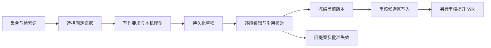

# 本机生成与可编辑候选

补齐 R029、R032—R037 中已有的生成和审核前编辑流程。原 W4、RSH3 只交付原文整理及模型接口，不能视为真实写作能力。本次验收聚焦：在 Obsidian 选择 XQuant 集合、检索原文，输入写作要求，本机生成简介，编辑并保存草稿，再逐次审核写入候选区及 Wiki。

## 实施与验收

- [x] 简化 Ollama 结构化输出：模型返回正文段落及证据短编号；程序补充固定 ID、范围、待审核标记。沿用专用回环进程、禁云、身份检查、Broker、零费用账本和来源用途授权。没有模型时明确告知启动方式。
- [x] 检索与写作要求分开；用户选定不超过 8 条固定证据。生成缓存包含写作要求及证据选择；禁止跨集合、越权、失效快照和伪造引用。
- [x] 持久化草稿及版本：标题、逐段正文、引用可编辑；保存使用预期版本，重复保存不重复增加版本；过期编辑不能覆盖新内容。重生成创建独立结果，人工编辑不被覆盖。
- [x] 冻结当前草稿到不可变候选，候选与 Wiki 共用可读正文及引用格式；再次编辑使旧提案/批准/Writer 授权失效。正式知识仍通过既有批准与回执链路。
- [x] Obsidian 增加本机路线设置入口、生成按钮、草稿编辑及恢复列表。异步结果不能覆盖后续输入，错误保留编辑内容。
- [x] 真实 SQLite/HTTP/Writer 集成测试、编辑并发/撤回/引用越界测试、UI 测试、实际 XQuant 本机生成及桌面写入验收；更新 README、接手指南和对应场景说明。

## 范围与可行性核对

复用 AnswerService、答案缓存、证据定位、候选与 Wiki Writer，不新建第二套写入通道。草稿存放现有应用数据库 KV，冻结版本复制到 answer_candidates；保存及失效检查在事务内。正文只作为普通文字渲染，Markdown 语法由编排器转义，引用由程序生成。

这项功能完成不代表长文档全部问题集通过，也不代表多章研究自动达到语义正确门槛。完整 RAG 计划及 RSH3 的剩余验收仍保留真实状态。

## 2026-09-28 交付记录

本机生成、编辑与两次审核写入已在 XQuant 独立试点验证。原文取证与语义质量保持分开：模型初稿的首段引用和入门顺序经编辑补齐，最终 4 段 514 字。检查、操作与限制见[接手说明](../implementation/local-writing-drafts.md)。
